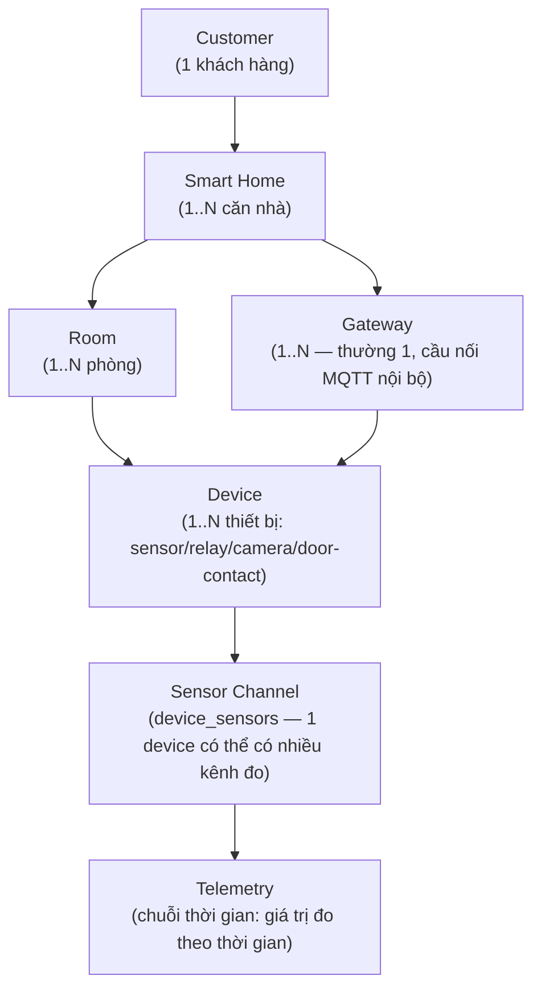
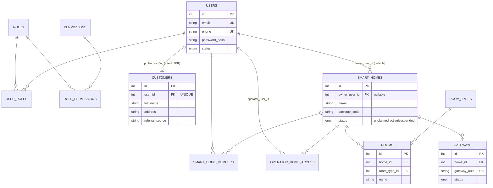
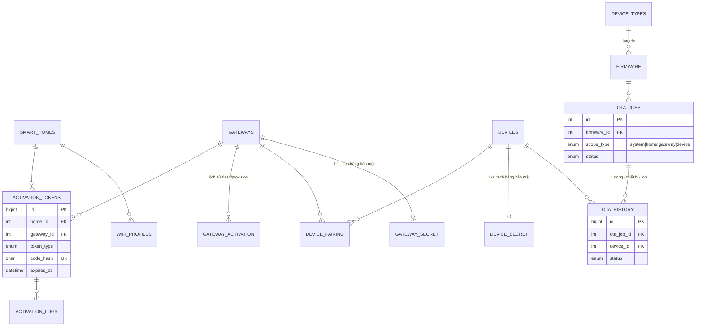
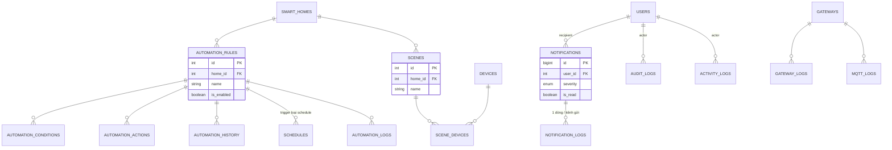
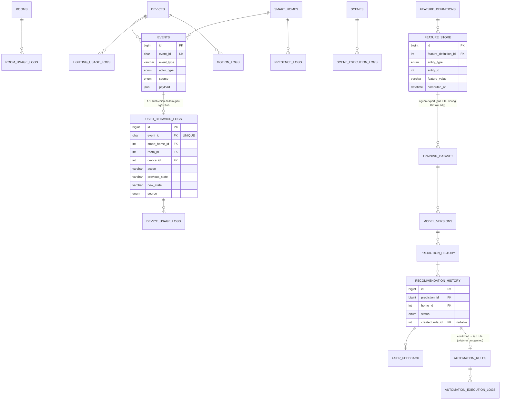
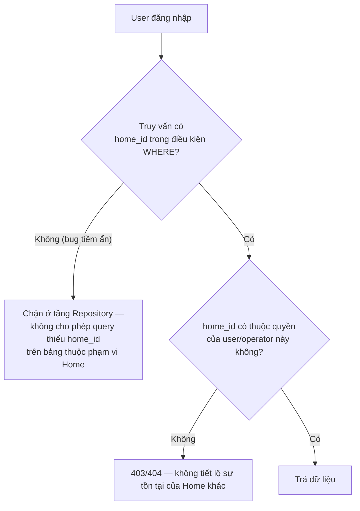
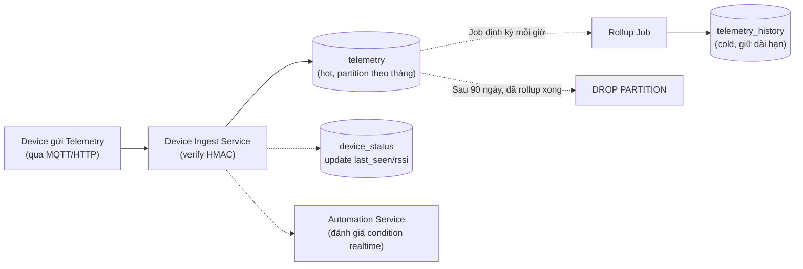
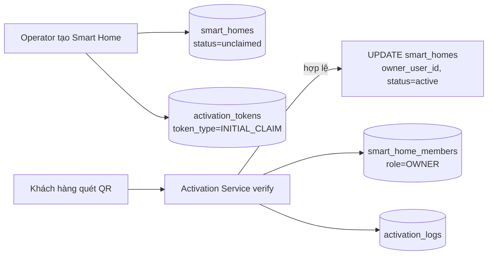
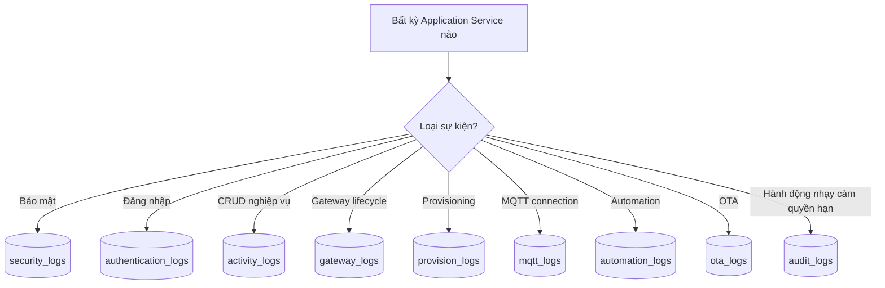

# DATABASE_REFACTOR_SMARTHOME.md

> Thiết kế lại Database — từ **schema demo 5 bảng (users/devices/sensor_data/device_tokens/audit_log)** sang **Database chuẩn cho Commercial Smart Home Platform** hỗ trợ hàng nghìn khách hàng, hàng chục nghìn thiết bị.
> Vai trò biên soạn: Principal Database Architect / Senior Solution Architect / Data Architect / Backend Architect.
> Tài liệu **chỉ thiết kế — không viết SQL, không sửa code**. Ràng buộc chặt với các tài liệu đã có, không lặp lại mà **hệ thống hoá + bổ sung** phần Index/Partition/Retention/Naming còn thiếu:
> - [`PROJECT_ANALYSIS_SMARTHOME.md`](PROJECT_ANALYSIS_SMARTHOME.md) — đề xuất schema sơ bộ Phần 4 (nguồn tham chiếu chính cho các bảng nghiệp vụ lõi).
> - [`SMART_HOME_PRODUCT_ARCHITECTURE.md`](SMART_HOME_PRODUCT_ARCHITECTURE.md) — Claim/Activation, `smart_home_members`, RBAC theo Home.
> - [`SMART_HOME_WIFI_PROVISIONING.md`](SMART_HOME_WIFI_PROVISIONING.md) — `gateway_provision`, `wifi_profiles`, `device_pairing`, Key Hierarchy.
> - [`BACKEND_REFACTOR_SMARTHOME.md`](BACKEND_REFACTOR_SMARTHOME.md) — ranh giới domain/service sở hữu từng nhóm bảng (Phần 5, 6).
>
> Toàn bộ Database thực tế trong workspace đã được đọc đầy đủ: `database/migrations/001_schema.sql` (file DB duy nhất tồn tại — đã xác nhận bằng liệt kê toàn bộ thư mục `database/`, không có ERD, không có ORM/ entity/model, không có seed SQL riêng — seed dữ liệu được thực hiện bằng script TypeScript `backend/src/scripts/seed.ts`), đối chiếu thêm với `backend/src/config/migrate.ts` (2 bảng phát sinh runtime: `notifications`, `_migrations`).

---

## MỤC LỤC

0. [Tóm tắt điều hành](#0-tóm-tắt-điều-hành)
1. [Review Database hiện tại](#1-review-database-hiện-tại)
2. [Bảng tổng hợp vấn đề](#2-bảng-tổng-hợp-vấn-đề)
3. [Nguyên tắc thiết kế Database mới](#3-nguyên-tắc-thiết-kế-database-mới)
4. [Mô hình phân cấp mới](#4-mô-hình-phân-cấp-mới)
5. [ERD tổng thể](#5-erd-tổng-thể)
6. [Naming Convention](#6-naming-convention)
7. [Thiết kế chi tiết từng bảng](#7-thiết-kế-chi-tiết-từng-bảng)
8. [Multi-tenant Design](#8-multi-tenant-design)
9. [Index Strategy](#9-index-strategy)
10. [Partition Strategy](#10-partition-strategy)
11. [Retention & Archive Strategy](#11-retention--archive-strategy)
12. [Security Strategy](#12-security-strategy)
13. [Data Flow](#13-data-flow)
14. [Migration Plan](#14-migration-plan)
15. [Roadmap Refactor](#15-roadmap-refactor)

---

## 0. TÓM TẮT ĐIỀU HÀNH

Database hiện tại (`001_schema.sql`) chỉ có **4 bảng gốc** (`users`, `devices`, `sensor_data`, `device_tokens`, `audit_log`) + 2 bảng phát sinh runtime qua `migrate.ts` (`notifications`, `_migrations`) — tổng cộng **6 bảng cho toàn bộ hệ thống**. Đây là schema chuẩn cho 1 đồ án single-tenant (1 hệ thống = 1 chủ sở hữu ngầm định), hoàn toàn không có khái niệm khách hàng, nhà, phòng. Chuyển sang mô hình thương mại cần khoảng **45 bảng**, tổ chức thành 11 domain: Identity & Access, Customer & Home, Spatial, Gateway Infrastructure, Device & Sensor, Telemetry, Notification, Automation & Scene, OTA, Provisioning, Log.

Ba quyết định thiết kế quan trọng nhất của tài liệu này:

1. **Tách `devices` (đăng ký thiết bị, ghi hiếm) khỏi `device_status` (trạng thái sống, ghi liên tục mỗi heartbeat)** — tránh khoá tranh chấp (lock contention) giữa 2 loại truy cập có tần suất khác nhau hoàn toàn trên cùng 1 bảng.
2. **Tách `telemetry` (dữ liệu thô, retention ngắn hạn) khỏi `telemetry_history` (dữ liệu rollup, giữ dài hạn)** — giải quyết đúng vấn đề "giới hạn cứng 150 bản ghi/thiết bị" hiện tại không đáp ứng được báo cáo xu hướng dài hạn.
3. **Tách 8 loại log theo mục đích và vòng đời** thay vì 1 bảng `audit_log` gộp chung như hiện tại — mỗi loại log có tần suất ghi, đối tượng xem, và thời hạn lưu trữ khác nhau.

---

## 1. REVIEW DATABASE HIỆN TẠI

### 1.1. Bảng `users`

| Cột | Kiểu | Ràng buộc | Đánh giá |
|---|---|---|---|
| `id` | INT UNSIGNED | PK, AUTO_INCREMENT | Hợp lý |
| `username` | VARCHAR(64) | UNIQUE NOT NULL | Không có `email`/`phone` — không thể phân biệt tài khoản nội bộ và khách hàng dùng OTP qua SĐT |
| `password_hash` | VARCHAR(255) | NOT NULL | Đủ dài cho bcrypt (đúng) |
| `role` | ENUM('admin','operator') | NOT NULL DEFAULT 'operator' | **Vấn đề cốt lõi**: ENUM cứng, không có role `user` (khách hàng), thêm role mới phải `ALTER TABLE` |
| `created_at` | DATETIME | DEFAULT CURRENT_TIMESTAMP | OK |
| `last_login` | DATETIME | NULL | OK |

**Index:** chỉ có `UNIQUE KEY uq_users_username`. **Không có index nào khác** — chấp nhận được ở quy mô hiện tại (bảng nhỏ), sẽ cần thêm khi có `email`/`phone`/`role_id`.

### 1.2. Bảng `devices`

| Cột | Kiểu | Ràng buộc | Đánh giá |
|---|---|---|---|
| `device_type` | ENUM('sensor','gateway') | NOT NULL | **Vấn đề nghiêm trọng nhất bảng này**: không mở rộng được cho camera/relay/door-contact mà không sửa ENUM + migrate toàn bộ dữ liệu cũ |
| `secret_key` | VARCHAR(64) | NOT NULL | **Lưu plaintext** — vi phạm nguyên tắc "không lưu secret dạng đọc trực tiếp"; nên mã hoá tại rest |
| `location` | VARCHAR(255) | NULL | **Vi phạm chuẩn hoá (Normalization)** — text tự do thay vì FK tới bảng `rooms`; 2 thiết bị "Phòng khách" ở 2 nhà khác nhau không thể phân biệt/lọc/join được |
| `status` | ENUM('inactive','active','blocked') | DEFAULT 'inactive' | Thiếu trạng thái `maintenance` (đang bảo trì/OTA) |
| `created_by` | INT UNSIGNED | FK → users.id ON DELETE SET NULL | Đúng là "người đăng ký", nhưng hệ thống **không có cột nào biểu diễn "người sở hữu"** (owner) — không có bất kỳ liên kết nào tới khách hàng |

**Vấn đề Normalization nghiêm trọng:** bảng này đang gộp **2 khái niệm nghiệp vụ khác hẳn nhau** (Gateway = hạ tầng mạng, Sensor = thiết bị đo lường thuộc 1 phòng) vào cùng 1 bảng, phân biệt chỉ bằng 1 cột ENUM — vi phạm nguyên tắc "1 bảng = 1 khái niệm nghiệp vụ" dù về mặt kỹ thuật vẫn đạt 3NF (không có transitive dependency rõ ràng, nhưng đây là vấn đề **thiết kế mô hình miền (domain modeling)**, không phải vấn đề chuẩn hoá thuần tuý).

**Index:** `UNIQUE KEY uq_devices_device_id`, `KEY idx_devices_status` — hợp lý cho quy mô nhỏ, nhưng **không có index cho `device_type`** dù mọi truy vấn Dashboard hiện tại đều lọc theo `device_type` (`dashboard.ts:11-14`, `devices.ts` phân tab gateway/sensor) — full scan trên cột không index khi bảng lớn.

### 1.3. Bảng `sensor_data`

| Cột | Kiểu | Ràng buộc | Đánh giá |
|---|---|---|---|
| `payload` | JSON | NOT NULL | **Vấn đề chuẩn hoá**: gộp mọi loại cảm biến (`temperature`, `humidity`, và tương lai `motion`/`gas`/`door_state`) vào 1 cột JSON tự do — không thể tạo index/constraint theo giá trị cụ thể, không thể query hiệu quả "tất cả cảm biến gas > 300ppm" bằng SQL thuần |
| `device_id`, `gateway_id` | INT UNSIGNED | FK → devices.id ON DELETE CASCADE (cả 2) | Đúng hướng nhưng **cả 2 FK cùng trỏ vào 1 bảng `devices`** — hệ quả trực tiếp của vấn đề "gộp Gateway+Sensor" ở mục 1.2 |
| `received_at` | DATETIME | DEFAULT CURRENT_TIMESTAMP | **Chỉ giây, không có mili-giây** — không đủ độ chính xác khi thiết bị gửi dữ liệu tần suất cao (nhiều bản ghi cùng giây bị mất thứ tự tương đối) |

**Index:** `KEY idx_sensor_data_device_received (device_id, received_at DESC)` — đúng hướng cho time-series nhưng bảng này **không có partition**, và ứng dụng tự giới hạn cứng 150 bản ghi/thiết bị bằng `DELETE` mỗi lần insert (`data.routes.ts:91-97`) — cách làm chấp nhận được cho demo nhưng **tốn I/O** (mỗi INSERT kéo theo 1 DELETE quét subquery) và **không giữ được lịch sử dài hạn** cho báo cáo xu hướng.

### 1.4. Bảng `device_tokens`

Tồn tại trong schema nhưng **không thấy route/service nào trong `backend/src/` sử dụng bảng này** (đã đọc toàn bộ 22 file backend, không có `device_tokens` xuất hiện ngoài `devices.ts:292` — chỉ dùng trong câu lệnh `DELETE FROM device_tokens WHERE device_id = ?` lúc xoá thiết bị). Đây là **bảng chết** (dead table) — thiết kế cho 1 cơ chế token chưa từng được triển khai đầy đủ.

### 1.5. Bảng `audit_log`

| Cột | Kiểu | Ràng buộc | Đánh giá |
|---|---|---|---|
| `event_type` | VARCHAR(64) | NOT NULL | Text tự do — không có bảng danh mục `event_types`, danh sách hợp lệ hard-code trong `routes/audit.ts:8-18` (đã nêu ở `BACKEND_REFACTOR_SMARTHOME.md` mục 1.7) |
| `details` | JSON | NULL | Chấp nhận được cho log (không cần chuẩn hoá triệt để dữ liệu log biến thiên theo loại sự kiện) |

**Vấn đề gốc rễ:** 1 bảng duy nhất gánh **3 mục đích khác nhau về vòng đời**: sự kiện bảo mật (`GATEWAY_AUTH_FAIL`, cần giữ lâu để điều tra), sự kiện nghiệp vụ (`DEVICE_REGISTER`, tần suất thấp), và sự kiện dữ liệu tần suất cao (`DATA_RECV`, bị giới hạn cứng 150 bản ghi/thiết bị qua transaction trong `auditLogger.ts:23-64` — **về bản chất đây là dữ liệu vận hành/monitoring, không phải "log kiểm toán"**, nhưng bị nhét chung bảng).

### 1.6. Bảng `notifications` (phát sinh runtime qua `migrate.ts`, không có trong `001_schema.sql` gốc)

`target_role VARCHAR(32) DEFAULT 'admin'` — hard-code gửi cho *vai trò*, không phải *người dùng cụ thể* — không thể gửi thông báo riêng cho 1 khách hàng khi có nhiều khách hàng.

### 1.7. Tổng kết review theo tiêu chí

| Tiêu chí | Đánh giá |
|---|---|
| **Normalization** | Đạt 3NF hình thức cho từng bảng riêng lẻ, nhưng **sai ở tầng domain modeling**: gộp Gateway+Sensor, gộp mọi loại log, gộp mọi loại payload cảm biến vào JSON tự do. |
| **Primary Key** | Nhất quán `INT UNSIGNED AUTO_INCREMENT` / `BIGINT UNSIGNED` cho bảng lớn (`sensor_data`, `audit_log`, `device_tokens`) — **quy ước đúng, nên giữ nguyên** ở schema mới. |
| **Foreign Key** | Có khai báo FK với `ON DELETE CASCADE`/`SET NULL` hợp lý theo từng trường hợp — **điểm cộng, thể hiện hiểu đúng ý nghĩa nghiệp vụ của việc xoá** (xoá device → xoá luôn sensor_data liên quan; xoá user → chỉ set NULL cột `created_by`, không xoá device). |
| **Index** | Đủ dùng cho quy mô hiện tại, nhưng thiếu index cho các cột lọc thường xuyên (`device_type`), và hoàn toàn chưa có chiến lược cho time-series (Phần 9/10). |
| **Constraint** | Thiếu `CHECK constraint` cho các cột có miền giá trị hẹp (`fail_count >= 0` là ngầm định qua `TINYINT UNSIGNED` nhưng không có constraint tường minh giới hạn ngưỡng khoá) — chấp nhận được vì MySQL 8 CHECK constraint mới ổn định gần đây, không phải lỗi nghiêm trọng. |
| **Naming** | Nhất quán `snake_case`, số ít cho tên bảng thực thể đơn (`users`, `devices`) — **quy ước hợp lý, nên giữ format này** cho schema mới (xem Phần 6). |
| **Performance** | Ổn ở quy mô demo; sẽ suy giảm nhanh khi `devices`/`sensor_data` tăng vì (a) không phân vùng theo khách hàng, (b) `sensor_data` liên tục INSERT+DELETE trong 1 transaction ẩn ở tầng ứng dụng thay vì partition/TTL ở tầng DB. |
| **Scalability** | Không hỗ trợ multi-tenant ở bất kỳ mức nào — không có cột `home_id` ở bất kỳ bảng nào để làm điều kiện lọc/index chính. |
| **Maintainability** | Danh mục cứng (ENUM, hard-code trong code) khiến mọi thay đổi nghiệp vụ nhỏ (thêm loại thiết bị, thêm loại sự kiện log) đều cần sửa schema + deploy lại — không có bảng danh mục (lookup table) nào. |

### 1.8. Đánh giá theo góc nhìn AI-Readiness

> Góc nhìn bổ sung: schema gốc **thuần theo khả năng cung cấp dữ liệu huấn luyện AI** (học thói quen sử dụng — không phải Chatbot). Thiết kế đáp ứng các khoảng trống này ở Phần 7.12.

**`sensor_data` không có ngữ cảnh (context):** không có `room_id`/`home_id` trực tiếp (phải join qua `device_id`); `payload JSON` gộp `temperature`/`humidity` tự do, không có cột `brightness`/`fan_speed`/`motion`/`door_status`; không có `user_id` (không phân biệt bản ghi nào gắn với 1 phiên sử dụng cụ thể); không có `action`/`previous_state`/`new_state` (bảng này đo lường, không ghi hành vi); không có `weekday`/`is_weekend`/`is_holiday`/`season` tính sẵn.

**Giới hạn cứng 150 bản ghi/thiết bị mâu thuẫn trực tiếp với nguyên tắc "Raw Data không được ghi đè":** với tần suất gửi vài phút/lần, 150 bản ghi chỉ tương đương vài giờ dữ liệu — không đủ để phát hiện pattern theo ngày/tuần (giờ ngủ trung bình, giờ về nhà trung bình cần quan sát hàng chục/hàng trăm chu kỳ liên tiếp).

**Không có bảng nào ghi nhận "phiên sử dụng" hoặc "hiện diện" (presence/occupancy):** không có khái niệm "có người trong nhà/phòng nào hay không", "khi nào rời/về nhà" — nhóm feature quan trọng bậc nhất cho AI học thói quen nhưng hoàn toàn không có nguồn dữ liệu thô để tính ra (chưa có cảm biến chuyển động/camera/door-contact).

| Nhóm dữ liệu AI cần | Có trong DB hiện tại? | Ghi chú |
|---|---|---|
| Lịch sử điều khiển thiết bị (action + state) | Không | Chưa có bảng nào lưu hành động điều khiển |
| Ngữ cảnh không gian (room/home) gắn với từng bản ghi | Một phần (qua `device_id` gián tiếp, không denormalize) | Đã giải quyết ở Phần 7.5 (`devices.home_id`/`room_id`) cho bảng nghiệp vụ, cần áp dụng lại cho bảng hành vi ở 7.12 |
| Ngữ cảnh thời gian (weekday/holiday/season) | Không | Cần tính sẵn, không suy luận lúc query |
| Ngữ cảnh môi trường (ambient_light, motion) | Không (phần cứng chưa có cảm biến tương ứng) | DB phải có chỗ chứa sẵn (nullable) dù dữ liệu ban đầu là NULL |
| Presence/Occupancy | Không | Thiết kế mới ở Phần 7.12 |
| Nguồn hành động (manual/automation/...) | Không | Thiết kế mới ở Phần 7.12 |
| Lịch sử dài hạn không bị xoá | Không (giới hạn cứng 150 bản ghi) | Vi phạm trực tiếp nguyên tắc Raw Data |
| Feature đã tính sẵn (feature store) | Không | Thiết kế mới ở Phần 7.12 |
| Dataset huấn luyện có phiên bản | Không | Thiết kế mới ở Phần 7.12 |
| Lưu lại dự đoán/đề xuất của AI để đánh giá lại | Không | Thiết kế mới ở Phần 7.12 |

**Kết luận:** hệ thống hiện tại hoàn toàn chưa sẵn sàng cho AI — không phải vì thiếu 1-2 cột, mà vì thiếu cả tầng dữ liệu hành vi (chỉ có tầng dữ liệu đo lường). Đây là lý do bắt buộc phải thiết kế đúng ngay từ đầu giai đoạn thương mại hoá, để không phải đổi schema giữa chừng khi bắt đầu có đủ dữ liệu để train.

---

## 2. BẢNG TỔNG HỢP VẤN ĐỀ

| # | Vấn đề | Mức độ | Bảng liên quan | Hướng khắc phục |
|---|---|---|---|---|
| 1 | Không có cột/bảng biểu diễn Customer/Smart Home/Room | Nghiêm trọng | Toàn schema | Phần 4, 7.2–7.3 |
| 2 | `devices.device_type` ENUM cứng, gộp Gateway+Sensor | Nghiêm trọng | `devices` | Phần 7.5 — `device_types` danh mục + tách `gateways`/`devices` |
| 3 | `secret_key` lưu plaintext | Cao (bảo mật) | `devices` | Phần 12 |
| 4 | `location` text tự do, không FK | Cao | `devices` | Phần 7.3 — FK `room_id` |
| 5 | `sensor_data.payload` JSON tự do, không chuẩn hoá theo loại cảm biến | Cao | `sensor_data` | Phần 7.6 — `device_sensors` + `telemetry` chuẩn hoá `value_numeric` |
| 6 | Giới hạn cứng 150 bản ghi/thiết bị bằng DELETE thủ công mỗi lần insert | Cao (performance) | `sensor_data` | Phần 10, 11 — Partition + Rollup |
| 7 | 1 bảng `audit_log` gộp 3 mục đích khác vòng đời | Cao | `audit_log` | Phần 7.11 — 8 bảng log riêng |
| 8 | `notifications.target_role` hard-code, không gửi theo user cụ thể | Trung bình | `notifications` | Phần 7.7 |
| 9 | `device_tokens` là bảng chết, không service nào dùng | Thấp | `device_tokens` | Loại bỏ hoặc thiết kế lại cho Refresh Token (Phần 7.1) |
| 10 | Không có bảng danh mục nào (role, permission, device_type, sensor_type, room_type, event_type) | Nghiêm trọng | Toàn schema | Phần 7 — mọi domain đều có bảng lookup |
| 11 | Không có cơ chế Provisioning/Activation/Pairing nào trong DB | Nghiêm trọng | — chưa tồn tại | Phần 7.10 |
| 12 | Không có OTA/Firmware nào trong DB | Nghiêm trọng | — chưa tồn tại | Phần 7.9 |
| 13 | Không có Automation/Scene nào trong DB | Cao | — chưa tồn tại | Phần 7.8 |
| 14 | Thiếu index cho cột lọc thường xuyên (`device_type`) | Trung bình | `devices` | Phần 9 |
| 15 | `received_at`/`created_at` chỉ tới giây, không mili-giây | Thấp-Trung bình | `sensor_data` | Phần 7.6 — `telemetry.recorded_at DATETIME(3)` |
| 16 | Không có bảng nào tách trạng thái "sống" (last_seen, RSSI) khỏi thông tin đăng ký thiết bị | Trung bình (performance) | `devices` | Phần 7.5 — `device_status` |
| 17 | Không có Event Store/Behavior Log/Feature Store nào — không thể huấn luyện AI học thói quen | Nghiêm trọng (chặn AI) | — chưa tồn tại | Phần 7.12 |
| 18 | `sensor_data` không có `previous_state`/`source`/ngữ cảnh thời gian — không phân biệt được hành vi thủ công và kết quả tự động hoá | Cao (chặn AI) | `sensor_data` | Phần 7.12 — `events`/`user_behavior_logs` |

---

## 3. NGUYÊN TẮC THIẾT KẾ DATABASE MỚI

1. **Mọi bảng thuộc phạm vi 1 Smart Home đều có cột `home_id`** (trực tiếp hoặc gián tiếp qua FK 1 cấp) — đây là điều kiện lọc bắt buộc cho tenant isolation, không phải tuỳ chọn.
2. **Danh mục (device_type, sensor_type, room_type, permission, event_type log...) luôn là bảng, không bao giờ là ENUM cứng cho giá trị có thể mở rộng bởi nghiệp vụ** — ENUM chỉ dùng cho tập giá trị **cố định về mặt kỹ thuật** và hiếm khi đổi (ví dụ `status ENUM('pending','active','suspended')` là trạng thái vòng đời cố định, chấp nhận ENUM).
3. **Tách bảng theo tần suất ghi (write frequency), không chỉ theo ý nghĩa nghiệp vụ** — bảng ghi hiếm (`devices` — đăng ký) tách khỏi bảng ghi liên tục (`device_status` — heartbeat mỗi 15-30s) để tránh lock contention và cho phép chiến lược index/cache khác nhau.
4. **Time-series (Telemetry, Log tần suất cao) luôn có chiến lược Partition + Retention rõ ràng ngay từ thiết kế**, không phải "thêm sau khi bảng đã phình to" như cách xử lý tạm thời hiện tại (xoá thủ công 150 bản ghi/thiết bị).
5. **Secret/credential nhạy cảm tách bảng riêng, giới hạn quyền SELECT ở tầng DB** — không nằm chung bảng với dữ liệu thường xuyên được SELECT cho hiển thị (đúng khuyến nghị đã nêu ở `SMART_HOME_WIFI_PROVISIONING.md` mục 14 cho `device_secret`/`gateway_secret`).
6. **Log tách theo mục đích và vòng đời (retention)**, không gộp 1 bảng.
7. **Naming Convention nhất quán toàn schema** (Phần 6) — kế thừa đúng quy ước tốt đã có (`snake_case`, số ít, `_id` cho FK, `created_at`/`updated_at`).

---

## 4. MÔ HÌNH PHÂN CẤP MỚI



So sánh trực tiếp với mô hình cũ:

| | Mô hình cũ | Mô hình mới |
|---|---|---|
| Đơn vị gốc | `devices` (phẳng, ENUM 2 giá trị) | `customers → smart_homes → rooms → devices → device_sensors → telemetry` (6 cấp) |
| Sở hữu | Không có | `smart_homes.owner_user_id`, `smart_home_members` |
| Vị trí | `devices.location` (text tự do) | `devices.room_id` (FK có cấu trúc) |
| Mở rộng loại thiết bị | Sửa ENUM + migrate | Thêm dòng vào `device_types` |

---

## 5. ERD TỔNG THỂ

> ERD được tách thành 4 sơ đồ theo domain để giữ khả năng đọc được (1 sơ đồ duy nhất ~45 bảng sẽ không thể đọc) — đúng nguyên tắc đã áp dụng ở `PROJECT_ANALYSIS_SMARTHOME.md`.

### 5.1. ERD — Identity, Customer & Smart Home (lõi nghiệp vụ)



### 5.2. ERD — Device, Sensor & Telemetry

```mermaid
erDiagram
    SMART_HOMES ||--o{ DEVICES : ""
    ROOMS ||--o{ DEVICES : ""
    GATEWAYS ||--o{ DEVICES : "bridges"
    DEVICE_TYPES ||--o{ DEVICES : "classifies"
    DEVICES ||--o| DEVICE_STATUS : "trạng thái sống 1-1"
    DEVICES ||--o{ DEVICE_SENSORS : "exposes"
    SENSOR_TYPES ||--o{ DEVICE_SENSORS : "defines unit"
    DEVICE_SENSORS ||--o{ TELEMETRY : "produces (raw, hot)"
    DEVICE_SENSORS ||--o{ TELEMETRY_HISTORY : "rollup (cold, archive)"
    DEVICES ||--o{ ALERTS : "triggers"
    DEVICES ||--o{ DEVICE_COMMANDS : "receives"

    DEVICES {
        int id PK
        int home_id FK
        int room_id FK "nullable"
        int gateway_id FK
        int device_type_id FK
        string device_uid UK
        string name
    }
    DEVICE_STATUS {
        int device_id PK_FK
        enum status
        datetime last_seen
        int rssi
        boolean mqtt_connected
    }
    DEVICE_SENSORS {
        int id PK
        int device_id FK
        int sensor_type_id FK
        int channel_index
    }
    TELEMETRY {
        bigint id PK
        int device_sensor_id FK
        decimal value_numeric
        datetime recorded_at
    }
    TELEMETRY_HISTORY {
        bigint id PK
        int device_sensor_id FK
        enum bucket_type "hourly|daily"
        datetime bucket_start
        decimal avg_value
        decimal min_value
        decimal max_value
    }
```

### 5.3. ERD — Provisioning & OTA



### 5.4. ERD — Automation, Notification & Log



### 5.5. ERD — AI / Behavior Logging (AI-Ready)



> Ghi chú tách riêng ERD này khỏi 5.1-5.4 vì khác hẳn mục đích (dữ liệu hành vi/huấn luyện AI, không phải dữ liệu vận hành nghiệp vụ) và khác vòng đời (retention dài hạn, không xoá — xem Phần 11).

---

## 6. NAMING CONVENTION

| Hạng mục | Quy ước | Ví dụ | Ghi chú |
|---|---|---|---|
| Tên bảng | `snake_case`, **số nhiều** cho bảng chứa nhiều thực thể, **số ít** cho bảng trạng thái/1-1 | `smart_homes`, `devices` (nhiều) vs `device_status`, `gateway_secret` (1-1, "trạng thái của 1 thứ") | Kế thừa đúng quy ước đã có ở `001_schema.sql` (`users`, `devices` số nhiều) — schema mới giữ nguyên, chỉ làm rõ ngoại lệ 1-1 |
| Tên cột khoá chính | Luôn `id` | `id INT UNSIGNED AUTO_INCREMENT` | Giữ nguyên quy ước hiện có |
| Tên cột khoá ngoại | `<tên_bảng_số_ít>_id` | `home_id`, `room_id`, `device_type_id` | Giữ nguyên quy ước hiện có (`created_by`, `device_id`, `gateway_id`) |
| Timestamp | `created_at`, `updated_at`, `<sự_kiện>_at` | `claimed_at`, `resolved_at`, `expires_at` | Giữ nguyên quy ước hiện có (`created_at`, `last_seen`) |
| Cột boolean | Tiền tố `is_`/`has_` | `is_read`, `is_enabled`, `is_stable` | Áp dụng nhất quán (hiện tại `notifications.is_read` đã đúng, cần áp dụng lại cho mọi bảng mới) |
| Bảng danh mục (lookup) | Hậu tố `_types`/số nhiều của khái niệm | `device_types`, `sensor_types`, `room_types` | Mới — thay thế hoàn toàn ENUM cứng cho giá trị mở rộng được |
| Bảng nối nhiều-nhiều | Ghép tên 2 bảng theo thứ tự phụ thuộc | `role_permissions`, `user_roles`, `scene_devices` | Chuẩn quan hệ N-N |
| Bảng log | Hậu tố `_logs` | `gateway_logs`, `security_logs` | Nhất quán 100% cho mọi loại log (Phần 7.11) |
| Đơn vị đo lường | Cột `value_numeric`/`unit` tách riêng, không nhét đơn vị vào tên cột | `value_numeric DECIMAL(12,4)`, `unit VARCHAR(16)` ở `sensor_types` | Tránh kiểu đặt tên `temperature_celsius`, `humidity_percent` không mở rộng được |
| Khoá bí mật | Hậu tố `_encrypted`/`_hash`, không bao giờ chỉ `_key`/`_secret` trần | `gateway_secret_encrypted`, `code_hash` | Tên cột tự nó phải nói rõ dữ liệu đã được bảo vệ, tránh nhầm lẫn như `devices.secret_key` hiện tại (tên gợi ý mơ hồ về việc có mã hoá hay không) |

---

## 7. THIẾT KẾ CHI TIẾT TỪNG BẢNG

> Mỗi bảng trình bày: **Purpose, Columns (Cột/Kiểu/Ràng buộc/Mô tả), PK, FK, Unique, Index, Relationship.**

### 7.1. Domain: Identity & Access

#### `roles`
**Purpose:** Danh mục vai trò hệ thống.

| Cột | Kiểu | Ràng buộc | Mô tả |
|---|---|---|---|
| id | TINYINT UNSIGNED | PK, AUTO_INCREMENT | |
| code | VARCHAR(32) | UNIQUE NOT NULL | `ADMIN`, `OPERATOR`, `USER` |
| channel | ENUM('dashboard','mobile') | NOT NULL | Quyết định kênh đăng nhập — `ADMIN`/`OPERATOR` → dashboard, `USER` → mobile |
| description | VARCHAR(255) | NULL | |

**PK:** `id`. **Unique:** `code`. **Relationship:** 1 role → N `user_roles`, N `role_permissions`.

#### `permissions`
**Purpose:** Danh mục quyền hạn dạng `resource:action`.

| Cột | Kiểu | Ràng buộc | Mô tả |
|---|---|---|---|
| id | INT UNSIGNED | PK, AUTO_INCREMENT | |
| code | VARCHAR(64) | UNIQUE NOT NULL | VD `smart_home:create`, `device:control`, `ota:deploy` |
| description | VARCHAR(255) | NULL | |

**Unique:** `code`.

#### `role_permissions`
**Purpose:** Quan hệ N-N Role ↔ Permission.

| Cột | Kiểu | Ràng buộc |
|---|---|---|
| role_id | TINYINT UNSIGNED | PK (composite), FK → roles.id |
| permission_id | INT UNSIGNED | PK (composite), FK → permissions.id |

**Index:** thêm `KEY(permission_id)` để tra ngược "role nào có quyền X".

#### `users`
**Purpose:** Danh tính đăng nhập thuần tuý (auth), tách khỏi hồ sơ nghiệp vụ.

| Cột | Kiểu | Ràng buộc | Mô tả |
|---|---|---|---|
| id | INT UNSIGNED | PK, AUTO_INCREMENT | |
| email | VARCHAR(190) | UNIQUE NULL | Bắt buộc với Admin/Operator |
| phone | VARCHAR(20) | UNIQUE NULL | Bắt buộc với User (kênh OTP) |
| password_hash | VARCHAR(255) | NOT NULL | bcrypt cost 12 — giữ nguyên từ hiện tại |
| status | ENUM('pending_verification','active','suspended') | DEFAULT 'pending_verification' | |
| created_at | DATETIME | DEFAULT CURRENT_TIMESTAMP | |
| last_login | DATETIME | NULL | |

**Unique:** `email`, `phone` (cả 2 nullable-unique — MySQL cho phép nhiều NULL trong unique index). **Relationship:** 1 user → N `user_roles` (thiết kế hỗ trợ đa vai trò, dù MVP mỗi tài khoản thường chỉ gán 1 role — xem `user_roles` bên dưới); 1 user (role=USER) → 0..1 `customers`.

#### `user_roles`
**Purpose:** Quan hệ N-N User ↔ Role — cho phép 1 tài khoản có nhiều vai trò trong tương lai (ví dụ 1 "Support Lead" vừa là OPERATOR vừa có thêm quyền ADMIN read-only) mà không cần đổi schema, thay vì gắn cứng `role_id` trực tiếp trên `users` như thiết kế sơ bộ ban đầu.

| Cột | Kiểu | Ràng buộc |
|---|---|---|
| user_id | INT UNSIGNED | PK (composite), FK → users.id ON DELETE CASCADE |
| role_id | TINYINT UNSIGNED | PK (composite), FK → roles.id |
| assigned_at | DATETIME | DEFAULT CURRENT_TIMESTAMP |

**Index:** `KEY(role_id)`.

### 7.2. Domain: Customer & Home

#### `customers`
**Purpose:** Hồ sơ nghiệp vụ (CRM) của khách hàng — tách khỏi `users` để giữ bảng `users` thuần vai trò xác thực; đồng thời có thể mở rộng thêm trường CRM (nguồn giới thiệu, ghi chú chăm sóc khách hàng) không ảnh hưởng logic auth.

| Cột | Kiểu | Ràng buộc | Mô tả |
|---|---|---|---|
| id | INT UNSIGNED | PK, AUTO_INCREMENT | |
| user_id | INT UNSIGNED | UNIQUE NOT NULL, FK → users.id ON DELETE CASCADE | 1-1 với user có role USER |
| full_name | VARCHAR(128) | NOT NULL | |
| address | VARCHAR(255) | NULL | Địa chỉ liên hệ chung (khác địa chỉ từng Smart Home) |
| referral_source | VARCHAR(64) | NULL | Kênh bán hàng (cửa hàng/TMĐT/đại lý) — phục vụ báo cáo kinh doanh |
| created_at | DATETIME | DEFAULT CURRENT_TIMESTAMP | |

**Unique:** `user_id`. **Relationship:** 1 customer ↔ 1 user; quan hệ sở hữu Smart Home vẫn đi qua `smart_homes.owner_user_id` (trỏ `users.id`, không trỏ `customers.id`) để giữ nhất quán với `smart_home_members` — `customers` chỉ là **lớp hồ sơ mở rộng**, không phải lớp quan hệ.

#### `smart_homes`
**Purpose:** Thực thể trung tâm — 1 căn nhà thực tế, có thể ở trạng thái `unclaimed` trước khi bán.

| Cột | Kiểu | Ràng buộc | Mô tả |
|---|---|---|---|
| id | INT UNSIGNED | PK, AUTO_INCREMENT | |
| owner_user_id | INT UNSIGNED | NULL, FK → users.id | NULL cho tới khi được claim |
| name | VARCHAR(128) | NOT NULL | |
| package_code | VARCHAR(32) | NOT NULL | `KIT_A`, `KIT_B`... |
| location_prepared | VARCHAR(255) | NULL | Địa chỉ dự kiến lúc Operator tạo |
| address_confirmed | VARCHAR(255) | NULL | Địa chỉ khách xác nhận sau khi claim |
| timezone | VARCHAR(64) | DEFAULT 'Asia/Ho_Chi_Minh' | |
| status | ENUM('unclaimed','active','suspended') | DEFAULT 'unclaimed' | |
| created_by | INT UNSIGNED | FK → users.id (Operator) | |
| claimed_at | DATETIME | NULL | |
| created_at | DATETIME | DEFAULT CURRENT_TIMESTAMP | |

**Index:** `KEY(status)`, `KEY(owner_user_id)`. **Relationship:** 1 smart_home → N `rooms`, N `gateways`, N `smart_home_members`, N `alerts`, N `automation_rules`, N `scenes`.

#### `smart_home_members`
**Purpose:** Thành viên trong 1 nhà (Owner/Controller/Viewer/Guest — RBAC theo Home, độc lập RBAC hệ thống).

| Cột | Kiểu | Ràng buộc | Mô tả |
|---|---|---|---|
| id | INT UNSIGNED | PK, AUTO_INCREMENT | |
| home_id | INT UNSIGNED | NOT NULL, FK → smart_homes.id ON DELETE CASCADE | |
| user_id | INT UNSIGNED | NOT NULL, FK → users.id | |
| member_role | ENUM('OWNER','CONTROLLER','VIEWER','GUEST') | NOT NULL | |
| invited_by | INT UNSIGNED | NULL, FK → users.id | |
| expires_at | DATETIME | NULL | Bắt buộc có giá trị khi `member_role='GUEST'` (ràng buộc ở tầng Application, không phải CHECK constraint) |
| created_at | DATETIME | DEFAULT CURRENT_TIMESTAMP | |

**Unique:** `(home_id, user_id)`.

#### `operator_home_access`
**Purpose:** Cấp quyền Operator truy cập tạm thời 1 Smart Home cụ thể — bảng cốt lõi giải quyết vấn đề "Operator quyền ngang Admin trên mọi dữ liệu".

| Cột | Kiểu | Ràng buộc | Mô tả |
|---|---|---|---|
| id | INT UNSIGNED | PK, AUTO_INCREMENT | |
| operator_user_id | INT UNSIGNED | NOT NULL, FK → users.id | |
| home_id | INT UNSIGNED | NOT NULL, FK → smart_homes.id | |
| reason | VARCHAR(255) | NOT NULL | Bắt buộc — lý do/ticket hỗ trợ |
| granted_by | INT UNSIGNED | NOT NULL, FK → users.id (Admin) | |
| expires_at | DATETIME | NOT NULL | |
| revoked_at | DATETIME | NULL | |

**Index:** `KEY(operator_user_id, home_id)`, `KEY(expires_at)`.

### 7.3. Domain: Spatial

#### `room_types`
**Purpose:** Danh mục loại phòng — thay ENUM cứng, cho phép thêm loại phòng mới (Garage/Garden/Office...) không cần sửa schema.

| Cột | Kiểu | Ràng buộc | Mô tả |
|---|---|---|---|
| id | SMALLINT UNSIGNED | PK, AUTO_INCREMENT | |
| code | VARCHAR(32) | UNIQUE NOT NULL | `LIVING_ROOM`, `BEDROOM`, `KITCHEN`, `DOOR`, `GARAGE`, `GARDEN`, `BATHROOM`, `OFFICE`, `GUEST_ROOM`, `OTHER` |
| display_name | VARCHAR(64) | NOT NULL | |
| icon | VARCHAR(32) | NULL | Tên icon FE |

#### `rooms`
**Purpose:** 1 phòng trong 1 Smart Home.

| Cột | Kiểu | Ràng buộc | Mô tả |
|---|---|---|---|
| id | INT UNSIGNED | PK, AUTO_INCREMENT | |
| home_id | INT UNSIGNED | NOT NULL, FK → smart_homes.id ON DELETE CASCADE | |
| room_type_id | SMALLINT UNSIGNED | NOT NULL, FK → room_types.id | |
| name | VARCHAR(64) | NOT NULL | Khách đổi tên tự do |
| sort_order | SMALLINT UNSIGNED | DEFAULT 0 | |
| created_at | DATETIME | DEFAULT CURRENT_TIMESTAMP | |

**Index:** `KEY(home_id)`.

### 7.4. Domain: Gateway Infrastructure

#### `gateways`
**Purpose:** Thiết bị hạ tầng mạng — tách hẳn khỏi `devices` (khác vòng đời: 1 nhà thường chỉ có 1 gateway, không phải "1 thiết bị trong phòng").

| Cột | Kiểu | Ràng buộc | Mô tả |
|---|---|---|---|
| id | INT UNSIGNED | PK, AUTO_INCREMENT | |
| home_id | INT UNSIGNED | NOT NULL, FK → smart_homes.id ON DELETE CASCADE | |
| gateway_uuid | CHAR(36) | UNIQUE NOT NULL | UUIDv4/ULID |
| status | ENUM('provisioning','unclaimed','active','blocked','retired') | DEFAULT 'provisioning' | `retired` cho flow thay Gateway |
| firmware_version | VARCHAR(32) | NULL | |
| created_at | DATETIME | DEFAULT CURRENT_TIMESTAMP | |

**Unique:** `gateway_uuid`. **Index:** `KEY(home_id, status)`. **Relationship:** 1 gateway → N `devices`, 1 `gateway_secret` (1-1), N `gateway_activation`, N `device_pairing`.

*(Ghi chú hợp nhất: yêu cầu đề bài liệt kê cả `gateway_pairing` lẫn `device_pairing` — 2 tên này mô tả cùng 1 khái niệm "quan hệ pairing giữa Gateway và Node/Camera". Tài liệu này **hợp nhất thành 1 bảng `device_pairing`** ở mục 7.10 để tránh trùng lặp dữ liệu về cùng 1 quan hệ.)*

#### `gateway_secret`
**Purpose:** Tách bí mật khỏi bảng `gateways` — giới hạn quyền SELECT ở tầng DB chỉ cho service xử lý HMAC.

| Cột | Kiểu | Ràng buộc | Mô tả |
|---|---|---|---|
| gateway_id | INT UNSIGNED | PK, FK → gateways.id ON DELETE CASCADE | 1-1 |
| secret_encrypted | VARBINARY(512) | NOT NULL | Mã hoá bằng KMS/Vault — cần giải mã được để tính HMAC, không phải hash 1 chiều |
| secret_version | INT UNSIGNED | DEFAULT 1 | Tăng khi Replace Gateway |
| rotated_at | DATETIME | NULL | |

#### `gateway_activation`
**Purpose:** Lịch sử cấu hình vật lý (flash firmware/thay thế/factory reset) — khác `activation_tokens` (đó là claim nghiệp vụ, đây là thao tác kỹ thuật tại kho).

| Cột | Kiểu | Ràng buộc | Mô tả |
|---|---|---|---|
| id | INT UNSIGNED | PK, AUTO_INCREMENT | |
| gateway_id | INT UNSIGNED | NOT NULL, FK → gateways.id | |
| action_type | ENUM('INITIAL_PROVISION','REPLACE','FACTORY_RESET') | NOT NULL | |
| performed_by | INT UNSIGNED | NOT NULL, FK → users.id (Operator) | |
| configured_at | DATETIME | DEFAULT CURRENT_TIMESTAMP | |

#### `wifi_profiles`
**Purpose:** (Tuỳ chọn, cần consent) — lưu SSID/Password đã mã hoá để auto-restore khi Replace Gateway.

| Cột | Kiểu | Ràng buộc | Mô tả |
|---|---|---|---|
| id | INT UNSIGNED | PK, AUTO_INCREMENT | |
| home_id | INT UNSIGNED | NOT NULL, FK → smart_homes.id | |
| gateway_id | INT UNSIGNED | NOT NULL, FK → gateways.id | |
| ssid | VARCHAR(64) | NOT NULL | |
| password_encrypted | VARBINARY(512) | NOT NULL | |
| consent_given | TINYINT(1) | DEFAULT 0 | |
| is_active | TINYINT(1) | DEFAULT 1 | |

### 7.5. Domain: Device & Sensor

#### `device_types`
**Purpose:** Danh mục loại thiết bị — thay ENUM `('sensor','gateway')` cứng hiện tại.

| Cột | Kiểu | Ràng buộc | Mô tả |
|---|---|---|---|
| id | SMALLINT UNSIGNED | PK, AUTO_INCREMENT | |
| code | VARCHAR(64) | UNIQUE NOT NULL | `SENSOR_TEMP_HUMID`, `RELAY_1CH`, `CAMERA_DOOR`, `DOOR_CONTACT`, `SMOKE_GAS` |
| category | ENUM('sensor','actuator','camera','controller') | NOT NULL | |
| display_name | VARCHAR(128) | NOT NULL | |
| capabilities | JSON | NULL | VD `{"channels":2,"supports_ota":true}` |

#### `devices`
**Purpose:** Thiết bị vật lý trong 1 phòng (Sensor/Relay/Camera/Door Contact — không bao gồm Gateway, đã tách bảng riêng).

| Cột | Kiểu | Ràng buộc | Mô tả |
|---|---|---|---|
| id | INT UNSIGNED | PK, AUTO_INCREMENT | |
| home_id | INT UNSIGNED | NOT NULL, FK → smart_homes.id ON DELETE CASCADE | Denormalized để tránh join qua room khi lọc theo nhà |
| room_id | INT UNSIGNED | NULL, FK → rooms.id ON DELETE SET NULL | Nullable — thiết bị mới có thể chưa gán phòng |
| gateway_id | INT UNSIGNED | NOT NULL, FK → gateways.id ON DELETE CASCADE | |
| device_type_id | SMALLINT UNSIGNED | NOT NULL, FK → device_types.id | |
| device_uid | VARCHAR(64) | UNIQUE NOT NULL | |
| name | VARCHAR(128) | NOT NULL | |
| created_by | INT UNSIGNED | NULL, FK → users.id ON DELETE SET NULL | |
| created_at | DATETIME | DEFAULT CURRENT_TIMESTAMP | |

**Unique:** `device_uid`. **Index:** `KEY(home_id)`, `KEY(room_id)`, `KEY(gateway_id)`, `KEY(device_type_id)` (vá vấn đề #14 — thiếu index lọc theo loại thiết bị ở schema hiện tại).

#### `device_status`
**Purpose:** Trạng thái "sống" — tách khỏi `devices` vì tần suất ghi rất cao (mỗi heartbeat 15-30s) trong khi `devices` chỉ ghi khi đăng ký/đổi tên/đổi phòng (hiếm).

| Cột | Kiểu | Ràng buộc | Mô tả |
|---|---|---|---|
| device_id | INT UNSIGNED | PK, FK → devices.id ON DELETE CASCADE | 1-1 |
| status | ENUM('inactive','active','blocked','maintenance') | DEFAULT 'inactive' | |
| last_seen | DATETIME | NULL | |
| last_ip | VARCHAR(45) | NULL | |
| rssi | SMALLINT | NULL | |
| mqtt_connected | TINYINT(1) | DEFAULT 0 | |
| fail_count | TINYINT UNSIGNED | DEFAULT 0 | |
| updated_at | DATETIME | ON UPDATE CURRENT_TIMESTAMP | |

**Index:** `KEY(status)`, `KEY(last_seen)`.

#### `device_secret`
**Purpose:** Tách bí mật Device khỏi bảng `devices` (cùng lý do `gateway_secret`).

| Cột | Kiểu | Ràng buộc | Mô tả |
|---|---|---|---|
| device_id | INT UNSIGNED | PK, FK → devices.id ON DELETE CASCADE | |
| secret_encrypted | VARBINARY(512) | NOT NULL | |
| secret_version | INT UNSIGNED | DEFAULT 1 | |

#### `sensor_types`
**Purpose:** Danh mục loại cảm biến/đơn vị đo.

| Cột | Kiểu | Ràng buộc | Mô tả |
|---|---|---|---|
| id | SMALLINT UNSIGNED | PK, AUTO_INCREMENT | |
| code | VARCHAR(64) | UNIQUE NOT NULL | `TEMPERATURE`, `HUMIDITY`, `MOTION`, `DOOR_STATE`, `GAS_PPM`, `RELAY_STATE` |
| unit | VARCHAR(16) | NULL | `°C`, `%RH`, `ppm`, `bool` |
| value_type | ENUM('numeric','boolean','enum','json') | NOT NULL | |
| min_value, max_value | DECIMAL(10,2) | NULL | Dùng để validate ở tầng Application trước khi ghi Telemetry |

#### `device_sensors`
**Purpose:** Channel cụ thể trên 1 thiết bị vật lý (thiết bị đa kênh, ví dụ relay 2 kênh = 2 dòng).

| Cột | Kiểu | Ràng buộc | Mô tả |
|---|---|---|---|
| id | INT UNSIGNED | PK, AUTO_INCREMENT | |
| device_id | INT UNSIGNED | NOT NULL, FK → devices.id ON DELETE CASCADE | |
| sensor_type_id | SMALLINT UNSIGNED | NOT NULL, FK → sensor_types.id | |
| channel_index | TINYINT UNSIGNED | DEFAULT 0 | |
| label | VARCHAR(64) | NULL | "Relay đèn chính" |

**Unique:** `(device_id, sensor_type_id, channel_index)`.

#### `device_commands`
**Purpose:** Lệnh điều khiển gửi xuống thiết bị (bật/tắt relay, chụp camera).

| Cột | Kiểu | Ràng buộc | Mô tả |
|---|---|---|---|
| id | BIGINT UNSIGNED | PK, AUTO_INCREMENT | |
| device_id | INT UNSIGNED | NOT NULL, FK → devices.id | |
| issued_by | INT UNSIGNED | NOT NULL, FK → users.id | |
| command | VARCHAR(64) | NOT NULL | `RELAY_ON`, `CAMERA_SNAPSHOT` |
| status | ENUM('pending','sent','acked','failed','timeout') | DEFAULT 'pending' | |
| issued_at | DATETIME | DEFAULT CURRENT_TIMESTAMP | |
| acked_at | DATETIME | NULL | |

**Index:** `KEY(device_id, status)`, `KEY(issued_at)`.

### 7.6. Domain: Telemetry

#### `telemetry` (hot — dữ liệu thô gần đây)
**Purpose:** Lưu chuỗi thời gian giá trị đo, độ phân giải cao, retention ngắn hạn (Phần 11).

| Cột | Kiểu | Ràng buộc | Mô tả |
|---|---|---|---|
| id | BIGINT UNSIGNED | PK, AUTO_INCREMENT | |
| device_sensor_id | INT UNSIGNED | NOT NULL, FK → device_sensors.id ON DELETE CASCADE | |
| value_numeric | DECIMAL(12,4) | NULL | |
| value_json | JSON | NULL | Giá trị phức tạp (toạ độ chuyển động, metadata event) |
| recorded_at | DATETIME(3) | NOT NULL | Mili-giây — vá vấn đề #15 |

**Index:** `KEY(device_sensor_id, recorded_at DESC)` — **bắt buộc partition theo thời gian** (Phần 10). Không có FK trực tiếp tới `home_id` để tránh phình index (truy vấn theo nhà đi qua `device_sensors → devices.home_id`).

#### `telemetry_history` (cold — dữ liệu rollup dài hạn)
**Purpose:** Dữ liệu tổng hợp giờ/ngày cho biểu đồ xu hướng 30/90/365 ngày mà không cần quét bảng thô.

| Cột | Kiểu | Ràng buộc | Mô tả |
|---|---|---|---|
| id | BIGINT UNSIGNED | PK, AUTO_INCREMENT | |
| device_sensor_id | INT UNSIGNED | NOT NULL, FK → device_sensors.id | |
| bucket_type | ENUM('hourly','daily') | NOT NULL | |
| bucket_start | DATETIME | NOT NULL | |
| avg_value, min_value, max_value | DECIMAL(12,4) | NULL | |
| sample_count | INT UNSIGNED | NOT NULL | |

**Unique:** `(device_sensor_id, bucket_type, bucket_start)`. **Index:** `KEY(bucket_start)`.

#### `alerts`
**Purpose:** Cảnh báo phát sinh từ Telemetry vượt ngưỡng hoặc sự kiện thiết bị.

| Cột | Kiểu | Ràng buộc | Mô tả |
|---|---|---|---|
| id | BIGINT UNSIGNED | PK, AUTO_INCREMENT | |
| home_id | INT UNSIGNED | NOT NULL, FK → smart_homes.id | |
| device_id | INT UNSIGNED | NULL, FK → devices.id | |
| rule_id | INT UNSIGNED | NULL, FK → automation_rules.id | |
| severity | ENUM('info','warning','critical') | NOT NULL | |
| status | ENUM('open','acknowledged','resolved') | DEFAULT 'open' | |
| created_at | DATETIME | DEFAULT CURRENT_TIMESTAMP | |
| resolved_at | DATETIME | NULL | |

**Index:** `KEY(home_id, status)`, `KEY(created_at)`.

### 7.7. Domain: Notification

#### `notifications`
**Purpose:** Nội dung thông báo gửi tới 1 người dùng cụ thể — thay `target_role` hard-code.

| Cột | Kiểu | Ràng buộc | Mô tả |
|---|---|---|---|
| id | BIGINT UNSIGNED | PK, AUTO_INCREMENT | |
| user_id | INT UNSIGNED | NOT NULL, FK → users.id | |
| home_id | INT UNSIGNED | NULL, FK → smart_homes.id | |
| severity | ENUM('critical','warning','info','success') | NOT NULL | |
| title | VARCHAR(255) | NOT NULL | |
| message | TEXT | NOT NULL | |
| is_read | TINYINT(1) | DEFAULT 0 | |
| created_at | DATETIME | DEFAULT CURRENT_TIMESTAMP | |

**Index:** `KEY(user_id, is_read)`, `KEY(created_at)`.

#### `notification_logs`
**Purpose:** Lịch sử gửi theo từng kênh (Push/Email/In-app) — 1 notification có thể gửi qua nhiều kênh, mỗi kênh có kết quả riêng.

| Cột | Kiểu | Ràng buộc | Mô tả |
|---|---|---|---|
| id | BIGINT UNSIGNED | PK, AUTO_INCREMENT | |
| notification_id | BIGINT UNSIGNED | NOT NULL, FK → notifications.id ON DELETE CASCADE | |
| channel | ENUM('push','email','in_app') | NOT NULL | |
| status | ENUM('sent','failed','skipped') | NOT NULL | |
| provider_response | VARCHAR(255) | NULL | Mã lỗi từ FCM/APNs/SMTP nếu thất bại |
| sent_at | DATETIME | DEFAULT CURRENT_TIMESTAMP | |

**Index:** `KEY(notification_id)`.

### 7.8. Domain: Automation & Scene

#### `automation_rules`
| Cột | Kiểu | Ràng buộc | Mô tả |
|---|---|---|---|
| id | INT UNSIGNED | PK, AUTO_INCREMENT | |
| home_id | INT UNSIGNED | NOT NULL, FK → smart_homes.id | |
| name | VARCHAR(128) | NOT NULL | |
| trigger_type | ENUM('schedule','sensor_threshold','device_event') | NOT NULL | |
| is_enabled | TINYINT(1) | DEFAULT 1 | |
| created_by | INT UNSIGNED | FK → users.id | |

**Index:** `KEY(home_id, is_enabled)`.

#### `automation_conditions`
**Purpose:** Tách khỏi JSON tự do — hỗ trợ nhiều điều kiện AND/OR có cấu trúc, truy vấn/validate được.

| Cột | Kiểu | Ràng buộc | Mô tả |
|---|---|---|---|
| id | INT UNSIGNED | PK, AUTO_INCREMENT | |
| rule_id | INT UNSIGNED | NOT NULL, FK → automation_rules.id ON DELETE CASCADE | |
| sensor_type_id | SMALLINT UNSIGNED | NOT NULL, FK → sensor_types.id | |
| room_id | INT UNSIGNED | NULL, FK → rooms.id | Điều kiện có thể giới hạn theo phòng cụ thể |
| operator | ENUM('>','<','>=','<=','=','!=') | NOT NULL | |
| threshold_value | DECIMAL(12,4) | NOT NULL | |
| logic_group | TINYINT UNSIGNED | DEFAULT 0 | Nhóm điều kiện (0,1,2...) — điều kiện cùng nhóm là AND, khác nhóm là OR |

#### `automation_actions`
| Cột | Kiểu | Ràng buộc | Mô tả |
|---|---|---|---|
| id | INT UNSIGNED | PK, AUTO_INCREMENT | |
| rule_id | INT UNSIGNED | NOT NULL, FK → automation_rules.id ON DELETE CASCADE | |
| device_id | INT UNSIGNED | NULL, FK → devices.id | |
| scene_id | INT UNSIGNED | NULL, FK → scenes.id | Action có thể là 1 lệnh thiết bị hoặc kích hoạt 1 Scene |
| command | VARCHAR(64) | NULL | |
| execution_order | TINYINT UNSIGNED | DEFAULT 0 | |

#### `automation_history`
| Cột | Kiểu | Ràng buộc | Mô tả |
|---|---|---|---|
| id | BIGINT UNSIGNED | PK, AUTO_INCREMENT | |
| rule_id | INT UNSIGNED | NOT NULL, FK → automation_rules.id | |
| triggered_at | DATETIME | NOT NULL | |
| result | ENUM('success','failed','skipped') | NOT NULL | |
| details | JSON | NULL | |

**Index:** `KEY(rule_id, triggered_at DESC)`.

#### `scenes`
| Cột | Kiểu | Ràng buộc | Mô tả |
|---|---|---|---|
| id | INT UNSIGNED | PK, AUTO_INCREMENT | |
| home_id | INT UNSIGNED | NOT NULL, FK → smart_homes.id | |
| name | VARCHAR(128) | NOT NULL | VD "Chế độ Ngủ" |
| created_by | INT UNSIGNED | FK → users.id | |

#### `scene_devices`
**Purpose:** N-N Scene ↔ Device kèm lệnh cố định thực thi khi Scene kích hoạt.

| Cột | Kiểu | Ràng buộc | Mô tả |
|---|---|---|---|
| scene_id | INT UNSIGNED | PK (composite), FK → scenes.id ON DELETE CASCADE | |
| device_id | INT UNSIGNED | PK (composite), FK → devices.id ON DELETE CASCADE | |
| command | VARCHAR(64) | NOT NULL | |

#### `schedules`
**Purpose:** Trigger theo thời gian cho Automation (không có trong danh sách gợi ý ban đầu của đề bài nhưng cần thiết để `trigger_type='schedule'` có dữ liệu cụ thể — bổ sung hợp lý).

| Cột | Kiểu | Ràng buộc | Mô tả |
|---|---|---|---|
| id | INT UNSIGNED | PK, AUTO_INCREMENT | |
| rule_id | INT UNSIGNED | NOT NULL, FK → automation_rules.id ON DELETE CASCADE | |
| cron_expression | VARCHAR(64) | NULL | Hoặc `days_of_week`+`time_of_day` cấu trúc hoá |
| time_of_day | TIME | NULL | |
| days_of_week | VARCHAR(16) | NULL | Bitmask hoặc CSV "1,3,5" |
| next_run_at | DATETIME | NULL | Tính sẵn để job scheduler không phải parse cron mỗi lần quét |

**Index:** `KEY(next_run_at)`.

### 7.9. Domain: OTA

#### `firmware`
| Cột | Kiểu | Ràng buộc | Mô tả |
|---|---|---|---|
| id | INT UNSIGNED | PK, AUTO_INCREMENT | |
| device_type_id | SMALLINT UNSIGNED | NOT NULL, FK → device_types.id | |
| version | VARCHAR(32) | NOT NULL | Semver |
| binary_url | VARCHAR(512) | NOT NULL | Object Storage, không lưu binary trong DB |
| checksum_sha256 | CHAR(64) | NOT NULL | |
| is_stable | TINYINT(1) | DEFAULT 0 | Gắn thủ công sau khi rollout thử nghiệm ổn định |

**Unique:** `(device_type_id, version)`.

#### `ota_jobs`
**Purpose:** 1 lần rollout (có thể target nhiều thiết bị cùng lúc).

| Cột | Kiểu | Ràng buộc | Mô tả |
|---|---|---|---|
| id | INT UNSIGNED | PK, AUTO_INCREMENT | |
| firmware_id | INT UNSIGNED | NOT NULL, FK → firmware.id | |
| scope_type | ENUM('system','home','gateway','device') | NOT NULL | |
| scope_id | INT UNSIGNED | NULL | ID tương ứng scope_type (nullable khi scope=system) |
| status | ENUM('pending','running','completed','failed_partial') | DEFAULT 'pending' | |
| created_by | INT UNSIGNED | FK → users.id | |
| created_at | DATETIME | DEFAULT CURRENT_TIMESTAMP | |

**Index:** `KEY(status)`.

#### `ota_history`
**Purpose:** 1 dòng / thiết bị / job — trạng thái riêng từng thiết bị trong 1 job rollout.

| Cột | Kiểu | Ràng buộc | Mô tả |
|---|---|---|---|
| id | BIGINT UNSIGNED | PK, AUTO_INCREMENT | |
| ota_job_id | INT UNSIGNED | NOT NULL, FK → ota_jobs.id ON DELETE CASCADE | |
| device_id | INT UNSIGNED | NOT NULL, FK → devices.id | |
| status | ENUM('pending','downloading','applied','failed','rolled_back') | DEFAULT 'pending' | |
| started_at, finished_at | DATETIME | NULL | |
| error_message | VARCHAR(255) | NULL | |

**Unique:** `(ota_job_id, device_id)`. **Index:** `KEY(device_id, status)`.

### 7.10. Domain: Provisioning

#### `activation_tokens`
**Purpose:** Bảng lõi Claim/Activation/Replace/Transfer — dùng chung `token_type` cho 3 luồng.

| Cột | Kiểu | Ràng buộc | Mô tả |
|---|---|---|---|
| id | BIGINT UNSIGNED | PK, AUTO_INCREMENT | |
| home_id | INT UNSIGNED | NOT NULL, FK → smart_homes.id | |
| gateway_id | INT UNSIGNED | NULL, FK → gateways.id | |
| token_type | ENUM('INITIAL_CLAIM','GATEWAY_REPLACE','OWNERSHIP_TRANSFER') | NOT NULL | |
| code_hash | CHAR(64) | UNIQUE NOT NULL | SHA-256 — không lưu plaintext |
| expires_at | DATETIME | NOT NULL | |
| used_at | DATETIME | NULL | |
| used_by_user_id | INT UNSIGNED | NULL, FK → users.id | |
| revoked_at | DATETIME | NULL | |

**Unique:** `code_hash`. **Index:** `KEY(home_id, token_type)`, `KEY(expires_at)`.

#### `device_pairing` (hợp nhất `gateway_pairing`)
**Purpose:** Quan hệ pairing giữa Gateway và Node/Camera (ESP-NOW/Local-AP).

| Cột | Kiểu | Ràng buộc | Mô tả |
|---|---|---|---|
| id | BIGINT UNSIGNED | PK, AUTO_INCREMENT | |
| gateway_id | INT UNSIGNED | NOT NULL, FK → gateways.id | |
| device_id | INT UNSIGNED | NOT NULL, FK → devices.id | |
| pairing_status | ENUM('unpaired','pairing','paired','failed','revoked') | DEFAULT 'unpaired' | |
| peer_mac_address | CHAR(17) | NULL | |
| session_key_version | INT UNSIGNED | DEFAULT 1 | Tăng mỗi lần re-pair |
| last_heartbeat_at | DATETIME | NULL | Tự động đưa Node về "listening mode" sau 24h mất liên lạc |

**Unique:** `(gateway_id, device_id)`. **Index:** `KEY(last_heartbeat_at)`.

### 7.11. Domain: Log Database

> **Template chung** (mọi bảng log kế thừa cấu trúc này, chỉ khác cột đặc thù bổ sung — tránh lặp lại 8 lần):

| Cột chung | Kiểu | Ràng buộc |
|---|---|---|
| id | BIGINT UNSIGNED | PK, AUTO_INCREMENT |
| created_at | DATETIME(3) | DEFAULT CURRENT_TIMESTAMP |
| ip_address | VARCHAR(45) | NULL |
| details | JSON | NULL |

| Bảng | Cột đặc thù bổ sung | Ghi | Đối tượng xem | Retention |
|---|---|---|---|---|
| `security_logs` | `event_type` (GATEWAY_AUTH_FAIL/SENSOR_AUTH_FAIL/REPLAY_ATTACK/PRIVILEGE_ESCALATION), `device_id` NULL FK | Auth Service, Device Ingest | ADMIN only | 365 ngày |
| `authentication_logs` | `user_id` NULL FK, `channel` (dashboard/mobile), `result` (success/fail) | Auth Service | ADMIN only | 365 ngày |
| `activity_logs` | `actor_user_id` FK, `action` VARCHAR(64), `target_type`, `target_id` | Mọi Application Service | ADMIN, OPERATOR (phạm vi được cấp quyền) | 365 ngày |
| `gateway_logs` | `gateway_id` FK, `event_type` (ONLINE/OFFLINE/RESTART/FACTORY_RESET/REPLACED) | Gateway Service, Monitoring Service | ADMIN, OPERATOR | 90 ngày |
| `provision_logs` | `gateway_id` NULL FK, `device_id` NULL FK, `event_type` (WIFI_PROV_START/SUCCESS/FAILED, NODE_PAIR_*) | Provision Service, Pairing Service | ADMIN, OPERATOR | 180 ngày |
| `mqtt_logs` | `gateway_id` NULL FK, `event_type` (CONNECT/DISCONNECT/ACL_VIOLATION) | MQTT Client Wrapper | ADMIN, OPERATOR | 30 ngày (tần suất cao) |
| `automation_logs` | `rule_id` FK, `result` (success/failed/skipped) | Automation Service | ADMIN, OPERATOR (nhà được cấp quyền) | 90 ngày — *lưu ý: đây là bản ghi vận hành phục vụ Log Center; `automation_history` ở mục 7.8 là bản ghi nghiệp vụ phục vụ tính năng "lịch sử rule" trong UI, 2 bảng phục vụ 2 mục đích khác nhau dù nội dung gần giống nhau* |
| `ota_logs` | `ota_job_id` NULL FK, `device_id` NULL FK, `event_type` (DOWNLOAD_START/CHECKSUM_FAIL/FLASH_SUCCESS) | OTA Service | ADMIN, OPERATOR | 180 ngày |
| `api_logs` | `method`, `path`, `status_code`, `latency_ms`, `user_id` NULL | Middleware logging tập trung | ADMIN (vận hành) | 14-30 ngày, khuyến nghị lưu ngoài MySQL (Loki/ELK) |
| `system_logs` | `level` (info/warn/error), `source` (tên service) | Toàn bộ service (lỗi hệ thống không thuộc nghiệp vụ cụ thể) | ADMIN | 30-90 ngày |
| `audit_logs` | `actor_user_id` FK, `action`, `target_type`, `target_id` | Audit Service — hành động quản trị nhạy cảm (đổi quyền, xoá thiết bị, cấp `operator_home_access`) | ADMIN only, không thể tự xoá log về hành động của chính mình | 365 ngày, append-only tuyệt đối |

**Nguyên tắc phân biệt `activity_logs` vs `audit_logs`:** `activity_logs` ghi **mọi** thao tác CRUD thông thường (đổi tên phòng, thêm thiết bị) phục vụ truy vết vận hành; `audit_logs` chỉ ghi tập con **hành động nhạy cảm về quyền/bảo mật** (cấp quyền, xoá vĩnh viễn, đổi vai trò) phục vụ tuân thủ (compliance) — tách bảng vì yêu cầu bất biến (immutability) và thời hạn lưu khác nhau.

### 7.12. Domain: AI / Behavior Logging (AI-Ready)

> Bổ sung 17 bảng phục vụ **học thói quen sử dụng Smart Home và đề xuất Automation** (không phải Chatbot). Nguyên tắc bất biến: AI không bao giờ tự động điều khiển thiết bị — chỉ quan sát → phát hiện mẫu hành vi → dự đoán → đề xuất → chờ người dùng xác nhận → khi đó mới tạo `automation_rules`. Thiết kế Service/Pipeline tương ứng ở `BACKEND_REFACTOR_SMARTHOME.md` Phần 18.

#### `events` (Event Store)
**Purpose:** Lưu toàn bộ sự kiện hệ thống dạng append-only, nguồn nguyên liệu thô duy nhất cho AI pipeline.

| Cột | Kiểu | Ràng buộc | Mô tả |
|---|---|---|---|
| id | BIGINT UNSIGNED | PK, AUTO_INCREMENT | |
| event_id | CHAR(36) | UNIQUE NOT NULL | UUID — cho phép idempotency khi replay/retry |
| event_type | VARCHAR(64) | NOT NULL | Xem Event Catalog `BACKEND_REFACTOR_SMARTHOME.md` mục 18.2 — không ràng buộc ENUM |
| schema_version | SMALLINT UNSIGNED | DEFAULT 1 | |
| occurred_at | DATETIME(3) | NOT NULL | |
| recorded_at | DATETIME(3) | DEFAULT CURRENT_TIMESTAMP(3) | |
| home_id | INT UNSIGNED | NULL, FK → smart_homes.id | |
| room_id | INT UNSIGNED | NULL, FK → rooms.id | |
| device_id | INT UNSIGNED | NULL, FK → devices.id | |
| actor_type | ENUM('user','system','automation_rule','ai_recommendation','device') | NOT NULL | |
| actor_id | INT UNSIGNED | NULL | |
| source | ENUM('manual','automation','voice','mobile','dashboard','ai_suggested') | NULL | |
| payload | JSON | NOT NULL | |

**Unique:** `event_id`. **Index:** `KEY(event_type, occurred_at)`, `KEY(home_id, occurred_at)`, `KEY(device_id, occurred_at)`. **Relationship:** nguồn phát sinh cho `user_behavior_logs` và toàn bộ Specialized Usage Logs.

#### `user_behavior_logs`
**Purpose:** Bảng trung tâm phục vụ AI — hình chiếu đầy đủ ngữ cảnh của mọi hành vi có ý nghĩa.

| Cột | Kiểu | Ràng buộc | Mô tả |
|---|---|---|---|
| id | BIGINT UNSIGNED | PK, AUTO_INCREMENT | |
| event_id | CHAR(36) | UNIQUE NOT NULL, FK → events.event_id | 1-1 với event gốc |
| timestamp | DATETIME(3) | NOT NULL | |
| user_id | INT UNSIGNED | NULL, FK → users.id | NULL nếu actor là system/automation |
| smart_home_id | INT UNSIGNED | NOT NULL, FK → smart_homes.id | |
| room_id | INT UNSIGNED | NULL, FK → rooms.id | |
| device_id | INT UNSIGNED | NULL, FK → devices.id | |
| device_type | VARCHAR(64) | NULL | Denormalized từ `device_types.code` — tránh join khi feature engineering |
| action | VARCHAR(64) | NOT NULL | `TURN_ON`, `TURN_OFF`, `BRIGHTNESS_SET`, `FAN_SPEED_SET`, `TEMPERATURE_SET`, `DOOR_LOCK`, ... |
| previous_state | VARCHAR(128) | NULL | |
| new_state | VARCHAR(128) | NULL | |
| brightness | TINYINT UNSIGNED | NULL | 0-100 |
| fan_speed | TINYINT UNSIGNED | NULL | |
| temperature | DECIMAL(5,2) | NULL | |
| humidity | DECIMAL(5,2) | NULL | |
| ambient_light | DECIMAL(8,2) | NULL | Lux — nullable tới khi có cảm biến |
| motion | TINYINT(1) | NULL | |
| door_status | ENUM('open','closed') | NULL | |
| camera_status | ENUM('idle','viewing','recording') | NULL | |
| weekday | TINYINT UNSIGNED | NOT NULL | 0-6, tính sẵn lúc ghi |
| is_weekend | TINYINT(1) | NOT NULL | |
| is_holiday | TINYINT(1) | NOT NULL | Tra `calendar_holidays` lúc ghi |
| season | VARCHAR(16) | NULL | |
| weather | VARCHAR(32) | NULL | Nullable — tích hợp API thời tiết ngoài là tuỳ chọn tương lai |
| source | ENUM('manual','automation','voice','mobile','dashboard','ai_suggested') | NOT NULL | |
| latency | INT UNSIGNED | NULL | Mili-giây, dùng cho `NotificationOpenedEvent` |
| created_at | DATETIME(3) | DEFAULT CURRENT_TIMESTAMP(3) | |

**Index:** `KEY(smart_home_id, timestamp DESC)`, `KEY(device_id, timestamp DESC)`, `KEY(room_id, timestamp DESC)`, `KEY(action, timestamp)`. **Partition:** RANGE theo tháng (Phần 10.1). **Retention:** không giới hạn cứng như `sensor_data` hiện tại — bảng hiện thực hoá nguyên tắc "Raw Data không được ghi đè" (Phần 11).

#### `device_usage_logs`
**Purpose:** 1 dòng = 1 phiên sử dụng thiết bị hoàn chỉnh (ON → OFF), đã tính sẵn `duration`.

| Cột | Kiểu | Ràng buộc | Mô tả |
|---|---|---|---|
| id | BIGINT UNSIGNED | PK, AUTO_INCREMENT | |
| device_id | INT UNSIGNED | NOT NULL, FK → devices.id | |
| turn_on_behavior_log_id | BIGINT UNSIGNED | FK → user_behavior_logs.id | |
| turn_off_behavior_log_id | BIGINT UNSIGNED | NULL, FK → user_behavior_logs.id | NULL nếu phiên chưa kết thúc |
| started_at | DATETIME(3) | NOT NULL | |
| ended_at | DATETIME(3) | NULL | |
| duration_seconds | INT UNSIGNED | NULL | Tính khi `ended_at` được ghi |
| source | ENUM('manual','automation','voice','mobile','dashboard','ai_suggested') | NOT NULL | |

**Index:** `KEY(device_id, started_at DESC)`.

#### `room_usage_logs`
**Purpose:** Khoảng thời gian phòng có hoạt động (bất kỳ thiết bị nào trong phòng đổi trạng thái).

| Cột | Kiểu | Ràng buộc | Mô tả |
|---|---|---|---|
| id | BIGINT UNSIGNED | PK, AUTO_INCREMENT | |
| room_id | INT UNSIGNED | NOT NULL, FK → rooms.id | |
| activity_started_at | DATETIME(3) | NOT NULL | |
| activity_ended_at | DATETIME(3) | NULL | Đóng phiên sau N phút không có hoạt động mới (ngưỡng cấu hình) |
| device_count_involved | SMALLINT UNSIGNED | DEFAULT 1 | |

**Index:** `KEY(room_id, activity_started_at DESC)`.

#### `lighting_usage_logs`
**Purpose:** Chuyên biệt cho độ sáng theo thời gian — phục vụ trực tiếp bài toán "học đường cong độ sáng buổi tối".

| Cột | Kiểu | Ràng buộc | Mô tả |
|---|---|---|---|
| id | BIGINT UNSIGNED | PK, AUTO_INCREMENT | |
| device_id | INT UNSIGNED | NOT NULL, FK → devices.id | |
| room_id | INT UNSIGNED | NOT NULL, FK → rooms.id | |
| brightness | TINYINT UNSIGNED | NOT NULL | |
| changed_at | DATETIME(3) | NOT NULL | |
| source | ENUM('manual','automation','voice','mobile','dashboard','ai_suggested') | NOT NULL | |

**Index:** `KEY(device_id, changed_at)`, `KEY(room_id, changed_at)`.

#### `automation_execution_logs`
**Purpose:** Ghi mọi lần rule chạy phục vụ AI đánh giá lại (khác `automation_history` ở mục 7.8 — bảng đó phục vụ UI hiển thị, bảng này phục vụ so khớp với hành vi thủ công để phát hiện rule đã lỗi thời).

| Cột | Kiểu | Ràng buộc | Mô tả |
|---|---|---|---|
| id | BIGINT UNSIGNED | PK, AUTO_INCREMENT | |
| rule_id | INT UNSIGNED | NOT NULL, FK → automation_rules.id | |
| executed_at | DATETIME(3) | NOT NULL | |
| result | ENUM('success','failed','skipped') | NOT NULL | |
| behavior_log_ids | JSON | NULL | Danh sách `user_behavior_logs.id` phát sinh từ lần chạy này |

**Index:** `KEY(rule_id, executed_at DESC)`.

#### `scene_execution_logs`
**Purpose:** Tương tự `automation_execution_logs` nhưng cho Scene.

| Cột | Kiểu | Ràng buộc | Mô tả |
|---|---|---|---|
| id | BIGINT UNSIGNED | PK, AUTO_INCREMENT | |
| scene_id | INT UNSIGNED | NOT NULL, FK → scenes.id | |
| triggered_by | ENUM('manual','automation_rule','ai_suggested') | NOT NULL | |
| executed_at | DATETIME(3) | NOT NULL | |

**Index:** `KEY(scene_id, executed_at DESC)`.

#### `presence_logs`
**Purpose:** Thời điểm chuyển trạng thái có người ↔ không người trong nhà.

| Cột | Kiểu | Ràng buộc | Mô tả |
|---|---|---|---|
| id | BIGINT UNSIGNED | PK, AUTO_INCREMENT | |
| home_id | INT UNSIGNED | NOT NULL, FK → smart_homes.id | |
| status | ENUM('arrived','left') | NOT NULL | |
| changed_at | DATETIME(3) | NOT NULL | |
| detection_method | ENUM('inferred','motion_sensor','camera','door_contact','manual') | NOT NULL | Phân biệt độ tin cậy nguồn dữ liệu (suy luận gián tiếp khi chưa có cảm biến thật vs cảm biến chính xác) |

**Index:** `KEY(home_id, changed_at DESC)`.

#### `motion_logs`
**Purpose:** Từng lượt phát hiện chuyển động (nullable tới khi có cảm biến motion — bảng tồn tại sẵn từ đầu, không có dữ liệu cho tới khi phần cứng sẵn sàng).

| Cột | Kiểu | Ràng buộc | Mô tả |
|---|---|---|---|
| id | BIGINT UNSIGNED | PK, AUTO_INCREMENT | |
| device_id | INT UNSIGNED | NOT NULL, FK → devices.id | Thiết bị cảm biến motion |
| room_id | INT UNSIGNED | NOT NULL, FK → rooms.id | |
| detected_at | DATETIME(3) | NOT NULL | |

**Index:** `KEY(room_id, detected_at DESC)`.

#### `feature_definitions`
**Purpose:** Catalog metadata mô tả feature — thay đổi hiếm, đọc bởi Data Scientist/Feature Engineering job.

| Cột | Kiểu | Ràng buộc | Mô tả |
|---|---|---|---|
| id | INT UNSIGNED | PK, AUTO_INCREMENT | |
| feature_name | VARCHAR(64) | UNIQUE NOT NULL | VD `preferred_brightness`, `average_sleep_time`, `energy_usage` |
| entity_type | ENUM('home','room','device','user') | NOT NULL | |
| value_type | ENUM('numeric','boolean','category','time','json') | NOT NULL | |
| description | VARCHAR(255) | NULL | |
| computation_window | VARCHAR(32) | NULL | VD "rolling_30_days" |
| version | INT UNSIGNED | DEFAULT 1 | Tăng khi đổi công thức tính |

**Unique:** `feature_name`.

#### `feature_store`
**Purpose:** Giá trị feature đã tính — **EAV mở rộng** (không phải bảng cột cứng, để thêm feature mới không cần `ALTER TABLE`), ghi bởi Feature Engineering job, đọc bởi Inference Service.

| Cột | Kiểu | Ràng buộc | Mô tả |
|---|---|---|---|
| id | BIGINT UNSIGNED | PK, AUTO_INCREMENT | |
| feature_definition_id | INT UNSIGNED | NOT NULL, FK → feature_definitions.id | |
| feature_version | INT UNSIGNED | NOT NULL | Snapshot `feature_definitions.version` tại thời điểm tính |
| entity_type | ENUM('home','room','device','user') | NOT NULL | |
| entity_id | INT UNSIGNED | NOT NULL | |
| feature_value | VARCHAR(255) | NOT NULL | Lưu dạng chuỗi, ép kiểu theo `feature_definitions.value_type` khi đọc |
| computed_at | DATETIME | NOT NULL | |

**Unique:** `(feature_definition_id, entity_type, entity_id, computed_at)`. **Index:** `KEY(entity_type, entity_id, feature_definition_id)`.

#### `training_dataset`
**Purpose:** Metadata mô tả 1 lần export dataset — dữ liệu thật (Parquet) ở Object Storage, không lưu trực tiếp trong MySQL.

| Cột | Kiểu | Ràng buộc | Mô tả |
|---|---|---|---|
| id | INT UNSIGNED | PK, AUTO_INCREMENT | |
| name | VARCHAR(128) | NOT NULL | |
| model_type | ENUM('tabular','sequential') | NOT NULL | Tabular cho RF/XGBoost/LightGBM, Sequential cho LSTM/Transformer |
| feature_set_version | VARCHAR(32) | NOT NULL | Tham chiếu tổ hợp `feature_definitions.version` dùng khi export |
| date_range_start, date_range_end | DATE | NOT NULL | |
| storage_uri | VARCHAR(512) | NOT NULL | Đường dẫn Parquet trên Object Storage |
| row_count | BIGINT UNSIGNED | NULL | |
| created_at | DATETIME | DEFAULT CURRENT_TIMESTAMP | |

#### `prediction_history`
**Purpose:** Lưu mọi dự đoán mô hình sinh ra — kể cả dự đoán không dẫn tới đề xuất (dưới ngưỡng confidence) — phục vụ đánh giá lại model.

| Cột | Kiểu | Ràng buộc | Mô tả |
|---|---|---|---|
| id | BIGINT UNSIGNED | PK, AUTO_INCREMENT | |
| model_version_id | INT UNSIGNED | NULL, FK → model_versions.id | |
| entity_type | ENUM('home','room','device') | NOT NULL | |
| entity_id | INT UNSIGNED | NOT NULL | |
| predicted_habit | VARCHAR(64) | NOT NULL | VD `PREFERRED_BRIGHTNESS_EVENING` |
| predicted_value | JSON | NOT NULL | |
| confidence_score | DECIMAL(4,3) | NOT NULL | 0.000-1.000 |
| predicted_at | DATETIME | NOT NULL | |

**Index:** `KEY(entity_type, entity_id, predicted_at DESC)`.

#### `recommendation_history`
**Purpose:** Vòng đời 1 đề xuất Automation gửi tới người dùng.

| Cột | Kiểu | Ràng buộc | Mô tả |
|---|---|---|---|
| id | BIGINT UNSIGNED | PK, AUTO_INCREMENT | |
| prediction_id | BIGINT UNSIGNED | NOT NULL, FK → prediction_history.id | |
| home_id | INT UNSIGNED | NOT NULL, FK → smart_homes.id | |
| suggested_rule_config | JSON | NOT NULL | Cấu hình rule đề xuất (tương thích trực tiếp cấu trúc `automation_conditions`/`automation_actions`) |
| status | ENUM('pending','confirmed','rejected','expired') | DEFAULT 'pending' | |
| presented_at | DATETIME | NOT NULL | |
| responded_at | DATETIME | NULL | |
| created_rule_id | INT UNSIGNED | NULL, FK → automation_rules.id | Chỉ set khi `status='confirmed'` |

**Index:** `KEY(home_id, status)`.

#### `user_feedback`
**Purpose:** Phản hồi của người dùng về đề xuất — nhãn cho vòng lặp active learning.

| Cột | Kiểu | Ràng buộc | Mô tả |
|---|---|---|---|
| id | INT UNSIGNED | PK, AUTO_INCREMENT | |
| recommendation_id | BIGINT UNSIGNED | NOT NULL, FK → recommendation_history.id | |
| feedback_type | ENUM('accepted','rejected','modified') | NOT NULL | |
| modified_value | JSON | NULL | Giá trị user tự chỉnh trước khi xác nhận |
| reason | VARCHAR(255) | NULL | Lý do từ chối (tuỳ chọn, từ UI) |
| created_at | DATETIME | DEFAULT CURRENT_TIMESTAMP | |

#### `model_versions` (Reserved)
**Purpose:** Model registry tối thiểu — đặt chỗ cho giai đoạn V3, chưa cần đầy đủ tính năng MLOps.

| Cột | Kiểu | Ràng buộc | Mô tả |
|---|---|---|---|
| id | INT UNSIGNED | PK, AUTO_INCREMENT | |
| model_name | VARCHAR(64) | NOT NULL | VD `lighting_habit_predictor` |
| version | VARCHAR(32) | NOT NULL | |
| algorithm | VARCHAR(32) | NULL | `random_forest`/`xgboost`/`lstm`... |
| training_dataset_id | INT UNSIGNED | NULL, FK → training_dataset.id | |
| metrics | JSON | NULL | Accuracy/F1/... trên tập validation |
| is_active | TINYINT(1) | DEFAULT 0 | Model đang phục vụ Inference |
| trained_at | DATETIME | NULL | |

**Unique:** `(model_name, version)`.

#### Bổ sung cột (additive, không phá vỡ) cho bảng đã có

| Bảng đã có | Cột thêm | Lý do |
|---|---|---|
| `automation_rules` (mục 7.8) | `origin ENUM('user','ai_suggested') DEFAULT 'user'`, `source_recommendation_id INT UNSIGNED NULL FK → recommendation_history.id` | Phân biệt rule do người dùng tự tạo và rule tạo từ đề xuất AI đã xác nhận — cần cho feature `automation_usage` theo đúng nguồn gốc |

**Bảng mới không có trong danh sách gợi ý ban đầu nhưng cần thiết để hệ thống vận hành đúng:** `calendar_holidays` (danh mục ngày lễ theo địa phương — nguồn tính `is_holiday` cho `user_behavior_logs`).

---

## 8. MULTI-TENANT DESIGN

### 8.1. Mô hình cô lập dữ liệu

Chiến lược: **Shared Database, Shared Schema, row-level isolation qua `home_id`** (không dùng schema-per-tenant hay database-per-tenant — không cần thiết ở quy mô hàng nghìn khách hàng, và schema-per-tenant sẽ khiến 45 bảng × N khách hàng không thể quản lý migration đồng bộ).



### 8.2. Nguyên tắc thực thi

1. **Mọi Repository method thao tác bảng thuộc phạm vi Home đều bắt buộc nhận `homeId` làm tham số** (không optional) — vá đúng lỗ hổng `GET /api/devices` hiện tại trả toàn bộ hệ thống không lọc.
2. **`home_id` được denormalize xuống `devices`/`device_status` dù đã có `room_id`** (route gián tiếp qua `rooms.home_id`) — đánh đổi 1 chút dư thừa dữ liệu để tránh JOIN thêm 1 bảng trên **mọi** truy vấn lọc theo nhà, vốn là truy vấn phổ biến nhất trong hệ thống.
3. **Bảng danh mục (`device_types`, `sensor_types`, `room_types`, `roles`, `permissions`) là dữ liệu toàn cục (global), không có `home_id`** — đây là dữ liệu dùng chung mọi khách hàng, không phải dữ liệu cần cô lập.
4. **Operator chỉ truy vấn được `home_id` có trong `operator_home_access` còn hiệu lực** — kiểm tra ở tầng Repository/Service (Phần 8 của `BACKEND_REFACTOR_SMARTHOME.md`), không phải chỉ dựa vào role tĩnh.

---

## 9. INDEX STRATEGY

| Loại truy vấn | Index đề xuất | Lý do |
|---|---|---|
| Lọc thiết bị theo nhà | `devices(home_id)`, `devices(home_id, device_type_id)` | Truy vấn phổ biến nhất — Dashboard/Mobile luôn lọc theo `home_id` |
| Lọc theo phòng | `devices(room_id)` | Room Detail cần liệt kê nhanh thiết bị trong phòng |
| Tra cứu thiết bị online | `device_status(status)`, `device_status(last_seen)` | Dashboard đếm online/offline realtime |
| Time-series Telemetry | `telemetry(device_sensor_id, recorded_at DESC)` | Truy vấn "N bản ghi gần nhất của 1 sensor" — pattern phổ biến nhất |
| Rollup lookup | `telemetry_history(device_sensor_id, bucket_type, bucket_start)` (unique) | Vừa là unique constraint vừa là index chính cho biểu đồ xu hướng |
| Log theo thời gian | Mọi bảng log: `KEY(created_at DESC)` + `KEY(<entity>_id, created_at DESC)` khi cần lọc theo gateway/device cụ thể | Log luôn truy vấn theo khoảng thời gian gần nhất trước |
| Activation lookup | `activation_tokens(code_hash)` (unique) | Tra cứu O(1) khi khách hàng claim bằng mã |
| RBAC theo Home (Operator) | `operator_home_access(operator_user_id, home_id)`, `operator_home_access(expires_at)` | Kiểm tra quyền trên mỗi request + job quét quyền hết hạn |
| Notification chưa đọc | `notifications(user_id, is_read)` | Badge số lượng chưa đọc — truy vấn mỗi lần mở app/dashboard |
| Event Store theo loại/thời gian | `events(event_type, occurred_at)`, `events(home_id, occurred_at)`, `events(device_id, occurred_at)` | Behavior Log Projector và điều tra sự cố đều lọc theo 1 trong 3 chiều này |
| Behavior Log theo thực thể | `user_behavior_logs(smart_home_id, timestamp DESC)`, `(device_id, timestamp DESC)`, `(room_id, timestamp DESC)`, `(action, timestamp)` | Feature Engineering Job quét theo home/device/room/action trong cửa sổ thời gian — pattern truy vấn phổ biến nhất của pipeline AI |
| Feature Store theo entity | `feature_store(entity_type, entity_id, feature_definition_id)` | Truy vấn chính của Inference Service ("lấy toàn bộ feature mới nhất của home X") |

**Nguyên tắc chung:** composite index luôn đặt cột **lọc bằng (`=`)** trước, cột **sắp xếp/khoảng (`ORDER BY`, `>`, `<`)** sau (ví dụ `(device_sensor_id, recorded_at DESC)` — đúng thứ tự để tận dụng B-Tree index hiệu quả cho cả filter và sort).

---

## 10. PARTITION STRATEGY

### 10.1. Bảng cần partition

| Bảng | Kiểu partition | Chu kỳ | Lý do |
|---|---|---|---|
| `telemetry` | `RANGE` theo `TO_DAYS(recorded_at)` | Theo tháng | Bảng lớn nhất hệ thống — ở 10,000 thiết bị gửi dữ liệu mỗi 5 giây ≈ 200,000 insert/phút; partition theo tháng cho phép `DROP PARTITION` tức thời khi hết hạn retention thay vì `DELETE` quét toàn bảng (cách hiện tại đang làm thủ công cho `sensor_data`) |
| `mqtt_logs`, `api_logs` | `RANGE` theo ngày/tuần | Theo tuần | Tần suất ghi cao nhất trong nhóm log, retention ngắn (30 ngày, 14-30 ngày) — partition theo tuần giúp xoá nhanh bằng `DROP PARTITION` |
| `activity_logs`, `security_logs`, `authentication_logs` | `RANGE` theo tháng | Theo tháng | Retention dài (365 ngày) nhưng vẫn hưởng lợi từ partition pruning khi query theo khoảng thời gian gần đây (trường hợp phổ biến nhất trong Log Center) |
| `events`, `user_behavior_logs` | `RANGE` theo tháng | Theo tháng | Cùng chiến lược `telemetry` — nhưng **không `DROP PARTITION` theo lịch cố định** như log vận hành, vì đây là nguồn dữ liệu huấn luyện AI có giá trị tăng theo độ dài lịch sử (Phần 11) — partition chỉ phục vụ hiệu năng truy vấn, không phục vụ xoá sớm |

### 10.2. Khuyến nghị vượt ngoài MySQL thuần

Khi `telemetry` vượt quá **vài trăm triệu bản ghi**, khuyến nghị **tách sang time-series database chuyên dụng** (TimescaleDB — mở rộng PostgreSQL, hoặc InfluxDB) — MySQL InnoDB partition giải quyết được vấn đề vận hành (xoá nhanh, quản lý dung lượng) nhưng không tối ưu bằng compression/downsampling tự động của TSDB chuyên dụng ở quy mô rất lớn. Đây là quyết định **hoãn tới khi có số liệu tải thực tế**, không phải yêu cầu MVP.

### 10.3. Cách chọn ranh giới partition

- `telemetry`: partition theo tháng, tự động tạo trước 2-3 tháng tới bằng job định kỳ (tránh lỗi "no partition found" khi insert vào tháng chưa có partition).
- Partition cũ hơn ngưỡng retention (Phần 11) bị `DROP PARTITION` sau khi đã chạy job rollup vào `telemetry_history` — đảm bảo dữ liệu tổng hợp được lưu trước khi xoá dữ liệu thô.

---

## 11. RETENTION & ARCHIVE STRATEGY

| Loại dữ liệu | Retention (hot) | Sau retention | Archive đích |
|---|---|---|---|
| `telemetry` (raw) | 90 ngày | Rollup vào `telemetry_history` rồi `DROP PARTITION` | `telemetry_history` (giữ vĩnh viễn — dung lượng nhỏ vì đã nén theo giờ/ngày) |
| `telemetry_history` | Vĩnh viễn (hoặc 2-3 năm tuỳ chính sách kinh doanh) | Xuất báo cáo lưu trữ lạnh (cold storage/S3 Glacier) nếu cần giảm dung lượng DB chính | Object Storage dạng file nén (Parquet/CSV) |
| `mqtt_logs`, `api_logs` | 30 ngày / 14-30 ngày | Xoá hẳn (không archive — giá trị vận hành ngắn hạn) | Không |
| `gateway_logs`, `automation_logs` | 90 ngày | Xoá hẳn hoặc archive nếu có yêu cầu audit dài hạn | Tuỳ chọn |
| `provision_logs`, `ota_logs` | 180 ngày | Archive (liên quan bảo hành/khiếu nại có thể cần tra cứu lại) | Object Storage |
| `activity_logs`, `security_logs`, `authentication_logs`, `audit_logs` | 365 ngày | Archive bắt buộc (yêu cầu compliance/điều tra) | Object Storage, giữ tối thiểu 1-3 năm tuỳ quy định pháp lý áp dụng |
| `activation_tokens`/`activation_logs` | Token: tới `expires_at` (180 ngày); Log: 365 ngày (điều tra gian lận kích hoạt) | Token hết hạn không xoá ngay — giữ thêm 1 chu kỳ để đối chiếu tranh chấp | — |
| `events`, `user_behavior_logs` (AI-Ready) | **Không giới hạn cứng** (khác `sensor_data` hiện tại đang giới hạn 150 bản ghi/thiết bị) | Giữ dài hạn (≥ 2 năm) — giá trị huấn luyện AI tăng theo độ dài lịch sử tích luỹ được, không "hồi tố" được nếu xoá sớm | Xuất định kỳ sang Object Storage (Parquet, qua `training_dataset`) khi cần giảm dung lượng OLTP, nhưng **không xoá bản gốc trước khi đã export xong** |
| `feature_store` | Giữ theo `feature_version` — chỉ prune version cũ khi không còn `model_versions` nào tham chiếu | Không prune tự động theo thời gian như log thông thường | — |

**Nguyên tắc:** **không xoá dữ liệu thô trước khi rollup đã chạy thành công** — mọi job archive/prune đều kiểm tra "đã tổng hợp xong chưa" trước khi `DROP PARTITION`/`DELETE`, tránh mất dữ liệu vĩnh viễn do lỗi job.

---

## 12. SECURITY STRATEGY

| Hạng mục | Thiết kế |
|---|---|
| **Tách bảng secret** | `gateway_secret`/`device_secret` tách khỏi `gateways`/`devices` — cấp quyền DB user riêng, chỉ service HMAC mới có `SELECT` trên 2 bảng này; mọi service khác (Dashboard API trả danh sách thiết bị) dùng DB user **không có quyền** truy cập 2 bảng đó — phòng thủ theo chiều sâu ở tầng DB, không chỉ ở tầng Application. |
| **Mã hoá tại rest** | `secret_encrypted`, `password_encrypted` dùng AES-256, khoá quản lý qua KMS/Vault — không bao giờ lưu plaintext như `devices.secret_key` hiện tại. |
| **Hash 1 chiều cho token dùng-1-lần** | `activation_tokens.code_hash` — SHA-256, không cần giải mã ngược (khác secret Gateway/Device cần giải mã để tính HMAC). |
| **Append-only cho log nhạy cảm** | `audit_logs`, `security_logs` — DB user của Application Service chỉ có quyền `INSERT`, không có `UPDATE`/`DELETE`; xoá log (nếu cần dọn dẹp theo retention) chỉ qua 1 tài khoản DB riêng dùng cho job archive định kỳ, không qua API ứng dụng thông thường. |
| **Least privilege theo domain** | Khuyến nghị tạo DB user riêng theo nhóm domain (Identity, Telemetry, Log, Secret) thay vì 1 user `root`/`app` duy nhất có toàn quyền như cấu hình hiện tại (`config/db.ts` dùng 1 pool duy nhất cho mọi truy vấn). |
| **Không log giá trị đã giải mã** | Khi Application Service giải mã `secret_encrypted` trong RAM để tính HMAC, giá trị này **không bao giờ** được ghi vào bất kỳ bảng log nào (`details JSON` của mọi bảng log phải được service tầng trên lọc bỏ trường nhạy cảm trước khi ghi). |

---

## 13. DATA FLOW

### 13.1. Ingest Telemetry → Rollup → Prune



### 13.2. Provisioning → Claim → Ownership



### 13.3. Log Write Flow (mọi service → đúng bảng log theo mục đích)



---

## 14. MIGRATION PLAN

### 14.1. Nguyên tắc chung

- **Không đổi trực tiếp trên schema production đang chạy** — mọi migration mới chạy theo pattern idempotent đã có sẵn (`config/migrate.ts` — giữ nguyên cơ chế bảng `_migrations` theo dõi migration đã áp dụng, đây là điểm tốt đáng giữ).
- **Expand → Migrate → Contract** (3 bước) cho từng bảng bị tách/đổi cấu trúc, tránh downtime:
  1. **Expand**: tạo bảng mới (`smart_homes`, `rooms`, `device_status`...) song song bảng cũ, chưa xoá gì.
  2. **Migrate**: chạy job chuyển dữ liệu từ bảng cũ sang bảng mới (ví dụ: mỗi `devices` cũ với `device_type='gateway'` → 1 dòng `gateways` mới + 1 `smart_homes` mặc định "Nhà chưa phân loại" cho dữ liệu tồn tại trước khi có khái niệm Home; `location` text tự do → tạo `rooms` tương ứng theo giá trị unique của `location` nếu cần giữ lại dữ liệu cũ).
  3. **Contract**: sau khi Application code đã chuyển hẳn sang đọc/ghi bảng mới và đã xác nhận ổn định qua 1 chu kỳ vận hành, mới `DROP` bảng cũ (`sensor_data`, `device_tokens` nếu xác nhận không còn dùng).

### 14.2. Thứ tự migration đề xuất

| Bước | Nội dung | Phụ thuộc |
|---|---|---|
| 1 | Tạo bảng danh mục (`roles`, `permissions`, `role_permissions`, `user_roles`, `device_types`, `sensor_types`, `room_types`) + seed dữ liệu mặc định | Không phụ thuộc bảng nghiệp vụ nào — làm trước tiên |
| 2 | Tạo `customers`, `smart_homes` (mỗi `users.role='admin'`/`'operator'` hiện có giữ nguyên trong `users`; tạo 1 `smart_homes` "Nhà mặc định" gán toàn bộ `devices` cũ vào để không mất dữ liệu lịch sử) | Bước 1 |
| 3 | Tạo `rooms`, gán `devices.location` cũ thành `rooms.name` tương ứng (best-effort mapping, cần Operator xác nhận thủ công các giá trị mơ hồ) | Bước 2 |
| 4 | Tạo `gateways` (tách từ `devices WHERE device_type='gateway'`), `gateway_secret` (di chuyển `secret_key` cũ, mã hoá lại), `device_status` | Bước 2, 3 |
| 5 | Tạo `devices` mới (schema mới, tách khỏi gateway), `device_secret`, `device_sensors` (mỗi sensor cũ → 1 `device_sensors` mặc định loại tương ứng dữ liệu `payload` đã từng gửi — cần script phân tích `payload` JSON cũ để suy ra `sensor_type`) | Bước 4 |
| 6 | Tạo `telemetry` (migrate dữ liệu từ `sensor_data`, chuẩn hoá `payload.temperature`/`payload.humidity` thành các dòng `value_numeric` riêng theo `device_sensors` tương ứng) | Bước 5 |
| 7 | Tạo `telemetry_history`, chạy rollup lần đầu cho dữ liệu vừa migrate | Bước 6 |
| 8 | Tạo nhóm bảng Log (`security_logs`, `authentication_logs`, `activity_logs`, `gateway_logs`, `mqtt_logs`, `automation_logs`, `ota_logs`, `audit_logs`) — migrate `audit_log` cũ theo `event_type` vào đúng bảng tương ứng | Không phụ thuộc bảng nghiệp vụ, có thể chạy song song bước 2-7 |
| 9 | Tạo nhóm bảng Provisioning (`activation_tokens`, `activation_logs`, `gateway_activation`, `device_pairing`, `wifi_profiles`) | Bước 4, 5 |
| 10 | Tạo nhóm bảng Automation/Scene/OTA (mới hoàn toàn, không cần migrate dữ liệu cũ) | Bước 5 |
| 11 | Cập nhật `notifications` (thêm `home_id`, đổi `target_role` → `user_id` — cần script suy luận user_id từ `actor_id`/role cũ) | Bước 2 |
| 11b | Tạo nhóm bảng AI-Ready (`events`, `user_behavior_logs`, 7 Specialized Usage Logs, `feature_definitions`, `feature_store`, `training_dataset`, `prediction_history`, `recommendation_history`, `user_feedback`, `model_versions`, `calendar_holidays`) + cột `automation_rules.origin`/`source_recommendation_id` | Bước 4, 5, 10 — **nên bắt đầu ghi dữ liệu (`events`/`user_behavior_logs`) càng sớm càng tốt sau khi bảng tồn tại, không chờ tới khi có model AI thật** (Phần 15) |
| 12 | **Contract**: sau khi Backend đã chuyển hẳn sang schema mới và chạy ổn định ≥ 1 chu kỳ release, `DROP` bảng cũ: `sensor_data`, `device_tokens` (bảng chết), cột `devices.location`/`secret_key` cũ (nếu bảng `devices` cũ được giữ lại tên nhưng đổi cấu trúc thay vì tạo bảng hoàn toàn mới) | Toàn bộ bước trên đã xác nhận ổn định |

### 14.3. Rủi ro cần lưu ý khi migrate dữ liệu thật

- **Suy luận `sensor_type` từ `payload` JSON cũ** (bước 5) là bước **rủi ro nhất** — dữ liệu cũ chỉ có `temperature`/`humidity` nên mapping tương đối rõ ràng, nhưng cần script kiểm tra toàn bộ `payload` distinct keys trước khi chạy migrate thật để không bỏ sót loại dữ liệu lạ.
- **`devices.location` text tự do** có thể có nhiều biến thể cho cùng 1 phòng thực tế ("Phòng khách", "phòng khách", "P.Khách") — cần bước làm sạch dữ liệu (data cleansing) thủ công hoặc bán tự động trước khi tạo `rooms`, không nên tự động 100%.
- **`notifications.target_role='admin'`** → suy ra `user_id` cụ thể là **không thể chính xác tuyệt đối** (thông báo cũ vốn gửi cho "vai trò", không phải người cụ thể) — chấp nhận migrate thô sang toàn bộ user có role ADMIN tại thời điểm migrate, chấp nhận sai lệch nhỏ vì đây là dữ liệu lịch sử ít giá trị tra cứu lại.

---

## 15. ROADMAP REFACTOR

| Phase | Nội dung | Vì sao ưu tiên |
|---|---|---|
| **Phase 0 — Bảng danh mục & Identity** | `roles`, `permissions`, `role_permissions`, `user_roles`, `device_types`, `sensor_types`, `room_types`, `customers` | Nền tảng cho mọi migration sau — không phụ thuộc dữ liệu nghiệp vụ hiện có |
| **Phase 1 — Customer/Home/Room** | `smart_homes`, `smart_home_members`, `operator_home_access`, `rooms` + migrate dữ liệu `devices.location` cũ | Vá lỗ hổng tenant isolation nghiêm trọng nhất — ưu tiên cao nhất trong toàn bộ 15 phase |
| **Phase 2 — Gateway/Device tách bảng** | `gateways`, `gateway_secret`, `devices` (schema mới), `device_secret`, `device_status`, `device_sensors` | Tách đúng 2 khái niệm Gateway/Sensor đã gộp sai ở schema cũ; tách bảng ghi-hiếm/ghi-liên tục |
| **Phase 3 — Telemetry** | `telemetry` (partition theo tháng), `telemetry_history`, `alerts` + migrate `sensor_data` cũ | Giải quyết vấn đề giới hạn cứng 150 bản ghi/thiết bị, mở khả năng báo cáo dài hạn |
| **Phase 4 — Log Database** | 8 bảng log tách theo mục đích + migrate `audit_log` cũ | Đáp ứng yêu cầu Logs Center (đã thiết kế ở `FRONTEND_REFACTOR_SMARTHOME.md`) |
| **Phase 5 — Provisioning** | `activation_tokens`, `activation_logs`, `gateway_activation`, `device_pairing`, `wifi_profiles` | Điều kiện để vận hành mô hình bán hàng Claim/Activation |
| **Phase 6 — Notification nâng cấp** | `notifications` (thêm `user_id`,`home_id`,`severity`), `notification_logs` | Vá hard-code `target_role='admin'` |
| **Phase 7 — OTA** | `firmware`, `ota_jobs`, `ota_history` | Cần khi fleet đủ lớn để cập nhật hàng loạt |
| **Phase 8 — Automation/Scene** | `automation_rules/conditions/actions/history`, `scenes`, `scene_devices`, `schedules` | Tính năng giá trị cao, phụ thuộc Phase 1-2 đã ổn định |
| **Phase 9 — Partition & Retention hardening** | Bật partition thật cho `telemetry`/log tần suất cao, job rollup/archive tự động, đánh giá nhu cầu chuyển Telemetry sang TSDB chuyên dụng | Chỉ cấp thiết khi khối lượng dữ liệu thực tế tiệm cận ngưỡng MySQL partition thuần xử lý hiệu quả |
| **Phase 9b — AI-Ready (`events`/`user_behavior_logs`/Feature Store)** | Toàn bộ 17 bảng ở mục 7.12 + `calendar_holidays` | **Nên chạy song song Phase 2-3, không chờ tới Phase 9** — dữ liệu hành vi không "bật hồi tố" được, giá trị huấn luyện AI (V3) tăng theo độ dài lịch sử tích luỹ ngay từ ngày vận hành thương mại đầu tiên |
| **Phase 10 — Contract (dọn schema cũ)** | `DROP` bảng/cột cũ (`sensor_data`, `device_tokens`, `devices.location`/`secret_key` cũ) | Chỉ thực hiện sau khi mọi phase trên đã chạy ổn định ≥ 1 chu kỳ production, không rút ngắn giai đoạn quan sát này |

**Nguyên tắc xuyên suốt:** Phase 0-3 là nền tảng bắt buộc tuần tự; Phase 4 (Log) có thể chạy song song Phase 1-3 vì không phụ thuộc dữ liệu nghiệp vụ; Phase 9b (AI-Ready) là ngoại lệ có chủ đích — nên tách khỏi đúng thứ tự số và chạy sớm song song Phase 2-3, vì chi phí trì hoãn ghi dữ liệu hành vi (mất vĩnh viễn lịch sử đã bỏ lỡ) cao hơn nhiều so với lợi ích chờ đúng thứ tự; Phase 10 (Contract) luôn là bước cuối cùng, không bao giờ xoá schema cũ trước khi có đủ bằng chứng vận hành ổn định trên schema mới.
