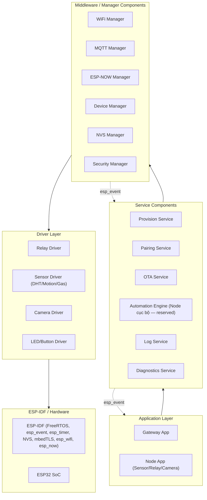
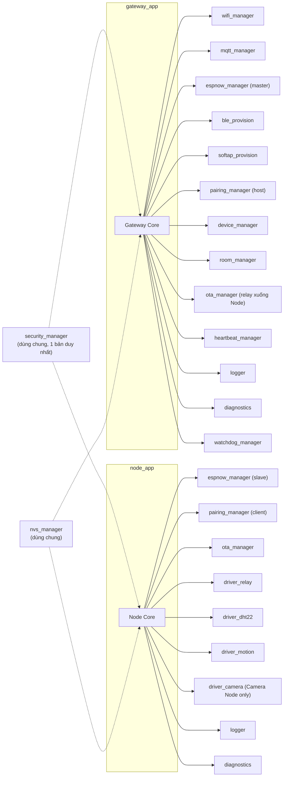
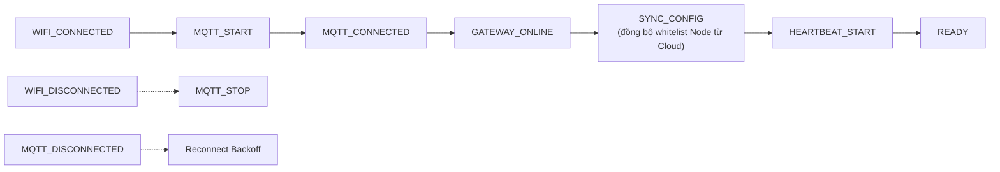
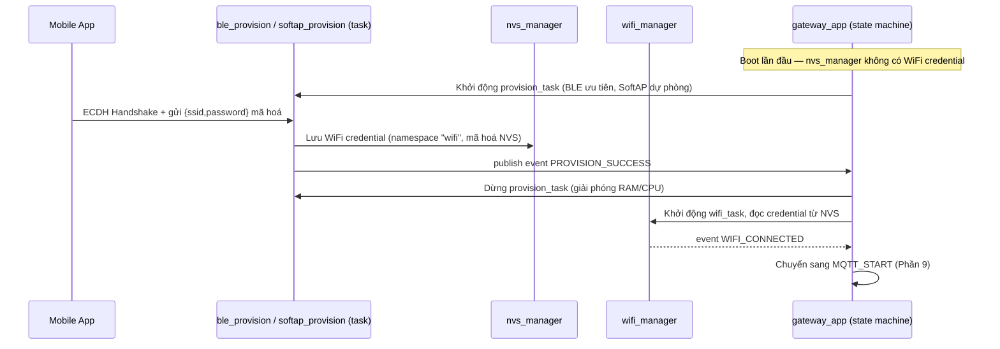
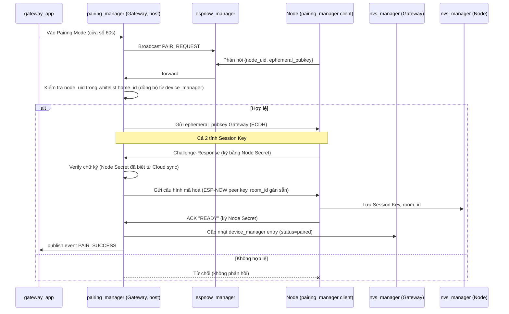
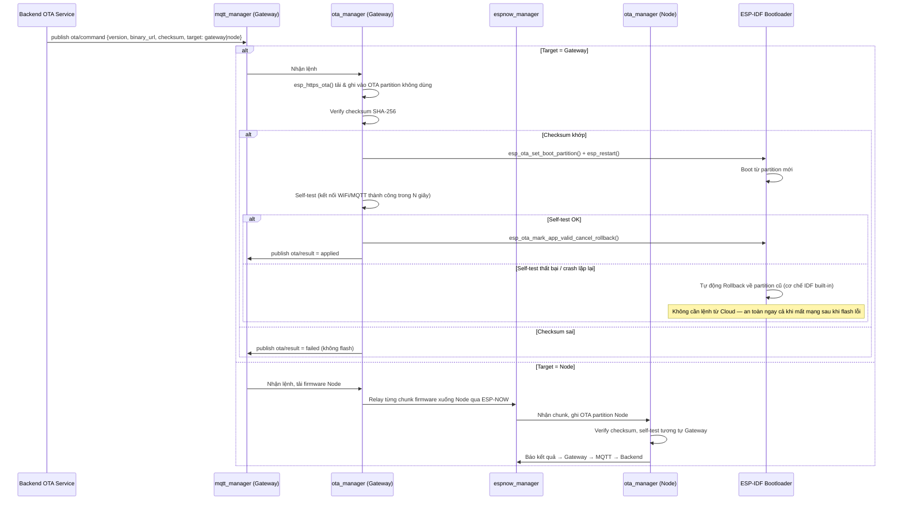
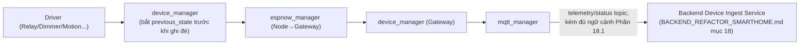

# EMBEDDED_ARCHITECTURE_ESP_IDF.md

> Thiết kế lại Firmware — từ **PlatformIO + Arduino Framework (prototype)** sang **ESP-IDF + CMake + FreeRTOS (Commercial Smart Home Firmware)**.
> Vai trò biên soạn: Principal Embedded Architect / IoT Firmware Architect / ESP-IDF Expert / RTOS Expert / Solution Architect.
> Tài liệu **chỉ thiết kế kiến trúc — không viết code, không migrate code**. Ràng buộc chặt với các tài liệu đã có, không lặp lại logic nghiệp vụ đã thiết kế mà **hiện thực hoá ở tầng firmware**:
> - [`SMART_HOME_WIFI_PROVISIONING.md`](SMART_HOME_WIFI_PROVISIONING.md) — Network Topology (Gateway↔Node qua ESP-NOW, Gateway↔Camera qua Local-AP), Key Hierarchy, Provisioning/Pairing flow.
> - [`BACKEND_REFACTOR_SMARTHOME.md`](BACKEND_REFACTOR_SMARTHOME.md) — MQTT Topic Design (Phần 10), OTA Design (Phần 11).
> - [`BACKEND_REFACTOR_SMARTHOME.md`](BACKEND_REFACTOR_SMARTHOME.md) mục 18 — Event Catalog cần firmware phát sinh (`BrightnessChangedEvent`, `MotionDetectedEvent`...).
>
> Toàn bộ source code firmware thực tế đã được đọc: `firmware/gateway-node/{platformio.ini, include/config_gw.h, src/main.cpp, lib/{wifi_manager,mqtt_client,forwarder,hmac_util,ntp_sync,sensor_registry}}`, `firmware/sensor-node/{platformio.ini, include/config_1.h, src/main.cpp, lib/{wifi_manager,mqtt_sender,sensor_reader,hmac_util,ntp_sync}}`, và đối chiếu `firmware/sensor-node-2` (xác nhận bằng `diff` là bản sao gần như y hệt `sensor-node`, chỉ khác `device_id`/`secret_key`/IP broker). Thư mục `firmware/ESP32-S3-Touch-LCD-7B/` là SDK/ví dụ tham khảo của nhà cung cấp board (font, LCD driver, ví dụ I2C/CAN...) — **không phải firmware sản phẩm**, không thuộc phạm vi review.

---

## MỤC LỤC

1. [Review firmware hiện tại](#1-review-firmware-hiện-tại)
2. [Review PlatformIO](#2-review-platformio)
3. [Lý do chuyển sang ESP-IDF](#3-lý-do-chuyển-sang-esp-idf)
4. [Kiến trúc firmware mới](#4-kiến-trúc-firmware-mới)
5. [Project Structure](#5-project-structure)
6. [Component Diagram](#6-component-diagram)
7. [Layer Architecture](#7-layer-architecture)
8. [Task Architecture](#8-task-architecture)
9. [Event Flow](#9-event-flow)
10. [Gateway Architecture](#10-gateway-architecture)
11. [Device Architecture](#11-device-architecture)
12. [Provision Flow](#12-provision-flow)
13. [Pairing Flow](#13-pairing-flow)
14. [OTA Flow](#14-ota-flow)
15. [Partition Design](#15-partition-design)
16. [NVS Design](#16-nvs-design)
17. [Logging Design](#17-logging-design)
18. [AI Ready Design](#18-ai-ready-design)
19. [Security Design](#19-security-design)
20. [Diagnostics](#20-diagnostics)
21. [Roadmap migrate](#21-roadmap-migrate)
22. [Best Practices](#22-best-practices)

---

## 1. REVIEW FIRMWARE HIỆN TẠI

### 1.1. Project Structure & Folder Structure

```
firmware/
├── gateway-node/   {include/config_gw.h, src/main.cpp, lib/{wifi_manager,mqtt_client,forwarder,hmac_util,ntp_sync,sensor_registry}}
├── sensor-node/    {include/config_1.h,  src/main.cpp, lib/{wifi_manager,mqtt_sender,sensor_reader,hmac_util,ntp_sync}}
└── sensor-node-2/  {include/config_2.h,  src/main.cpp, lib/{...}}  — bản sao gần như 100% của sensor-node
```

**Nhận xét:** Cấu trúc `lib/<module>/module.{h,cpp}` là pattern PlatformIO tiêu chuẩn, **đủ tốt cho 1 firmware duy nhất** — nhưng đây là **3 project PlatformIO độc lập hoàn toàn** (3 thư mục gốc riêng, 3 `platformio.ini` riêng), không phải 1 codebase dùng chung với cấu hình khác nhau theo target. Đây là vấn đề kiến trúc gốc rễ: `sensor-node-2` **không tồn tại vì có lý do kỹ thuật** (không phải 1 loại node khác) — nó tồn tại thuần tuý vì PlatformIO/Arduino không có cơ chế "build cùng 1 mã nguồn với cấu hình khác nhau cho nhiều thiết bị vật lý" một cách tiện lợi ở mức dự án nhỏ, nên đội ngũ đã **copy-paste toàn bộ project** thay vì tham số hoá.

### 1.2. Library / Dependency

| File | Dependency | Đánh giá |
|---|---|---|
| `gateway-node/platformio.ini` | `PubSubClient@^2.8`, `ArduinoJson@^6.21.5` | 2 thư viện Arduino ngoài, không version pin tuyệt đối (`^` cho phép minor update tự động — rủi ro build không tái lập được (non-reproducible build) giữa các lần build khác thời điểm) |
| `sensor-node/platformio.ini` | + `DHT sensor library@^1.4.4`, `Adafruit Unified Sensor@^1.1.9` | Cùng vấn đề pin version |
| `hmac_util.cpp` (cả 2 project) | `mbedtls/md.h` | Đây là thư viện **đã có sẵn trong ESP-IDF** (Arduino-ESP32 core chỉ là lớp vỏ bọc quanh ESP-IDF) — bằng chứng cho thấy firmware hiện tại **đã ngầm phụ thuộc ESP-IDF bên dưới** dù đang dùng Arduino Framework ở trên, chỉ là chưa khai thác trực tiếp các API mạnh hơn (esp_event, esp_timer, NVS...). |

**Trùng lặp code giữa 2 biến thể `hmac_util`:** `gateway-node/lib/hmac_util/hmac_util.cpp` dùng chữ ký C-string (`bool computeHMAC(const char*, const char*, char[65])`), còn `sensor-node/lib/hmac_util/hmac_util.cpp` dùng chữ ký `Arduino String` (`String computeHMAC(const String&, const String&)`) — **cùng 1 thuật toán, viết lại 2 lần với API khác nhau** vì không có cơ chế chia sẻ code giữa 3 project PlatformIO độc lập. Đây chính xác là hệ quả trực tiếp của vấn đề 1.1.

### 1.3. Task / Kiến trúc thực thi

**Không có RTOS task nào được tạo tường minh.** Cả `gateway-node/src/main.cpp` và `sensor-node/src/main.cpp` đều theo mô hình **super-loop tuần tự** kinh điển của Arduino: `setup()` khởi tạo tuần tự (WiFi → NTP → MQTT → ...), `loop()` gọi tuần tự các hàm `xxxMaintain()` rồi kiểm tra điều kiện gửi dữ liệu bằng `millis()` polling (`sensor-node/src/main.cpp:46-87`). Bản thân Arduino-ESP32 core **có chạy trên FreeRTOS bên dưới** (loopTask là 1 task FreeRTOS duy nhất), nhưng ở tầng ứng dụng, lập trình viên **không hề khai thác** khả năng đa nhiệm thật (không `xTaskCreate`, không `xQueue`, không `xEventGroup`) — mọi việc chạy tuần tự trong 1 task, nghĩa là 1 thao tác chậm (VD `HTTPClient` fetch sensor list trong `sensor_registry.cpp:34-44` với `HTTP_TIMEOUT=10000ms`) **có thể làm treo toàn bộ vòng lặp chính** (bao gồm cả việc gateway ngừng forward dữ liệu sensor khác trong lúc đang chờ HTTP timeout).

### 1.4. Driver

Chỉ có 2 driver đơn giản: DHT22 (qua thư viện Adafruit, `sensor_reader.cpp`) và GPIO LED thuần (`digitalWrite`). **Không có driver nào cho relay/actuator, camera, cảm biến chuyển động, door-contact** — đúng như đã xác nhận ở các tài liệu trước, phần cứng hiện tại thuần đo lường, chưa có khả năng điều khiển.

### 1.5. Communication

| Kênh | Hiện trạng |
|---|---|
| WiFi | `WiFi.begin(WIFI_SSID, WIFI_PASS)` — **SSID/Password hard-code trực tiếp trong `config_1.h`/`config_gw.h`, compile vào firmware, commit vào source control** (`WIFI_SSID "Tang 4"`, `WIFI_PASS "19581958"` — đã xác nhận đọc trực tiếp trong file). Đây là lỗ hổng nghiêm trọng cho sản phẩm thương mại: mọi thiết bị build từ cùng firmware sẽ mang **cùng 1 WiFi credential** của mạng dev nội bộ — hoàn toàn không dùng được cho khách hàng thật (đúng vấn đề mà `SMART_HOME_WIFI_PROVISIONING.md` đã giải quyết ở tầng thiết kế, nhưng **firmware thực tế hiện tại không hề triển khai** cơ chế Provisioning nào — không có SoftAP, không có BLE, không có NVS lưu WiFi runtime). |
| MQTT | `PubSubClient` (thư viện Arduino phổ biến nhưng **không hỗ trợ TLS có kiểm chứng chứng chỉ đầy đủ** dễ dàng như `esp-mqtt` của ESP-IDF) — kết nối không TLS (`WiFiClient` thuần, không `WiFiClientSecure`), khớp với cấu hình Mosquitto `allow_anonymous true` không TLS đã nêu ở các tài liệu trước. |
| ESP-NOW | **Không tồn tại trong code hiện tại** — dù đã được `SMART_HOME_WIFI_PROVISIONING.md` chọn làm giao thức chính Gateway↔Node (Phần 3.1), firmware thực tế chưa triển khai; mọi Sensor Node hiện tại kết nối **thẳng vào WiFi thật** (`WiFi.begin` trong `sensor-node`), vi phạm trực tiếp nguyên tắc "chỉ Gateway giữ WiFi thật" đã chốt ở tài liệu đó — **đây là khoảng cách lớn nhất giữa thiết kế đã có và code hiện tại**, không phải lỗi thiết kế mà là phần **chưa triển khai**. |
| BLE | Không tồn tại (`about_page.dart` phía Mobile có nhắc "Kết nối Bluetooth" nhưng đó chỉ là placeholder UI, chưa có gì tương ứng ở firmware). |
| HTTP | Dùng cho `fetchSensorList()` (`sensor_registry.cpp`) — gọi `BACKEND_SENSORS_URL` không TLS (`http://`), đúng với lỗ hổng "rò rỉ secret_key toàn hệ thống" đã nêu ở `sensors.routes.ts` (backend trả plaintext secret cho endpoint này). |

### 1.6. MQTT chi tiết

Gateway giữ **2 kết nối `PubSubClient` song song** (`mqttSubClient` cho Broker 1, `mqttPubClient` cho Broker 2 — `mqtt_client.cpp:9-14`) trong cùng 1 task, tự quản lý reconnect bằng `millis()` polling riêng cho từng broker (`mqtt_client.cpp:97-116`). Không có QoS > 1 (PubSubClient chỉ hỗ trợ QoS 0/1), không có Last Will and Testament (LWT) được cấu hình — nghĩa là khi Gateway mất kết nối đột ngột (rút điện, crash), **Backend không có cách nào biết ngay lập tức** ngoài chờ hết hạn `last_seen` (đã nêu ở `BACKEND_REFACTOR_SMARTHOME.md` — thiếu Heartbeat/LWT).

### 1.7. Memory

`StaticJsonDocument<512>`/`StaticJsonDocument<768>` (ArduinoJson, cấp phát tĩnh trên stack) dùng nhất quán trong `forwarder.cpp` — **điểm tốt** (tránh fragment heap so với `DynamicJsonDocument`), nhưng `sensor_registry.cpp:49` lại dùng `DynamicJsonDocument doc(4096)` (cấp phát heap) cho việc parse response HTTP — không nhất quán chiến lược quản lý bộ nhớ giữa các module trong cùng project.

### 1.8. Performance / Scalability

- Gateway lặp `mqttClientMaintain()` mỗi vòng `loop()` không giới hạn tốc độ (busy loop nhẹ, chấp nhận được ở quy mô hiện tại nhưng không tối ưu năng lượng — không có bất kỳ cơ chế `vTaskDelay`/sleep nào để nhường CPU).
- Không có giới hạn nào cho số lượng Sensor Node 1 Gateway có thể quản lý ngoài `SENSOR_REGISTRY_MAX = 16` (cấp phát tĩnh, hợp lý cho quy mô 1 hộ gia đình — **điểm thiết kế tốt**, không nên đổi khi migrate).
- Kiến trúc super-loop **không scale được về mặt tính năng** (không phải hiệu năng) — mỗi tính năng mới (OTA, BLE Provisioning, ESP-NOW, Camera) đều cần chạy song song độc lập, không thể chèn thêm vào 1 vòng lặp tuần tự mà không làm tăng độ trễ phản hồi của các tác vụ khác.

### 1.9. Maintainability / Code Quality

| Điểm tốt (đáng giữ lại) | Điểm cần cải thiện |
|---|---|
| Comment tiếng Việt rõ ràng, giải thích đúng lý do kỹ thuật (VD lý do dùng `StaticJsonDocument`, lý do offset NTP) | Cấu hình nhạy cảm (WiFi, Secret Key) nằm trong file `.h` **compile vào binary và commit vào git** — không tách biệt build-time config khỏi provisioning-time credential |
| `safeEq64()` trong `forwarder.cpp:13-17` — so sánh hằng thời gian (constant-time) tự viết tay đúng nguyên tắc chống timing attack, nhất quán với triết lý bảo mật ở Backend (`hmacService.ts` dùng `timingSafeEqual`) | 2 bản `hmac_util` khác API cho cùng 1 thuật toán (mục 1.2) |
| `registryFindSecret()` có fallback 2 tầng (danh sách động từ backend → danh sách cứng `KNOWN_SENSORS`) — thiết kế resilient hợp lý cho giai đoạn demo | `KNOWN_SENSORS[]` hard-code secret key plaintext ngay trong file cấu hình (`config_gw.h:74-79`) — trùng lặp đúng vấn đề "rò rỉ secret" đã nêu ở Backend, giờ xác nhận **firmware cũng lưu bản sao plaintext ở phía thiết bị** |
| Module hoá theo `lib/<name>` rõ ràng, mỗi module 1 trách nhiệm (WiFi/MQTT/HMAC/NTP/Registry/Forwarder) — **đúng tinh thần Component-based** dù chưa dùng ESP-IDF component thật | Không có test nào (`test/` không tồn tại trong cả 2 project) — không thể unit test do phụ thuộc cứng vào `Arduino.h`/`WiFi.h` toàn cục, không có interface trừu tượng cho driver |

### 1.10. Bảng tổng hợp vấn đề

| # | Vấn đề | Mức độ |
|---|---|---|
| 1 | WiFi SSID/Password hard-code, compile vào binary, commit vào git | Nghiêm trọng |
| 2 | Gateway/Device Secret lưu plaintext trong file cấu hình, không mã hoá | Nghiêm trọng |
| 3 | Không có Provisioning nào (SoftAP/BLE) — mỗi thiết bị phải flash riêng WiFi | Nghiêm trọng — chặn bán hàng loạt |
| 4 | Không có ESP-NOW — Sensor Node vẫn nối thẳng WiFi thật, trái thiết kế đã chốt | Nghiêm trọng |
| 5 | Không có OTA nào | Nghiêm trọng |
| 6 | Không có RTOS task thật — super-loop tuần tự, dễ bị 1 tác vụ chậm chặn toàn bộ | Cao |
| 7 | 3 project PlatformIO độc lập thay vì 1 codebase tham số hoá | Cao — nợ kỹ thuật nhân bản |
| 8 | Không TLS cho MQTT/HTTP | Cao |
| 9 | Không NVS — mọi cấu hình đều compile-time, không thể thay đổi runtime (đổi WiFi phải re-flash) | Nghiêm trọng |
| 10 | Không Watchdog, không Diagnostics, không Restart Reason logging | Trung bình |
| 11 | Không relay/actuator/camera driver | Cao (phụ thuộc mở rộng phần cứng, không phải lỗi code) |
| 12 | Không unit test được do phụ thuộc cứng Arduino global | Trung bình |

---

## 2. REVIEW PLATFORMIO

| Tiêu chí | Đánh giá |
|---|---|
| **Ưu điểm** | Cài đặt nhanh, học đường cong thấp; hệ sinh thái thư viện Arduino khổng lồ (PubSubClient, DHT, ArduinoJson — đều đã dùng); tích hợp tốt VSCode; phù hợp prototype/demo/đồ án cần ra kết quả nhanh — **đúng lý do dự án hiện tại chọn nó, hợp lý cho giai đoạn đó**. |
| **Nhược điểm** | `lib_deps` dùng version range (`^2.8`) thay vì pin tuyệt đối — build không tái lập (reproducible) hoàn toàn theo thời gian; Arduino Framework che giấu phần lớn API mạnh của ESP-IDF bên dưới (Partition Table tuỳ biến, NVS trực tiếp, esp_event, esp_timer độ phân giải cao, Secure Boot, Flash Encryption) đằng sau lớp trừu tượng đơn giản hoá — muốn dùng phải "đục xuyên" qua `esp_` API thô bên trong Arduino-ESP32 (đã thấy dấu hiệu này qua việc dùng thẳng `mbedtls/md.h` và `soc/rtc_cntl_reg.h` trong code hiện tại). |
| **Giới hạn** | Không có khái niệm Managed Component (ESP Component Registry) — quản lý dependency third-party kém hơn (không versioning theo SHA/component manifest như `idf_component.yml`); partition table mặc định đơn giản, tuỳ biến được nhưng không phải luồng làm việc chính thống của toolchain; `menuconfig` không khả dụng (Kconfig chỉ có ở ESP-IDF) — không có cách chuẩn để bật/tắt tính năng theo cấu hình build (Debug/Release, có/không Camera...) mà không sửa code. |
| **Khó khăn khi phát triển sản phẩm lớn** | (a) Không tách được build config (compile-time, theo dòng sản phẩm) khỏi provisioning config (runtime, theo từng thiết bị bán ra) — hiện đang lẫn cả 2 vào cùng 1 file `.h` (mục 1.10 #1-2); (b) không tận dụng được OTA hạ tầng chuẩn của Espressif (`esp_https_ota` + App Rollback tự động khi boot lỗi liên tiếp — tính năng "must-have" cho fleet hàng nghìn thiết bị, Arduino có OTA library riêng nhưng không tích hợp Rollback tự động sâu bằng ESP-IDF); (c) không có Secure Boot/Flash Encryption production-grade dễ bật qua `menuconfig` như ESP-IDF; (d) khó viết Unit Test tách biệt phần cứng (Arduino Framework không có cơ chế "Native/Host build" chính thức mạnh như ESP-IDF's `idf.py --preview target linux`). |

**Kết luận:** PlatformIO + Arduino **không sai** khi dùng cho giai đoạn hiện tại (demo/đồ án, 1-2 loại thiết bị, chưa cần OTA/Provisioning/Security production) — nhưng đã chạm trần giới hạn ngay khi bước sang giai đoạn "bán hàng loạt, nhiều loại thiết bị, cần OTA + Provisioning + Security thật" — đúng đánh giá của yêu cầu đề bài.

---

## 3. LÝ DO CHUYỂN SANG ESP-IDF

| Nhu cầu sản phẩm thương mại | Khả năng ESP-IDF đáp ứng | PlatformIO/Arduino tương đương |
|---|---|---|
| Build tái lập, quản lý dependency chuẩn | **CMake** + **Managed Components** (`idf_component.yml`, ESP Component Registry — pin version chính xác, kể cả từ Git commit/tag) | `lib_deps` dạng text, version range lỏng lẻo |
| Bật/tắt tính năng theo dòng sản phẩm (Gateway có Camera hay không, Node loại Sensor hay Relay) mà không sửa code | **Kconfig / `idf.py menuconfig`** — cấu hình dạng cây, sinh macro tự động, có thể lưu nhiều `sdkconfig.defaults` theo target | Không có tương đương chính thống — phải dùng `build_flags`/`#ifdef` thủ công rải rác |
| Lưu cấu hình runtime (WiFi, Secret, Provisioning status) tách khỏi firmware binary | **NVS (Non-Volatile Storage)** — key-value namespace, hỗ trợ encryption riêng, là cơ chế chuẩn của Espressif cho chính xác nhu cầu này | Arduino Preferences.h là lớp bọc NVS đơn giản hoá, thiếu kiểm soát namespace/encryption tinh vi |
| Cập nhật firmware hàng loạt an toàn (không biến hàng nghìn thiết bị thành "gạch" nếu OTA lỗi) | **OTA 2 partition (`ota_0`/`ota_1`) + App Rollback tự động** — ESP-IDF có cơ chế xác nhận "boot thành công" (`esp_ota_mark_app_valid_cancel_rollback`), nếu app mới crash liên tục trong vài lần boot đầu, bootloader **tự động rollback** về partition cũ mà không cần can thiệp từ xa | Cần tự viết logic rollback thủ công, không có sẵn tích hợp sâu ở tầng bootloader |
| Đa nhiệm thật (WiFi/MQTT/OTA/Sensor/Automation chạy độc lập, không chặn nhau) | **FreeRTOS Task + Queue + Event Group** là công dân hạng nhất của ESP-IDF (không phải lớp bọc như trên Arduino core) | Arduino-ESP32 có FreeRTOS bên dưới nhưng API tầng ứng dụng khuyến khích super-loop, không khuyến khích multi-task tường minh |
| Giao tiếp giữa các module không tight-coupling (WiFi connect → tự động trigger MQTT start, không gọi hàm trực tiếp) | **`esp_event` (Event Loop)** — publish/subscribe chuẩn hoá, tách rời hoàn toàn các component | Không có tương đương — hiện tại gọi hàm trực tiếp tuần tự trong `setup()`/`loop()` |
| Đo thời gian chính xác cho HMAC timestamp, watchdog, task scheduling | **`esp_timer`** (độ phân giải micro giây, callback trong ISR/task context) | Arduino chỉ có `millis()` (độ phân giải mili giây, đủ dùng hiện tại nhưng giới hạn khi cần đo chính xác hơn cho Diagnostics) |
| Bảo mật production (chống đọc trộm firmware, chống giả mạo bootloader) | **Secure Boot V2 + Flash Encryption** tích hợp sẵn, bật qua `menuconfig`, ký bằng khoá RSA/ECDSA quản lý qua quy trình xưởng | Không có tương đương chính thống trên Arduino Framework |
| Quản lý phân vùng flash tuỳ biến (tách vùng Log/Storage khỏi App/OTA) | **Partition Table CSV tuỳ biến hoàn toàn** (Phần 15) | Partition table mặc định đơn giản, tuỳ biến được nhưng không phải luồng chính thống |

**Kết luận:** ESP-IDF không phải "framework khác" mà là **lớp nền tảng thật sự** mà Arduino-ESP32 core đang bọc bên ngoài (đã thấy bằng chứng cụ thể: `hmac_util.cpp` dùng thẳng `mbedtls/md.h`, `main.cpp` dùng thẳng `soc/rtc_cntl_reg.h` — cả hai đều là API ESP-IDF thuần, không phải Arduino). Chuyển sang ESP-IDF là **bóc lớp vỏ Arduino để dùng trực tiếp nền tảng đã luôn ở đó**, không phải học lại từ đầu một hệ sinh thái hoàn toàn xa lạ.

---

## 4. KIẾN TRÚC FIRMWARE MỚI



**Nguyên tắc phân lớp:** mỗi lớp chỉ gọi xuống lớp ngay dưới, giao tiếp ngược lên qua **Event Loop** (không gọi hàm callback trực tiếp xuyên lớp) — khắc phục đúng vấn đề "gọi hàm trực tiếp tuần tự" đã nêu ở mục 1.3.

---

## 5. PROJECT STRUCTURE

> Đề xuất **1 mono-repo firmware duy nhất**, nhiều `sdkconfig.defaults`/target theo dòng sản phẩm (Gateway/Sensor Node/Relay Node/Camera Node) — thay thế 3 project PlatformIO độc lập hiện tại (vấn đề #7).

```
firmware/
├── CMakeLists.txt                 # Root project — idf.py build entry
├── sdkconfig.defaults             # Cấu hình mặc định chung mọi target
├── sdkconfig.defaults.gateway     # Override riêng cho Gateway (VD bật ESP-NOW master + Camera AP)
├── sdkconfig.defaults.sensor_node # Override riêng cho Sensor Node (VD bật deep-sleep, tắt Camera)
├── partitions_gateway.csv         # Partition table riêng Gateway (Phần 15)
├── partitions_node.csv            # Partition table riêng Node (nhỏ hơn, không cần OTA 2 slot đầy đủ nếu ràng buộc chi phí)
│
├── main/                          # Application layer — 1 thư mục / loại firmware
│   ├── gateway_app/               # Gateway Core (Phần 10)
│   └── node_app/                  # Device App (Sensor/Relay/Camera — Phần 11), chọn qua Kconfig NODE_TYPE
│
└── components/                    # Toàn bộ Service/Middleware/Driver — dùng chung giữa Gateway & Node
    ├── wifi_manager/
    ├── espnow_manager/
    ├── mqtt_manager/
    ├── ble_provision/
    ├── softap_provision/
    ├── pairing_manager/
    ├── device_manager/
    ├── room_manager/               # Chỉ Gateway dùng — cache cấu trúc Room/Device đồng bộ từ Cloud
    ├── automation_engine/          # Reserved — rule engine cục bộ (Phần 12 BACKEND_REFACTOR)
    ├── ota_manager/
    ├── firmware_verify/            # Checksum SHA-256, chữ ký
    ├── nvs_manager/
    ├── security_manager/           # HMAC, mã hoá NVS, Key Hierarchy
    ├── logger/
    ├── diagnostics/
    ├── watchdog_manager/
    ├── heartbeat_manager/
    ├── drivers/
    │   ├── driver_relay/
    │   ├── driver_dht22/
    │   ├── driver_motion/
    │   ├── driver_door_contact/
    │   ├── driver_camera/
    │   └── driver_led_button/
    └── common/                     # Kiểu dữ liệu dùng chung (Event payload struct, Device UUID format...)
```

**Nguyên tắc:** `components/` chứa **mọi logic dùng chung** giữa Gateway và Node — khắc phục triệt để vấn đề "2 bản `hmac_util` khác API" (mục 1.2): chỉ có **1** `security_manager` component, cả `gateway_app` và `node_app` đều `REQUIRES security_manager` trong `CMakeLists.txt` của mình.

---

## 6. COMPONENT DIAGRAM



---

## 7. LAYER ARCHITECTURE

| Lớp | Trách nhiệm | Ví dụ component |
|---|---|---|
| **Application** | Điều phối vòng đời thiết bị (state machine tổng: Provisioning → Pairing → Ready → OTA...), không chứa logic giao thức chi tiết | `gateway_app`, `node_app` |
| **Service** | Nghiệp vụ hoàn chỉnh, độc lập, expose qua Event + API function | `ota_manager`, `pairing_manager`, `automation_engine` (Node), `diagnostics` |
| **Middleware/Manager** | Quản lý 1 giao thức/tài nguyên hệ thống cụ thể, che giấu chi tiết bên dưới | `wifi_manager`, `mqtt_manager`, `espnow_manager`, `nvs_manager` |
| **Driver** | Điều khiển phần cứng trực tiếp, không biết gì về giao thức mạng/nghiệp vụ | `driver_relay`, `driver_dht22`, `driver_camera` |
| **HAL/ESP-IDF** | Nền tảng — FreeRTOS, esp_event, esp_timer, NVS, mbedTLS, esp_wifi/esp_now | Do Espressif cung cấp, không tự viết |

**Quy tắc phụ thuộc:** lớp trên chỉ được `#include`/`REQUIRES` lớp ngay dưới; **Driver không bao giờ biết tới khái niệm MQTT/Room/Home** (Driver chỉ trả về giá trị đo được hoặc nhận lệnh bật/tắt thuần tuý) — đảm bảo Driver test được độc lập (Phần 22 Best Practices).

---

## 8. TASK ARCHITECTURE

### 8.1. Gateway — Task Table

| Task | Ưu tiên | Stack (đề xuất) | Core (nếu ESP32 dual-core) | Trách nhiệm |
|---|---|---|---|---|
| `wifi_task` | 5 (cao) | 3072B | Core 0 (giao thức mạng) | Quản lý kết nối/reconnect WiFi Station, publish event `WIFI_CONNECTED`/`WIFI_DISCONNECTED` |
| `mqtt_task` | 5 | 4096B | Core 0 | Duy trì kết nối MQTT Broker 2, publish/subscribe, xử lý reconnect + LWT |
| `espnow_task` | 5 | 3072B | Core 0 | Nhận/gửi frame ESP-NOW từ/tới Node, forward vào Queue nội bộ |
| `provision_task` | 4 | 4096B | Core 0 | Chạy khi ở chế độ Provisioning (BLE/SoftAP), tự huỷ sau khi hoàn tất hoặc timeout |
| `pairing_task` | 4 | 3072B | Core 0 | Chạy khi Gateway ở "Pairing Mode" (cửa sổ 60s), broadcast `PAIR_REQUEST`, verify challenge-response |
| `ota_task` | 3 | 4096B (cần buffer tải firmware) | Core 1 (tách khỏi mạng để không chặn heartbeat khi ghi flash) | Tải firmware, verify checksum, ghi OTA partition, relay OTA xuống Node qua ESP-NOW |
| `telemetry_forward_task` | 4 | 3072B | Core 1 | Nhận dữ liệu từ `espnow_task` qua Queue, verify HMAC 2 lớp, publish MQTT (thay thế logic `forwardSensorData()` hiện tại — vẫn tuần tự trong 1 hàm nhưng nay chạy trong task riêng, không chặn `wifi_task`/`mqtt_task`) |
| `heartbeat_task` | 3 | 2048B | Core 1 | Định kỳ publish MQTT `heartbeat` topic (RSSI, uptime, node_count) — tính năng **hoàn toàn chưa có** ở firmware hiện tại |
| `automation_task` (reserved) | 3 | 4096B | Core 1 | Đánh giá rule cục bộ khi mất kết nối Cloud tạm thời (roadmap dài hạn, `BACKEND_REFACTOR_SMARTHOME.md` Phần 12.2) |
| `logger_task` | 2 (thấp) | 3072B | Core 1 | Ghi log ra Serial/flash log partition theo hàng đợi, không chặn task khác đang cần in log gấp |
| `diagnostics_task` | 1 (thấp nhất) | 2048B | Core 1 | Định kỳ đo heap/stack watermark, đẩy vào `heartbeat_task` để báo cáo |
| `watchdog_task` (hoặc dùng Task Watchdog Timer tích hợp IDF) | 2 | 1536B | — | Subscribe (feed) từ mọi task quan trọng; nếu 1 task không feed đúng hạn → reset có kiểm soát |

### 8.2. Node (Sensor/Relay/Camera) — Task Table (nhẹ hơn, tiết kiệm điện)

| Task | Ưu tiên | Trách nhiệm |
|---|---|---|
| `espnow_task` | 5 | Nhận lệnh từ Gateway, gửi telemetry định kỳ |
| `sensor_task` | 4 | Đọc cảm biến (DHT22/Motion/Gas) theo chu kỳ, đẩy dữ liệu vào Queue cho `espnow_task` |
| `actuator_task` (Relay Node) | 4 | Xử lý lệnh bật/tắt/dimmer, cập nhật trạng thái, publish `status` (retained) |
| `camera_task` (Camera Node only) | 5 | Chụp snapshot theo yêu cầu/motion trigger, kết nối Local-AP của Gateway để upload |
| `pairing_task` | 4 | Chỉ chạy khi node ở trạng thái "listening for pairing" |
| `ota_task` | 3 | Nhận firmware relay từ Gateway qua ESP-NOW, ghi OTA partition |
| `logger_task` | 2 | Ghi log tối giản (Node không cần log phong phú như Gateway — tiết kiệm flash/điện) |
| `watchdog_task` | 2 | Cùng cơ chế Gateway, đơn giản hơn |

**Nguyên tắc chọn Priority/Stack:** Task xử lý giao thức mạng thời gian thực (`wifi`/`mqtt`/`espnow`) luôn ưu tiên **cao hơn** task nền (`logger`/`diagnostics`) để tránh mất gói tin khi hệ thống bận; `ota_task` đặt ưu tiên **trung bình** (không quá cao để không chặn heartbeat, không quá thấp để tránh timeout tải firmware).

---

## 9. EVENT FLOW

### 9.1. Event Loop tổng thể (dùng `esp_event`)



### 9.2. Danh mục Event nội bộ firmware (không nhầm với Event Catalog Backend ở `BACKEND_REFACTOR_SMARTHOME.md` mục 18.2 — đây là event **nội bộ giữa các component firmware**, một phần trong số đó sẽ **kích hoạt** việc gửi Event lên Backend)

| Event (esp_event) | Publisher | Subscriber |
|---|---|---|
| `WIFI_CONNECTED` / `WIFI_DISCONNECTED` | `wifi_manager` | `mqtt_manager`, `heartbeat_manager`, `diagnostics` |
| `MQTT_CONNECTED` / `MQTT_DISCONNECTED` | `mqtt_manager` | `gateway_app` (chuyển state machine), `heartbeat_manager` |
| `PROVISION_STARTED` / `PROVISION_SUCCESS` / `PROVISION_FAILED` | `ble_provision`/`softap_provision` | `gateway_app`, `logger` |
| `PAIR_REQUEST_RECEIVED` / `PAIR_SUCCESS` / `PAIR_FAILED` | `pairing_manager` | `device_manager`, `logger` |
| `DEVICE_COMMAND_RECEIVED` | `mqtt_manager` (nhận từ Cloud) | `device_manager` → relay ESP-NOW xuống đúng Node |
| `DEVICE_STATE_CHANGED` | `driver_relay`/`driver_camera` (qua `device_manager`) | `mqtt_manager` (publish `status`/telemetry lên Cloud — Phần 18) |
| `OTA_AVAILABLE` / `OTA_PROGRESS` / `OTA_SUCCESS` / `OTA_FAILED` | `ota_manager` | `logger`, `mqtt_manager` (báo cáo Cloud) |
| `HEARTBEAT_TICK` | `esp_timer` callback | `heartbeat_manager` |
| `WATCHDOG_TIMEOUT` | `watchdog_manager` | Trigger `esp_restart()` có ghi log lý do trước khi reset |

**Nguyên tắc:** mọi component chỉ **publish** event của mình và **subscribe** event mình quan tâm — không gọi hàm trực tiếp xuyên component (khắc phục triệt để vấn đề mục 1.3 "gọi hàm trực tiếp tuần tự trong `setup()`").

---

## 10. GATEWAY ARCHITECTURE

| Thành phần | Vai trò | Kế thừa/thay thế từ code hiện tại |
|---|---|---|
| **Gateway Core** | State machine tổng: `PROVISIONING → PAIRING → SYNCING → ONLINE → OTA(tạm thời) → ONLINE` | Thay thế `setup()`/`loop()` tuần tự hiện tại |
| **Provision Manager** | Điều phối BLE/SoftAP Provisioning (Phần 12) | Hoàn toàn mới — hiện tại không có |
| **Pairing Manager** | Điều phối ghép nối Node mới, whitelist theo `home_id` (Phần 13) | Hoàn toàn mới |
| **WiFi Manager** | Kết nối WiFi Station bằng credential từ NVS (không hard-code) | Nâng cấp từ `wifi_manager.cpp` hiện tại — giữ nguyên tư duy retry/backoff, đổi nguồn credential |
| **MQTT Manager** | Kết nối TLS Broker 2, publish/subscribe theo Topic Design mới (`BACKEND_REFACTOR_SMARTHOME.md` Phần 10) | Nâng cấp từ `mqtt_client.cpp` — thêm TLS, LWT, đổi topic có `home_id` |
| **Device Manager** | Quản lý danh sách Node đã pair: UUID, Type, Room, Status, Firmware version, RSSI, Battery (nếu có), Last Seen (Phần 10.1 chi tiết bên dưới) | Nâng cấp từ `sensor_registry.cpp` — mở rộng từ "chỉ lưu secret" thành đầy đủ metadata |
| **Room Manager** | Cache cấu trúc Room/Device đồng bộ từ Cloud (để Gateway biết Node nào thuộc phòng nào mà không cần hỏi Cloud mỗi lần) | Hoàn toàn mới |
| **Heartbeat Manager** | Định kỳ publish RSSI/uptime/node_count | Hoàn toàn mới — hiện tại suy luận online qua `last_seen` gián tiếp, không có heartbeat riêng |
| **OTA Manager** | Tải firmware cho chính Gateway (`esp_https_ota`) + relay firmware xuống Node qua ESP-NOW | Hoàn toàn mới |
| **Firmware Manager** | Quản lý version hiện tại, verify checksum trước khi flash | Hoàn toàn mới |
| **Log Manager** | Ghi 8 loại log cục bộ (Phần 17), đẩy lên Cloud theo lô | Nâng cấp từ `Serial.print` rải rác hiện tại |
| **Diagnostics** | Heap/Task/RSSI/Restart Reason | Hoàn toàn mới |
| **Watchdog** | Task Watchdog Timer (IDF built-in) + Interrupt Watchdog | Hoàn toàn mới |
| **NVS Manager** | Namespace hoá toàn bộ cấu hình runtime (Phần 16) | Hoàn toàn mới — hiện tại 100% compile-time |
| **Security Manager** | HMAC (giữ nguyên thuật toán, hợp nhất 1 bản duy nhất — vá vấn đề #2 mục 1.2), mã hoá NVS | Hợp nhất từ 2 bản `hmac_util` hiện tại |

### 10.1. Device Manager — mô hình dữ liệu Node quản lý bởi Gateway

| Trường | Mô tả |
|---|---|
| `uuid` | Định danh duy nhất Node (khớp `devices.device_uid` ở Backend) |
| `type` | Sensor/Relay/Camera/Door-Contact (khớp `device_types.code`) |
| `room` | Phòng Node thuộc về (Living Room/Bedroom/Kitchen/Door/Garage/Garden/Bathroom...) |
| `status` | paired/unpaired/offline |
| `firmware_version` | Version hiện tại của Node (để quyết định có cần OTA hay không) |
| `rssi` | Cường độ tín hiệu ESP-NOW từ Node này |
| `battery` | % pin (nếu Node chạy pin — Garden/Balcony) |
| `last_seen` | Thời điểm nhận tín hiệu gần nhất (dùng để tự động đưa Node "mất kết nối" — khớp cơ chế 24h ở `SMART_HOME_WIFI_PROVISIONING.md` Phần 9.2) |

---

## 11. DEVICE ARCHITECTURE

Mỗi Node (Sensor/Relay/Camera) theo đúng 6 lớp yêu cầu:

| Lớp | Nội dung |
|---|---|
| **Application Layer** | `node_app` — state machine: `UNPAIRED → PAIRING → PAIRED_IDLE → ACTIVE ↔ OTA` |
| **Device Layer** | Logic nghiệp vụ loại thiết bị cụ thể (VD: Relay Node biết "kênh 1 = đèn, kênh 2 = quạt", Camera Node biết "chụp khi nhận lệnh hoặc khi Motion Driver trigger") |
| **Driver Layer** | `driver_relay`/`driver_dht22`/`driver_motion`/`driver_camera` — chỉ biết GPIO/I2C/SPI, không biết ESP-NOW/MQTT |
| **Communication Layer** | `espnow_manager` (giao tiếp với Gateway) — Node **không** có `wifi_manager`/`mqtt_manager` riêng (đúng nguyên tắc Phương án C đã chọn ở `SMART_HOME_WIFI_PROVISIONING.md`, ngoại trừ Camera Node dùng WiFi Station trỏ vào Local-AP của Gateway) |
| **Storage Layer** | `nvs_manager` — lưu `device_secret`, `paired_gateway_mac`, `session_key_version` |
| **OTA Layer** | `ota_manager` (client — nhận firmware relay từ Gateway) |
| **Logger** | Tối giản, ghi log cục bộ ít hơn Gateway (tiết kiệm tài nguyên) |
| **Diagnostics** | Heap/RSSI/Battery — báo cáo về Gateway qua Heartbeat |

---

## 12. PROVISION FLOW

> Chi tiết đầy đủ (BLE/SoftAP, ECDH handshake) đã có ở `SMART_HOME_WIFI_PROVISIONING.md` Phần 8. Phần dưới là **ánh xạ sang component/task ESP-IDF cụ thể**.



---

## 13. PAIRING FLOW



---

## 14. OTA FLOW



**Điểm mấu chốt khác biệt so với thiết kế OTA ở tầng Backend (`BACKEND_REFACTOR_SMARTHOME.md` Phần 11):** tài liệu đó thiết kế luồng rollout từ góc nhìn Backend/DB; tài liệu này bổ sung **chi tiết cơ chế Rollback tự động ở tầng bootloader** — đây là tính năng **chỉ ESP-IDF cung cấp sẵn**, không cần Backend "ra lệnh rollback" trong trường hợp thiết bị tự phát hiện lỗi ngay sau khi flash (an toàn ngay cả khi thiết bị mất kết nối Internet ngay sau khi cập nhật).

---

## 15. PARTITION DESIGN

### 15.1. Gateway (đủ dung lượng cho OTA 2 slot + Log + Storage)

| Partition | Loại | Kích thước (đề xuất) | Mô tả |
|---|---|---|---|
| `nvs` | data/nvs | 24 KB | WiFi, MQTT config, Device Secret, Provision status |
| `otadata` | data/ota | 8 KB | Con trỏ OTA slot đang active (cơ chế chuẩn ESP-IDF) |
| `phy_init` | data/phy | 4 KB | Hiệu chỉnh RF (chuẩn ESP-IDF, không tự quản) |
| `factory` | app/factory | 1.5 MB | Firmware gốc xuất xưởng — dùng làm "phao cứu sinh" nếu cả `ota_0`/`ota_1` đều lỗi (tuỳ chọn, có thể bỏ nếu tin tưởng hoàn toàn App Rollback) |
| `ota_0` | app/ota_0 | 1.5 MB | Slot firmware A |
| `ota_1` | app/ota_1 | 1.5 MB | Slot firmware B |
| `nvs_keys` | data/nvs_keys | 4 KB | Khoá mã hoá NVS (chỉ tồn tại khi bật NVS Encryption — Phần 19) |
| `storage` | data/spiffs hoặc littlefs | 512 KB | Cache cấu hình Room/Device đồng bộ từ Cloud (Room Manager) |
| `log` | data (custom, raw) | 256 KB | Log cục bộ dạng ring-buffer, đẩy lên Cloud theo lô, tự ghi đè khi đầy |

### 15.2. Node (tối giản hơn — không nhất thiết cần `factory` riêng nếu chi phí flash hạn chế)

| Partition | Kích thước (đề xuất) | Ghi chú |
|---|---|---|
| `nvs` | 16 KB | Device Secret, Session Key, Room ID |
| `otadata` + `ota_0` + `ota_1` | Theo dung lượng flash Node (thường nhỏ hơn Gateway) | Vẫn giữ 2 slot để có Rollback — không cắt giảm an toàn OTA dù Node rẻ hơn |
| `log` | 64 KB | Nhỏ hơn Gateway — Node chỉ log cục bộ tối thiểu, phần lớn log đẩy qua Gateway |

**Nguyên tắc:** **luôn giữ tối thiểu 2 OTA slot** cho cả Gateway lẫn Node — đây là điều kiện tiên quyết bắt buộc để có App Rollback tự động (Phần 3, 14); không nên cắt bớt xuống 1 slot dù tiết kiệm flash, vì mất khả năng rollback đồng nghĩa 1 lần OTA lỗi có thể biến thiết bị đã bán ra thị trường thành "gạch" không sửa được từ xa.

---

## 16. NVS DESIGN

| Namespace | Key | Mô tả |
|---|---|---|
| `wifi` | `ssid`, `password` (mã hoá) | Ghi bởi Provision Manager, đọc bởi WiFi Manager |
| `mqtt` | `broker_host`, `broker_port`, `client_cert`, `client_key` (nếu dùng mTLS) | |
| `identity` | `device_uuid`, `device_secret` (mã hoá), `gateway_uuid` (với Node) | Ghi 1 lần lúc xuất xưởng, không đổi trừ khi Replace/Factory Reset |
| `provision` | `status` (`unprovisioned`/`provisioning`/`provisioned`), `provisioned_at` | Device Manager/Provision Manager đọc để quyết định vào state nào lúc boot |
| `firmware` | `current_version`, `rollback_version` | Firmware Manager |
| `pairing` (Node) | `gateway_mac`, `session_key` (mã hoá), `session_key_version` | Pairing Manager |
| `pairing` (Gateway) | Danh sách Node đã pair — nếu vượt quá giới hạn 1 entry NVS, lưu dạng blob JSON nén hoặc dùng `storage` partition thay vì NVS thuần |
| `automation_cache` (reserved) | Rule cục bộ đồng bộ từ Cloud để đánh giá khi mất mạng tạm thời | Automation Engine (roadmap dài hạn) |
| `diag` | `last_restart_reason`, `boot_count` | Diagnostics |

**Nguyên tắc:** Namespace tách theo **domain sở hữu** (giống nguyên tắc tách bảng Database ở `DATABASE_REFACTOR_SMARTHOME.md`) — không gộp mọi key vào 1 namespace `"config"` chung chung; mọi giá trị nhạy cảm (`password`, `device_secret`, `session_key`) đọc/ghi qua `security_manager` (có bật NVS Encryption — Phần 19), không component nào khác được truy cập trực tiếp.

---

## 17. LOGGING DESIGN

| Loại Log | Component ghi | Đẩy lên Cloud qua |
|---|---|---|
| System Log | Mọi component (dùng `ESP_LOGI`/`ESP_LOGE` theo TAG chuẩn ESP-IDF) | Không đẩy toàn bộ — chỉ đẩy log mức `ERROR`/`WARN` |
| Provision Log | `ble_provision`/`softap_provision` | MQTT `provision` topic → Backend `provision_logs` |
| WiFi Log | `wifi_manager` | Gộp vào Heartbeat định kỳ (không cần realtime từng sự kiện) |
| MQTT Log | `mqtt_manager` | Backend `mqtt_logs` (qua chính kết nối MQTT khi còn sống) |
| OTA Log | `ota_manager` | Backend `ota_logs` |
| Automation Log (reserved) | `automation_engine` | Backend `automation_logs` |
| Device Log | `device_manager` | Backend `gateway_logs`/`device_logs` |
| Security Log | `security_manager` (HMAC fail, Pairing reject) | Backend `security_logs` — **ưu tiên cao nhất**, không được rớt log loại này dù hàng đợi đầy |
| AI Behavior Log | `device_manager` (mỗi lần đổi trạng thái thiết bị) | Backend `events`/`user_behavior_logs` (Phần 18) |

**Cơ chế:** log ghi cục bộ vào `log` partition dạng ring-buffer (ghi đè log cũ nhất khi đầy — chấp nhận được cho System/WiFi/MQTT Log tần suất cao), riêng **Security Log và AI Behavior Log không ghi đè** — nếu hàng đợi đẩy lên Cloud đầy, ưu tiên giữ 2 loại này, có thể hy sinh System Log cũ hơn.

---

## 18. AI READY DESIGN

> Ánh xạ trực tiếp tới Event Catalog đã thiết kế ở `BACKEND_REFACTOR_SMARTHOME.md` mục 18.2 — firmware là **nơi phát sinh** các Event đó, không tự lưu trữ/xử lý AI (AI hoàn toàn ở phía Backend).

### 18.1. Nguyên tắc

Mọi thay đổi trạng thái thiết bị có ý nghĩa hành vi (Brightness, Fan Speed, Relay ON/OFF, Door, Motion) đều đi qua `device_manager`, và `device_manager` **luôn gửi kèm ngữ cảnh** cần thiết cho AI Backend, không chỉ giá trị thô:

| Trường gửi kèm mỗi lần đổi trạng thái | Vai trò cho AI |
|---|---|
| `device_id`, `room_id` | Định vị không gian |
| `action` (`TURN_ON`/`BRIGHTNESS_SET`/...) | Loại hành vi |
| `previous_state`, `new_state` | Bắt buộc — Node/Gateway phải tự nhớ trạng thái trước đó (lưu tạm ở RAM `device_manager`, không cần NVS vì chỉ cần trong phiên hoạt động) trước khi ghi đè, rồi gửi cả 2 giá trị lên |
| `source` (`manual`/`automation`) | Quan trọng nhất — Node/Gateway phải phân biệt được lệnh này đến từ **App người dùng** (qua MQTT `command` do người dùng bấm) hay từ **Automation Rule** cục bộ (nếu có, roadmap dài hạn) — field này **bắt buộc có trong payload lệnh** gửi xuống từ Cloud để Node biết gắn nhãn đúng khi echo lại |
| `timestamp` | Từ NTP đã đồng bộ (giữ nguyên cơ chế `ntp_sync` hiện tại — **đáng giữ lại**, chỉ chuyển sang `esp_sntp` API của ESP-IDF thay vì `configTime` Arduino) |
| `ambient_light`, `motion`, `humidity` (nếu Node có cảm biến tương ứng) | Ngữ cảnh môi trường đính kèm — nullable nếu Node loại đó không có cảm biến |

### 18.2. Đường đi dữ liệu



**Không có bất kỳ xử lý AI/thống kê nào trên firmware** — đúng nguyên tắc "AI hoàn toàn ở Backend, firmware chỉ là nguồn dữ liệu trung thực nhất có thể" (giữ firmware đơn giản, dễ kiểm chứng, không tốn tài nguyên MCU hạn chế cho việc không phải sở trường của nó).

---

## 19. SECURITY DESIGN

| Hạng mục | Thiết kế | So với hiện tại |
|---|---|---|
| **TLS cho MQTT** | `esp-mqtt` (ESP-IDF) hỗ trợ TLS mutual/server-auth qua `esp_tls` — chứng chỉ CA nhúng vào firmware hoặc lưu NVS | Hiện tại `PubSubClient` không TLS (mục 1.5) |
| **Device Secret / Gateway Secret** | Lưu trong NVS namespace `identity`, **mã hoá bằng NVS Encryption** (khoá lưu ở `nvs_keys` partition, bản thân partition đó được bảo vệ bởi Flash Encryption) | Hiện tại plaintext trong file `.h` compile vào binary (mục 1.10 #2) |
| **Secure Provision** | ECDH handshake (đã thiết kế ở `SMART_HOME_WIFI_PROVISIONING.md` Phần 6) — WiFi Password không bao giờ truyền dạng rõ qua BLE/SoftAP | Hiện tại không có Provisioning nào — WiFi hard-code |
| **NVS Encryption** | Bật qua `menuconfig` (`CONFIG_NVS_ENCRYPTION`), khoá sinh ngẫu nhiên lúc xuất xưởng, lưu tách biệt `nvs_keys` partition | Không tồn tại (Arduino không có tương đương dễ dùng) |
| **Flash Encryption (Reserved)** | Bật ở bản Production (không bật ở bản Development để giữ khả năng debug/re-flash nhanh trong giai đoạn phát triển) — mã hoá toàn bộ nội dung flash bằng khoá AES gắn với chip (eFuse), chống dump firmware vật lý | Chưa có |
| **Secure Boot V2 (Reserved)** | Ký firmware bằng khoá RSA/ECDSA quản lý qua quy trình xưởng (HSM hoặc ký ly khai offline) — bootloader từ chối chạy firmware không đúng chữ ký | Chưa có |
| **HMAC 2 lớp (Sensor→Gateway→Backend)** | **Giữ nguyên hoàn toàn thuật toán và tư duy đã có** (constant-time compare, cửa sổ chống replay ±300s) — chỉ hợp nhất thành 1 component `security_manager` dùng chung Gateway/Node thay vì 2 bản API khác nhau | Đã đúng về thuật toán, chỉ cần dọn trùng lặp code |

---

## 20. DIAGNOSTICS

| Chỉ số | Cách thu thập (ESP-IDF) | Báo cáo |
|---|---|---|
| Heap free/min-ever-free | `esp_get_free_heap_size()`, `esp_get_minimum_free_heap_size()` | Kèm trong Heartbeat |
| Task stack watermark | `uxTaskGetStackHighWaterMark()` cho từng task quan trọng | Log khi dưới ngưỡng cảnh báo (nguy cơ stack overflow) |
| CPU usage | `vTaskGetRunTimeStats()` (cần bật `CONFIG_FREERTOS_GENERATE_RUN_TIME_STATS`) | Chỉ bật ở bản Debug — tắt ở Production để tiết kiệm overhead |
| RSSI | `esp_wifi_sta_get_ap_info()` | Heartbeat |
| MQTT connection state | `mqtt_manager` tự theo dõi | Heartbeat |
| WiFi reconnect count | Đếm trong `wifi_manager` | Heartbeat/Diagnostics report định kỳ dài hơn (VD mỗi giờ) |
| Nhiệt độ chip | `temperature_sensor` driver (ESP32-S3/C3 có cảm biến nhiệt nội bộ; ESP32 WROOM-32 gốc không có — cân nhắc khi chọn lại chip cho dòng sản phẩm thương mại) | Diagnostics |
| **Restart Reason** | `esp_reset_reason()` (`ESP_RST_POWERON`/`ESP_RST_PANIC`/`ESP_RST_WDT`/`ESP_RST_BROWNOUT`...) | Log ngay khi boot — **quan trọng bậc nhất để phân biệt "mất điện" và "firmware crash"** khi phân tích sự cố hàng loạt trên fleet |

**Nguyên tắc:** Diagnostics chạy ở priority thấp nhất (Phần 8), không được ảnh hưởng tới task giao thức mạng — mọi phép đo đều "quan sát", không "can thiệp" luồng chính.

---

## 21. ROADMAP MIGRATE

| Phase | Nội dung | Ghi chú |
|---|---|---|
| **Phase 0 — Thiết lập nền tảng ESP-IDF** | Khởi tạo project CMake, cấu trúc `components/` (Phần 5), migrate **thuần cấu trúc** (chưa đổi logic) từ Arduino sang ESP-IDF API tương đương (`WiFi.h`→`esp_wifi`, `PubSubClient`→`esp-mqtt`, giữ nguyên `mbedtls` đã dùng sẵn) | Không đổi hành vi — mục tiêu là build chạy được trên ESP-IDF với đúng chức năng hiện có |
| **Phase 1 — NVS hoá cấu hình** | Chuyển toàn bộ WiFi/Secret từ hard-code sang NVS (Phần 16) — **chưa cần Provisioning UI**, tạm thời ghi NVS qua `idf.py` monitor console/1 tool nội bộ cho giai đoạn dev | Vá vấn đề bảo mật nghiêm trọng nhất (#1, #2) sớm nhất có thể, trước cả khi có Provisioning UI hoàn chỉnh |
| **Phase 2 — Task hoá kiến trúc** | Tách `wifi`/`mqtt`/`telemetry_forward` thành FreeRTOS Task + Queue riêng (Phần 8), thay gọi hàm trực tiếp bằng `esp_event` (Phần 9) | Nền tảng bắt buộc trước khi thêm OTA/Provisioning/ESP-NOW — thêm task mới vào kiến trúc event-driven dễ hơn nhiều so với chèn vào super-loop |
| **Phase 3 — OTA + Partition 2-slot** | Triển khai `ota_manager` + Partition Table (Phần 15) + App Rollback | Điều kiện tiên quyết để có thể sửa lỗi từ xa cho fleet đã bán ra — làm sớm giảm rủi ro kinh doanh |
| **Phase 4 — Provisioning (BLE/SoftAP) + Pairing** | Triển khai đầy đủ theo `SMART_HOME_WIFI_PROVISIONING.md` Phần 7-9 | Điều kiện để bán hàng loạt (không phải flash tay từng thiết bị) |
| **Phase 5 — ESP-NOW Gateway↔Node** | Chuyển Sensor Node từ WiFi Station trực tiếp sang ESP-NOW qua Gateway (Phương án C đã chọn) | Đây là thay đổi kiến trúc mạng lớn nhất — cần test kỹ tầm phủ ESP-NOW thực tế trước khi rollout |
| **Phase 6 — Security hardening** | Bật NVS Encryption, TLS MQTT, (Reserved) Flash Encryption + Secure Boot | Bắt buộc trước khi bán ra thị trường thật — không nên trì hoãn tới "sau khi có khách hàng" |
| **Phase 7 — AI-Ready payload** | Bổ sung `previous_state`/`source`/ngữ cảnh môi trường vào mọi Event gửi lên (Phần 18) | Càng làm sớm càng tích luỹ được nhiều dữ liệu hành vi cho AI (đúng nguyên tắc đã nêu ở `BACKEND_REFACTOR_SMARTHOME.md` mục 18.9 — dữ liệu lịch sử không "ghi hồi tố" được) |
| **Phase 8 — Diagnostics & Watchdog đầy đủ** | Heap/Task/RSSI/Restart Reason, Task Watchdog Timer | Hoàn thiện khả năng vận hành/điều tra sự cố ở quy mô fleet lớn |
| **Phase 9 — Mở rộng loại thiết bị** | `driver_relay`, `driver_motion`, `driver_camera`, `driver_door_contact` | Phụ thuộc quyết định phần cứng cụ thể từng dòng sản phẩm — có thể chạy song song Phase 5-8 nếu đội ngũ đủ lớn |
| **Phase 10 — Automation Engine cục bộ (dài hạn)** | Đánh giá rule đơn giản ngay trên Gateway khi mất kết nối Cloud tạm thời | Không MVP bắt buộc — chỉ làm sau khi Cloud Automation (`BACKEND_REFACTOR_SMARTHOME.md`) đã ổn định |

**Nguyên tắc xuyên suốt:** Phase 0-2 là nền tảng bắt buộc tuần tự (không thể làm OTA/Provisioning tốt trên kiến trúc super-loop); Phase 3 và Phase 4 có thể chạy song song bởi 2 nhóm khác nhau sau khi Phase 2 hoàn tất; Phase 6 (Security) tuyệt đối không lùi tới sau khi đã bán hàng — phải hoàn tất trước lô hàng thương mại đầu tiên.

---

## 22. BEST PRACTICES

1. **Không bao giờ hard-code credential (WiFi/Secret) trong source code compile vào binary** — mọi giá trị theo từng thiết bị phải qua NVS, ghi lúc Provisioning/xuất xưởng, không commit vào git (bài học trực tiếp từ vấn đề #1, #2 đã phát hiện).
2. **1 codebase, nhiều target qua Kconfig — không copy-paste project cho từng thiết bị vật lý** (bài học trực tiếp từ `sensor-node-2` là bản sao gần như 100% của `sensor-node`).
3. **Giữ nguyên các quyết định bảo mật đã đúng** (constant-time HMAC compare, cửa sổ chống replay ±300s, dual-broker/dual-layer HMAC) — không "tối ưu lại" những gì đã đúng, chỉ tổ chức lại thành component dùng chung.
4. **Luôn giữ tối thiểu 2 OTA slot + App Rollback** cho mọi dòng thiết bị, không đánh đổi lấy tiết kiệm flash.
5. **Driver không bao giờ biết về giao thức mạng/nghiệp vụ** — để có thể mock Driver trong Unit Test (Testability) mà không cần mock cả `esp_wifi`/`esp_now`.
6. **Mock Driver / Mock MQTT / Mock WiFi cho Unit Test:** thiết kế mọi Manager qua **interface hàm con trỏ hoặc `Kconfig`-switchable implementation** (tương tự cách ESP-IDF hỗ trợ build cho target `linux` để chạy Unit Test trên máy host không cần phần cứng thật) — Driver Layer định nghĩa interface trừu tượng (`typedef struct { ... } relay_driver_ops_t`), test dùng bản mock implement cùng interface đó.
7. **Restart Reason phải được log ngay dòng đầu tiên sau boot** — đây là dữ liệu rẻ nhất nhưng giá trị điều tra sự cố cao nhất khi vận hành fleet hàng nghìn thiết bị.
8. **Security Log và AI Behavior Log không bao giờ bị ghi đè** khi hàng đợi log cục bộ đầy — mọi loại log khác có thể hy sinh trước.
9. **`source` (manual/automation) phải là trường bắt buộc trong mọi lệnh điều khiển gửi xuống Node** — thiếu trường này ở tầng firmware sẽ khiến toàn bộ nỗ lực AI-Ready ở tầng Backend/Database (`BACKEND_REFACTOR_SMARTHOME.md` mục 18, `DATABASE_REFACTOR_SMARTHOME.md` mục 7.12) mất đi tín hiệu quan trọng nhất mà không cách nào bù đắp lại được sau này.
10. **Không bật Flash Encryption/Secure Boot ở bản Development** — chỉ bật ở quy trình build Production chính thức, vì bật sớm sẽ làm chậm đáng kể vòng lặp debug/re-flash hàng ngày của đội ngũ phát triển.
