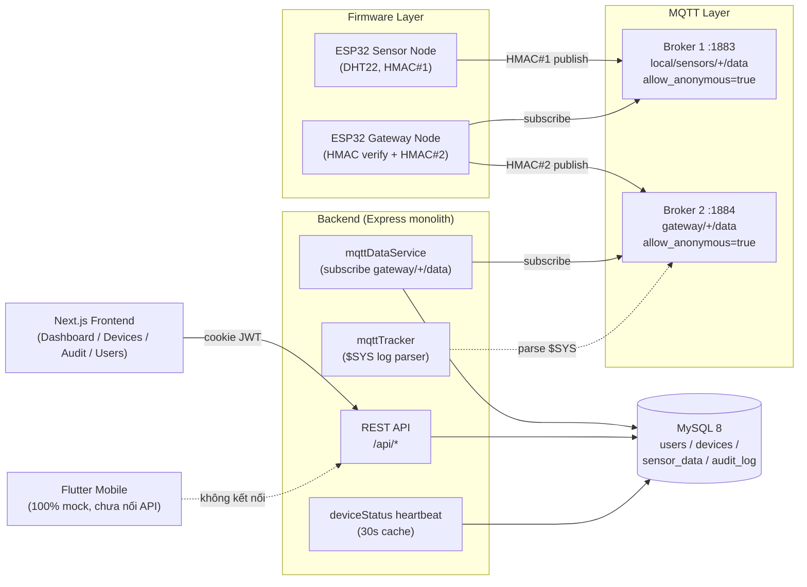
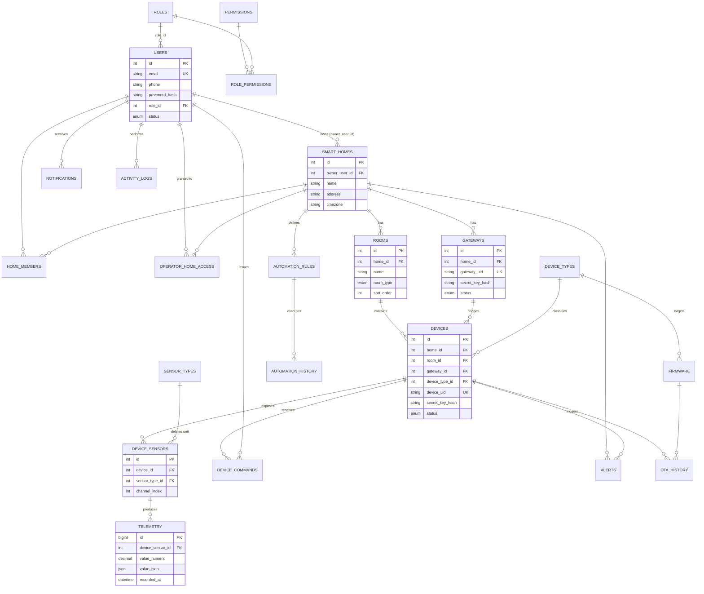
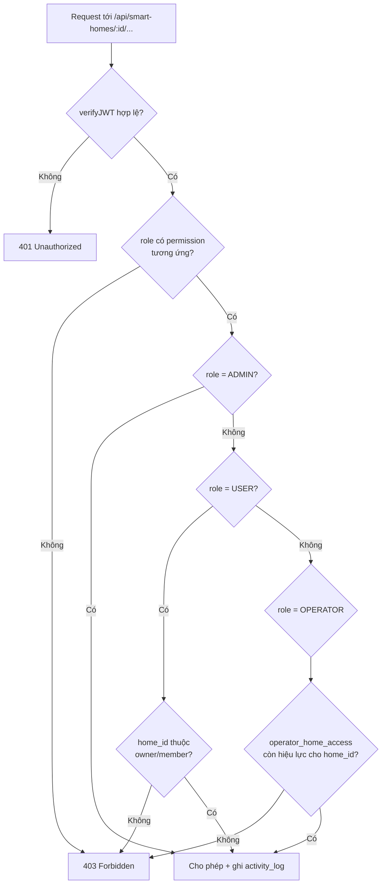
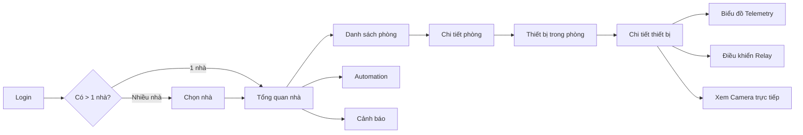
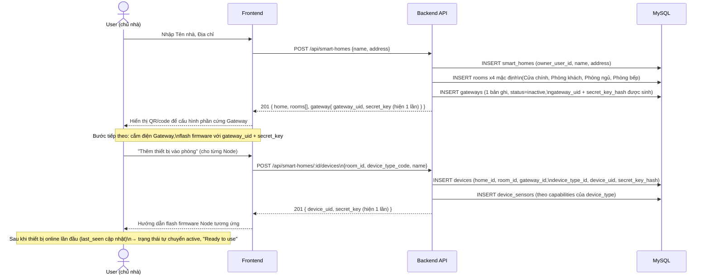
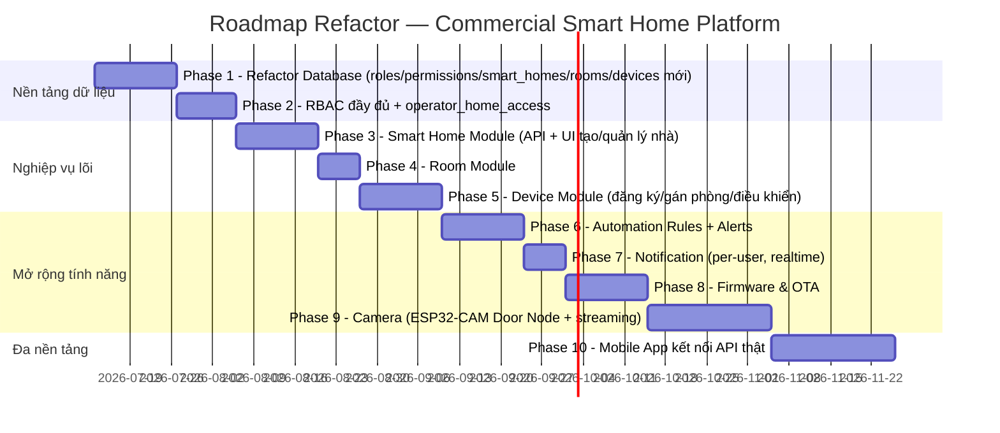

# PROJECT ANALYSIS — Secure Smart Home IoT → Commercial Smart Home Platform

> Tài liệu phân tích kiến trúc toàn diện, được biên soạn sau khi đọc toàn bộ source code trong workspace: `backend/`, `database/`, `frontend/`, `mobile/`, `firmware/{gateway-node,sensor-node,sensor-node-2}`, `mosquitto/`, `nginx/`, `docker-compose*.yml`, `README.md`.
>
> Mục tiêu: chuyển đổi từ **đồ án IoT demo** (Device/Gateway/Node Manager) thành **sản phẩm Smart Home thương mại** có khả năng bán cho hàng nghìn khách hàng, mỗi khách hàng vận hành một hoặc nhiều căn nhà với hàng chục thiết bị.

---

## MỤC LỤC

1. [Tổng quan dự án hiện tại](#1-tổng-quan-dự-án-hiện-tại)
2. [Vì sao mô hình Device/Gateway/Node Manager không phù hợp](#2-vì-sao-mô-hình-devicegatewaynode-manager-không-phù-hợp)
3. [Mục tiêu mới: Commercial Smart Home Platform](#3-mục-tiêu-mới-commercial-smart-home-platform)
4. [Đề xuất Database mới](#4-đề-xuất-database-mới)
5. [Role & RBAC đầy đủ](#5-role--rbac-đầy-đủ)
6. [Smart Home Management — UI & luồng điều hướng](#6-smart-home-management--ui--luồng-điều-hướng)
7. [Luồng tạo Smart Home mới](#7-luồng-tạo-smart-home-mới)
8. [Device Management — thiết kế lại](#8-device-management--thiết-kế-lại)
9. [Log System — thiết kế lại](#9-log-system--thiết-kế-lại)
10. [REST API — thiết kế lại theo module](#10-rest-api--thiết-kế-lại-theo-module)
11. [Frontend — đánh giá & đề xuất](#11-frontend--đánh-giá--đề-xuất)
12. [Roadmap Refactor](#12-roadmap-refactor)
13. [Đánh giá mức độ ưu tiên](#13-đánh-giá-mức-độ-ưu-tiên)

---

## 1. TỔNG QUAN DỰ ÁN HIỆN TẠI

### 1.1. Project structure thực tế

```
secure-smart-home-iot/
├── backend/            Express 5 + TypeScript, 8 route module phẳng, không có layer service/repository
├── database/
│   └── migrations/001_schema.sql   Chỉ có 4 bảng gốc (users, devices, sensor_data, device_tokens, audit_log)
│                                    + 2 bảng phát sinh runtime qua migrate.ts (notifications, _migrations)
├── frontend/           Next.js 16 App Router, feature-based (features/{auth,devices,dashboard,audit,logs,users,notifications})
├── firmware/
│   ├── gateway-node/   ESP32 – cầu nối 2 broker MQTT + xác thực HMAC offline
│   ├── sensor-node/    ESP32 – đọc DHT22, ký HMAC, publish MQTT
│   └── sensor-node-2/  Bản sao gần như y hệt sensor-node (code trùng lặp)
├── mobile/             Flutter app — 100% MOCK, chưa gọi API thật, đã có khái niệm "Room"
├── mosquitto/          2 broker Mosquitto độc lập (broker1: sensor↔gateway, broker2: gateway↔backend)
├── nginx/              Reverse proxy đơn giản (/api → backend, / → frontend)
└── docker-compose.yml  6 service: mysql, mqtt-broker-1, mqtt-broker-2, nginx, backend, frontend
```

### 1.2. Kiến trúc hiện tại (Mermaid)



### 1.3. Tech stack thực tế

| Layer | Công nghệ | Ghi chú |
|---|---|---|
| Frontend | Next.js 16, React 19, TailwindCSS v4, SWR, Recharts | App Router, feature-sliced, không có state quản lý multi-tenant |
| Backend | Node.js 20, Express 5, TypeScript, `mysql2/promise`, `mqtt.js` | Không ORM, không repository layer, raw SQL trong route handler |
| Database | MySQL 8.0, 1 schema `iot_managerDeviceIoT` | Không partitioning, không time-series design |
| Message broker | Eclipse Mosquitto 2 × 2 instance | `allow_anonymous true` ở cả hai, không TLS, không ACL |
| Auth | JWT (HttpOnly cookie) + bcrypt cost 12 | 1 bảng `users`, role là `ENUM('admin','operator')` cứng trong schema |
| Firmware | C++ / PlatformIO, ESP32 DOIT DevKit V1 | Chỉ đọc cảm biến (DHT22), **không có relay/actuator, không có camera** |
| Mobile | Flutter | UI mock hoàn toàn, `MockAuthService` hard-code 1 tài khoản admin |
| Infra | Docker Compose, Nginx Alpine | 6 service, không có Redis/cache, không có message queue ngoài MQTT |

### 1.4. Những điểm tốt (đáng giữ lại)

1. **Two-layer HMAC-SHA256** (`backend/src/services/hmacService.ts`) — thiết kế xác thực chuỗi (sensor ký → gateway xác thực offline → backend xác thực lại cả hai) là một mô hình bảo mật tốt, dùng `crypto.timingSafeEqual` chống timing attack, có cửa sổ chống replay ±300s. Nên **giữ nguyên nguyên lý này** khi refactor.
2. **Dual-broker MQTT topology** — tách biệt lớp Sensor↔Gateway (broker1) và Gateway↔Backend (broker2) là ý tưởng defense-in-depth hợp lý, hạn chế blast radius nếu broker1 bị xâm nhập.
3. **Auto-block sau N lần xác thực thất bại** (`BLOCK_THRESHOLD = 5`) chống brute-force secret key.
4. **User-enumeration prevention** khi login (`dummyHash` compare cho username không tồn tại) — chi tiết bảo mật tinh tế, hiếm gặp trong đồ án sinh viên.
5. **Idempotent migration runner** (`backend/src/config/migrate.ts`) — pattern đơn giản nhưng đủ dùng cho hệ thống nhỏ.
6. **Audit log có transaction-safe prune** (`logDataRecvWithPrune`) tránh phình bảng vô hạn.
7. Cấu trúc frontend feature-sliced (`features/<domain>/{api,hooks,pages,components,providers,types}`) là pattern tốt, dễ mở rộng nếu áp dụng đúng cho domain mới (rooms, smart-homes...).

### 1.5. Những điểm chưa hợp lý (code smell / kiến trúc)

| # | Vấn đề | Vị trí | Vì sao là vấn đề |
|---|---|---|---|
| 1 | **Rò rỉ secret_key toàn hệ thống** | `backend/src/routes/sensors.routes.ts:24-26` | `GET /api/device/sensors` trả về **secret_key của TẤT CẢ sensor `active` trong toàn hệ thống** cho bất kỳ gateway nào xác thực HMAC hợp lệ. Với 1 khách hàng thì vô hại; với hàng nghìn khách hàng, **gateway của khách hàng A sẽ nhận được secret_key của mọi sensor thuộc khách hàng B, C, D...** Đây là lỗi multi-tenant nghiêm trọng nhất trong toàn bộ codebase. |
| 2 | **Trùng lặp logic xác thực & ingest 100%** | `backend/src/middleware/validateDevice.ts` vs `backend/src/services/mqttDataService.ts` | Cùng một luồng "verify gateway HMAC → verify sensor HMAC → check device_type → check status → insert → prune → update last_seen" được viết lại 2 lần độc lập. Comment trong code còn ghi rõ "Hai đường phải luôn đồng bộ logic xác thực khi có thay đổi" — tức đã tự nhận thức rủi ro drift nhưng chưa refactor thành service dùng chung. |
| 3 | **`BLOCK_THRESHOLD = 5` hard-code lặp lại ở 2 file** | `validateDevice.ts:11`, `mqttDataService.ts:11` | Magic number trùng lặp, không có single source of truth. |
| 4 | **Không có layer Service/Repository** | Toàn bộ `backend/src/routes/*.ts` | Raw SQL string nằm thẳng trong route handler (kể cả string interpolation `LIMIT ${limit} OFFSET ${offset}` ở `devices.ts:139` — may mắn `limit`/`offset` đã được ép kiểu số nên không SQL injection được, nhưng là anti-pattern nguy hiểm nếu code sau này copy-paste sang chỗ khác không kiểm soát kiểu). |
| 5 | **`device_type ENUM('sensor','gateway')` cứng trong schema** | `001_schema.sql:33` | Không thể mở rộng thêm `actuator` (relay đèn/quạt), `camera` (ESP32-CAM cửa), `controller` mà không sửa schema ENUM — điều README đã cam kết ("Nút điều khiển thiết bị (đèn, quạt): 🔜 Chưa làm") nhưng schema hiện tại **không hề có chỗ chứa** cho loại thiết bị này. |
| 6 | **Không có khái niệm Nhà / Phòng / Khách hàng sở hữu thiết bị** | Toàn bộ DB + API | `devices.location` là `VARCHAR(255)` tự do — không phải foreign key tới bảng `rooms`. Không có bảng `smart_homes`, không có `owner_id` (chỉ có `created_by` — người *đăng ký*, không phải người *sở hữu*). |
| 7 | **RBAC chỉ có 2 role, không có "khách hàng"** | `001_schema.sql:19`, `middleware/rbac.ts` | `ENUM('admin','operator')` — không có role `user` (customer). Toàn bộ hệ thống hiện tại được thiết kế cho **nhân viên vận hành nội bộ**, không có khái niệm người dùng cuối sở hữu nhà riêng. |
| 8 | **`LogsPage.tsx` là trang rỗng chưa cài đặt** | `frontend/src/features/logs/pages/LogsPage.tsx:3-5,22` | Comment tự nhận: *"Trang placeholder – hiện chỉ hiển thị bảng rỗng"*. Route `/logs` tồn tại trong sidebar nhưng không có API, không có dữ liệu — **dead feature** gây nhầm lẫn cho khách hàng thật. |
| 9 | **Audit log event types hard-code trong route, không phải bảng danh mục** | `backend/src/routes/audit.ts:8-25` | `VALID_EVENT_TYPES` và `ALLOWED_EVENT_TYPES_BY_ROLE` là mảng cứng trong code — mỗi lần thêm loại sự kiện mới phải sửa code & deploy lại, không thể cấu hình qua DB/permission. |
| 10 | **DeviceDetailPage hard-code field `temperature`/`humidity`** | `frontend/src/features/devices/pages/DeviceDetailPage.tsx:236-239,250-260` | `record.payload?.temperature`, `record.payload?.humidity` được truy cập trực tiếp — không scale được khi có sensor loại khác (motion, gas, door contact, camera snapshot). |
| 11 | **`notifications.target_role` hard-code `'admin'`** | `services/notificationService.ts:20`, `routes/notifications.ts` | Không thể gửi thông báo cho khách hàng cụ thể — chỉ admin nhận được thông báo. |
| 12 | **MQTT không TLS, `allow_anonymous true`** | `mosquitto/broker1/mosquitto.conf:5`, `broker2/mosquitto.conf:6` | Bất kỳ ai truy cập được mạng LAN/Docker network đều publish/subscribe được vào topic của bất kỳ thiết bị nào — không có per-device credential ở tầng MQTT (bảo mật hiện đang dựa 100% vào tầng ứng dụng HMAC, MQTT transport không có phòng thủ độc lập). |
| 13 | **Topic MQTT không namespace theo khách hàng** | `gateway/+/data`, `local/sensors/+/data` | Không có `home_id` trong topic → khi multi-tenant, không thể phân vùng ACL theo khách hàng ở tầng broker (mọi gateway trên cùng 1 broker instance đều chung 1 topic namespace toàn cục). |
| 14 | **`sensor_data` giới hạn cứng 150 bản ghi/thiết bị** | `data.routes.ts:91-97`, `mqttDataService.ts:115-121` | Phù hợp demo real-time, nhưng sản phẩm thương mại cần lưu lịch sử dài hạn cho biểu đồ xu hướng/báo cáo — cần kiến trúc time-series riêng (xem Phần 4). |
| 15 | **`sensor-node` và `sensor-node-2` gần như trùng lặp 100%** | `firmware/sensor-node/`, `firmware/sensor-node-2/` | Không phải firmware đa năng cấu hình qua `device_type_id`, mà là copy-paste project cho từng thiết bị vật lý — không scale khi có 10 loại node khác nhau. |
| 16 | **Mobile app hoàn toàn mock, không nối backend thật** | `mobile/lib/features/auth/data/mock_auth_service.dart` | `MockAuthService` hard-code 1 tài khoản `admin@smarthome.local` — chứng tỏ mobile app hiện chỉ là UI prototype, chưa có tầng network client, chưa có khái niệm multi-home. Tuy nhiên mobile đã **đúng hướng sản phẩm** khi có sẵn `RoomListPage` với "Phòng khách/Phòng ngủ/Phòng bếp/Cửa" — cho thấy đội ngũ đã hình dung đúng mô hình Room nhưng chưa đồng bộ với backend/web. |
| 17 | **Không có OTA, không có bảng `firmware`** | Toàn bộ backend/DB | Không thể cập nhật firmware từ xa cho hàng nghìn thiết bị đã bán ra thị trường. |
| 18 | **Connection pool cứng `connectionLimit: 10`** | `backend/src/config/db.ts:16` | Không phù hợp khi scale hàng nghìn khách hàng đồng thời — cần connection pooling theo tải thực tế + có thể cần PgBouncer/ProxySQL ở tầng hạ tầng khi scale lớn. |

---

## 2. VÌ SAO MÔ HÌNH DEVICE/GATEWAY/NODE MANAGER KHÔNG PHÙ HỢP

Hiện tại toàn bộ hệ thống (DB, API, UI) được tổ chức xoay quanh **một registry thiết bị phẳng** — không có khái niệm ai sở hữu thiết bị, thiết bị thuộc căn nhà nào, phòng nào. Cụ thể:

- `devices` là một bảng **toàn cục duy nhất**, không có `home_id`/`owner_id`.
- API `/api/devices` trả về **tất cả thiết bị trong toàn hệ thống** cho bất kỳ user nào đã đăng nhập (`router.get("/", verifyJWT, ...)` — không lọc theo ai sở hữu).
- Frontend `DevicesPage` chỉ phân loại theo tab `gateway` / `sensor` — không có khái niệm "nhà của tôi" vs "nhà người khác".
- Sidebar chỉ có 4 mục phẳng: Dashboard / Thiết bị / Audit Log / Người dùng — đúng mô hình **công cụ quản trị nội bộ** (internal admin tool), không phải **sản phẩm tiêu dùng multi-tenant**.

### Vì sao mô hình này sụp đổ khi thương mại hoá

1. **Không có ranh giới dữ liệu giữa các khách hàng (tenant isolation).** Một khi có khách hàng B đăng ký, họ sẽ nhìn thấy (hoặc ít nhất backend không chặn) thiết bị của khách hàng A qua `/api/devices`, `/api/dashboard/stats` (đếm toàn hệ thống), và đặc biệt là `/api/device/sensors` (rò rỉ secret_key — mục 1.5.#1). Đây không phải rủi ro lý thuyết — đây là **lỗ hổng bảo mật sẽ khai hoả ngay khi có khách hàng thứ hai**.
2. **Đơn vị quản lý sai bản chất nghiệp vụ.** Khách hàng không nghĩ theo "tôi có 1 gateway và 3 sensor" — họ nghĩ theo **"nhà tôi có phòng khách, phòng ngủ, phòng bếp, và mỗi phòng có vài thiết bị"**. Giao diện quản lý theo Gateway/Node buộc khách hàng phải hiểu kiến trúc mạng nội bộ (điều mà Tuya/Xiaomi/SmartThings cố tình giấu đi hoàn toàn khỏi người dùng cuối).
3. **Không mở rộng được sang nhiều loại thiết bị.** `device_type ENUM('sensor','gateway')` không có chỗ cho camera, relay, khoá cửa, cảm biến khói/gas — những thiết bị lõi của bất kỳ sản phẩm Smart Home thật nào.
4. **Không hỗ trợ vận hành ở quy mô lớn.** Khi có 10,000 thiết bị, "Device Manager" phẳng sẽ có 1 bảng khổng lồ không phân vùng theo khách hàng → mọi truy vấn (dashboard, danh sách, tìm kiếm) đều phải quét toàn bộ hệ thống rồi lọc thủ công ở tầng ứng dụng thay vì lọc bằng index theo `home_id`.
5. **Operator (nhân viên vận hành) hiện có quyền ngang Admin trên MỌI thiết bị.** `requireRole("admin", "operator")` cho phép Operator đăng ký/khoá/mở khoá **bất kỳ thiết bị nào** — không giới hạn theo khách hàng được phân công. Trong một sản phẩm thương mại, nhân viên hỗ trợ kỹ thuật không được có quyền vô hạn trên dữ liệu của mọi khách hàng (vi phạm nguyên tắc least-privilege và thường là yêu cầu bắt buộc của các chứng nhận bảo mật như SOC2/ISO 27001).
6. **Không tương thích với hướng đi mobile đã có sẵn.** Mobile app (Flutter) đã có `RoomListPage` — nghĩa là đội ngũ *đã* dự định mô hình Room, nhưng backend/web hiện tại hoàn toàn không có khái niệm này. Nếu tiếp tục phát triển trên nền Device Manager, mobile app sẽ vĩnh viễn là một mock UI không thể nối được với API thật.

**Kết luận:** đơn vị quản lý phải chuyển từ **"Thiết bị mạng" (Gateway/Node)** — một khái niệm kỹ thuật — sang **"Không gian sống" (Home/Room)** — một khái niệm nghiệp vụ mà khách hàng hiểu và mua. Thiết bị mạng (Gateway) vẫn tồn tại về mặt kỹ thuật, nhưng bị **ẩn đi** phía sau mô hình Home/Room, giống cách Tuya/Xiaomi/Aqara vẫn có gateway/hub vật lý nhưng người dùng cuối không bao giờ phải "quản lý Gateway" — họ chỉ quản lý "phòng khách nhà tôi".

---

## 3. MỤC TIÊU MỚI: COMMERCIAL SMART HOME PLATFORM

### 3.1. Mô hình sản phẩm

```
1 Customer (User)
   └── N Smart Home  (mỗi Smart Home = 1 căn nhà thực tế, có địa chỉ riêng)
          └── N Room  (Phòng khách, Phòng ngủ, Bếp, Cửa, Garage, Sân vườn, ...)
                 └── N Device  (Gateway, Sensor Node, Camera Node, Relay/Actuator Node)
                        └── N Sensor / Channel  (nhiệt độ, độ ẩm, chuyển động, trạng thái relay, ...)
                               └── N Telemetry  (chuỗi thời gian: giá trị đo theo thời gian)
```

### 3.2. Bộ thiết bị mặc định khi tạo Smart Home mới

| Thiết bị | Vai trò | Phòng mặc định |
|---|---|---|
| 1× ESP32 Gateway | Cầu nối MQTT nội bộ ↔ backend, quản lý whitelist thiết bị trong nhà | Không thuộc phòng cụ thể (gắn ở tủ điện/hành lang) |
| 1× ESP32-CAM Door Node | Camera cửa chính + cảm biến chuyển động | Phòng "Cửa chính" (room type = `door`) |
| 1× Living Room Node | Cảm biến (nhiệt độ/độ ẩm/ánh sáng) + relay đèn/quạt | Phòng khách |
| 1× Bedroom Node | Cảm biến + relay đèn | Phòng ngủ |
| 1× Kitchen Node | Cảm biến (nhiệt độ/gas/khói) + relay | Phòng bếp |

Có thể mở rộng thêm phòng tuỳ chọn: Garage, Garden, Bathroom, Balcony, Office, Guest Room — bằng cách thêm `room` mới và gắn thiết bị vào, không cần thay đổi schema.

### 3.3. Vì sao mô hình phân cấp User → Smart Home → Room → Device → Sensor → Telemetry tốt hơn

| Tiêu chí | Mô hình cũ (Device/Gateway/Node) | Mô hình mới (User→Home→Room→Device→Sensor→Telemetry) |
|---|---|---|
| **Tenant isolation** | Không có — mọi API trả toàn bộ dữ liệu hệ thống | Mọi truy vấn bắt buộc join qua `home_id` thuộc quyền sở hữu của `user_id` đang đăng nhập → cô lập dữ liệu tự nhiên bằng thiết kế, không phải bằng "nhớ lọc thủ công" |
| **Trải nghiệm khách hàng** | Phải hiểu Gateway/Node là gì | Chỉ cần hiểu "phòng nào có thiết bị gì" — đúng mental model người dùng cuối |
| **Mở rộng loại thiết bị** | ENUM cứng 2 giá trị | `device_type` là bảng danh mục — thêm loại mới (camera, relay, khoá cửa...) không cần sửa schema |
| **Phân quyền** | Nhị phân admin/operator, phẳng | RBAC theo `home_id` — Operator được cấp quyền hỗ trợ theo từng ticket/từng nhà cụ thể, có thời hạn, có audit |
| **Khả năng bán hàng loạt (SaaS)** | Không thể — 1 hệ thống ngầm định 1 chủ sở hữu duy nhất | Có thể onboard hàng nghìn khách hàng độc lập, mỗi người có 1..N nhà |
| **Truy vấn hiệu năng khi scale** | Quét toàn bảng `devices`/`sensor_data` | Index theo `(home_id, ...)`, `(room_id, ...)` → truy vấn theo nhà/phòng luôn dùng index, không quét toàn bộ hệ thống |
| **Automation & Alert theo ngữ cảnh** | Không thể nói "nếu phòng bếp có khói thì bật chuông toàn nhà" vì không biết thiết bị nào thuộc phòng nào | `automation_rules` có thể tham chiếu theo `room_id`/`home_id` tự nhiên |
| **Đồng bộ với Mobile app đã có** | Mobile có `Room` nhưng backend không có → không thể tích hợp | Backend cung cấp đúng cấu trúc dữ liệu mobile cần |

---

## 4. ĐỀ XUẤT DATABASE MỚI

### 4.1. ERD tổng quan (Mermaid)



> Ghi chú: các bảng log (`gateway_logs`, `device_logs`, `mqtt_logs`, `authentication_logs`, `api_logs`, `system_logs`, `security_logs`, `error_logs`) được trình bày riêng ở **Phần 9** vì có vòng đời (retention) và mục đích khác hẳn nhóm bảng nghiệp vụ ở trên — gộp chung vào 1 ERD sẽ khiến sơ đồ không thể đọc được.

### 4.2. Chi tiết từng bảng

#### 4.2.1. `roles`
| Cột | Kiểu | Ràng buộc | Mô tả |
|---|---|---|---|
| id | TINYINT UNSIGNED | PK, AUTO_INCREMENT | |
| code | VARCHAR(32) | UNIQUE, NOT NULL | `ADMIN`, `OPERATOR`, `USER` |
| name | VARCHAR(64) | NOT NULL | Tên hiển thị |
| description | VARCHAR(255) | NULL | |

**Relationship:** 1 role → N users. **Index:** UNIQUE(`code`).

#### 4.2.2. `permissions`
| Cột | Kiểu | Ràng buộc | Mô tả |
|---|---|---|---|
| id | INT UNSIGNED | PK, AUTO_INCREMENT | |
| code | VARCHAR(64) | UNIQUE, NOT NULL | Dạng `resource:action`, ví dụ `smart_home:create`, `device:control`, `camera:view` |
| description | VARCHAR(255) | NULL | |

#### 4.2.3. `role_permissions`
| Cột | Kiểu | Ràng buộc | Mô tả |
|---|---|---|---|
| role_id | TINYINT UNSIGNED | PK (composite), FK → roles.id | |
| permission_id | INT UNSIGNED | PK (composite), FK → permissions.id | |

**Relationship:** many-to-many roles ↔ permissions. **Index:** PK(`role_id`, `permission_id`), thêm KEY(`permission_id`).

#### 4.2.4. `users`
| Cột | Kiểu | Ràng buộc | Mô tả |
|---|---|---|---|
| id | INT UNSIGNED | PK, AUTO_INCREMENT | |
| full_name | VARCHAR(128) | NOT NULL | |
| email | VARCHAR(190) | UNIQUE, NOT NULL | Dùng làm định danh đăng nhập chính (thay `username`) |
| phone | VARCHAR(20) | NULL, UNIQUE | |
| password_hash | VARCHAR(255) | NOT NULL | bcrypt cost 12 (giữ nguyên) |
| role_id | TINYINT UNSIGNED | NOT NULL, FK → roles.id | Thay cho `ENUM` cứng |
| status | ENUM('active','suspended','pending_verification') | DEFAULT 'pending_verification' | |
| avatar_url | VARCHAR(512) | NULL | |
| created_at | DATETIME | DEFAULT CURRENT_TIMESTAMP | |
| last_login | DATETIME | NULL | |

**Relationship:** 1 user (role=USER) → N smart_homes (owner); 1 user → N home_members; 1 user (role=OPERATOR) → N operator_home_access. **Index:** UNIQUE(`email`), UNIQUE(`phone`), KEY(`role_id`).

#### 4.2.5. `smart_homes`
| Cột | Kiểu | Ràng buộc | Mô tả |
|---|---|---|---|
| id | INT UNSIGNED | PK, AUTO_INCREMENT | |
| owner_user_id | INT UNSIGNED | NOT NULL, FK → users.id | Chủ sở hữu chính |
| name | VARCHAR(128) | NOT NULL | Ví dụ "Nhà Quận 7" |
| address | VARCHAR(255) | NULL | |
| timezone | VARCHAR(64) | DEFAULT 'Asia/Ho_Chi_Minh' | Cần thiết khi mở rộng đa quốc gia |
| status | ENUM('active','suspended') | DEFAULT 'active' | |
| created_at | DATETIME | DEFAULT CURRENT_TIMESTAMP | |

**Relationship:** 1 smart_home → N rooms, N gateways, N alerts, N automation_rules. **Index:** KEY(`owner_user_id`).

#### 4.2.6. `home_members` *(mở rộng — hỗ trợ nhiều thành viên trong 1 gia đình dùng chung nhà, giống Tuya/Xiaomi "Gia đình")*
| Cột | Kiểu | Ràng buộc | Mô tả |
|---|---|---|---|
| id | INT UNSIGNED | PK, AUTO_INCREMENT | |
| home_id | INT UNSIGNED | NOT NULL, FK → smart_homes.id | |
| user_id | INT UNSIGNED | NOT NULL, FK → users.id | |
| member_role | ENUM('owner','member') | DEFAULT 'member' | Owner có toàn quyền, member bị giới hạn (không xoá nhà, không mời người khác) |
| invited_at | DATETIME | DEFAULT CURRENT_TIMESTAMP | |

**Index:** UNIQUE(`home_id`, `user_id`). *(Phase mở rộng — không bắt buộc ở Phase 1, xem Phần 12.)*

#### 4.2.7. `operator_home_access` *(truy cập hỗ trợ có kiểm soát cho Operator)*
| Cột | Kiểu | Ràng buộc | Mô tả |
|---|---|---|---|
| id | INT UNSIGNED | PK, AUTO_INCREMENT | |
| operator_user_id | INT UNSIGNED | NOT NULL, FK → users.id | |
| home_id | INT UNSIGNED | NOT NULL, FK → smart_homes.id | |
| reason | VARCHAR(255) | NOT NULL | Bắt buộc ghi lý do (ticket hỗ trợ) |
| granted_by | INT UNSIGNED | NOT NULL, FK → users.id | Admin cấp quyền |
| expires_at | DATETIME | NOT NULL | Truy cập có thời hạn, không vĩnh viễn |
| revoked_at | DATETIME | NULL | |

**Index:** KEY(`operator_user_id`, `home_id`), KEY(`expires_at`). Đây là bảng **cốt lõi** giải quyết vấn đề mục 2.5 ("Operator có quyền ngang Admin trên mọi thiết bị").

#### 4.2.8. `rooms`
| Cột | Kiểu | Ràng buộc | Mô tả |
|---|---|---|---|
| id | INT UNSIGNED | PK, AUTO_INCREMENT | |
| home_id | INT UNSIGNED | NOT NULL, FK → smart_homes.id ON DELETE CASCADE | |
| name | VARCHAR(64) | NOT NULL | |
| room_type | ENUM('living_room','bedroom','kitchen','door','garage','garden','bathroom','balcony','office','guest_room','other') | DEFAULT 'other' | |
| icon | VARCHAR(32) | NULL | Tên icon hiển thị FE |
| sort_order | SMALLINT UNSIGNED | DEFAULT 0 | |
| created_at | DATETIME | DEFAULT CURRENT_TIMESTAMP | |

**Relationship:** 1 room → N devices. **Index:** KEY(`home_id`).

#### 4.2.9. `gateways`
| Cột | Kiểu | Ràng buộc | Mô tả |
|---|---|---|---|
| id | INT UNSIGNED | PK, AUTO_INCREMENT | |
| home_id | INT UNSIGNED | NOT NULL, FK → smart_homes.id ON DELETE CASCADE | |
| gateway_uid | VARCHAR(64) | UNIQUE, NOT NULL | Ví dụ `ESP32-GW-A1B2C3D4` |
| secret_key_hash | VARCHAR(255) | NOT NULL | **Hash** (không lưu plaintext — khác thiết kế hiện tại) |
| mqtt_client_id | VARCHAR(128) | NOT NULL | |
| status | ENUM('inactive','active','blocked','maintenance') | DEFAULT 'inactive' | |
| firmware_version | VARCHAR(32) | NULL | |
| last_seen | DATETIME | NULL | |
| last_ip | VARCHAR(45) | NULL | |
| fail_count | TINYINT UNSIGNED | DEFAULT 0 | |
| created_at | DATETIME | DEFAULT CURRENT_TIMESTAMP | |

**Relationship:** 1 gateway → N devices (các node trong nhà kết nối qua gateway này). **Index:** UNIQUE(`gateway_uid`), KEY(`home_id`, `status`).

#### 4.2.10. `device_types` *(bảng danh mục — thay ENUM cứng)*
| Cột | Kiểu | Ràng buộc | Mô tả |
|---|---|---|---|
| id | SMALLINT UNSIGNED | PK, AUTO_INCREMENT | |
| code | VARCHAR(64) | UNIQUE, NOT NULL | `SENSOR_TEMP_HUMID`, `CAMERA_DOOR`, `RELAY_1CH`, `RELAY_2CH`, `DOOR_CONTACT`, `SMOKE_GAS` |
| category | ENUM('sensor','actuator','camera','controller') | NOT NULL | |
| display_name | VARCHAR(128) | NOT NULL | |
| capabilities | JSON | NULL | Ví dụ `{"channels": 2, "supports_ota": true}` |

**Relationship:** 1 device_type → N devices, N firmware. **Index:** UNIQUE(`code`), KEY(`category`).

#### 4.2.11. `devices` *(tổng quát hoá — thay bảng `devices` cũ)*
| Cột | Kiểu | Ràng buộc | Mô tả |
|---|---|---|---|
| id | INT UNSIGNED | PK, AUTO_INCREMENT | |
| home_id | INT UNSIGNED | NOT NULL, FK → smart_homes.id ON DELETE CASCADE | Denormalized để tránh join qua room khi lọc theo nhà |
| room_id | INT UNSIGNED | NULL, FK → rooms.id ON DELETE SET NULL | Nullable — thiết bị mới thêm có thể chưa gán phòng |
| gateway_id | INT UNSIGNED | NOT NULL, FK → gateways.id ON DELETE CASCADE | |
| device_type_id | SMALLINT UNSIGNED | NOT NULL, FK → device_types.id | |
| device_uid | VARCHAR(64) | UNIQUE, NOT NULL | |
| name | VARCHAR(128) | NOT NULL | Khách hàng đổi tên tự do ("Đèn phòng khách") |
| secret_key_hash | VARCHAR(255) | NOT NULL | |
| status | ENUM('inactive','active','blocked','maintenance') | DEFAULT 'inactive' | |
| firmware_version | VARCHAR(32) | NULL | |
| last_seen | DATETIME | NULL | |
| last_ip | VARCHAR(45) | NULL | |
| fail_count | TINYINT UNSIGNED | DEFAULT 0 | |
| created_by | INT UNSIGNED | NULL, FK → users.id ON DELETE SET NULL | |
| created_at | DATETIME | DEFAULT CURRENT_TIMESTAMP | |

**Index:** UNIQUE(`device_uid`), KEY(`home_id`, `status`), KEY(`room_id`), KEY(`gateway_id`).

#### 4.2.12. `sensor_types` *(bảng danh mục đơn vị đo)*
| Cột | Kiểu | Ràng buộc | Mô tả |
|---|---|---|---|
| id | SMALLINT UNSIGNED | PK, AUTO_INCREMENT | |
| code | VARCHAR(64) | UNIQUE, NOT NULL | `TEMPERATURE`, `HUMIDITY`, `MOTION`, `DOOR_STATE`, `GAS_PPM`, `RELAY_STATE` |
| unit | VARCHAR(16) | NULL | `°C`, `%RH`, `ppm`, `bool` |
| value_type | ENUM('numeric','boolean','enum','json') | NOT NULL | |
| min_value | DECIMAL(10,2) | NULL | |
| max_value | DECIMAL(10,2) | NULL | |

#### 4.2.13. `device_sensors` *(channel cụ thể trên 1 thiết bị vật lý)*
| Cột | Kiểu | Ràng buộc | Mô tả |
|---|---|---|---|
| id | INT UNSIGNED | PK, AUTO_INCREMENT | |
| device_id | INT UNSIGNED | NOT NULL, FK → devices.id ON DELETE CASCADE | |
| sensor_type_id | SMALLINT UNSIGNED | NOT NULL, FK → sensor_types.id | |
| channel_index | TINYINT UNSIGNED | DEFAULT 0 | Cho thiết bị đa kênh (relay 2 kênh = 2 dòng) |
| label | VARCHAR(64) | NULL | "Relay đèn chính", "Relay quạt trần" |

**Index:** UNIQUE(`device_id`, `sensor_type_id`, `channel_index`).

#### 4.2.14. `telemetry` *(time-series — bảng lớn nhất hệ thống)*
| Cột | Kiểu | Ràng buộc | Mô tả |
|---|---|---|---|
| id | BIGINT UNSIGNED | PK, AUTO_INCREMENT | |
| device_sensor_id | INT UNSIGNED | NOT NULL, FK → device_sensors.id ON DELETE CASCADE | |
| value_numeric | DECIMAL(12,4) | NULL | Giá trị số (nhiệt độ, độ ẩm, ppm...) |
| value_json | JSON | NULL | Giá trị phức tạp (ví dụ toạ độ chuyển động, metadata camera event) |
| recorded_at | DATETIME(3) | NOT NULL | Millisecond precision |

**Index:** KEY(`device_sensor_id`, `recorded_at` DESC) — **bắt buộc partition theo tháng** (xem khuyến nghị vận hành ở Phần 4.4). **Không có** khoá ngoại join sang `home_id` trực tiếp để tránh phình index — truy vấn theo nhà đi qua `device_sensors → devices.home_id`.

#### 4.2.15. `telemetry_hourly_rollup` / `telemetry_daily_rollup` *(bảng tổng hợp cho dashboard/báo cáo)*
| Cột | Kiểu | Mô tả |
|---|---|---|
| device_sensor_id | INT UNSIGNED | FK |
| bucket_start | DATETIME | Đầu giờ/đầu ngày |
| avg_value, min_value, max_value | DECIMAL(12,4) | Giá trị tổng hợp |
| sample_count | INT UNSIGNED | |

**Mục đích:** biểu đồ xu hướng 30/90 ngày không cần quét bảng `telemetry` thô — job định kỳ (cron/worker) tổng hợp rồi cho phép prune bảng thô theo retention (xem 4.4).

#### 4.2.16. `device_commands` *(điều khiển relay/actuator, snapshot camera)*
| Cột | Kiểu | Ràng buộc | Mô tả |
|---|---|---|---|
| id | BIGINT UNSIGNED | PK, AUTO_INCREMENT | |
| device_id | INT UNSIGNED | NOT NULL, FK → devices.id | |
| issued_by | INT UNSIGNED | NOT NULL, FK → users.id | |
| command | VARCHAR(64) | NOT NULL | `RELAY_ON`, `RELAY_OFF`, `CAMERA_SNAPSHOT` |
| payload | JSON | NULL | |
| status | ENUM('pending','sent','acked','failed','timeout') | DEFAULT 'pending' | |
| issued_at | DATETIME | DEFAULT CURRENT_TIMESTAMP | |
| acked_at | DATETIME | NULL | |

**Index:** KEY(`device_id`, `status`), KEY(`issued_at`).

#### 4.2.17. `alerts`
| Cột | Kiểu | Ràng buộc | Mô tả |
|---|---|---|---|
| id | BIGINT UNSIGNED | PK, AUTO_INCREMENT | |
| home_id | INT UNSIGNED | NOT NULL, FK → smart_homes.id | |
| device_id | INT UNSIGNED | NULL, FK → devices.id | |
| rule_id | INT UNSIGNED | NULL, FK → automation_rules.id | |
| severity | ENUM('info','warning','critical') | NOT NULL | |
| title | VARCHAR(128) | NOT NULL | |
| message | TEXT | NULL | |
| status | ENUM('open','acknowledged','resolved') | DEFAULT 'open' | |
| created_at | DATETIME | DEFAULT CURRENT_TIMESTAMP | |
| resolved_at | DATETIME | NULL | |

**Index:** KEY(`home_id`, `status`), KEY(`created_at`).

#### 4.2.18. `automation_rules`
| Cột | Kiểu | Ràng buộc | Mô tả |
|---|---|---|---|
| id | INT UNSIGNED | PK, AUTO_INCREMENT | |
| home_id | INT UNSIGNED | NOT NULL, FK → smart_homes.id | |
| name | VARCHAR(128) | NOT NULL | |
| trigger_type | ENUM('schedule','sensor_threshold','device_event') | NOT NULL | |
| trigger_config | JSON | NOT NULL | Ví dụ `{"sensor_type":"GAS_PPM","operator":">","value":300}` |
| action_config | JSON | NOT NULL | Ví dụ `{"device_id":12,"command":"RELAY_ON"}` |
| is_enabled | TINYINT(1) | DEFAULT 1 | |
| created_by | INT UNSIGNED | FK → users.id | |
| created_at | DATETIME | DEFAULT CURRENT_TIMESTAMP | |

**Index:** KEY(`home_id`, `is_enabled`).

#### 4.2.19. `automation_history`
| Cột | Kiểu | Ràng buộc | Mô tả |
|---|---|---|---|
| id | BIGINT UNSIGNED | PK, AUTO_INCREMENT | |
| rule_id | INT UNSIGNED | NOT NULL, FK → automation_rules.id | |
| triggered_at | DATETIME | NOT NULL | |
| result | ENUM('success','failed','skipped') | NOT NULL | |
| details | JSON | NULL | |

**Index:** KEY(`rule_id`, `triggered_at` DESC).

#### 4.2.20. `firmware`
| Cột | Kiểu | Ràng buộc | Mô tả |
|---|---|---|---|
| id | INT UNSIGNED | PK, AUTO_INCREMENT | |
| device_type_id | SMALLINT UNSIGNED | NOT NULL, FK → device_types.id | |
| version | VARCHAR(32) | NOT NULL | Semver |
| binary_url | VARCHAR(512) | NOT NULL | Lưu trên object storage (S3/MinIO), không lưu binary trong DB |
| checksum_sha256 | CHAR(64) | NOT NULL | |
| release_notes | TEXT | NULL | |
| is_stable | TINYINT(1) | DEFAULT 0 | |
| created_at | DATETIME | DEFAULT CURRENT_TIMESTAMP | |

**Index:** UNIQUE(`device_type_id`, `version`).

#### 4.2.21. `ota_history`
| Cột | Kiểu | Ràng buộc | Mô tả |
|---|---|---|---|
| id | BIGINT UNSIGNED | PK, AUTO_INCREMENT | |
| device_id | INT UNSIGNED | NOT NULL, FK → devices.id | |
| firmware_id | INT UNSIGNED | NOT NULL, FK → firmware.id | |
| status | ENUM('pending','downloading','applied','failed','rolled_back') | DEFAULT 'pending' | |
| started_at | DATETIME | NULL | |
| finished_at | DATETIME | NULL | |
| error_message | VARCHAR(255) | NULL | |

**Index:** KEY(`device_id`, `status`).

#### 4.2.22. `notifications` *(redesign — nhắm tới user cụ thể, không chỉ admin)*
| Cột | Kiểu | Ràng buộc | Mô tả |
|---|---|---|---|
| id | BIGINT UNSIGNED | PK, AUTO_INCREMENT | |
| user_id | INT UNSIGNED | NOT NULL, FK → users.id | Thay `target_role` hard-code |
| home_id | INT UNSIGNED | NULL, FK → smart_homes.id | |
| title | VARCHAR(255) | NOT NULL | |
| message | TEXT | NOT NULL | |
| type | VARCHAR(64) | NOT NULL | |
| related_device_id | INT UNSIGNED | NULL | |
| is_read | TINYINT(1) | DEFAULT 0 | |
| created_at | DATETIME | DEFAULT CURRENT_TIMESTAMP | |

**Index:** KEY(`user_id`, `is_read`), KEY(`created_at`).

### 4.3. Bảng đối chiếu Hiện trạng vs Đề xuất

| Hiện trạng | Đề xuất | Thay đổi chính |
|---|---|---|
| `users.role ENUM('admin','operator')` | `users.role_id FK → roles` + `permissions` + `role_permissions` | RBAC linh hoạt, thêm role `USER`, phân quyền chi tiết theo permission code |
| `devices` (1 bảng phẳng, `device_type ENUM`) | `smart_homes → rooms → gateways/devices`, `device_types` là danh mục | Phân cấp sở hữu + mở rộng loại thiết bị không giới hạn |
| `sensor_data.payload JSON` (đa trường gộp) | `device_sensors` (định nghĩa channel) + `telemetry` (giá trị chuẩn hoá) + rollup | Truy vấn/biểu đồ theo từng loại cảm biến hiệu quả, hỗ trợ nhiều loại sensor |
| Không có bảng điều khiển | `device_commands` | Hỗ trợ relay/actuator — điều khiển 2 chiều |
| `audit_log` (1 bảng gộp mọi loại event) | Tách theo Phần 9: `security_logs`, `gateway_logs`, `device_logs`, `activity_logs`, ... | Phân loại đúng mục đích, retention riêng biệt |
| `notifications.target_role='admin'` cứng | `notifications.user_id` | Gửi thông báo đúng khách hàng sở hữu |
| Không có `firmware`/`ota_history` | Có đầy đủ | Hỗ trợ OTA hàng loạt |
| Operator = quyền ngang Admin toàn hệ thống | `operator_home_access` (có `expires_at`, `reason`) | Least-privilege, truy cập có kiểm soát + audit |

### 4.4. Khuyến nghị vận hành khi scale hàng nghìn khách hàng / hàng chục nghìn thiết bị

1. **`telemetry` phải partition theo tháng** (`PARTITION BY RANGE (TO_DAYS(recorded_at))`) hoặc — khuyến nghị mạnh hơn — **tách sang time-series DB chuyên dụng** (TimescaleDB/InfluxDB) khi vượt quá vài trăm triệu bản ghi; MySQL InnoDB thuần không tối ưu cho ghi time-series tần suất cao ở quy mô hàng chục nghìn thiết bị gửi dữ liệu mỗi 5 giây (~ 200,000 insert/phút ở 10,000 thiết bị).
2. **Retention rõ ràng:** `telemetry` thô giữ 30-90 ngày → rollup giờ/ngày giữ vĩnh viễn (dữ liệu đã nén nhiều lần, dung lượng nhỏ).
3. **Connection pool** không nên cố định `connectionLimit: 10` — cần theo tải thực tế, cân nhắc PgBouncer-style connection pooler hoặc chuyển sang serverless-friendly driver nếu lên cloud.
4. **Redis cache** cho: danh sách thiết bị online (thay cache Set in-memory hiện tại, không scale khi chạy nhiều instance backend), rate-limit counter (hiện dùng `express-rate-limit` in-memory — sẽ sai khi chạy nhiều pod/container).
5. **MQTT ACL theo `home_id`:** topic nên đổi thành `home/{home_id}/gateway/{gateway_id}/data` và cấu hình Mosquitto dynamic security plugin (hoặc chuyển sang EMQX/VerneMQ hỗ trợ multi-tenant ACL tốt hơn) — mỗi gateway chỉ được publish/subscribe đúng namespace nhà của nó.

---

## 5. ROLE & RBAC ĐẦY ĐỦ

### 5.1. Ba role

| Role | Bản chất | Sở hữu Smart Home? |
|---|---|---|
| **ADMIN** | Quản trị hệ thống (nhân viên công ty vận hành nền tảng) | Không sở hữu, quản lý toàn bộ |
| **OPERATOR** | Nhân viên vận hành/hỗ trợ kỹ thuật | Không sở hữu — chỉ truy cập tạm thời qua `operator_home_access` |
| **USER** | Khách hàng (chủ nhà) | Sở hữu 1..N Smart Home |

### 5.2. Ma trận quyền chi tiết

| Permission code | ADMIN | OPERATOR | USER (chủ nhà) |
|---|:---:|:---:|:---:|
| `system:manage_users` (tạo/xoá admin, operator) | ✅ | ❌ | ❌ |
| `system:view_all_homes` | ✅ | ⚠️ chỉ nhà được cấp quyền (`operator_home_access`) | ❌ |
| `system:manage_firmware` | ✅ | ❌ | ❌ |
| `smart_home:create` | ✅ (thay mặt khách khi onboard) | ❌ | ✅ (nhà của chính mình) |
| `smart_home:update` | ✅ | ❌ | ✅ (chỉ nhà mình sở hữu) |
| `smart_home:delete` | ✅ | ❌ | ✅ (chỉ owner, không phải member) |
| `room:create/update/delete` | ✅ | ❌ | ✅ (nhà mình) |
| `device:register` (thêm thiết bị mới vào nhà) | ✅ | ✅ (khi đang cài đặt hỗ trợ, có access) | ✅ (nhà mình) |
| `device:rename` | ✅ | ❌ | ✅ (nhà mình) |
| `device:view_status` | ✅ | ✅ (được cấp quyền) | ✅ (nhà mình) |
| `device:control` (bật/tắt relay) | ✅ | ❌ | ✅ (nhà mình) |
| `device:block/unblock` | ✅ | ✅ (được cấp quyền, có audit) | ❌ |
| `device:delete` | ✅ | ❌ | ✅ (nhà mình) |
| `camera:view` | ✅ (cần lý do + audit) | ⚠️ chỉ khi khách hàng đồng ý cấp quyền tường minh | ✅ (nhà mình) |
| `telemetry:view_history` | ✅ | ✅ (được cấp quyền) | ✅ (nhà mình) |
| `automation:manage` | ✅ | ❌ | ✅ (nhà mình) |
| `alert:acknowledge` | ✅ | ✅ (được cấp quyền) | ✅ (nhà mình) |
| `notification:manage_own` | ✅ | ✅ | ✅ |
| `audit_log:view_security` | ✅ | ✅ (giới hạn phạm vi) | ❌ |
| `audit_log:purge` | ✅ | ❌ | ❌ |

### 5.3. Nguyên tắc thực thi RBAC (khác biệt cốt lõi so với hiện tại)

Hiện tại: `requireRole("admin", "operator")` — **chỉ kiểm tra role, không kiểm tra ai sở hữu resource nào**.

Đề xuất: mọi middleware kiểm quyền cho resource cấp Home/Room/Device phải qua **2 bước**:
1. **Role check** — user có permission code tương ứng không (dựa trên `role_permissions`).
2. **Ownership/Scope check** — nếu role = USER: resource (`home_id`) có thuộc sở hữu (`smart_homes.owner_user_id` hoặc `home_members`) của chính user không; nếu role = OPERATOR: có bản ghi `operator_home_access` còn hiệu lực (`expires_at > NOW()`, `revoked_at IS NULL`) cho đúng `home_id` đó không.



---

## 6. SMART HOME MANAGEMENT — UI & LUỒNG ĐIỀU HƯỚNG

### 6.1. Cấu trúc Sidebar theo role

```
ADMIN
└── Dashboard (toàn hệ thống: tổng số khách hàng, tổng số nhà, tổng thiết bị online/offline)
└── Khách hàng (Customers) — danh sách user role=USER, xem chi tiết từng khách hàng
└── Smart Homes (toàn hệ thống)
      Home A (khách hàng X)
      Home B (khách hàng Y)
      Home C (khách hàng Y)   ← 1 khách hàng có thể có nhiều nhà
└── Fleet Devices (toàn bộ thiết bị, lọc theo loại/trạng thái/khách hàng)
└── Firmware & OTA
└── Users & Roles (quản lý admin/operator)
└── System Logs (Phần 9)
└── Security Center (audit bảo mật, threat log)

OPERATOR
└── Dashboard hỗ trợ (ticket đang xử lý, thiết bị offline cần chú ý)
└── Tra cứu khách hàng (Customer Lookup) — chỉ xem, không sửa nếu chưa có access
└── Nhà được cấp quyền (Assigned Homes) — danh sách home đang có operator_home_access hiệu lực
└── Device Health (thiết bị thuộc nhà được cấp quyền)
└── Logs (phạm vi giới hạn theo nhà được cấp quyền)

USER (khách hàng)
└── Chuyển đổi nhà (Home Switcher, nếu có > 1 nhà)
└── My Home
      Tổng quan (trạng thái toàn nhà)
      Phòng khách → Devices → Sensors → Lịch sử
      Phòng ngủ   → ...
      Phòng bếp   → ...
      Cửa chính   → Camera trực tiếp + lịch sử chuyển động
└── Automation (kịch bản tự động)
└── Cảnh báo (Alerts)
└── Thông báo (Notifications)
└── Hồ sơ cá nhân / Thành viên trong nhà
```

### 6.2. Sơ đồ luồng điều hướng USER (mermaid)



---

## 7. LUỒNG TẠO SMART HOME MỚI

### 7.1. So sánh

| Hiện tại | Đề xuất |
|---|---|
| Admin/Operator vào `/devices` → bấm "Thêm thiết bị" → nhập tên + loại (`sensor`/`gateway`) + vị trí tự do → nhận `device_id` + `secret_key` một lần | Chủ nhà (hoặc Admin thay mặt khi onboard) tạo **Smart Home** trước → hệ thống tự sinh cấu trúc phòng mặc định → sau đó **gán thiết bị vật lý** vào từng phòng qua flow provisioning |

### 7.2. Luồng chi tiết "Create Smart Home"



### 7.3. Mô tả từng bước

1. **Create Smart Home** — chủ nhà nhập Tên nhà + Địa chỉ (owner suy ra từ JWT, không cần chọn).
2. **Tự động sinh cấu trúc mặc định** — backend tạo transaction 1 lần: 1 `gateways` + 4 `rooms` (Cửa chính/Phòng khách/Phòng ngủ/Phòng bếp) theo template `device_types`/`room_type` mặc định.
3. **Sinh Device** — với mỗi Node vật lý khách hàng mua kèm hộp sản phẩm (đã có QR/serial in sẵn từ nhà máy) hoặc đăng ký thủ công qua UI — backend map vào đúng `room_id`, sinh `device_uid` + `secret_key` một lần duy nhất (giống cơ chế hiện tại, giữ nguyên nguyên lý HMAC).
4. **Sinh Sensor (device_sensors)** — dựa vào `device_types.capabilities` (ví dụ Kitchen Node có `TEMPERATURE + HUMIDITY + GAS_PPM` → tự động tạo 3 dòng `device_sensors`).
5. **Ready to use** — khi thiết bị gửi dữ liệu lần đầu qua MQTT/HTTP (xác thực HMAC thành công), `status` tự chuyển `active`, ứng dụng hiển thị "Nhà đã sẵn sàng".

---

## 8. DEVICE MANAGEMENT — THIẾT KẾ LẠI

### 8.1. Vấn đề hiện tại

`DevicesPage.tsx` hiện quản lý thiết bị **độc lập, phẳng**, chỉ phân loại tab Gateway/Sensor toàn hệ thống — không có ngữ cảnh nhà/phòng nào. `DeviceDetailPage.tsx` hard-code hiển thị `temperature`/`humidity` — không mở rộng được cho camera hay relay.

### 8.2. Cấu trúc UI mới (drilldown 5 cấp)

```mermaid
flowchart LR
    Home[Smart Home] --> Room[Room]
    Room --> Device[Device\n(Gateway ẩn phía sau,\nchỉ hiện Node vật lý)]
    Device --> Sensor[Sensor / Channel]
    Sensor --> Telemetry[Telemetry\n(biểu đồ + lịch sử)]
```

**Breadcrumb ví dụ:** `Nhà Quận 7 › Phòng bếp › Kitchen Node #1 › Cảm biến Gas › Biểu đồ 7 ngày`

### 8.3. Đề xuất trang cụ thể

| Trang | Nội dung |
|---|---|
| `/homes/:homeId` | Tổng quan nhà: số phòng, số thiết bị online/offline, cảnh báo đang mở |
| `/homes/:homeId/rooms/:roomId` | Danh sách thiết bị trong phòng (card layout, không phải bảng phẳng như hiện tại) |
| `/homes/:homeId/devices/:deviceId` | Chi tiết thiết bị: thông tin phần cứng, danh sách `device_sensors`, nếu `category=camera` → hiển thị player trực tiếp, nếu `category=actuator` → hiển thị nút điều khiển |
| `/homes/:homeId/devices/:deviceId/sensors/:sensorId` | Biểu đồ telemetry chi tiết (đổi range 24h/7d/30d, dùng bảng rollup) |

### 8.4. Nguyên tắc kỹ thuật

- Loại bỏ hard-code `payload?.temperature`/`payload?.humidity` — component `SensorChart` nhận `sensor_type_id` + `unit` động, render theo `value_type` (`numeric` → line chart, `boolean` → timeline on/off, `enum` → trạng thái rời rạc).
- Component `DeviceCard` render icon/label theo `device_types.category` thay vì if/else 2 nhánh cứng (`sensor`/`gateway`) như hiện tại.

---

## 9. LOG SYSTEM — THIẾT KẾ LẠI

### 9.1. Vấn đề hiện tại

Toàn bộ log dồn vào **1 bảng `audit_log`** với `event_type` là chuỗi tự do, danh sách hợp lệ hard-code trong route (`audit.ts`). Trang `/logs` (`LogsPage.tsx`) là **placeholder rỗng chưa cài đặt** — một tính năng "chết" đang hiển thị trên sidebar cho người dùng thật.

### 9.2. Phân loại log đề xuất

| Loại log | Bảng lưu trữ | Nội dung chính | Retention khuyến nghị | Index chính |
|---|---|---|---|---|
| **Security logs** | `security_logs` (kế thừa `audit_log` cũ, đổi tên + thêm `home_id`) | HMAC fail, replay attack, privilege escalation, device blocked | 1 năm (yêu cầu compliance) | (`home_id`,`created_at`), (`event_type`) |
| **Authentication logs** | `authentication_logs` | Login/logout thành công/thất bại, đổi mật khẩu, refresh token | 180 ngày | (`user_id`,`created_at`) |
| **Gateway logs** | `gateway_logs` | Kết nối/mất kết nối MQTT, đồng bộ whitelist sensor, firmware boot | 90 ngày | (`gateway_id`,`created_at`) |
| **Device logs** | `device_logs` | Trạng thái online/offline, lỗi cảm biến, low battery | 90 ngày | (`device_id`,`created_at`) |
| **MQTT logs** | `mqtt_logs` (hoặc external — xem ghi chú) | Thống kê publish/subscribe theo topic (không lưu payload đầy đủ để tránh phình dữ liệu) | 14 ngày, khuyến nghị đẩy sang Grafana Loki/ELK thay vì MySQL | (`gateway_id`,`created_at`) |
| **API logs** | External (Loki/ELK/Datadog), không phải MySQL | method, path, status_code, latency | 30 ngày | — |
| **System logs** | `system_logs` | Sự kiện service backend (start/stop/crash/migration) | 90 ngày | (`service`,`created_at`) |
| **User activity logs** | `activity_logs` | Đổi tên phòng/thiết bị, thêm/xoá thành viên nhà, bật automation | Vĩnh viễn (giá trị pháp lý + hỗ trợ khách hàng) | (`user_id`,`created_at`), (`home_id`,`created_at`) |
| **Automation logs** | `automation_history` (Phần 4.2.19) | Kết quả mỗi lần rule kích hoạt | 180 ngày | (`rule_id`,`triggered_at`) |
| **OTA logs** | `ota_history` (Phần 4.2.21) | Tiến trình cập nhật firmware từng thiết bị | Vĩnh viễn (audit compliance thiết bị) | (`device_id`,`status`) |
| **Error logs** | `error_logs` hoặc Sentry/external APM | Stack trace, context request | 30 ngày | (`service`,`created_at`) |

> **Nguyên tắc kiến trúc quan trọng:** log có **cardinality cao và không có giá trị nghiệp vụ lâu dài** (API logs, MQTT logs chi tiết) nên đẩy sang **hệ thống log tập trung ngoài MySQL** (Grafana Loki, ELK, hoặc CloudWatch) — giữ MySQL chỉ cho log có giá trị truy vấn nghiệp vụ/bảo mật/audit compliance. Đây là khác biệt lớn nhất so với cách làm hiện tại (dồn hết vào 1 bảng SQL).

### 9.3. Filter/Search

Tất cả bảng log đề xuất filter theo tối thiểu: `home_id` (nếu áp dụng) + khoảng thời gian (`from`/`to`) + `severity`/`event_type` + phân trang cursor-based (không dùng `LIMIT 500` cứng như hiện tại `audit.ts:135`).

### 9.4. Về trang `/logs` hiện tại

Khuyến nghị: **hoặc cài đặt thật** (kết nối `security_logs` + `activity_logs` theo `home_id` đang xem, có filter, có realtime qua WebSocket), **hoặc gỡ khỏi sidebar** cho tới khi sẵn sàng — không nên để một mục điều hướng dẫn tới trang rỗng trong sản phẩm bán cho khách hàng thật.

---

## 10. REST API — THIẾT KẾ LẠI THEO MODULE

| Module | Method | Endpoint | Role | Mô tả |
|---|---|---|---|---|
| **Auth** | POST | `/api/auth/register` | Public | Khách hàng tự đăng ký (role=USER) |
| | POST | `/api/auth/login` | Public | |
| | POST | `/api/auth/logout` | JWT | |
| | GET | `/api/auth/me` | JWT | |
| | POST | `/api/auth/forgot-password` | Public | (frontend đã có trang, backend hiện chưa có route tương ứng) |
| **Users** (nội bộ) | GET/POST/PATCH/DELETE | `/api/users` | ADMIN | Quản lý admin/operator |
| **Customers** | GET | `/api/customers` | ADMIN | Danh sách khách hàng (role=USER) |
| | GET | `/api/customers/:id` | ADMIN, OPERATOR (có access) | |
| **Smart Homes** | POST | `/api/smart-homes` | USER, ADMIN | Tạo nhà mới (mục 7) |
| | GET | `/api/smart-homes` | USER (nhà của mình), ADMIN (tất cả), OPERATOR (được cấp quyền) | |
| | GET/PATCH/DELETE | `/api/smart-homes/:id` | Ownership-checked | |
| | POST | `/api/smart-homes/:id/members` | USER (owner) | Mời thành viên gia đình |
| **Rooms** | GET/POST | `/api/smart-homes/:id/rooms` | Ownership-checked | |
| | PATCH/DELETE | `/api/rooms/:id` | Ownership-checked | |
| **Gateways** | GET | `/api/smart-homes/:id/gateway` | Ownership-checked | |
| | PATCH | `/api/gateways/:id/status` | ADMIN, OPERATOR (access), USER (nhà mình) | |
| **Devices** | POST | `/api/smart-homes/:id/devices` | Ownership-checked | Đăng ký thiết bị vào phòng |
| | GET | `/api/smart-homes/:id/devices` | Ownership-checked | |
| | GET/PATCH/DELETE | `/api/devices/:id` | Ownership-checked | |
| | PATCH | `/api/devices/:id/status` | ADMIN, OPERATOR (access), USER (nhà mình, không block/unblock) | |
| | POST | `/api/devices/:id/commands` | USER (nhà mình), ADMIN | Điều khiển relay/camera snapshot |
| **Sensors** | GET | `/api/devices/:id/sensors` | Ownership-checked | |
| **Telemetry** | GET | `/api/sensors/:id/telemetry?range=24h\|7d\|30d` | Ownership-checked | Dùng bảng rollup cho range dài |
| | POST | `/api/device/telemetry` | HMAC (firmware) | Endpoint ingest — thay `/api/device/data` |
| **Alerts** | GET | `/api/smart-homes/:id/alerts` | Ownership-checked | |
| | PATCH | `/api/alerts/:id/acknowledge` | Ownership-checked | |
| **Automation** | GET/POST/PATCH/DELETE | `/api/smart-homes/:id/automation-rules` | Ownership-checked | |
| **Firmware/OTA** | GET/POST | `/api/firmware` | ADMIN | |
| | POST | `/api/devices/:id/ota` | ADMIN | Đẩy OTA cho 1 thiết bị/hàng loạt |
| **Logs** | GET | `/api/logs/security` | Theo Phần 9 role/scope | |
| | GET | `/api/logs/activity` | | |
| | GET | `/api/logs/gateway` / `/api/logs/device` | | |
| **Notifications** | GET/PATCH | `/api/notifications` | JWT (chính user đó) | Thay vì chỉ admin |
| **Operator Access** | POST | `/api/operator-access` | ADMIN | Cấp quyền hỗ trợ có thời hạn |
| | GET | `/api/operator-access/mine` | OPERATOR | Xem các nhà mình đang có quyền |

**Ghi chú RESTful:** API hiện tại (`/api/device/data`, `/api/device/sensors`) đặt số ít không nhất quán với các resource khác (`/api/devices` số nhiều) — đề xuất chuẩn hoá toàn bộ về số nhiều + namespace lồng nhau phản ánh đúng ownership hierarchy (`/api/smart-homes/:id/devices` thay vì `/api/devices` phẳng toàn cục).

---

## 11. FRONTEND — ĐÁNH GIÁ & ĐỀ XUẤT

### 11.1. Đánh giá hiện trạng

| Thành phần | Hiện trạng | Vấn đề |
|---|---|---|
| `Sidebar.tsx` | 4 mục cứng (`NAV_LINKS` hard-code), không đổi theo role (ngoại trừ ẩn hiện qua `usePermissions`) | Không có khái niệm Home/Room, không đổi cấu trúc theo 3 role mới |
| `DashboardPage.tsx` | Đếm tổng gateway/sensor **toàn hệ thống** (`total_gateway`, `total_sensor` không lọc theo ai) | Sai hoàn toàn cho khách hàng — khách hàng không được thấy số liệu toàn hệ thống |
| `DevicesPage.tsx` | Bảng phẳng 2 tab Gateway/Sensor | Cần thay bằng drilldown Home→Room→Device (Phần 8) |
| `DeviceDetailPage.tsx` | Hard-code `temperature`/`humidity` | Cần render động theo `device_sensors` |
| `LogsPage.tsx` | Trang rỗng (placeholder tự nhận trong comment) | Phải cài đặt thật hoặc gỡ khỏi menu |
| `UsersPage.tsx` | Quản lý user nội bộ (admin/operator) | Giữ nguyên cho ADMIN, tách riêng khỏi "Customers" |
| Mobile `RoomListPage` | Mock tĩnh, không gọi API | Cần dựng lại toàn bộ tầng network + nối đúng API mới ở Phần 10 |

### 11.2. Đề xuất Dashboard theo role

- **Admin Dashboard:** tổng khách hàng, tổng nhà, tổng thiết bị (toàn hệ thống), tỷ lệ online, top lỗi HMAC/security gần đây, trạng thái OTA đang triển khai.
- **Operator Dashboard:** danh sách nhà đang được cấp quyền hỗ trợ, ticket đang xử lý, thiết bị offline cần chú ý trong phạm vi được cấp quyền.
- **User (Home) Dashboard:** trạng thái tổng quan CĂN NHÀ ĐANG CHỌN (không phải toàn hệ thống) — số phòng, thiết bị online/offline, cảnh báo mở, biểu đồ nhiệt độ/độ ẩm nhà mình.

### 11.3. Nguyên tắc UI

1. Mọi trang khách hàng (`USER`) phải scope theo `home_id` đang chọn (lưu trong context/URL, ví dụ `/homes/:homeId/...`) — không có trang nào hiển thị dữ liệu chưa lọc theo nhà.
2. Sidebar phải render động theo `role` (3 bộ menu hoàn toàn khác nhau, không chỉ ẩn/hiện từng nút như `usePermissions` hiện tại).
3. Component hiển thị thiết bị/sensor phải render theo danh mục (`device_types.category`, `sensor_types.value_type`) thay vì if/else cứng theo 2 loại.

---

## 12. ROADMAP REFACTOR



| Phase | Nội dung | Đầu ra chính |
|---|---|---|
| 1 | Migration DB mới (Phần 4), viết script migrate dữ liệu cũ (devices phẳng → smart_home mặc định "Nhà demo" + gán toàn bộ thiết bị cũ vào đó để không mất dữ liệu) | Schema mới, dữ liệu cũ không mất |
| 2 | RBAC: bảng `roles`/`permissions`/`role_permissions`, middleware ownership-check, `operator_home_access` | Middleware `requirePermission()` + `requireHomeAccess()` |
| 3 | API + UI tạo Smart Home, home switcher | `/api/smart-homes`, trang tạo nhà |
| 4 | CRUD Room, gán thiết bị vào phòng | `/api/smart-homes/:id/rooms` |
| 5 | Device provisioning flow mới, device_sensors, device_commands | Trang Device drilldown (Phần 8) |
| 6 | `automation_rules`, `alerts`, engine đánh giá rule (cron/worker) | Trang Automation |
| 7 | `notifications` theo user, kênh realtime (WebSocket/SSE hoặc push mobile) | Trung tâm thông báo |
| 8 | `firmware`, `ota_history`, cơ chế OTA cho ESP32 (HTTP OTA update endpoint trong firmware) | Trang Firmware & OTA |
| 9 | Firmware ESP32-CAM, endpoint streaming/snapshot, `camera:view` permission có audit | Camera trực tiếp trong app |
| 10 | Mobile: tầng network client thật, thay `MockAuthService`, nối `RoomListPage` vào API thật | Mobile app production-ready |

---

## 13. ĐÁNH GIÁ MỨC ĐỘ ƯU TIÊN

### 13.1. CRITICAL (phải sửa ngay, chặn thương mại hoá)

1. **Vá lỗ hổng rò rỉ `secret_key` toàn hệ thống** ở `/api/device/sensors` (mục 1.5.#1) — nếu deploy thêm 1 khách hàng nữa trước khi refactor, đây là lỗ hổng bảo mật nghiêm trọng ngay lập tức.
2. **Thêm `home_id` ownership vào mọi API trả dữ liệu thiết bị** — không cho bất kỳ user nào thấy thiết bị không thuộc sở hữu của mình.
3. **Thiết kế lại RBAC** — giới hạn quyền Operator theo từng nhà cụ thể (`operator_home_access`), không cho quyền toàn cục.
4. **Thêm role `USER`** — không thể bán sản phẩm cho khách hàng khi hệ thống chỉ có admin/operator.

### 13.2. HIGH (cần làm sớm, nền tảng cho mọi tính năng sau)

5. Refactor DB theo mô hình `smart_homes → rooms → devices → device_sensors → telemetry` (Phần 4).
6. Gộp logic trùng lặp `validateDevice.ts` / `mqttDataService.ts` thành 1 service dùng chung (`deviceIngestService`).
7. Chuẩn hoá `device_types`/`sensor_types` thành bảng danh mục thay ENUM cứng.
8. Xây dựng flow "Create Smart Home" (Phần 7) thay flow "Thêm Gateway → Thêm Node" hiện tại.
9. Redesign Sidebar/Dashboard theo 3 role (Phần 6, 11).

### 13.3. MEDIUM (quan trọng nhưng có thể làm sau khi nền tảng ổn định)

10. Hệ thống log phân loại đầy đủ (Phần 9) — hiện tại vẫn dùng tạm `audit_log` gộp nhưng cần lên kế hoạch tách sớm.
11. Firmware & OTA.
12. Automation Rules + Alerts engine.
13. Notification theo user + kênh realtime.
14. MQTT ACL/TLS theo `home_id` (bảo mật tầng transport, hiện đang dựa hoàn toàn vào tầng ứng dụng).
15. Time-series optimization (partition/rollup `telemetry`).

### 13.4. LOW (có thể để sau, không chặn ra mắt bản thương mại đầu tiên)

16. Camera streaming đầy đủ (có thể ra mắt bản đầu tiên chỉ với sensor/relay, thêm camera ở Phase 9 sau).
17. Mobile app production (có thể ra mắt web-first trước, mobile theo sau).
18. `home_members` (nhiều thành viên/gia đình dùng chung 1 nhà) — tính năng hay nhưng không phải MVP.
19. Rollup/aggregation dashboard nâng cao, báo cáo PDF/export.

### 13.5. NÊN BỎ (loại bỏ khỏi codebase khi refactor)

20. `sensor-node-2` như một project firmware **riêng biệt copy-paste** — nên gộp thành 1 firmware base cấu hình qua `device_type`/build flag, không duy trì N bản copy cho N loại node.
21. `VALID_EVENT_TYPES`/`ALLOWED_EVENT_TYPES_BY_ROLE` hard-code trong `audit.ts` — thay bằng bảng danh mục + permission-based filter.
22. Trang `/logs` rỗng — implement thật hoặc gỡ khỏi sidebar, không để tính năng "chết" hiển thị cho khách hàng.
23. `MockAuthService` trong mobile app khi bắt đầu Phase 10 — thay bằng auth client thật, không giữ song song 2 luồng auth (mock + thật) gây nhầm lẫn khi phát triển.
24. Cache `onlineDeviceIds` in-memory (Set) trong `deviceStatus.ts` — không scale khi chạy nhiều instance backend; thay bằng Redis khi lên kế hoạch horizontal-scale.

### 13.6. NÊN THÊM (tính năng còn thiếu hoàn toàn so với sản phẩm thương mại cùng phân khúc)

25. Bảng `device_commands` — hệ thống hiện tại **hoàn toàn read-only** (chỉ nhận dữ liệu cảm biến), chưa có đường điều khiển ngược lại thiết bị (bật/tắt đèn, quạt) dù README đã cam kết tính năng này.
26. Cơ chế OTA — không có cách nào cập nhật firmware từ xa cho thiết bị đã bán ra.
27. Multi-tenant MQTT ACL — bảo mật tầng broker hiện bằng 0 (`allow_anonymous true`), toàn bộ phòng thủ dựa vào tầng ứng dụng.
28. Endpoint đăng ký tài khoản khách hàng tự phục vụ (`/api/auth/register`) — hiện tại chỉ có `login`, việc tạo user hoàn toàn thủ công qua admin.

---

## TÓM TẮT ĐIỀU HÀNH (EXECUTIVE SUMMARY)

Hệ thống hiện tại là một **đồ án IoT bảo mật rất tốt về mặt kỹ thuật xác thực** (HMAC 2 lớp, dual-broker, chống replay/brute-force) nhưng **kiến trúc dữ liệu và mô hình quyền hoàn toàn của một công cụ quản trị nội bộ đơn khách hàng** — không có ranh giới sở hữu, không có khái niệm Nhà/Phòng, và nghiêm trọng nhất là có **một endpoint rò rỉ secret_key của mọi thiết bị cho mọi gateway** — điều sẽ trở thành sự cố bảo mật thật ngay khi có khách hàng thứ hai.

Để trở thành sản phẩm thương mại, việc cần làm không phải là "thêm tính năng" mà là **tái cấu trúc đơn vị quản lý cốt lõi**: từ *Thiết bị mạng (Gateway/Node)* sang *Không gian sống (Smart Home/Room)*, đi kèm RBAC ba cấp (Admin/Operator/User) với ranh giới sở hữu (`home_id`) được thực thi ở mọi tầng — database, API, và UI. Đây là nền tảng bắt buộc phải hoàn thành (Phase 1-5 trong roadmap) trước khi đầu tư vào automation, camera, hay mobile app — vì mọi tính năng sau đều phụ thuộc vào việc dữ liệu đã được phân vùng đúng theo khách hàng hay chưa.
