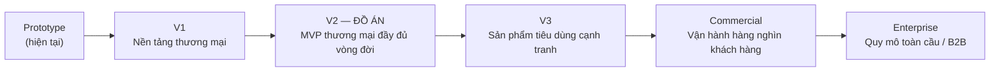
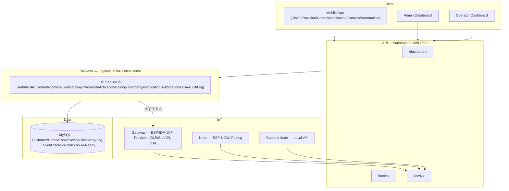
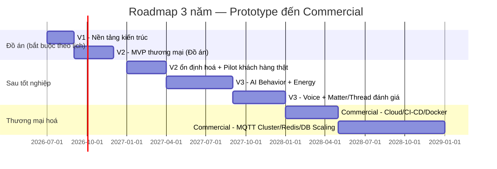
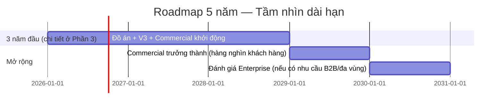
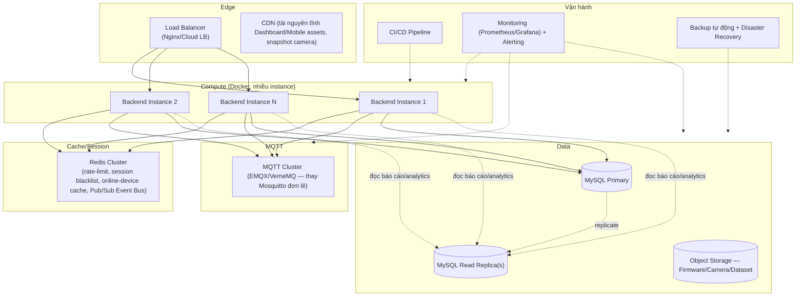
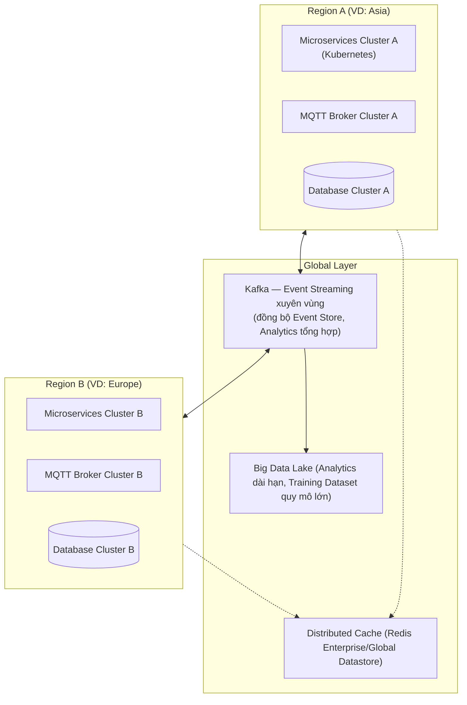
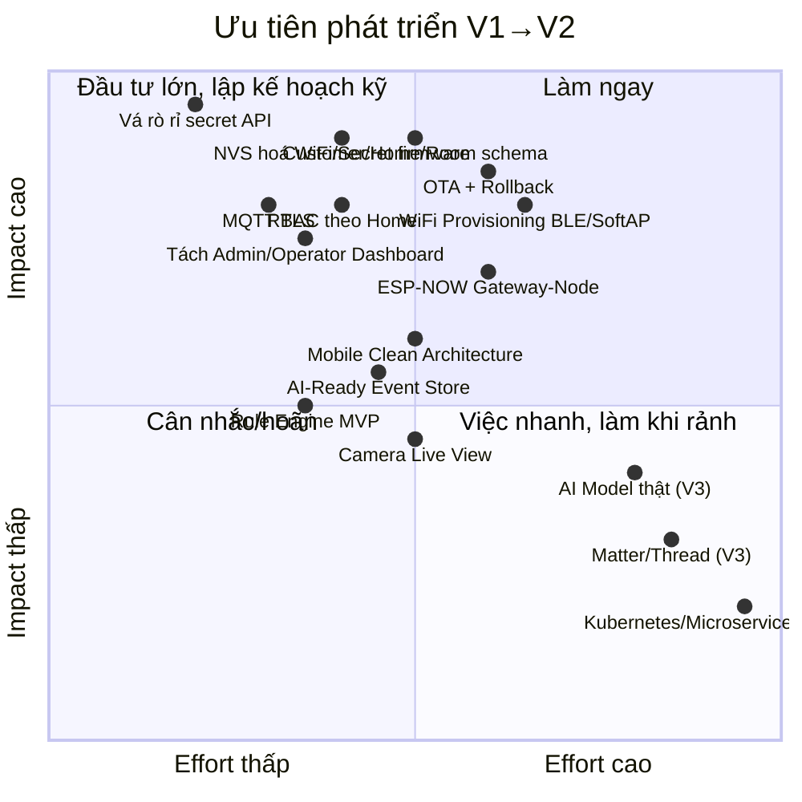

# SMART_HOME_PRODUCT_ROADMAP.md

> Lộ trình phát triển sản phẩm — từ **đồ án tốt nghiệp** đến **nền tảng Smart Home thương mại quy mô Enterprise**.
> Vai trò biên soạn: Principal Product Manager / Chief Technology Officer / Principal Solution Architect / IoT Product Architect.
> Đây là **tài liệu tổng hợp cấp cao nhất**, đứng trên toàn bộ 8 tài liệu kiến trúc đã biên soạn trong workspace — không lặp lại chi tiết kỹ thuật đã có, mà **tổng hợp thành lộ trình sản phẩm** với góc nhìn CTO: đánh đổi, rủi ro, ưu tiên, và tính khả thi trong khung thời gian một đồ án tốt nghiệp.
>
> **Nguồn tham chiếu (không lặp lại nội dung, chỉ dẫn chiếu):**
> - [`PROJECT_ANALYSIS_SMARTHOME.md`](PROJECT_ANALYSIS_SMARTHOME.md), [`SMART_HOME_PRODUCT_ARCHITECTURE.md`](SMART_HOME_PRODUCT_ARCHITECTURE.md), [`SMART_HOME_WIFI_PROVISIONING.md`](SMART_HOME_WIFI_PROVISIONING.md) — mô hình dữ liệu, Claim/Activation, Provisioning kỹ thuật.
> - [`FRONTEND_REFACTOR_SMARTHOME.md`](FRONTEND_REFACTOR_SMARTHOME.md) — Dashboard Admin/Operator.
> - [`BACKEND_REFACTOR_SMARTHOME.md`](BACKEND_REFACTOR_SMARTHOME.md) — 22 module Service, API, MQTT, và mục 18 — Event Sourcing/Feature Store/Recommendation Engine (AI-Ready).
> - [`DATABASE_REFACTOR_SMARTHOME.md`](DATABASE_REFACTOR_SMARTHOME.md) — ~45 bảng nghiệp vụ + mục 7.12 — 17 bảng AI-Ready, Partition/Retention.
> - [`MOBILE_APP_ARCHITECTURE.md`](MOBILE_APP_ARCHITECTURE.md) — Flutter/Riverpod, Claim/Provisioning UX.
> - [`EMBEDDED_ARCHITECTURE_ESP_IDF.md`](EMBEDDED_ARCHITECTURE_ESP_IDF.md) — Migrate PlatformIO→ESP-IDF, OTA, Partition.
> - [`SECURITY_ARCHITECTURE.md`](SECURITY_ARCHITECTURE.md) — 7-layer Security, Threat Model.

---

## MỤC LỤC

1. [Kiến trúc từng phiên bản](#1-kiến-trúc-từng-phiên-bản)
2. [Chức năng từng phiên bản](#2-chức-năng-từng-phiên-bản)
3. [Roadmap 3 năm](#3-roadmap-3-năm)
4. [Roadmap 5 năm](#4-roadmap-5-năm)
5. [Kiến trúc mở rộng](#5-kiến-trúc-mở-rộng)
6. [Các module cần refactor](#6-các-module-cần-refactor)
7. [Risk Analysis](#7-risk-analysis)
8. [Technical Debt](#8-technical-debt)
9. [Ưu tiên phát triển](#9-ưu-tiên-phát-triển)
10. [Những phần nên hoàn thành trước khi bảo vệ đồ án](#10-những-phần-nên-hoàn-thành-trước-khi-bảo-vệ-đồ-án)

---

## 0. TÓM TẮT ĐIỀU HÀNH

6 phiên bản tạo thành 1 đường cong trưởng thành sản phẩm liên tục — không phiên bản nào là "viết lại từ đầu", mỗi phiên bản là **mở rộng có kiểm soát** trên nền tảng phiên bản trước, đúng tinh thần "thiết kế đúng từ ngày đầu để không phải đổi kiến trúc sau này" đã xuyên suốt 9 tài liệu trước:

**Nguyên tắc cốt lõi của toàn bộ roadmap:** V2 (mục tiêu đồ án) không phải là "sản phẩm thu nhỏ để demo" mà là **lát cắt dọc đầy đủ (full vertical slice)** của kiến trúc thương mại — mỏng hơn về quy mô (ít khách hàng, ít thiết bị) nhưng **không mỏng hơn về tính đúng đắn kiến trúc** ở mọi tầng (Customer→Home→Room→Device, RBAC, Security, AI-Ready). Đây là lý do 9 tài liệu trước đều thiết kế "đủ dùng cho đồ án, không cần đổi khi thương mại hoá".

---

## 1. KIẾN TRÚC TỪNG PHIÊN BẢN

### 1.1. Prototype (hiện tại)

| Lớp | Trạng thái |
|---|---|
| Firmware | PlatformIO + Arduino, 3 project độc lập (gateway-node, sensor-node, sensor-node-2 — bản sao), super-loop, không OTA, không Provisioning, WiFi/Secret hard-code |
| Backend | Express monolith, không layer, raw SQL trong route, 1 bảng `devices` phẳng (Gateway+Sensor gộp) |
| Database | 6 bảng (`users`, `devices`, `sensor_data`, `device_tokens`, `audit_log`, `notifications`) |
| Frontend | Next.js Dashboard duy nhất, không phân biệt Admin/Operator, tổ chức theo "thiết bị mạng" |
| Mobile | Flutter UI mockup 100%, mock auth 1 tài khoản, không nối API |
| Security | HMAC 2 lớp đúng thuật toán (điểm mạnh duy nhất), không TLS, secret plaintext mọi nơi |

### 1.2. V1 — Nền tảng thương mại (chưa đủ tính năng, đúng kiến trúc)

**Mục tiêu:** dựng đúng khung xương kiến trúc trước khi thêm tính năng — tránh xây tính năng mới trên nền móng sai (bài học trực tiếp từ Prototype).

| Lớp | Thay đổi |
|---|---|
| Firmware | Bắt đầu migrate ESP-IDF (Phase 0-2 của `EMBEDDED_ARCHITECTURE_ESP_IDF.md`): CMake, component hoá, NVS hoá cấu hình, FreeRTOS task thật |
| Backend | Layered Architecture (Controller/Service/Repository), tách namespace API `/dashboard`, `/mobile`, `/device` |
| Database | Domain Customer→SmartHome→Room→Device (Phase 0-2 của `DATABASE_REFACTOR_SMARTHOME.md`) |
| Frontend | Sidebar/IA mới theo Home/Room, chưa cần tách hẳn 2 Dashboard |
| Mobile | Clean Architecture 3 lớp + Riverpod, Auth thật (chưa cần Claim/Provisioning hoàn chỉnh) |
| Security | **Phase 0 vá khẩn cấp** của `SECURITY_ARCHITECTURE.md` — vá rò rỉ secret, xoá hard-code WiFi/Secret khỏi firmware |

### 1.3. V2 — ĐỒ ÁN (MVP thương mại đầy đủ vòng đời)

Đây là **lát cắt dọc đầy đủ** — mọi tầng đều "chạy được thật", không phải mockup, nhưng quy mô nhỏ (1 kit demo, vài Smart Home thử nghiệm):

### 1.4. V3 — Sản phẩm tiêu dùng cạnh tranh

Bổ sung lớp **AI Behavior Learning** thật (không chỉ AI-Ready), **Energy Analytics**, **Voice Assistant**, và lớp giao thức chuẩn ngành **Matter/Thread/BLE Mesh** để tương thích hệ sinh thái Smart Home rộng hơn hệ thiết bị tự sản xuất.

### 1.5. Commercial — Vận hành hàng nghìn khách hàng

Chuyển từ "chạy được" sang "chạy được ổn định, có thể vận hành 24/7 với đội ngũ nhỏ": Cloud Deployment, CI/CD, Load Balancer, MQTT Cluster, Redis, Database Scaling, Backup/DR.

### 1.6. Enterprise — Quy mô toàn cầu / B2B

Kiến trúc Microservices + Kubernetes + Kafka + Multi-Region — chỉ cần thiết khi quy mô/yêu cầu hợp đồng B2B đòi hỏi (không phải đích đến bắt buộc của mọi sản phẩm Smart Home tiêu dùng).

---

## 2. CHỨC NĂNG TỪNG PHIÊN BẢN

| Chức năng | Prototype | V1 | V2 (Đồ án) | V3 | Commercial | Enterprise |
|---|:---:|:---:|:---:|:---:|:---:|:---:|
| Multi Smart Home (Customer→Home→Room) | ❌ | ⚠️ schema có, UI chưa | ✅ | ✅ | ✅ | ✅ |
| Mobile App thật (không mock) | ❌ | ⚠️ Auth thật | ✅ | ✅ | ✅ | ✅ |
| Admin Dashboard / Operator Dashboard tách biệt | ❌ | ❌ | ✅ | ✅ | ✅ | ✅ |
| RBAC (hệ thống + theo Home) | ❌ (2 role phẳng) | ⚠️ 3 role hệ thống | ✅ đầy đủ 2 tầng | ✅ | ✅ | ✅ + policy engine tuỳ biến B2B |
| MQTT TLS / mTLS | ❌ | ⚠️ TLS server-only | ✅ mTLS Gateway | ✅ | ✅ | ✅ + multi-broker cluster |
| Device Authentication (HMAC 2 lớp) | ✅ (đã có, giữ nguyên) | ✅ | ✅ | ✅ | ✅ | ✅ |
| WiFi Provisioning (BLE/SoftAP) | ❌ | ⚠️ đang migrate | ✅ | ✅ | ✅ | ✅ |
| Gateway Pairing (ESP-NOW) | ❌ | ⚠️ đang migrate | ✅ | ✅ | ✅ | ✅ |
| OTA Firmware + Rollback | ❌ | ⚠️ nền tảng partition | ✅ | ✅ | ✅ + canary rollout theo % fleet | ✅ |
| Notification (Push/Email/In-app) | ❌ | ❌ | ✅ | ✅ | ✅ | ✅ |
| Camera (Live View/Snapshot) | ❌ | ❌ | ✅ | ✅ | ✅ | ✅ |
| Rule Engine (Automation/Scene) | ❌ | ❌ | ✅ (MVP IF/THEN) | ✅ + kéo-thả | ✅ | ✅ |
| Logging (10 loại tách bảng) | ❌ (1 bảng gộp) | ⚠️ bắt đầu tách | ✅ | ✅ | ✅ + SIEM tích hợp | ✅ |
| Monitoring (Gateway/Device Status realtime) | ❌ | ⚠️ | ✅ | ✅ | ✅ + Observability đầy đủ (Prometheus/Grafana) | ✅ |
| AI-Ready Database (Event Store, Behavior Log, Feature Store) | ❌ | ⚠️ Event Store cơ bản | ✅ | ✅ (dùng thật) | ✅ | ✅ |
| AI-Ready Backend (Recommendation Engine khung) | ❌ | ❌ | ✅ (khung, chưa có model) | ✅ (model thật chạy) | ✅ | ✅ + multi-model |
| AI Behavior Learning (model thật) | ❌ | ❌ | ❌ (chỉ Reserved) | ✅ | ✅ | ✅ |
| Energy Analytics/Dashboard | ❌ | ❌ | ❌ | ✅ | ✅ | ✅ |
| Voice Assistant (Google/Alexa) | ❌ | ❌ | ❌ | ✅ | ✅ | ✅ |
| Matter/Thread | ❌ | ❌ | ❌ | ✅ (đánh giá/bắt đầu) | ✅ | ✅ |
| BLE Mesh (mở rộng ngoài ESP-NOW) | ❌ | ❌ | ❌ | ✅ (tuỳ chọn) | ✅ | ✅ |
| Family Sharing (Owner/Controller/Viewer/Guest) | ❌ | ❌ | ✅ (đã trong RBAC Home) | ✅ nâng cao (lịch dùng chung) | ✅ | ✅ |
| Cloud Deployment/Docker/CI-CD | ❌ (chạy local) | ⚠️ Docker Compose có sẵn | ⚠️ Docker Compose, chưa CI/CD đầy đủ | ⚠️ | ✅ | ✅ |
| MQTT Cluster / Redis / DB Scaling | ❌ | ❌ | ❌ (1 instance đủ dùng) | ⚠️ bắt đầu cân nhắc | ✅ | ✅ |
| Microservices / Kubernetes / Kafka | ❌ | ❌ | ❌ | ❌ | ⚠️ đánh giá | ✅ |
| Multi-Region | ❌ | ❌ | ❌ | ❌ | ❌ | ✅ |

---

## 3. ROADMAP 3 NĂM

> Mốc thời gian tính từ **hiện tại (Prototype)**. Giai đoạn đồ án (Prototype→V2) chiếm khoảng 2 quý đầu — đây là ràng buộc cứng theo lịch bảo vệ, các giai đoạn sau linh hoạt theo tốc độ gọi vốn/tuyển dụng thực tế.

| Năm | Trọng tâm | Cột mốc kinh doanh tương ứng |
|---|---|---|
| **Năm 0 (Quý 3-4 hiện tại)** | V1 → V2, bảo vệ đồ án | Sản phẩm demo hoàn chỉnh — điều kiện tốt nghiệp |
| **Năm 1** | Ổn định hoá V2, chạy pilot với 5-20 hộ gia đình thật (bạn bè/gia đình/beta tester), bắt đầu V3 (AI thật, Energy) | Xác thực Product-Market Fit ở quy mô rất nhỏ, thu thập dữ liệu hành vi thật đầu tiên |
| **Năm 2** | Hoàn thiện V3 (Voice, đánh giá Matter/Thread), bắt đầu Commercial (Cloud, CI/CD) | Chuẩn bị bán hàng thật — cần hạ tầng vận hành 24/7 |
| **Năm 3** | Commercial trưởng thành (MQTT Cluster, Redis, DB Scaling, Backup/DR) | Mục tiêu vài trăm đến ~1,000-2,000 Smart Home đang hoạt động |

---

## 4. ROADMAP 5 NĂM

| Năm | Trọng tâm | Điều kiện kích hoạt |
|---|---|---|
| Năm 4 | Commercial trưởng thành hoàn toàn — hàng nghìn Smart Home, vận hành ổn định, đội ngũ vận hành (Operator) chuyên trách | Doanh thu đủ nuôi đội ngũ ≥ 5-10 người |
| Năm 5 | **Chỉ khi có tín hiệu kinh doanh rõ ràng** (hợp đồng B2B/B2B2C lớn, hoặc mở rộng đa quốc gia): bắt đầu đánh giá Enterprise (Microservices, Kubernetes, Kafka, Multi-Region) | **Không nên chủ động đầu tư Enterprise nếu chưa có nhu cầu thật** — đây là quyết định kinh doanh, không phải quyết định kỹ thuật thuần tuý (Phần 5, 7) |

**Nguyên tắc quan trọng nhất của Roadmap 5 năm:** Enterprise **không phải đích đến tất yếu**. Rất nhiều sản phẩm Smart Home thương mại thành công (quy mô hàng chục nghìn tới hàng trăm nghìn thiết bị) vận hành tốt trên kiến trúc Commercial (monolith tối ưu tốt + Redis + MQTT Cluster + DB read replica) mà không cần Microservices/Kubernetes/Kafka — chuyển sang Enterprise quá sớm khi chưa cần là **over-engineering**, tốn chi phí vận hành và làm chậm tốc độ phát triển tính năng mà không mang lại giá trị kinh doanh tương xứng.

---

## 5. KIẾN TRÚC MỞ RỘNG

### 5.1. Commercial — chi tiết hạ tầng

**Lý do từng thành phần:**

| Thành phần | Vấn đề Prototype/V2 giải quyết |
|---|---|
| Load Balancer + nhiều Backend instance | Vấn đề rate-limit/cache in-memory chỉ đúng 1 instance đã nêu ở `BACKEND_REFACTOR_SMARTHOME.md`/`SECURITY_ARCHITECTURE.md` — bắt buộc giải quyết trước khi scale ngang |
| Redis Cluster | Chuyển toàn bộ state in-memory (rate-limit, online-device cache, JWT blacklist) sang shared store |
| MQTT Cluster (EMQX/VerneMQ) | Mosquitto đơn lẻ không có HA (High Availability) — 1 broker chết là toàn bộ Gateway mất kết nối Cloud; Cluster cho phép failover |
| Read Replica | Tách truy vấn báo cáo/Dashboard (đọc nhiều) khỏi truy vấn ghi telemetry tần suất cao (viết nhiều) — tránh 1 loại truy vấn làm chậm loại kia |
| CI/CD | Thay quy trình deploy thủ công hiện tại bằng pipeline tự động (test → build → deploy), giảm rủi ro lỗi người khi release thường xuyên hơn |
| Backup/DR | Hiện tại **không có chiến lược backup nào được đề cập** trong toàn bộ codebase — đây là khoảng trống cần lấp trước khi có dữ liệu khách hàng thật (mất dữ liệu Smart Home của khách hàng là sự cố không thể chấp nhận) |

### 5.2. Enterprise — chi tiết hạ tầng (chỉ khi có nhu cầu thật)

**Khi nào thật sự cần Microservices:** khi các domain (Telemetry Ingest, Automation Engine, OTA Rollout, AI Training Pipeline) có **tốc độ thay đổi và tải khác biệt rất lớn** tới mức triển khai/scale chung 1 monolith gây lãng phí tài nguyên nghiêm trọng (VD Telemetry Ingest cần scale theo số thiết bị — hàng triệu request/phút — trong khi Automation Engine tải thấp hơn nhiều bậc) — tách ra để **scale độc lập từng phần**, không phải vì "microservices là xu hướng".

**Khi nào thật sự cần Kafka:** khi Redis Pub/Sub (đủ dùng ở Commercial) không còn đáp ứng được yêu cầu **replay lịch sử event** (Kafka giữ log event có thể đọc lại từ đầu — quan trọng cho Training Dataset quy mô lớn ở `DATABASE_REFACTOR_SMARTHOME.md` mục 7.12) hoặc yêu cầu **đồng bộ multi-region** (Redis Pub/Sub không thiết kế cho xuyên vùng địa lý).

---

## 6. CÁC MODULE CẦN REFACTOR

> Tổng hợp cross-cutting từ 6 tài liệu kiến trúc chi tiết — liệt kê theo thứ tự **mức độ cấp thiết**, không theo thứ tự tài liệu.

| # | Module | Vấn đề cốt lõi | Cần refactor trước phiên bản nào | Tài liệu chi tiết |
|---|---|---|---|---|
| 1 | `GET /api/device/sensors` | Rò rỉ secret_key toàn hệ thống | **V1 (khẩn cấp)** | `SECURITY_ARCHITECTURE.md` #1 |
| 2 | Firmware config (`config_gw.h`/`config_1.h`) | WiFi/Secret hard-code compile vào binary, commit git | **V1 (khẩn cấp)** | `EMBEDDED_ARCHITECTURE_ESP_IDF.md`, `SECURITY_ARCHITECTURE.md` |
| 3 | `devices` table (schema gốc) | Gộp Gateway+Sensor, không Customer/Home/Room | **V1→V2** | `DATABASE_REFACTOR_SMARTHOME.md` |
| 4 | `middleware/rbac.ts` | Không giới hạn phạm vi Home cho Operator | **V2** | `SECURITY_ARCHITECTURE.md` #4 |
| 5 | `validateDevice.ts` vs `mqttDataService.ts` | Logic xác thực trùng lặp 2 nơi | **V1→V2** | `BACKEND_REFACTOR_SMARTHOME.md` |
| 6 | 3 project PlatformIO (`gateway-node`/`sensor-node`/`sensor-node-2`) | Copy-paste thay vì tham số hoá | **V1** | `EMBEDDED_ARCHITECTURE_ESP_IDF.md` |
| 7 | `Sidebar.tsx`/`constants.ts` (Frontend) | Điều hướng theo thiết bị, 2 nguồn nav lệch nhau | **V2** | `FRONTEND_REFACTOR_SMARTHOME.md` |
| 8 | `RegisterModal.tsx` | Hiển thị secret plaintext trên Dashboard | **V2** | `FRONTEND_REFACTOR_SMARTHOME.md`, `SECURITY_ARCHITECTURE.md` |
| 9 | Mobile `MockAuthService` | Phụ thuộc cứng, không interface, chặn viết test | **V2** | `MOBILE_APP_ARCHITECTURE.md` |
| 10 | `audit_log` (1 bảng gộp) | Gộp bảo mật + nghiệp vụ + dữ liệu tần suất cao | **V2** | `DATABASE_REFACTOR_SMARTHOME.md`, `BACKEND_REFACTOR_SMARTHOME.md` |
| 11 | `sensor_data` giới hạn cứng 150 bản ghi | Phá huỷ dữ liệu lịch sử cần cho AI | **V2 (trước khi có AI thật ở V3)** | `DATABASE_REFACTOR_SMARTHOME.md` mục 7.12 |
| 12 | Rate-limit/cache in-memory (`app.ts`, `deviceStatus.ts`) | Không scale ngang nhiều instance | **Commercial** | `BACKEND_REFACTOR_SMARTHOME.md`, `SECURITY_ARCHITECTURE.md` |
| 13 | Mosquitto đơn lẻ, không TLS, không ACL | Không HA, không bảo mật transport | **V2 (TLS) → Commercial (Cluster)** | `SECURITY_ARCHITECTURE.md` |
| 14 | Không Soft Delete toàn hệ thống | Mất dữ liệu điều tra vĩnh viễn | **V2→V3** | `SECURITY_ARCHITECTURE.md`, `DATABASE_REFACTOR_SMARTHOME.md` |
| 15 | Không CI/CD, deploy thủ công | Rủi ro lỗi người khi release | **Commercial** | Phần 5.1 |

---

## 7. RISK ANALYSIS

### 7.1. Rủi ro kỹ thuật

| Rủi ro | Xác suất | Tác động | Giảm thiểu |
|---|---|---|---|
| Firmware OTA lỗi biến thiết bị đã bán thành "gạch" | Trung bình (nếu bỏ qua App Rollback) | Nghiêm trọng — chi phí bảo hành/thu hồi vật lý | Bắt buộc 2 OTA partition + App Rollback tự động ngay từ V2 (`EMBEDDED_ARCHITECTURE_ESP_IDF.md` Phần 14-15) |
| Rò rỉ dữ liệu khách hàng (secret, hành vi sinh hoạt qua Telemetry) | Cao nếu không vá trước V2 | Nghiêm trọng — mất niềm tin khách hàng, rủi ro pháp lý (bảo vệ dữ liệu cá nhân) | `SECURITY_ARCHITECTURE.md` Phase 0-3 |
| ESP-NOW không đủ tầm phủ nhà nhiều tầng/nhà lớn | Trung bình | Trung bình — trải nghiệm khách hàng kém, tăng ticket hỗ trợ | Node lặp tín hiệu (repeater) — đã nêu ở `SMART_HOME_WIFI_PROVISIONING.md` mục 3.1 |
| AI Recommendation sai/gây phiền (spam đề xuất) | Trung bình ở V3 | Trung bình — giảm trải nghiệm, khách hàng tắt tính năng | Ngưỡng confidence + giới hạn tần suất đề xuất (`BACKEND_REFACTOR_SMARTHOME.md` mục 18.6) |
| Scale ngang thất bại do state in-memory | Cao nếu bỏ qua trước Commercial | Cao — sự cố khi tải tăng đột biến | Redis hoá bắt buộc trước Commercial (Phần 5.1) |
| Vendor lock-in Cloud Provider quá sớm | Thấp-Trung bình | Trung bình (chi phí chuyển đổi sau này) | Thiết kế Backend không phụ thuộc API độc quyền 1 Cloud cụ thể ở giai đoạn Commercial |

### 7.2. Rủi ro kinh doanh

| Rủi ro | Ghi chú |
|---|---|
| Cạnh tranh từ Tuya/Xiaomi/Aqara (đã có hệ sinh thái, chi phí sản xuất thấp hơn nhiều nhờ quy mô) | Sản phẩm tự phát triển firmware khó cạnh tranh giá — nên định vị vào phân khúc "tuỳ biến cao"/"bảo mật minh bạch"/"tích hợp AI học thói quen" thay vì cạnh tranh giá thuần |
| Chi phí chứng nhận (FCC/CE, an toàn điện cho Relay điều khiển thiết bị điện) khi bán hàng thật | Cần tính vào kế hoạch tài chính trước khi bán ra thị trường — không phải rủi ro kỹ thuật nhưng chặn thương mại hoá nếu bỏ qua |
| Chi phí hỗ trợ khách hàng tăng nhanh nếu Provisioning UX kém | Đây là lý do `SMART_HOME_WIFI_PROVISIONING.md` đầu tư kỹ vào UX "chỉ nhập WiFi 1 lần" — giảm trực tiếp chi phí vận hành dài hạn |
| Phụ thuộc chuỗi cung ứng ESP32 (giá linh kiện biến động) | Rủi ro chung ngành phần cứng, cần đa dạng hoá nhà cung cấp linh kiện khi lên số lượng lớn |
| Chuyển đổi Matter/Thread quá muộn so với thị trường | Theo dõi tốc độ chuẩn hoá ngành, không cần đi đầu nhưng không nên trễ quá 1-2 năm so với đối thủ lớn |

### 7.3. Rủi ro riêng cho bối cảnh đồ án tốt nghiệp

| Rủi ro | Giảm thiểu |
|---|---|
| Phạm vi V2 quá lớn cho 1 người/1 nhóm nhỏ trong khung thời gian đồ án | Phần 10 — phân loại rõ Must-have/Should-have/Could-have cho buổi bảo vệ |
| Phần cứng thật (Relay/Camera/Motion Sensor) chưa mua/lắp kịp | Có thể demo bằng **mô phỏng** (simulator gửi MQTT giả lập đúng payload) cho phần chưa có phần cứng, miễn kiến trúc Backend/DB đã đúng — hội đồng đánh giá thiết kế, không chỉ đánh giá phần cứng vật lý |
| Hội đồng đặt câu hỏi về phần chưa triển khai (AI thật, Matter...) | Trả lời bằng **tài liệu kiến trúc đã có** (`BACKEND_REFACTOR_SMARTHOME.md` mục 18, `DATABASE_REFACTOR_SMARTHOME.md` mục 7.12 v.v.) — chứng minh đã thiết kế đúng, chỉ là quyết định phạm vi hợp lý cho đồ án, không phải thiếu hiểu biết |

---

## 8. TECHNICAL DEBT

### 8.1. Kiểm kê nợ kỹ thuật theo tầng (đã phát hiện qua review 6 tài liệu)

| Tầng | Khoản nợ | "Lãi suất" (tốc độ trầm trọng hoá nếu không trả) |
|---|---|---|
| **Security** | Secret plaintext 3 nơi (DB/Firmware/UI), không TLS | **Rất cao** — mỗi khách hàng mới tăng thêm là tăng thêm bề mặt tấn công/số nạn nhân tiềm năng nếu bị khai thác |
| **Backend Architecture** | Transaction Script (route = controller+service+repo gộp), logic trùng lặp HTTP/MQTT | Trung bình-Cao — mỗi tính năng mới thêm vào làm phình thêm độ phức tạp theo cấp số nhân nếu không tái cấu trúc trước |
| **Database Schema** | ENUM cứng (`device_type`), gộp bảng sai domain, giới hạn cứng 150 bản ghi | Cao — càng trì hoãn, khối lượng dữ liệu cần migrate càng lớn, migration càng rủi ro |
| **Firmware** | Copy-paste project, super-loop, không NVS/OTA | Cao — mỗi loại thiết bị mới (Relay/Camera) lại nhân bản thêm 1 project nếu không tái cấu trúc trước |
| **Frontend** | IA theo thiết bị thay vì Home/Room, component trùng lặp (EmptyState/Toast tự viết lại mỗi trang) | Thấp-Trung bình — ảnh hưởng UX/tốc độ phát triển tính năng mới hơn là rủi ro vận hành |
| **Mobile** | 100% mockup, không kiến trúc phân lớp | Trung bình — thời gian "trả nợ" tương đương viết mới hoàn toàn, nhưng **không phải nợ xấu** vì chưa có gì để mất (chưa release cho khách hàng thật) |
| **Test Coverage** | Không có unit test ở bất kỳ tầng nào (Backend/Firmware/Mobile) | Cao dần theo thời gian — càng nhiều tính năng, càng khó đảm bảo không hồi quy (regression) khi thay đổi |

### 8.2. Nguyên tắc trả nợ

1. **Nợ Security luôn trả trước tiên** — không thương lượng, không hoãn vì lý do tốc độ ra tính năng (đã nhấn mạnh xuyên suốt `SECURITY_ARCHITECTURE.md` Phase 0).
2. **Nợ Database/Firmware trả sớm hơn nợ Frontend/Mobile** — vì chi phí migrate dữ liệu/thiết bị đã triển khai tăng theo thời gian nhanh hơn nhiều so với chi phí viết lại UI.
3. **Không vay thêm nợ mới cùng loại khi đang trả nợ cũ** — VD không nên thêm loại thiết bị mới (nợ Firmware kiểu copy-paste) trước khi Phase 0-2 của `EMBEDDED_ARCHITECTURE_ESP_IDF.md` hoàn tất.
4. **Chấp nhận có chủ đích 1 số nợ ở V2** (VD chưa cần Test Coverage đầy đủ, chưa cần CI/CD) — đây là "nợ tốt" trong giai đoạn đồ án, miễn được ghi nhận rõ ràng và có kế hoạch trả ở Commercial (không phải "quên luôn").

---

## 9. ƯU TIÊN PHÁT TRIỂN

### 9.1. Ma trận Impact × Effort (cho giai đoạn V1→V2)

### 9.2. Thứ tự khuyến nghị cụ thể (không chỉ định tính)

| Thứ tự | Hạng mục | Lý do xếp trước/sau |
|---|---|---|
| 1 | Vá rò rỉ secret (`/api/device/sensors`) | Impact cực cao, effort cực thấp — không có lý do trì hoãn |
| 2 | NVS hoá cấu hình firmware | Điều kiện tiên quyết cho Provisioning — không thể làm Provisioning nếu credential vẫn hard-code |
| 3 | Customer/Home/Room schema mới | Mọi tính năng V2 khác (Dashboard, Mobile, RBAC) đều phụ thuộc mô hình dữ liệu này |
| 4 | RBAC theo Home + tách 2 Dashboard | Phụ thuộc bước 3, là nền tảng phân quyền cho mọi API sau đó |
| 5 | MQTT TLS | Nên làm cùng lúc/ngay sau bước 2 (đã đụng vào cấu hình mạng firmware) |
| 6 | WiFi Provisioning + ESP-NOW Pairing | Effort cao nhất trong V2 — cần bắt đầu sớm, chạy song song các bước trên |
| 7 | OTA + Partition 2-slot | Có thể chạy song song bước 6 (khác team/khác thời gian nếu có nhân lực) |
| 8 | Rule Engine MVP + Notification + Camera | Sau khi nền tảng Home/Room/Device ổn định — các tính năng "trải nghiệm" xây trên nền đã vững |
| 9 | AI-Ready Event Store/Behavior Log | Có thể làm sớm hơn thứ tự này nếu nhân lực cho phép — **càng sớm càng tốt** vì dữ liệu lịch sử không "hồi tố" được (đã nhấn mạnh ở `BACKEND_REFACTOR_SMARTHOME.md` mục 18.9) |
| 10 | Logging/Monitoring đầy đủ | Có thể làm cuối cùng trong V2 — không chặn tính năng khác, nhưng bắt buộc phải xong trước khi bảo vệ để chứng minh khả năng vận hành |

---

## 10. NHỮNG PHẦN NÊN HOÀN THÀNH TRƯỚC KHI BẢO VỆ ĐỒ ÁN

> Góc nhìn thực tế của CTO tư vấn: phạm vi V2 như liệt kê (Multi Home, Mobile, 2 Dashboard, RBAC, TLS, Provisioning, Pairing, OTA, Notification, Camera, Rule Engine, Logging, Monitoring, AI-Ready) là **phạm vi của 1 sản phẩm MVP thật, không phải phạm vi hợp lý cho 1 người trong 1 học kỳ**. Dưới đây là phân loại MoSCoW thực tế để buổi bảo vệ vừa **có demo chạy được thuyết phục**, vừa **thể hiện tư duy kiến trúc sản phẩm thật** (chính là điều hội đồng đánh giá cao nhất, không phải số lượng tính năng).

### 10.1. MUST — bắt buộc chạy được thật, demo trực tiếp

| Hạng mục | Vì sao bắt buộc |
|---|---|
| Mô hình Customer→Home→Room→Device→Sensor→Telemetry (Database + Backend) | Đây là **luận điểm kiến trúc trung tâm** của toàn bộ đồ án ("không phải Device Manager mà là Smart Home Platform") — không có cái này, toàn bộ câu chuyện đồ án sụp đổ |
| RBAC 3 role (Admin/Operator/User) + phân biệt rõ Dashboard (Admin/Operator) vs Mobile (User) | Luận điểm thứ hai ("User không dùng Dashboard") — cũng là trọng tâm câu chuyện |
| HMAC 2 lớp Sensor→Gateway→Backend (đã có, giữ nguyên) | Điểm mạnh sẵn có — chỉ cần thêm TLS transport là đủ ấn tượng |
| Vá rò rỉ secret (`/api/device/sensors`) | Nếu hội đồng hỏi về bảo mật và phát hiện lỗ hổng này chưa vá, ảnh hưởng uy tín toàn bộ phần Security đã trình bày |
| Ít nhất 1 luồng Claim Smart Home hoàn chỉnh (QR hoặc nhập mã) chạy thật từ Mobile | Đây là trải nghiệm "wow" dễ demo nhất, thể hiện tư duy sản phẩm thương mại rõ ràng nhất |
| Dashboard Admin cơ bản (Smart Homes list, Devices, Users) chạy thật với dữ liệu Home/Room thật | Chứng minh mô hình dữ liệu mới hoạt động end-to-end |
| Tài liệu kiến trúc đầy đủ (9 tài liệu đã có) | **Đây chính là một phần bài nộp** — chứng minh năng lực thiết kế hệ thống ở mức Principal/Senior, bù đắp cho phần code chưa kịp hoàn thiện 100% |

### 10.2. SHOULD — cố gắng hoàn thành, có thể demo 1 phần

| Hạng mục | Mức tối thiểu chấp nhận được |
|---|---|
| WiFi Provisioning | Ít nhất chạy được BLE **hoặc** SoftAP (không nhất thiết cả 2), demo trên 1 Gateway thật |
| Gateway Pairing (ESP-NOW) | Demo được Gateway pair với 1 Node thật là đủ, không cần toàn bộ kit 4-5 thiết bị |
| OTA Firmware | Demo được **1 lần OTA thành công** trên Gateway hoặc Node (không cần Rollback thật, chỉ cần trình bày cơ chế Rollback trong tài liệu là đủ nếu chưa kịp test lỗi thật) |
| MQTT TLS | Bật TLS server-auth (không nhất thiết mTLS đầy đủ ngay) — vẫn thể hiện đúng hướng thiết kế |
| Rule Engine | 1 rule đơn giản chạy thật (VD "nhiệt độ > X → bật quạt") đủ để chứng minh khái niệm |
| Notification | Push đơn giản 1 loại sự kiện (VD thiết bị offline) là đủ |
| Operator Dashboard | Có thể chỉ là 1 phiên bản rút gọn của Admin Dashboard với RBAC khác, không cần đầy đủ Provisioning Queue UI |

### 10.3. COULD — trình bày bằng thiết kế, không bắt buộc chạy thật

| Hạng mục | Cách trình bày trong buổi bảo vệ |
|---|---|
| Camera Live View | Trình bày kiến trúc Local-AP Bridge + wireframe, có thể demo bằng ảnh snapshot tĩnh thay vì live stream thật nếu thiếu thời gian |
| AI-Ready Database/Backend đầy đủ (Event Store, Feature Store, Recommendation Engine) | Trình bày bằng tài liệu `BACKEND_REFACTOR_SMARTHOME.md` mục 18 + `DATABASE_REFACTOR_SMARTHOME.md` mục 7.12 + demo 1 bảng `events`/`user_behavior_logs` có dữ liệu mẫu, **không cần** model AI chạy thật |
| Logging 10 loại tách bảng | Có thể chỉ triển khai 2-3 loại quan trọng nhất thật (Security Log, Provision Log), còn lại trình bày thiết kế |
| Monitoring realtime (WebSocket) | Có thể tạm dùng polling REST như hiện tại, trình bày thiết kế WebSocket Gateway là hướng nâng cấp tiếp theo |
| Secure Boot / Flash Encryption | Chỉ cần trình bày trong tài liệu là "Reserved cho giai đoạn Production" — hội đồng hiểu đây là quyết định đúng đắn (không phải thiếu sót) khi biết phân biệt "cần cho demo" và "cần cho production" |

### 10.4. WON'T (ở giai đoạn đồ án — nêu rõ là Roadmap tương lai)

AI Behavior Learning (model thật), Energy Analytics, Voice Assistant, Matter/Thread/BLE Mesh, toàn bộ hạ tầng Commercial/Enterprise (Kubernetes, Kafka, Multi-Region) — **nêu rõ trong slide bảo vệ là "V3/Commercial/Enterprise Roadmap"**, kèm 1-2 câu giải thích ngắn gọn tại sao không nằm trong phạm vi V2 (thể hiện đây là **quyết định phạm vi có chủ đích**, không phải giới hạn năng lực).

### 10.5. Thông điệp trình bày trước hội đồng

Câu chuyện nên kể: *"Chúng tôi không xây một đồ án IoT demo rồi dừng lại — chúng tôi thiết kế một nền tảng Smart Home thương mại đầy đủ ngay từ đầu, hiện thực hoá phần lõi quan trọng nhất (mô hình dữ liệu, RBAC, bảo mật thiết bị, Claim/Provisioning) để chứng minh tính khả thi, và có lộ trình rõ ràng, đã được tài liệu hoá chi tiết ở mức kiến trúc, cho toàn bộ phần còn lại tới khi trở thành sản phẩm bán ra thị trường."* — đây chính xác là những gì 9 tài liệu kiến trúc trong workspace đã chuẩn bị sẵn.
