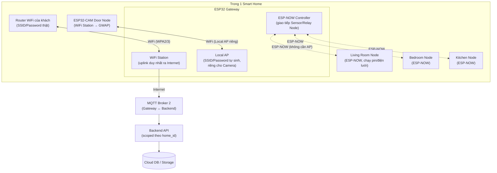
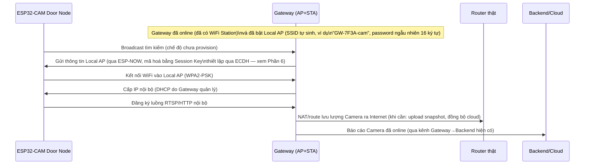
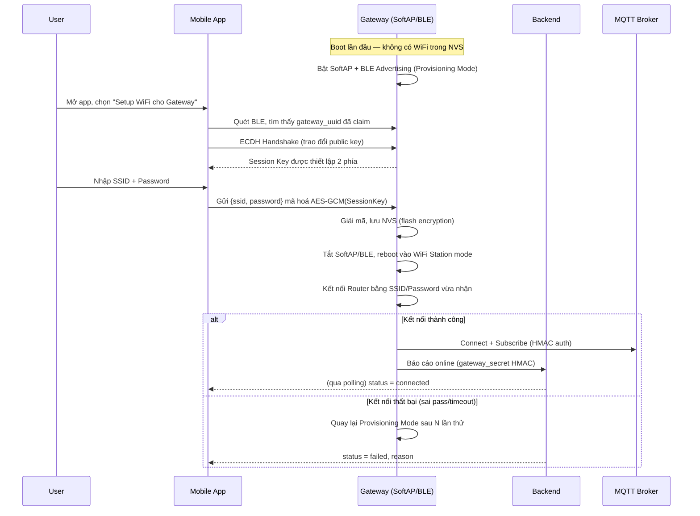
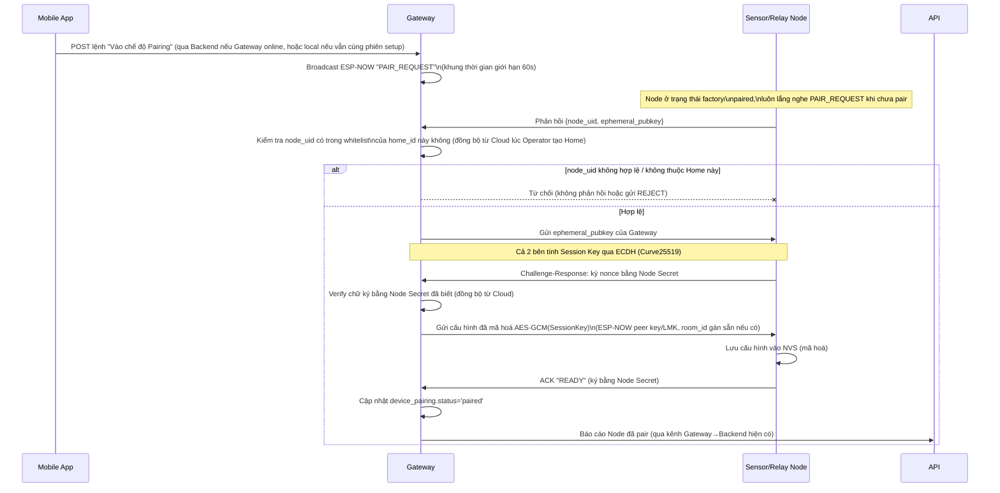
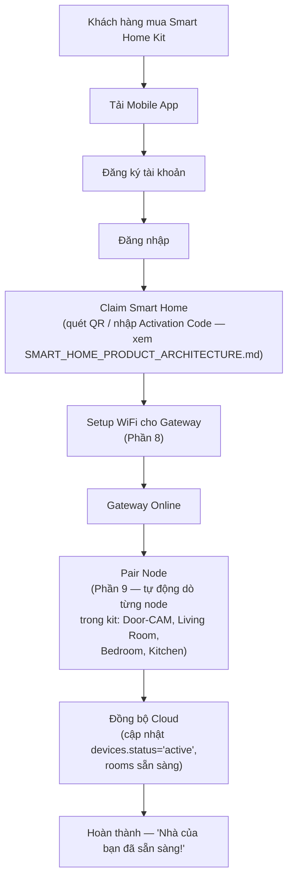
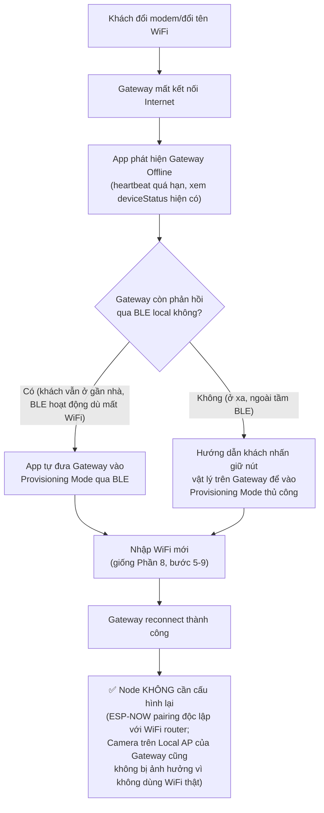
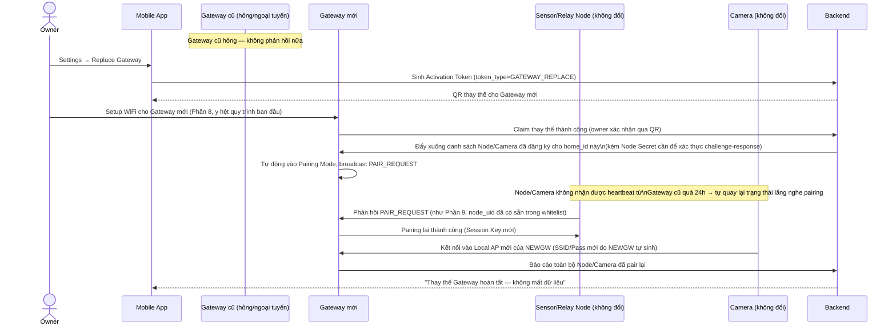
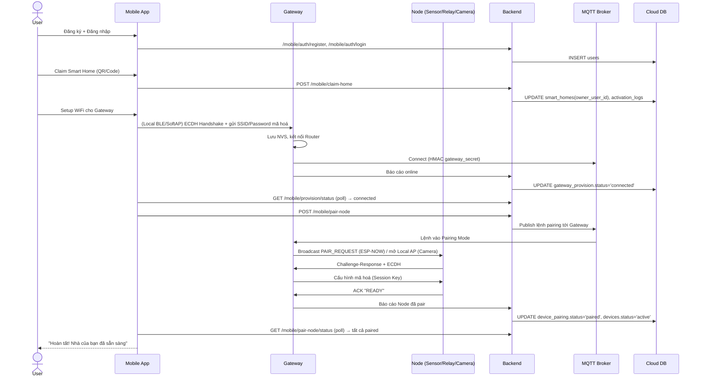

# SMART_HOME_WIFI_PROVISIONING.md

> Kiến trúc Device Provisioning cho nền tảng Smart Home thương mại — mục tiêu: **khách hàng chỉ nhập WiFi đúng 1 lần**, mọi thiết bị còn lại tự động online mà không cần thao tác mạng thêm.
> Tài liệu này là tầng **kỹ thuật mạng & embedded**, bổ sung cho [`PROJECT_ANALYSIS_SMARTHOME.md`](PROJECT_ANALYSIS_SMARTHOME.md) (mô hình dữ liệu Home/Room/Device) và [`SMART_HOME_PRODUCT_ARCHITECTURE.md`](SMART_HOME_PRODUCT_ARCHITECTURE.md) (Claim/Activation, RBAC, business flow bán hàng).
>
> Thiết kế hướng tới quy mô: **hàng chục nghìn Gateway, hàng trăm nghìn Node, multi-tenant**.

---

## MỤC LỤC

1. [Phân tích phương án Network Topology](#1-phân-tích-phương-án-network-topology)
2. [Đề xuất cuối & lý do lựa chọn](#2-đề-xuất-cuối--lý-do-lựa-chọn)
3. [So sánh giao thức Gateway ↔ Node](#3-so-sánh-giao-thức-gateway--node)
4. [Kiến trúc Network tổng thể](#4-kiến-trúc-network-tổng-thể)
5. [Camera Flow — ESP32-CAM Provisioning](#5-camera-flow--esp32-cam-provisioning)
6. [Security — Key Hierarchy](#6-security--key-hierarchy)
7. [Factory Configuration Flow](#7-factory-configuration-flow)
8. [WiFi Provisioning Flow (Gateway)](#8-wifi-provisioning-flow-gateway)
9. [Node Pairing Flow](#9-node-pairing-flow)
10. [First Installation — User Flow](#10-first-installation--user-flow)
11. [Change WiFi Flow](#11-change-wifi-flow)
12. [Replace Gateway Flow](#12-replace-gateway-flow)
13. [Reset Flows](#13-reset-flows)
14. [Database](#14-database)
15. [API](#15-api)
16. [Mobile App UX](#16-mobile-app-ux)
17. [Sequence Diagram tổng hợp](#17-sequence-diagram-tổng-hợp)
18. [Error Handling & Recovery](#18-error-handling--recovery)
19. [Best Practices](#19-best-practices)
20. [Những điểm cần tránh khi phát triển sản phẩm Smart Home thương mại](#20-những-điểm-cần-tránh-khi-phát-triển-sản-phẩm-smart-home-thương-mại)

---

## 1. PHÂN TÍCH PHƯƠNG ÁN NETWORK TOPOLOGY

> Ghi chú hiện trạng: firmware hiện tại (`firmware/sensor-node/src/main.cpp`, `firmware/gateway-node/src/main.cpp`) đang triển khai **đúng Phương án A** — mỗi node có `WIFI_SSID`/`WIFI_PASS` riêng trong `config.h`, tự kết nối WiFi độc lập rồi publish MQTT. Đây là cách làm chấp nhận được cho đồ án/demo 1-2 node, nhưng **vi phạm trực tiếp yêu cầu "chỉ nhập WiFi một lần"** khi mở rộng thành sản phẩm 5+ node/nhà bán hàng loạt.

### Phương án A — Mỗi Node tự kết nối WiFi

| Tiêu chí | Đánh giá |
|---|---|
| Ưu điểm | Firmware đơn giản (đã có sẵn); mỗi node độc lập hoàn toàn, gateway chết không ảnh hưởng node gửi dữ liệu (nếu node có đường dự phòng lên broker); dễ debug từng node riêng lẻ |
| Nhược điểm | **Khách phải nhập WiFi N lần cho N thiết bị** — vi phạm yêu cầu cốt lõi; N thiết bị cùng lưu trữ mật khẩu WiFi (tăng bề mặt tấn công gấp N lần); WiFi radio luôn bật tiêu tốn pin — không khả thi cho node chạy pin (Garden/Balcony); router gia đình giới hạn số client WiFi đồng thời (thường 15-30) — lãng phí khi node chỉ cần trao đổi vài byte cảm biến |
| Khả năng mở rộng | **Kém** — không phù hợp mô hình bán hàng loạt, không phù hợp node ngoài trời chạy pin, không phù hợp khi 1 nhà có 10+ thiết bị |

### Phương án B — Chỉ Gateway kết nối WiFi, Node giao tiếp nội bộ với Gateway

| Tiêu chí | Đánh giá |
|---|---|
| Ưu điểm | **Khách chỉ nhập WiFi đúng 1 lần** (cho Gateway); Node dùng giao thức nội bộ tiết kiệm điện (ESP-NOW/BLE) → phù hợp node chạy pin; bề mặt tấn công WiFi tối thiểu (chỉ 1 thiết bị giữ mật khẩu WiFi); pairing Node đơn giản hơn nhập WiFi (chỉ cần bấm nút) |
| Nhược điểm | Gateway là **single point of failure** — mất Gateway = mất kết nối cloud toàn bộ node; tầm phủ giới hạn bởi bán kính phủ sóng giao thức nội bộ (ESP-NOW/BLE ngắn hơn WiFi); **không khả thi cho node cần băng thông cao (camera)** — ESP-NOW/BLE không đủ băng thông truyền video |
| Khả năng mở rộng | Tốt cho cảm biến/relay, nhưng **không đủ cho camera** |

### Phương án C — Gateway Provision WiFi cho Node cần Internet riêng (Hybrid)

| Tiêu chí | Đánh giá |
|---|---|
| Ưu điểm | Kết hợp lợi ích của B (đa số node dùng giao thức nội bộ tiết kiệm điện, chỉ 1 lần nhập WiFi) **với** khả năng đáp ứng node cần băng thông cao (camera) bằng cách Gateway tự động "chuyển tiếp" cấu hình mạng cho đúng loại node cần — khách vẫn chỉ nhập WiFi 1 lần duy nhất |
| Nhược điểm | Phức tạp hơn (Gateway cần thêm vai trò "network provisioner" cho node khác); cần kênh mã hoá để chuyển thông tin nhạy cảm (WiFi credential) từ Gateway sang Node |
| Khả năng mở rộng | **Tốt nhất** — đáp ứng đồng thời yêu cầu UX (1 lần nhập WiFi), tiết kiệm điện cho đa số node, và hỗ trợ được node băng thông cao |

---

## 2. ĐỀ XUẤT CUỐI & LÝ DO LỰA CHỌN

### Chọn **Phương án C (Hybrid)**, với 2 biến thể kỹ thuật cho phần "provision WiFi cho node cần internet":

- **C1 — Relay tín thực (credential relay):** Gateway gửi thẳng SSID/Password (mã hoá) cho Camera, Camera tự kết nối thẳng vào router nhà.
- **C2 — Local AP Bridge (khuyến nghị):** Gateway tự bật một AP nội bộ riêng (SSID/Password do Gateway tự sinh, không phải WiFi thật của khách), Camera chỉ kết nối vào AP nội bộ này; Gateway đóng vai trò NAT/router trung gian ra Internet qua chính kết nối WiFi Station của nó.

**Chọn C2 làm mặc định** vì mật khẩu WiFi thật của khách hàng **không bao giờ rời khỏi Gateway** — kể cả ở dạng mã hoá — giảm triệt để rủi ro rò rỉ khi Camera (thiết bị lắp ở cửa, dễ bị tháo trộm hơn Gateway thường giấu trong tủ điện) bị tấn công vật lý/dump firmware. C1 vẫn được giữ làm phương án dự phòng cấu hình (fallback) cho các dòng camera thế hệ sau không hỗ trợ chế độ AP+STA đồng thời.

### 2.1. Phân tích theo 6 góc nhìn

| Góc nhìn | Đánh giá Phương án C (đã chọn) |
|---|---|
| **Business** | Trải nghiệm cài đặt tương đương Tuya/Xiaomi/Aqara (đối thủ cạnh tranh trực tiếp) — yếu tố quyết định tỷ lệ khách hàng tự lắp đặt thành công mà không cần gọi hỗ trợ, giảm chi phí vận hành (call center/on-site support) |
| **UX** | Khách chỉ tương tác màn hình "Nhập WiFi" **đúng 1 lần** trong toàn bộ quá trình setup 5 thiết bị — đúng yêu cầu cốt lõi |
| **Security** | Giảm bề mặt tấn công (chỉ Gateway giữ WiFi thật); Camera dùng mạng cách ly riêng (C2) — ngay cả khi Camera bị xâm nhập, kẻ tấn công chỉ vào được mạng nội bộ do Gateway kiểm soát, không vào thẳng được router/mạng LAN thật của khách |
| **Scalability** | ESP-NOW/BLE cho node cảm biến/relay tiêu thụ điện thấp → mở rộng tốt sang node chạy pin (Garden/Balcony); kiến trúc không phụ thuộc số lượng client WiFi trên router gia đình |
| **Maintainability** | Toàn bộ logic "ai cần WiFi thật, ai không" tập trung ở Gateway — 1 điểm cấu hình, dễ audit, dễ debug qua `provision_logs` (Phần 14) |
| **Commercial Product** | Đây chính xác là mô hình Aqara Hub (Zigbee sensor + Camera WiFi riêng) và Xiaomi Mi Home Gateway — đã được thị trường kiểm chứng ở quy mô hàng triệu thiết bị |

---

## 3. SO SÁNH GIAO THỨC GATEWAY ↔ NODE

| Giao thức | Băng thông | Điện năng | Tầm phủ | Cần phần cứng thêm? | Phù hợp Camera? | Phù hợp Sensor/Relay? | Ghi chú |
|---|---|---|---|---|---|---|---|
| **ESP-NOW** | Thấp (~1 Mbps thực tế, gói nhỏ) | Rất thấp (tương thích deep-sleep) | ~100-200m thoáng | Không — có sẵn trên mọi chip ESP32 | ❌ | ✅✅ (khuyến nghị chính) | Connectionless, không cần associate WiFi AP, độ trễ thấp (ms) |
| **BLE Mesh** | Thấp | Thấp | Trung bình (mesh multi-hop mở rộng tầm phủ) | Không (ESP32 có BLE) | ❌ | ✅ | Có multi-hop routing sẵn nhưng stack phức tạp hơn ESP-NOW, phù hợp nhà nhiều tầng cần mesh |
| **WiFi Mesh** (ESP-MESH/painlessMesh) | Cao | Cao (giữ WiFi radio full-time) | Tốt (multi-hop) | Không | ⚠️ (được nhưng lãng phí) | ⚠️ | Tốn điện hơn ESP-NOW đáng kể, không lý tưởng cho node pin |
| **Zigbee** | Thấp | Rất thấp | Tốt (mesh chuẩn công nghiệp) | **Có** — ESP32 DOIT hiện tại không có radio 802.15.4, cần ESP32-H2/C6 | ❌ | ✅✅ (chuẩn ngành, roadmap dài hạn) | Chuẩn Aqara/SmartThings dùng — khuyến nghị khi nâng cấp phần cứng thế hệ sau |
| **Thread** | Thấp | Rất thấp | Tốt (mesh, IP-based) | **Có** — cùng hạn chế như Zigbee | ❌ | ✅ (tương lai, chuẩn Matter) | Định hướng dài hạn nếu hướng tới chứng nhận Matter |
| **LoRa** | Rất thấp | Rất thấp | Rất xa (km) | **Có** — cần module SX127x rời | ❌ | ⚠️ chỉ hợp use-case đặc biệt | Sai use-case cho Smart Home trong nhà — dành cho nông trại/khu đất rộng |
| **UART** | Cao (nhưng có dây) | — | 0 (cần dây) | Không nhưng cần đi dây | ❌ | ❌ | Không khả thi — node phân bố nhiều phòng, không thể chạy dây retrofit |
| **RS485** | Trung bình (có dây) | — | Xa nhưng cần dây | Cần transceiver rời | ❌ | ❌ | Phù hợp nhà máy/toà nhà đi dây sẵn, không phù hợp lắp đặt sau (retrofit) hộ gia đình |
| **MQTT Local** | Phụ thuộc lớp dưới | Phụ thuộc lớp dưới | Phụ thuộc lớp dưới | Cần IP network (WiFi) bên dưới | ✅ (dùng cho Camera qua C2 Local AP) | ⚠️ chỉ nếu đã có WiFi | Là giao thức tầng ứng dụng, không phải PHY — ch�ạy trên nền Gateway Local AP cho Camera |

### 3.1. Đề xuất cuối cho hệ thống ESP32 hiện tại

- **Gateway ↔ Sensor/Relay Node (Living Room, Bedroom, Kitchen, và mở rộng Garage/Bathroom/Garden/Office/Balcony/Guest Room):** dùng **ESP-NOW** — không cần phần cứng mới, tương thích 100% với board ESP32 DOIT DevKit V1 đang dùng, tiết kiệm điện, độ trễ thấp, đủ băng thông cho payload cảm biến/lệnh relay.
- **Gateway ↔ Camera (ESP32-CAM Door Node):** dùng **WiFi qua Local AP Bridge (C2)** — vì ESP-NOW/BLE không đủ băng thông cho video.
- **Roadmap dài hạn (khi nâng cấp sang ESP32-C6/H2):** chuyển sensor/relay node sang **Zigbee/Thread** để tương thích chuẩn Matter và tăng mật độ node/mesh cho nhà nhiều tầng — không bắt buộc cho MVP.
- **Mở rộng tầm phủ (nhà lớn/nhiều tầng):** vì ESP-NOW là star-topology (không tự động đa chặng), nếu node ở quá xa Gateway (ví dụ Garden cuối vườn), cân nhắc thêm 1 node lặp tín hiệu (repeater) chạy firmware relay ESP-NOW, hoặc dùng thư viện mesh (`painlessMesh`) chỉ cho cụm node ở xa.

---

## 4. KIẾN TRÚC NETWORK TỔNG THỂ

**Điểm mấu chốt:** Router/WiFi thật của khách hàng **chỉ có 1 thiết bị kết nối trực tiếp — Gateway**. Mọi thiết bị khác (kể cả Camera) không bao giờ biết SSID/Password thật của khách.

---

## 5. CAMERA FLOW — ESP32-CAM PROVISIONING

### 5.1. So sánh các phương án cho Camera

| Phương án | Mô tả | Ưu điểm | Nhược điểm |
|---|---|---|---|
| Camera kết nối WiFi trực tiếp (nhập WiFi riêng) | Camera có SSID/Pass riêng trong config | Đơn giản nhất về firmware | **Vi phạm yêu cầu "1 lần nhập WiFi"** — loại ngay |
| Camera kết nối Gateway qua ESP-NOW/BLE, Gateway relay video | Video đi qua Gateway trước khi lên cloud | Camera không cần biết WiFi thật | **Không khả thi** — ESP-NOW/BLE băng thông quá thấp cho video, độ trễ cao, không thực tế cho streaming |
| **C1 — Gateway relay WiFi credential (mã hoá) cho Camera, Camera tự kết nối thẳng router** | Gateway đóng vai trò "người đưa thư" tín thực | Camera có đường truyền trực tiếp nhanh nhất tới router, không qua trung gian | Mật khẩu WiFi thật (dù mã hoá lúc truyền) vẫn được note vào NVS của Camera — nếu Camera bị tháo trộm/dump firmware, có thể trích xuất được |
| **C2 — Gateway mở Local AP riêng, Camera join Local AP, Gateway NAT ra ngoài (khuyến nghị)** | Camera không bao giờ biết WiFi thật | Cách ly mạng Camera khỏi mạng chính của khách (giống VLAN IoT); đổi WiFi router không ảnh hưởng Camera (Camera vẫn thấy Gateway AP y nguyên) | Gateway phải hỗ trợ AP+STA đồng thời (ESP32 hỗ trợ tốt); thêm độ trễ NAT nhỏ (không đáng kể với luồng HTTP/RTSP thông thường) |
| Camera tự stream lên Cloud trực tiếp (bỏ qua Gateway hoàn toàn) | Camera tự có logic cloud riêng | Không phụ thuộc Gateway khi xem live | Vẫn cần WiFi riêng (quay lại vấn đề ban đầu) hoặc cần Gateway cung cấp — không giải quyết được gốc rễ; tách khỏi mô hình quản lý tập trung theo Home |

### 5.2. Giải pháp chọn: **C2 — Local AP Bridge**

**Vì sao Camera không cần nhập WiFi lần 2:** Camera không kết nối router thật — nó chỉ cần biết thông tin AP nội bộ, và thông tin này được Gateway **tự sinh và tự cấp phát** trong lúc pairing (Phần 9), không phải thông tin khách hàng nhập.

---

## 6. SECURITY — KEY HIERARCHY

| Loại khoá | Sinh ra khi nào | Lưu ở đâu | Mục đích |
|---|---|---|---|
| **Factory Key** | Lúc flash firmware tại nhà máy, duy nhất/thiết bị | Cố định trong flash (khuyến nghị dùng eFuse/Secure Boot của ESP32 để chống đọc trộm) | Root of trust — không dùng trực tiếp để mã hoá dữ liệu vận hành, chỉ dùng để **ký (sign)** trong bước xác thực ban đầu (chứng minh thiết bị là hàng chính hãng, chưa bị giả mạo) |
| **Provision Key** | Sinh ngẫu nhiên mỗi phiên provisioning (WiFi setup hoặc Node pairing), tồn tại trong 1 cửa sổ thời gian ngắn (~10 phút) | Bộ nhớ tạm (RAM), không ghi flash | Dùng làm khoá phiên tạm thời trong handshake ECDH giữa App↔Gateway hoặc Gateway↔Node, đảm bảo dữ liệu nhạy cảm (SSID/Password, cấu hình Local AP) không bao giờ truyền dạng rõ |
| **Session Key** | Kết quả của ECDH handshake (Gateway↔Node hoặc App↔Gateway) | RAM, hết hạn sau phiên | Mã hoá đối xứng (AES-GCM) toàn bộ payload trao đổi trong phiên provisioning/pairing |
| **Device Secret** | Sinh tại xưởng hoặc lúc Operator cấu hình, gắn với từng Node | NVS (mã hoá bằng flash encryption của ESP32), bản sao trên Cloud (mã hoá tại rest) | Dùng cho HMAC ký dữ liệu telemetry vận hành hàng ngày (giữ nguyên nguyên lý HMAC hiện có của hệ thống) |
| **Gateway Secret** | Tương tự Device Secret nhưng cho Gateway | NVS (mã hoá) + Cloud (mã hoá tại rest) | HMAC cho lớp xác thực Gateway↔Backend |
| **Node Secret** | Bí danh khác của Device Secret khi Node là thiết bị vệ tinh (không phải Gateway) | Như Device Secret | Ký challenge-response lúc pairing để Gateway xác minh Node đúng là thiết bị đã đăng ký cho Home này (không phải thiết bị lạ) |
| **Activation Token** | Sinh lúc Operator tạo Smart Home (xem `SMART_HOME_PRODUCT_ARCHITECTURE.md` Phần 5) | Hash trong DB | Liên kết khách hàng ↔ Smart Home, không liên quan trực tiếp tới lớp mạng nhưng là điều kiện tiên quyết trước khi cho phép bắt đầu WiFi Provisioning (Gateway chỉ được provision khi Home đã ở trạng thái đang-claim hợp lệ) |
| **AES (AES-256-GCM)** | — | — | Thuật toán mã hoá đối xứng dùng cho: (1) mã hoá WiFi credential trong phiên provisioning, (2) mã hoá cấu hình Local AP gửi cho Camera, (3) mã hoá tại rest cho Device/Gateway Secret trong DB |
| **ECDH (Curve25519)** | Mỗi phiên provisioning/pairing | — | Thiết lập Session Key giữa 2 bên **mà không cần truyền bất kỳ secret nào qua sóng** — chống nghe lén dù kênh truyền (BLE/SoftAP/ESP-NOW) không có mã hoá sẵn |
| **TLS** | Kết nối Gateway↔Backend (HTTP/MQTT over TLS) | — | Bảo vệ kênh truyền tầng transport giữa Gateway và Cloud (khắc phục điểm yếu hiện tại: Mosquitto đang chạy không TLS — xem `PROJECT_ANALYSIS_SMARTHOME.md` mục 1.5.#12) |
| **Challenge-Response** | Lúc Node join Pairing Mode | — | Gateway gửi nonce ngẫu nhiên, Node phải trả lời bằng chữ ký tính từ Node Secret — chứng minh Node sở hữu đúng secret mà không truyền secret đó qua sóng |

### 6.1. Nguyên tắc bất biến

1. **Không bao giờ truyền bất kỳ Secret nào (Factory/Device/Gateway/Node) dạng rõ qua bất kỳ kênh nào** — mọi trao đổi nhạy cảm đều qua kênh đã thiết lập Session Key bằng ECDH.
2. **Mật khẩu WiFi thật của khách hàng chỉ tồn tại ở 2 nơi: bộ nhớ Gateway (mã hoá) và (tuỳ chọn, có consent) bảng `wifi_profiles` mã hoá tại Cloud** — không bao giờ ở Node/Camera.
3. **Mỗi thiết bị có secret riêng** — không dùng chung 1 secret cho cả dòng sản phẩm (nếu 1 thiết bị bị dump firmware, chỉ lộ đúng thiết bị đó, không lộ cả fleet).

---

## 7. FACTORY CONFIGURATION FLOW

```mermaid
flowchart LR
    A["Flash Firmware\n(theo device_type: Gateway/Sensor/Relay/Camera)"] --> B["Sinh UUID\n(gateway_uuid / device_uid — UUIDv4/ULID)"]
    B --> C["Sinh Secret\n(Factory Key + Device/Gateway Secret,\nAES-256 random, lưu mã hoá)"]
    C --> D["Ghi vào NVS\n(flash encryption bật ở bản production)"]
    D --> E["Self-test nội bộ\n(boot check, đo dòng tiêu thụ,\nkiểm tra cảm biến/camera hoạt động)"]
    E --> F["Đồng bộ metadata lên Cloud\n(gateway_secret/device_secret table — Phần 14)"]
    F --> G["Sinh QR + Activation Code\n(gắn với Smart Home unclaimed —\nliên kết SMART_HOME_PRODUCT_ARCHITECTURE.md)"]
    G --> H["In QR lên tem/hộp"]
    H --> I["Đóng gói theo Kit\n(Gateway + Door-CAM + Living Room +\nBedroom + Kitchen)"]
    I --> J["Xuất kho\n(status: unclaimed, ready-to-sell)"]
```

---

## 8. WIFI PROVISIONING FLOW (GATEWAY)

### 8.1. Mô tả từng bước

1. **Gateway xuất xưởng, chưa có WiFi trong NVS.** Lần khởi động đầu tiên (hoặc sau reset mạng), Gateway phát hiện không có cấu hình WiFi hợp lệ.
2. **Gateway tự mở chế độ Provisioning:** bật đồng thời **SoftAP** (SSID dạng `SmartHome-Setup-<6 ký tự cuối UUID>`) **và BLE GATT advertising** — khuyến nghị ưu tiên **BLE** làm kênh chính (UX tốt hơn: điện thoại không cần rời khỏi mạng 4G/WiFi hiện tại để "nhảy" sang mạng của Gateway như cách SoftAP thuần yêu cầu).
3. **Mobile App phát hiện Gateway** qua BLE scan (đã biết trước `gateway_uuid` cần tìm nhờ đã claim Smart Home ở bước trước — xem Phần 10) hoặc quét SoftAP dự phòng nếu điện thoại không hỗ trợ BLE tốt.
4. **Thiết lập phiên bảo mật:** App và Gateway thực hiện **ECDH (Curve25519)** handshake qua kênh BLE/SoftAP để derive **Session Key** — toàn bộ bước sau đều mã hoá bằng khoá này.
5. **User nhập SSID + Password** trong App (App có thể tự động điền sẵn SSID mạng điện thoại đang kết nối để giảm thao tác gõ).
6. **App gửi thông tin đã mã hoá (AES-GCM với Session Key)** tới Gateway qua kênh BLE/SoftAP.
7. **Gateway lưu vào NVS** (mã hoá bằng flash encryption ở bản production), tắt SoftAP/BLE provisioning mode.
8. **Gateway reboot** (hoặc chuyển mode không cần reboot nếu firmware hỗ trợ), kết nối WiFi Station bằng thông tin vừa nhận.
9. **Gateway kết nối MQTT Broker + Backend**, tự xác thực bằng `gateway_secret` (HMAC, giữ nguyên nguyên lý hiện có), báo cáo trạng thái `online`.
10. **App polling `/mobile/provision/status`** cho tới khi thấy Gateway `connected` → chuyển sang bước Pairing Node (Phần 9).

### 8.2. Sequence Diagram

---

## 9. NODE PAIRING FLOW

### 9.1. Thiết kế giao thức (ESP-NOW)

### 9.2. Đặc điểm quan trọng

- **Whitelist theo `home_id`, không phải whitelist toàn cục** — vá đúng lỗ hổng "rò rỉ secret toàn hệ thống" đã nêu ở `PROJECT_ANALYSIS_SMARTHOME.md` (mục 1.5.#1): Gateway chỉ nhận diện được Node thuộc đúng Home của nó.
- **Cửa sổ Pairing có thời hạn** (60 giây, có thể gia hạn thủ công qua app) — chống kẻ tấn công chờ sẵn để giả mạo Node.
- **Node tự động quay lại trạng thái "lắng nghe pairing"** nếu không nhận được heartbeat hợp lệ từ Gateway đã pair trong X giờ (mặc định 24h) — đây là cơ chế **then chốt giúp Replace Gateway không cần factory reset từng Node** (xem Phần 12).

---

## 10. FIRST INSTALLATION — USER FLOW

**Điểm UX cốt lõi:** từ bước E đến bước J, **màn hình nhập WiFi (F) chỉ xuất hiện đúng 1 lần** — bước H (Pair Node) hoàn toàn tự động, không có màn hình nhập thông tin mạng nào khác, kể cả cho Camera.

---

## 11. CHANGE WIFI FLOW

**Vì sao Node/Camera không cần setup lại:** quan hệ pairing Gateway↔Node (ESP-NOW Session/LMK) và Gateway↔Camera (Local AP riêng của Gateway) **hoàn toàn độc lập với việc Gateway đang dùng WiFi router nào** — đổi router chỉ ảnh hưởng đúng 1 kết nối (Gateway Station↔Router mới), không lan sang bất kỳ thiết bị nào khác. Đây là lợi ích kiến trúc lớn nhất của Phương án C so với Phương án A.

---

## 12. REPLACE GATEWAY FLOW

> Tầng nghiệp vụ/ownership của quy trình này đã mô tả tại `SMART_HOME_PRODUCT_ARCHITECTURE.md` Phần 15. Phần dưới đây bổ sung **chi tiết kỹ thuật tầng mạng**.

**Không mất dữ liệu vì:** lịch sử `telemetry` gắn với `device_sensor_id` (không đổi), `devices.gateway_id` chỉ được **UPDATE** sang Gateway mới trong 1 transaction (xem `SMART_HOME_PRODUCT_ARCHITECTURE.md` mục 15) — không xoá/tạo lại bản ghi thiết bị. Node/Camera vật lý **không cần factory reset thủ công** nhờ cơ chế tự động quay lại "chế độ lắng nghe pairing" sau khi mất heartbeat.

---

## 13. RESET FLOWS

| Loại Reset | Phạm vi ảnh hưởng | Cách thực hiện | Ảnh hưởng tới Cloud (`smart_homes`) |
|---|---|---|---|
| **Reset Node** | Xoá cấu hình pairing (Session/LMK) của đúng 1 Node | Lệnh từ App qua Gateway (nếu còn kết nối) hoặc nhấn giữ nút vật lý trên Node | Không — chỉ ảnh hưởng tầng mạng, `devices` record trên cloud giữ nguyên, chờ pair lại |
| **Reset Gateway (network reset)** | Xoá WiFi NVS + toàn bộ bảng pairing Node/Camera trên Gateway | Nhấn giữ nút vật lý Gateway hoặc lệnh App "Reset mạng Gateway" | Không unclaim Home — Gateway quay lại Provisioning Mode, sau khi setup WiFi lại, tự động re-pair toàn bộ Node/Camera đã biết (giống Phần 12) |
| **Reset Camera** | Xoá cấu hình Local AP đã lưu + trạng thái pairing | Nút vật lý trên Camera hoặc lệnh App | Không — Camera quay lại "chưa provision", chờ Gateway pair lại |
| **Reset toàn bộ Smart Home (Factory Reset ở tầng Cloud)** | Gỡ toàn bộ thành viên trừ Owner, vô hiệu hoá secret mọi thiết bị, buộc cấu hình lại vật lý | Owner chọn trong App (xem `SMART_HOME_PRODUCT_ARCHITECTURE.md` Phần 16) **+ đồng thời kích hoạt Reset Gateway/Node/Camera ở tầng mạng** | **Có** — dùng cho warranty return hoặc sang nhượng thiết bị cho chủ hoàn toàn mới (không giữ owner cũ) |

---

## 14. DATABASE

> Bổ sung cho schema đã có ở 2 tài liệu trước — các bảng dưới đây phục vụ riêng tầng Provisioning/Pairing.

#### `gateway_provision`
| Cột | Kiểu | Ràng buộc | Mô tả |
|---|---|---|---|
| id | BIGINT UNSIGNED | PK | |
| gateway_id | INT UNSIGNED | FK → gateways.id | |
| session_token_hash | CHAR(64) | UNIQUE | Token phiên provisioning (tương quan giữa kênh local BLE/SoftAP và Cloud tracking) |
| security_scheme | ENUM('ble_ecdh','softap_ecdh') | NOT NULL | |
| status | ENUM('awaiting_wifi','connecting','connected','failed','expired') | DEFAULT 'awaiting_wifi' | |
| ssid_attempted | VARCHAR(64) | NULL | Chỉ lưu SSID (metadata), **không lưu password ở đây** |
| retry_count | TINYINT UNSIGNED | DEFAULT 0 | |
| started_at, completed_at | DATETIME | | |

#### `wifi_profiles` *(tuỳ chọn, cần consent khách hàng — xem 19.3)*
| Cột | Kiểu | Ràng buộc | Mô tả |
|---|---|---|---|
| id | INT UNSIGNED | PK | |
| home_id | INT UNSIGNED | FK → smart_homes.id | |
| gateway_id | INT UNSIGNED | FK → gateways.id (bản ghi mới nhất) | |
| ssid | VARCHAR(64) | NOT NULL | |
| password_encrypted | VARBINARY(512) | NOT NULL | AES-256, khoá quản lý qua KMS/Vault |
| consent_given | TINYINT(1) | DEFAULT 0 | Khách phải đồng ý lưu để hỗ trợ auto-restore khi Replace Gateway |
| is_active | TINYINT(1) | DEFAULT 1 | |
| updated_at | DATETIME | | |

#### `device_pairing`
| Cột | Kiểu | Ràng buộc | Mô tả |
|---|---|---|---|
| id | BIGINT UNSIGNED | PK | |
| gateway_id | INT UNSIGNED | FK → gateways.id | |
| device_id | INT UNSIGNED | FK → devices.id | |
| pairing_status | ENUM('unpaired','pairing','paired','failed','revoked') | DEFAULT 'unpaired' | |
| peer_mac_address | CHAR(17) | NULL | MAC ESP-NOW của Node |
| session_key_version | INT UNSIGNED | DEFAULT 1 | Tăng mỗi lần re-pair (ví dụ sau Replace Gateway) |
| last_heartbeat_at | DATETIME | NULL | Dùng để tự động đưa Node về "listening mode" sau 24h mất liên lạc |
| paired_at | DATETIME | NULL | |

**Index:** UNIQUE(`gateway_id`,`device_id`), KEY(`last_heartbeat_at`).

#### `device_secret`
| Cột | Kiểu | Ràng buộc | Mô tả |
|---|---|---|---|
| id | INT UNSIGNED | PK | |
| device_id | INT UNSIGNED | UNIQUE, FK → devices.id | |
| factory_key_encrypted | VARBINARY(512) | NOT NULL | |
| device_secret_encrypted | VARBINARY(512) | NOT NULL | |
| secret_version | INT UNSIGNED | DEFAULT 1 | |
| rotated_at | DATETIME | NULL | |

> Tách khỏi bảng `devices` chính để **giới hạn quyền truy vấn ở tầng DB** — chỉ service nội bộ xử lý HMAC/pairing được cấp quyền SELECT bảng này, không lẫn với các API trả thông tin thiết bị thông thường.

#### `gateway_secret`
Cấu trúc tương tự `device_secret`, khoá theo `gateway_id UNIQUE`.

#### `provision_logs`
| Cột | Kiểu | Ràng buộc | Mô tả |
|---|---|---|---|
| id | BIGINT UNSIGNED | PK | |
| gateway_id | INT UNSIGNED | NULL, FK | |
| device_id | INT UNSIGNED | NULL, FK | |
| event_type | ENUM('WIFI_PROV_START','WIFI_PROV_SUCCESS','WIFI_PROV_FAILED','NODE_PAIR_START','NODE_PAIR_SUCCESS','NODE_PAIR_FAILED','CAMERA_AP_BRIDGE_SUCCESS','CAMERA_AP_BRIDGE_FAILED') | NOT NULL | |
| detail | JSON | NULL | |
| created_at | DATETIME | DEFAULT CURRENT_TIMESTAMP | |

**Index:** KEY(`gateway_id`,`created_at`), KEY(`event_type`,`created_at`).

#### `wifi_change_logs`
| Cột | Kiểu | Ràng buộc | Mô tả |
|---|---|---|---|
| id | BIGINT UNSIGNED | PK | |
| home_id | INT UNSIGNED | FK | |
| gateway_id | INT UNSIGNED | FK | |
| old_ssid_hash | CHAR(64) | NULL | Chỉ lưu hash (chẩn đoán "có phải cùng mạng đổi tên không"), không lưu SSID thật nếu cần ẩn danh nghiêm ngặt — có thể lưu SSID rõ nếu SSID không coi là nhạy cảm, tuỳ chính sách |
| new_ssid_hash | CHAR(64) | NULL | |
| changed_by_user_id | INT UNSIGNED | FK → users.id | |
| result | ENUM('SUCCESS','FAILED') | NOT NULL | |
| created_at | DATETIME | DEFAULT CURRENT_TIMESTAMP | |

#### `activation_logs`
Giữ nguyên thiết kế tại `SMART_HOME_PRODUCT_ARCHITECTURE.md` mục 8.2 — bổ sung cột `provisioning_session_id` (FK → `gateway_provision.id`, nullable) để liên kết 1 lượt activation với đúng phiên provisioning WiFi tương ứng khi cần điều tra sự cố.

---

## 15. API

### 15.1. Local API (Gateway tự host, không cần Internet — qua BLE GATT hoặc SoftAP HTTP 192.168.4.1)

| Method | Endpoint | Mô tả |
|---|---|---|
| GET | `/local/gateway/info` | Trả `{ gateway_uuid, fw_version, ecdh_pubkey }` |
| POST | `/local/gateway/handshake` | Trao đổi ECDH public key, thiết lập Session Key |
| POST | `/local/gateway/wifi` | Nhận `{ssid, password}` đã mã hoá bằng Session Key |
| GET | `/local/gateway/wifi/status` | `{ status: connecting|connected|failed }` |

### 15.2. Cloud Mobile API (`/api/mobile/**`, JWT — theo dõi/điều phối, không truyền credential nhạy cảm qua đây)

| Method | Endpoint | Mô tả |
|---|---|---|
| POST | `/mobile/provision/start` | Khởi tạo phiên provisioning (kiểm tra `gateway_uuid` thuộc Home đã claim của user) |
| GET | `/mobile/provision/status` | Poll trạng thái (đồng bộ với `gateway_provision.status`, do chính Gateway tự báo cáo khi có Internet) |
| POST | `/mobile/pair-node` | Ra lệnh Gateway vào Pairing Mode (qua MQTT command nếu Gateway đã online) |
| GET | `/mobile/pair-node/status` | Poll danh sách Node đã pair trong phiên hiện tại |
| POST | `/mobile/change-wifi` | Yêu cầu Gateway (đang online hoặc sắp offline) vào lại Provisioning Mode |
| GET | `/mobile/gateway/status` | Trạng thái tổng quan Gateway (online/offline, fw version, SSID đã mask 1 phần) |
| POST | `/mobile/reset-gateway` | Reset mạng Gateway (không unclaim Home) |
| POST | `/mobile/reset-node/:deviceId` | Reset pairing 1 Node |
| POST | `/mobile/reset-home` | Factory reset toàn bộ (đã đặc tả ở `SMART_HOME_PRODUCT_ARCHITECTURE.md`) |

> **Nguyên tắc:** không có endpoint Cloud nào nhận `password` WiFi dạng plaintext — bước 6 (App gửi WiFi credential) trong Phần 8 luôn đi qua **Local API**, không bao giờ qua Cloud API.

---

## 16. MOBILE APP UX

| Màn hình | Nội dung UX |
|---|---|
| 1. Đăng ký/Đăng nhập | Chuẩn (email/phone + OTP) |
| 2. Claim Smart Home | Quét QR (ưu tiên) / nhập Activation Code |
| 3. Setup WiFi | Auto-điền SSID hiện tại của điện thoại (nếu trùng dải tần 2.4GHz); nhập Password; hiển thị vòng xoay "Đang kết nối Gateway..." |
| 4. Đang kết nối Gateway | Progress bar theo trạng thái poll (`awaiting_wifi → connecting → connected`); timeout → gợi ý kiểm tra lại mật khẩu |
| 5. Đang Pair Node | Danh sách trực quan 4 thiết bị trong kit (icon Door-CAM/Living Room/Bedroom/Kitchen), mỗi thiết bị chuyển từ "Đang tìm..." → "✅ Đã kết nối" theo thời gian thực (qua polling hoặc WebSocket) |
| 6. Hoàn tất | Màn hình chúc mừng, điều hướng vào Home Dashboard chính |

**Nguyên tắc UX:** không có màn hình nào giữa bước 3 và bước 6 yêu cầu người dùng nhập lại bất kỳ thông tin mạng nào.

---

## 17. SEQUENCE DIAGRAM TỔNG HỢP

---

## 18. ERROR HANDLING & RECOVERY

| Tình huống lỗi | Xử lý |
|---|---|
| Sai mật khẩu WiFi | Gateway thử kết nối N lần (backoff), thất bại → tự quay lại Provisioning Mode, báo App lỗi cụ thể `WIFI_AUTH_FAILED` |
| Hết thời gian phiên Provisioning (>10 phút không hoàn tất) | `gateway_provision.status='expired'`, App yêu cầu thử lại từ đầu (an toàn hơn giữ phiên treo vô hạn) |
| Node không phản hồi Pairing trong 60s | Gateway retry broadcast 3 lần, sau đó báo App `NODE_PAIR_TIMEOUT`, cho phép thử lại thủ công từng thiết bị |
| Gateway mất Internet sau khi đã online | Giữ nguyên hành vi hiện có: MQTT persistent session (`persistence true` trong Mosquitto), Node tiếp tục gửi dữ liệu tới Gateway qua ESP-NOW, Gateway buffer cục bộ (hàng đợi trong RAM/NVS có giới hạn) rồi đẩy bù khi có mạng lại |
| Camera không vào được Local AP của Gateway | Camera tự thử lại theo chu kỳ backoff; nếu quá N lần, Camera phát tín hiệu lỗi (LED nháy mã lỗi) để khách biết cần hỗ trợ |
| Node bị "kẹt" ở trạng thái paired với Gateway đã hỏng vĩnh viễn, không tự chuyển sang listening mode | Cung cấp nút vật lý Factory-Reset-Pairing trên Node như phương án dự phòng cuối cùng |
| Kẻ tấn công cố gửi PAIR_REQUEST giả để chiếm quyền pairing | Whitelist `node_uid` theo `home_id` (Phần 9.2) + cửa sổ pairing có thời hạn + toàn bộ được ghi `provision_logs` để phát hiện bất thường (nhiều lượt PAIR_REQUEST dồn dập từ cùng khu vực) |

---

## 19. BEST PRACTICES

1. **Ưu tiên BLE hơn SoftAP thuần cho bước Setup WiFi** — tránh yêu cầu người dùng thủ công đổi mạng WiFi trên điện thoại (trải nghiệm gây nhầm lẫn nhất trong các sản phẩm IoT giá rẻ).
2. **Luôn có cửa sổ thời gian giới hạn cho mọi chế độ provisioning/pairing** — không bao giờ để thiết bị ở trạng thái "sẵn sàng nhận cấu hình" vô thời hạn.
3. **Log đầy đủ mọi bước provisioning/pairing (`provision_logs`)** — đội hỗ trợ (Operator) cần dữ liệu này để chẩn đoán từ xa khi khách hàng gặp lỗi, tránh phải yêu cầu khách gửi trả thiết bị chỉ để debug.
4. **Tách rõ 3 loại "reset"** (Node/Gateway mạng vs Home ownership) — tránh một hành động vô tình xoá dữ liệu ngoài ý muốn của khách hàng.
5. **Không lưu SSID/Password ở dạng cho phép suy luận ngược** trừ khi có sự đồng ý rõ ràng (`wifi_profiles.consent_given`) và mục đích cụ thể (auto-restore khi Replace Gateway).
6. **Camera nên luôn ở mạng cách ly (Local AP riêng)** — không chỉ vì UX (không cần nhập WiFi 2 lần) mà còn vì lý do bảo mật: camera là thiết bị dễ bị tháo trộm vật lý nhất trong kit (gắn ở cửa).
7. **Thiết kế cho khả năng mở rộng phòng mới** (Garage/Bathroom/Garden/Office/Balcony/Guest Room) mà không cần thay đổi giao thức — vì dùng ESP-NOW star-topology theo Gateway, thêm 1 node mới chỉ là 1 lượt Pairing bổ sung, không ảnh hưởng node đã có.
8. **Cân nhắc node lặp tín hiệu (repeater)** cho nhà lớn/nhiều tầng nếu ESP-NOW không đủ tầm phủ — không nên ép mọi node trực tiếp 1-hop với Gateway trong mọi trường hợp.

---

## 20. NHỮNG ĐIỂM CẦN TRÁNH KHI PHÁT TRIỂN SẢN PHẨM SMART HOME THƯƠNG MẠI

1. **Đừng yêu cầu khách nhập WiFi cho từng thiết bị** — đây chính là lý do tài liệu này tồn tại; nếu vi phạm, tỷ lệ khách tự lắp đặt thành công sẽ giảm mạnh và chi phí hỗ trợ tăng vọt.
2. **Đừng bao giờ lưu mật khẩu WiFi dạng plaintext** — dù ở NVS thiết bị hay ở database backend.
3. **Đừng dùng chung 1 secret cho toàn bộ dòng sản phẩm** — một thiết bị bị dump firmware không được phép làm lộ bí mật của toàn bộ fleet đang bán ra thị trường.
4. **Đừng để Node/Camera tự động pair với bất kỳ Gateway nào phát tín hiệu** — luôn kiểm tra whitelist theo `home_id`, nếu không kẻ tấn công có thể "câu" thiết bị của khách hàng khác vào Gateway của mình.
5. **Đừng thiết kế Gateway là điểm lỗi tuyệt đối không có phương án dự phòng** — cân nhắc tối thiểu: buffer dữ liệu cục bộ khi mất Internet, và cơ chế Node tự thoát trạng thái "paired" để sẵn sàng ghép lại khi thay Gateway.
6. **Đừng để cửa sổ pairing/provisioning mở vô thời hạn** — luôn có timeout, luôn log lại toàn bộ lượt thử.
7. **Đừng gộp lẫn "Reset mạng" và "Reset quyền sở hữu"** — nhầm lẫn giữa 2 khái niệm này là nguyên nhân phổ biến khiến khách hàng mất dữ liệu ngoài ý muốn hoặc mất quyền truy cập nhà đang dùng.
8. **Đừng bỏ qua trường hợp khách đổi router thường xuyên** — đây là tình huống thực tế xảy ra thường xuyên hơn "thay Gateway hỏng", phải có luồng UX mượt mà, không bắt phải pair lại từ đầu.
9. **Đừng hard-code danh sách loại phòng/thiết bị** — mọi mở rộng (Garage, Garden, Office...) phải là thêm dữ liệu, không phải sửa code/schema (nhắc lại nguyên tắc đã nêu ở `PROJECT_ANALYSIS_SMARTHOME.md`).
10. **Đừng bỏ qua log điều tra bảo mật cho tầng provisioning** — đây là nơi hacker thực tế hay nhắm tới nhất trong vòng đời sản phẩm IoT (giai đoạn onboarding thường có nhiều giả định lỏng lẻo hơn giai đoạn vận hành ổn định).
11. **Đừng triển khai MQTT không TLS ở bản production thương mại** — cấu hình `allow_anonymous true` không TLS hiện tại chỉ chấp nhận được ở giai đoạn phát triển/demo, phải bật TLS + ACL theo `home_id` trước khi bán ra thị trường thật (kế thừa khuyến nghị đã nêu ở `PROJECT_ANALYSIS_SMARTHOME.md` mục 4.4.5).
