# 01_SMART_HOME_PRODUCT_ARCHITECTURE.md

> Kiến trúc sản phẩm Smart Home SaaS — mô hình **Mobile-only cho khách hàng, Web Dashboard chỉ dành cho Admin/Operator**.
> Tài liệu này **mở rộng và ràng buộc chặt hơn** tài liệu [`00_PROJECT_ANALYSIS_SMARTHOME.md`](00_PROJECT_ANALYSIS_SMARTHOME.md) (đặc biệt Phần 4 – Database, Phần 5 – RBAC) với một nguyên tắc sản phẩm mới, mang tính quyết định kiến trúc:
>
> **User (khách hàng) không bao giờ đăng nhập Web Dashboard. Web Dashboard chỉ tồn tại cho ADMIN và OPERATOR. Khách hàng chỉ tương tác với hệ thống qua Mobile App.**

---

## MỤC LỤC

0. [Tóm tắt điều hành & nguyên tắc thiết kế cốt lõi](#0-tóm-tắt-điều-hành--nguyên-tắc-thiết-kế-cốt-lõi)
1. [Kiến trúc tổng thể](#1-kiến-trúc-tổng-thể)
2. [Mô hình Role](#2-mô-hình-role)
3. [Giải pháp liên kết User ↔ Smart Home](#3-giải-pháp-liên-kết-user--smart-home)
4. [Business Flow — Quy trình bán hàng tổng thể](#4-business-flow--quy-trình-bán-hàng-tổng-thể)
5. [Activation Flow chi tiết](#5-activation-flow-chi-tiết)
6. [Sequence Diagrams](#6-sequence-diagrams)
7. [Multi-user / Home Members & Permission](#7-multi-user--home-members--permission)
8. [Database](#8-database)
9. [API](#9-api)
10. [Security](#10-security)
11. [RBAC đầy đủ](#11-rbac-đầy-đủ)
12. [Mobile App Flow](#12-mobile-app-flow)
13. [Web Dashboard Flow](#13-web-dashboard-flow)
14. [Quy trình bảo hành](#14-quy-trình-bảo-hành)
15. [Quy trình thay thế Gateway](#15-quy-trình-thay-thế-gateway)
16. [Quy trình Reset và Chuyển quyền sở hữu Smart Home](#16-quy-trình-reset-và-chuyển-quyền-sở-hữu-smart-home)
17. [Đánh giá mức độ trưởng thành sản phẩm](#17-đánh-giá-mức-độ-trưởng-thành-sản-phẩm)
18. [Ghi chú triển khai / liên kết roadmap](#18-ghi-chú-triển-khai--liên-kết-roadmap)

---

## 0. TÓM TẮT ĐIỀU HÀNH & NGUYÊN TẮC THIẾT KẾ CỐT LÕI

Quyết định **"User không dùng Web Dashboard"** không phải là một thay đổi UI đơn thuần — nó là một **ràng buộc kiến trúc xuyên suốt** ảnh hưởng tới 6 lớp hệ thống:

| Lớp | Ảnh hưởng |
|---|---|
| **Database** | `users.role` phải phân biệt rõ 3 giá trị, nhưng quan trọng hơn: cần một **cờ/ràng buộc thực thi** rằng tài khoản `role=USER` không bao giờ được cấp session cho Web, và tài khoản `role IN (ADMIN, OPERATOR)` không bao giờ xuất hiện trong bảng `smart_home_members` với quyền sở hữu. Cần thêm bảng `activation_tokens`, `gateway_activation`, `activation_logs` — hoàn toàn không có trong thiết kế cũ vì thiết kế cũ chưa có khái niệm "claim". |
| **API** | Phải **tách namespace vật lý**: `/api/dashboard/*` (session cookie, chỉ Admin/Operator) và `/api/mobile/*` (JWT bearer + refresh token, chỉ User). Không dùng chung 1 tập endpoint như hiện tại (`/api/auth/login` đang phục vụ chung mọi role). |
| **Authentication** | Web dùng **HttpOnly cookie session** (như hiện tại, giữ nguyên cho Admin/Operator). Mobile dùng **JWT Access Token (15 phút) + Refresh Token (30 ngày, rotate)** lưu trong Keychain/Keystore — cookie không phù hợp cho native mobile client. Hai cơ chế auth độc lập, không dùng chung middleware `verifyJWT` hiện tại (vốn parse cookie thủ công). |
| **RBAC** | Phải kiểm tra **2 tầng độc lập**: (1) role hệ thống (ADMIN/OPERATOR/USER) quyết định được vào Dashboard hay Mobile; (2) role trong từng Smart Home (Owner/Controller/Viewer/Guest) quyết định hành động được phép trên chính căn nhà đó. |
| **UI** | Dashboard **không có bất kỳ màn hình nào** cho vai trò khách hàng (không "Customer view" trong web). Mobile App là **giao diện duy nhất** khách hàng nhìn thấy sản phẩm — trải nghiệm phải đạt chuẩn app tiêu dùng (Tuya/Xiaomi/Aqara), không phải "web responsive thu nhỏ". |
| **Business Flow** | Vòng đời 1 Smart Home bắt đầu **trước khi có khách hàng** (Operator tạo home ở trạng thái `unclaimed` khi đóng gói kit) — khác hẳn mô hình cũ nơi thiết bị được đăng ký sau khi đã có user đăng nhập. |

---

## 1. KIẾN TRÚC TỔNG THỂ

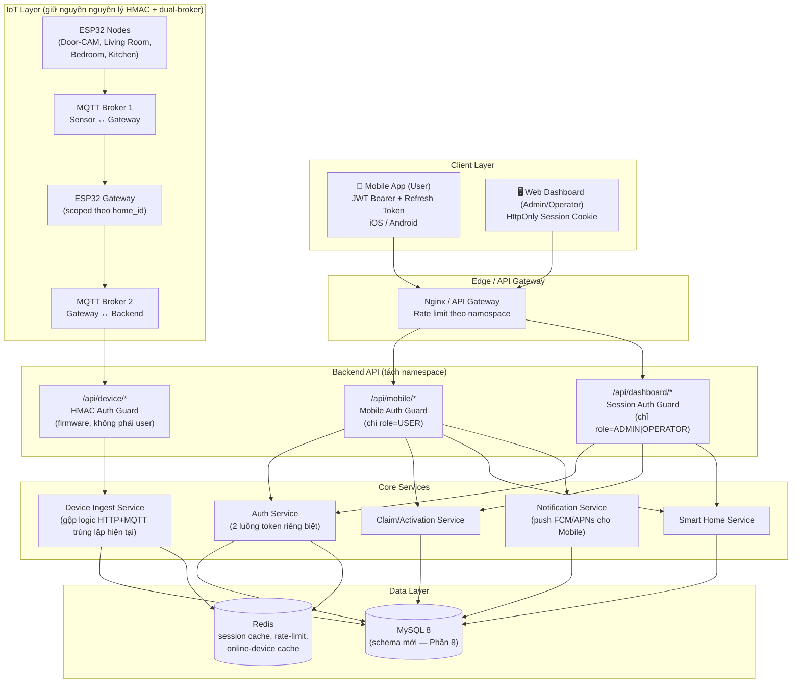

### 1.1. Nguyên tắc phân tách namespace API

- `/api/dashboard/**` — chỉ chấp nhận session cookie của user có `role_id ∈ {ADMIN, OPERATOR}`. Nếu một tài khoản `USER` cố đăng nhập endpoint này → trả `403 { error: "USE_MOBILE_APP" }`.
- `/api/mobile/**` — chỉ chấp nhận JWT Bearer của user có `role_id = USER`. Admin/Operator không có tài khoản dùng được namespace này (trừ trường hợp đặc biệt: Admin dùng **App nội bộ Operator** riêng — xem 13.2).
- `/api/device/**` — không đổi nguyên lý HMAC hiện tại, chỉ bổ sung scope theo `home_id`/`gateway_id` để vá lỗ hổng đã nêu trong `00_PROJECT_ANALYSIS_SMARTHOME.md` (mục 1.5.#1).

---

## 2. MÔ HÌNH ROLE

### 2.1. Role hệ thống (system-level) — quyết định "vào cửa nào"

| Role | Kênh truy cập | Sở hữu Smart Home? | Nhiệm vụ |
|---|---|---|---|
| **ADMIN** | Web Dashboard only | Không | Toàn quyền hệ thống: quản lý Operator, quản lý kho thiết bị, cấu hình firmware/OTA, xem toàn bộ audit log, xử lý escalation từ Operator |
| **OPERATOR** | Web Dashboard only | Không | Chuẩn bị thiết bị (nhập kho), khởi tạo Smart Home (unclaimed), cấu hình Gateway, hỗ trợ khách hàng (qua quyền truy cập có thời hạn), theo dõi trạng thái thiết bị, thực hiện OTA, xử lý cảnh báo/ticket bảo hành |
| **USER** | Mobile App only | Có (owner hoặc member) | Đăng ký/đăng nhập, claim Smart Home, điều khiển thiết bị, xem camera/sensor, automation, notification, quản lý thành viên gia đình, đổi tên phòng/thiết bị |

> **Ràng buộc cứng:** không tồn tại trạng thái nào mà một `USER` có session hợp lệ trên Web Dashboard, và không tồn tại trạng thái nào mà `ADMIN`/`OPERATOR` xuất hiện trong `smart_home_members` với vai trò sở hữu thực sự (Operator chỉ có bản ghi tạm thời trong `operator_home_access`, xem `00_PROJECT_ANALYSIS_SMARTHOME.md` mục 4.2.7).

### 2.2. Role trong 1 Smart Home (home-level) — xem Phần 7

`OWNER`, `CONTROLLER`, `VIEWER`, `GUEST` — độc lập hoàn toàn với role hệ thống, áp dụng cho từng thành viên trong `smart_home_members`.

---

## 3. GIẢI PHÁP LIÊN KẾT USER ↔ SMART HOME

Đây là quyết định kiến trúc quan trọng nhất của tài liệu này. So sánh 6 giải pháp:

| # | Giải pháp | Mô tả | Ưu điểm | Nhược điểm |
|---|---|---|---|---|
| 1 | **Serial Number + Gateway ID + Activation Code** (nhập tay) | Khách gõ tay mã in trên hộp | Không cần camera; hoạt động khi QR bị mờ/rách; hỗ trợ qua điện thoại được (đọc mã cho tổng đài) | Gõ sai nhiều (đặc biệt chuỗi dài); UX chậm; cần mã đủ dài để chống đoán → mâu thuẫn với "dễ gõ" |
| 2 | **QR Code** | App quét QR in trên hộp/gateway, QR chứa token đã ký | Nhanh, không gõ tay, chuẩn ngành (Tuya/Xiaomi/Aqara/SmartThings đều dùng QR chính); có thể nhúng entropy cao mà người dùng không cần đọc | Cần quyền camera; QR có thể hỏng vật lý (trầy, ướt); cần in ấn ở khâu đóng gói |
| 3 | **One-time Pairing Token qua BLE** (kiểu Matter/Google commissioning) | Gateway phát token ngắn hạn qua Bluetooth khi vào chế độ pairing | Bảo mật rất cao (cửa sổ hiệu lực ngắn, không cần in ấn); trải nghiệm hiện đại | Cần firmware hỗ trợ BLE (ESP32 hỗ trợ được nhưng codebase hiện tại **chưa có**); phức tạp hơn nhiều để triển khai; không phù hợp giai đoạn đầu sản phẩm |
| 4 | **Claim Device** (kiểu Chromecast — thiết bị tự quảng bá "chưa có chủ" trên mạng LAN, app đầu tiên yêu cầu sẽ được gán) | Không cần mã in sẵn, thiết bị tự "vẫy tay" khi chưa claim | Không cần chuẩn bị secret trước; đơn giản về in ấn | **Race condition**: ai trong cùng mạng LAN quét trước sẽ chiếm được nhà — rủi ro nghiêm trọng ở cửa hàng/kho bãi; không khớp với yêu cầu "Operator tạo Home trước khi bán" (không có "Home" nào tồn tại trước khi thiết bị online) |
| 5 | **Invitation** (mời qua email/số điện thoại) | Gửi lời mời tới tài khoản đã tồn tại để tham gia 1 Home đã có chủ | Hoàn hảo cho việc **thêm thành viên gia đình sau khi đã claim** | **Không áp dụng được cho lần claim đầu tiên** — trước khi mua hàng, không có tài khoản nào để "mời" gắn với chiếc hộp vật lý |
| 6 | **Activation Key** (mã dài in riêng trên tem, kiểu license key phần mềm) | Tương tự #1 nhưng tách biệt khỏi QR, thường in ở tem bảo hành | Có phương án dự phòng khi QR hỏng; cảm giác "chính hãng" giống license key | Nếu lộ mã trước khi bán (ví dụ ảnh chụp trong kho) → ai cũng claim được trước khách thật; cùng vấn đề UX gõ tay như #1 |

### 3.1. Giải pháp được chọn: **Hybrid — QR Code (chính) + Activation Code dạng người-đọc-được (dự phòng)**

**Lý do lựa chọn:**

1. **Đây chính xác là cách Tuya, Xiaomi Home, Aqara, SmartThings đều làm** — không có nền tảng lớn nào chỉ dùng 1 phương thức duy nhất. QR là đường chính (UX nhanh nhất, entropy cao ẩn trong token không cần người dùng đọc), Activation Code người-đọc-được (dạng `XXXX-XXXX-XXXX`, Base32 loại bỏ ký tự dễ nhầm như `0/O`, `1/I`) là **đường dự phòng bắt buộc phải có** cho các tình huống: QR hỏng, không có camera, khách gọi tổng đài nhờ nhân viên (Operator) claim hộ.
2. **Không dùng Claim Device thuần** vì mô hình nghiệp vụ yêu cầu **Operator tạo Smart Home TRƯỚC khi bán** (Bước 1-3 trong Activation Flow) — nghĩa là bản ghi `smart_homes` và `gateways` đã tồn tại ở trạng thái `unclaimed` từ trước, activation code/QR chỉ là **chìa khoá để "mở khoá" bản ghi đã có sẵn**, không phải cơ chế "thiết bị tự quảng bá tìm chủ". Claim Device phù hợp hơn cho các thiết bị rời không qua khâu Operator tạo trước (không phải trường hợp của chúng ta).
3. **Không dùng BLE one-time token** ở giai đoạn hiện tại vì firmware ESP32 hiện tại (`firmware/gateway-node/src/main.cpp`) chưa có bất kỳ code BLE nào — đầu tư BLE commissioning là hợp lý cho **roadmap dài hạn khi hướng tới chuẩn Matter** (ghi chú ở Phần 17), không phải yêu cầu MVP.
4. **Invitation được dùng riêng cho luồng khác** — thêm thành viên gia đình sau khi Home đã có chủ (Phần 7), không lẫn với luồng claim đầu tiên.
5. **Activation Key** (in riêng ngoài QR) được tích hợp làm **một phần của Activation Code dự phòng ở #1**, không cần tách thành cơ chế thứ 3 riêng biệt — tránh có quá nhiều loại mã khác nhau in trên cùng 1 hộp gây rối cho khách hàng.

**QR Code chứa gì?** Không chứa `gateway_secret`. QR chỉ encode:
```json
{ "t": "activation", "home_id": "HM-00123", "code_ref": "AC-9F3D2E", "v": 1 }
```
kèm chữ ký (JWS/HMAC) để chống giả mạo QR — app gửi nguyên payload này lên backend, backend tự tra `activation_tokens` bằng `code_ref` (không tin dữ liệu QR để quyết định quyền, chỉ dùng để tra cứu + chống giả mạo hình thức).

---

## 4. BUSINESS FLOW — QUY TRÌNH BÁN HÀNG TỔNG THỂ

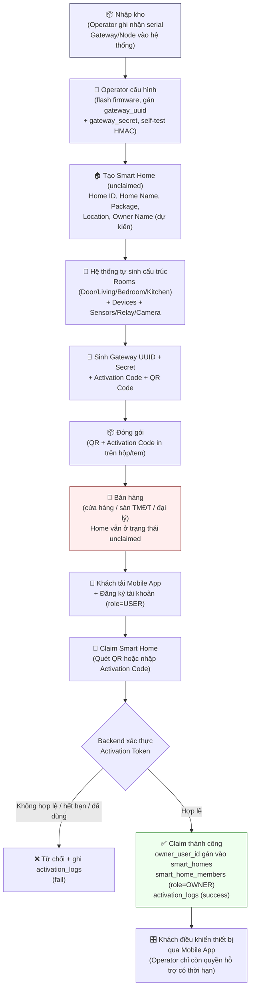

### 4.1. Ví dụ cụ thể: Smart Home Kit A

| Thành phần | Số lượng | Vai trò |
|---|---|---|
| ESP32 Gateway | 1 | Cầu nối MQTT nội bộ ↔ backend |
| Door ESP32-CAM Node | 1 | Camera cửa chính + cảm biến chuyển động |
| Living Room Node | 1 | Cảm biến nhiệt độ/độ ẩm/ánh sáng + relay đèn/quạt |
| Bedroom Node | 1 | Cảm biến + relay đèn |
| Kitchen Node | 1 | Cảm biến nhiệt độ/gas + relay |

Operator chuẩn bị **toàn bộ 5 thiết bị vật lý này thành 1 kit đóng gói sẵn**, gắn với đúng 1 bản ghi `smart_homes` (`package_code = 'KIT_A'`) — khách hàng mua nguyên kit, không mua thiết bị lẻ ở giai đoạn ra mắt sản phẩm đầu tiên (mua lẻ mở rộng phòng là tính năng Phase sau, xem Phần 18).

---

## 5. ACTIVATION FLOW CHI TIẾT

### 5.1. Sáu bước theo đúng yêu cầu nghiệp vụ

**Bước 1 — Operator tạo Smart Home trên Dashboard**
Nhập: `Home Name` (tạm, khách có thể đổi sau khi claim), `Owner Name` (dự kiến — chỉ mang tính ghi chú nội bộ, KHÔNG tạo tài khoản), `Package` (KIT_A/KIT_B/...), `Location` (kho hoặc địa chỉ dự kiến lắp đặt). Hệ thống sinh `home_id`, trạng thái `status = 'unclaimed'`.

**Bước 2 — Hệ thống tự sinh cấu trúc**
Transaction 1 lần: sinh `rooms` (Door, Living Room, Bedroom, Kitchen theo `package.template`) + `devices` tương ứng (Gateway không thuộc room nào, các Node gán vào đúng room) + `device_sensors`/`cameras` theo `device_types.capabilities`.

**Bước 3 — Gán Gateway**
`gateway_uuid` (sinh ngẫu nhiên, không đoán được — UUIDv4 hoặc ULID), `gateway_secret` (32 byte random, **chỉ lưu hash**, bản plaintext được Operator flash trực tiếp vào firmware qua cổng USB/local tại kho — không bao giờ đi qua bất kỳ API nào ngoài thao tác flash nội bộ), `activation_code` (xem 5.2), `qr_code` (payload đã ký, xem 3.1).

**Bước 4 — Khách hàng mua hàng**
Khách mua kit tại cửa hàng/sàn TMĐT → tải Mobile App → `POST /api/mobile/auth/register` (email/phone + OTP hoặc password) → tài khoản mới `role=USER`, chưa sở hữu Home nào (`status = pending_first_home`).

**Bước 5 — Khách chọn "Thêm Smart Home"**
App hiển thị 2 lựa chọn: **Quét QR Code** (camera, mặc định) hoặc **Nhập Activation Code** (bàn phím, dự phòng). Gửi `POST /api/mobile/claim-home`.

**Bước 6 — Backend kiểm tra & Claim**
Kiểm tra theo đúng thứ tự (fail-fast, mỗi bước ghi `activation_logs`):
1. `activation_tokens` tồn tại theo `code_ref`?
2. Token chưa `used_at`, chưa `revoked_at`?
3. `expires_at > NOW()`?
4. `gateway_id`/`home_id` tương ứng còn ở trạng thái `unclaimed`?
5. Rate-limit theo tài khoản & theo IP chưa vượt ngưỡng?

Nếu **hợp lệ** → transaction:
```
UPDATE smart_homes SET owner_user_id=:user_id, status='active' WHERE id=:home_id;
INSERT INTO smart_home_members (home_id, user_id, member_role='OWNER');
UPDATE activation_tokens SET used_at=NOW(), used_by_user_id=:user_id WHERE id=:token_id;
INSERT INTO activation_logs (..., result='SUCCESS');
```
Nếu **không hợp lệ** → trả lỗi cụ thể (`EXPIRED`/`ALREADY_USED`/`NOT_FOUND`/`RATE_LIMITED`) + `INSERT INTO activation_logs (..., result='FAILED', reason=...)`.

### 5.2. Đặc tả bảo mật Activation Code

| Thuộc tính | Giá trị |
|---|---|
| Độ dài & bảng chữ | 12 ký tự Base32 (Crockford, loại bỏ `0/O/1/I/L`), hiển thị dạng `XXXX-XXXX-XXXX` |
| Entropy | ~60 bit — đủ chống brute-force khi kết hợp rate-limit |
| Lưu trữ | **Chỉ lưu SHA-256 hash** trong `activation_tokens.code_hash`, không lưu plaintext |
| Số lần dùng | 1 lần duy nhất (`used_at` không null → luôn từ chối) |
| Hạn sử dụng | Mặc định 180 ngày kể từ khi sinh (đủ thời gian tồn kho + vận chuyển + bán lẻ; cấu hình được theo `package`) |
| Thu hồi | Admin/Operator có thể `revoke` thủ công (ví dụ hộp bị lỗi, thu hồi trước khi bán) |
| Rate limit | Tối đa 5 lần thử/mã/giờ, 20 lần thử/tài khoản/ngày — vượt ngưỡng → khoá tạm 15 phút + cảnh báo `security_logs` |
| Log | **100% lượt thử (thành công & thất bại) đều ghi `activation_logs`** kèm `ip_address`, `device_fingerprint`, `user_id` (nếu đã đăng nhập), `result`, `reason` |

### 5.3. Gateway Secret — không bao giờ tới Mobile

`gateway_secret` plaintext **chỉ tồn tại trong bộ nhớ tạm lúc Operator flash firmware tại kho** (qua công cụ nội bộ, không qua API công khai) và trong firmware của chính thiết bị. Từ thời điểm đó, backend **chỉ lưu hash** (`gateway_secret_hash`), dùng để verify HMAC (giống cơ chế hiện tại của `verifyGatewayHMAC`, chỉ khác là so sánh phải chuyển sang có thể verify từ hash — thực tế cơ chế HMAC hiện tại cần secret dạng plaintext để tính `HMAC(secret, message)`; do đó **backend vẫn cần lưu secret dạng mã hoá có thể giải mã được (encrypted-at-rest bằng KMS/Vault), không phải hash một chiều**, khác với `password_hash` của user). Điểm mấu chốt cần đảm bảo: **API không có bất kỳ endpoint nào trả `gateway_secret` (dù plaintext hay encrypted) cho Mobile App** — đây là khác biệt so với thiết kế hiện tại nơi `POST /api/devices/register` trả `secret_key` thẳng về response cho client gọi API.

---

## 6. SEQUENCE DIAGRAMS

### 6.1. Claim Smart Home (chi tiết đầy đủ)

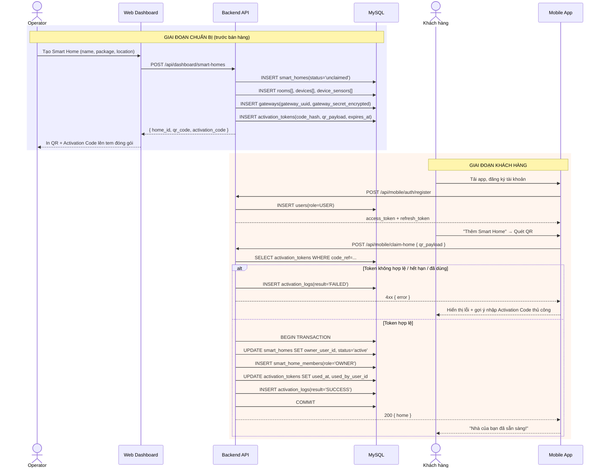

### 6.2. Đăng nhập — hai luồng auth tách biệt

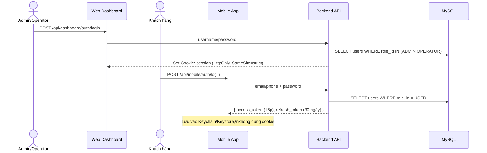

### 6.3. Mời thành viên gia đình

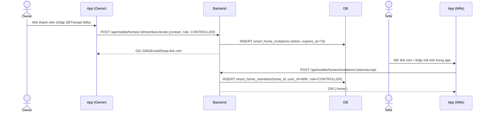

---

## 7. MULTI-USER / HOME MEMBERS & PERMISSION

### 7.1. Bốn cấp quyền trong 1 Smart Home

| Role trong Home | Ai thường dùng | Điều khiển thiết bị | Xem Camera | Xem Sensor | Automation | Mời/Xoá thành viên | Đổi tên phòng/thiết bị | Xoá nhà / Chuyển quyền sở hữu |
|---|---|:---:|:---:|:---:|:---:|:---:|:---:|:---:|
| **OWNER** | Chủ hộ | ✅ | ✅ | ✅ | ✅ tạo/sửa/xoá | ✅ | ✅ | ✅ |
| **CONTROLLER** | Vợ/chồng, thành viên tin cậy | ✅ | ✅ | ✅ | ✅ tạo/sửa (không xoá rule người khác tạo) | ❌ | ✅ | ❌ |
| **VIEWER** | Ông bà, người thân ở xa | ❌ (chỉ xem) | ✅ | ✅ | ❌ (chỉ xem) | ❌ | ❌ | ❌ |
| **GUEST** | Người giúp việc, khách tạm | ⚠️ chỉ thiết bị/phòng được chỉ định, có `expires_at` | ⚠️ theo cấu hình | ❌ | ❌ | ❌ | ❌ | ❌ |

Ví dụ theo đúng mô tả nghiệp vụ: `Owner → Invite → Wife (CONTROLLER) / Child (VIEWER hoặc CONTROLLER giới hạn phòng riêng) / Parent (VIEWER)`.

### 7.2. Nguyên tắc thực thi

- `GUEST` bắt buộc có `expires_at` — hết hạn tự động bị vô hiệu hoá (phù hợp use-case cho thuê ngắn hạn/Airbnb trong tương lai).
- Chỉ `OWNER` có quyền **Invite/Remove member**, **Transfer Ownership**, **Delete Home**, **Replace Gateway**.
- Mọi thay đổi thành viên đều ghi `activity_logs`/`audit_logs` (ai mời ai, khi nào, role gì).

---

## 8. DATABASE

### 8.1. ERD tổng quan

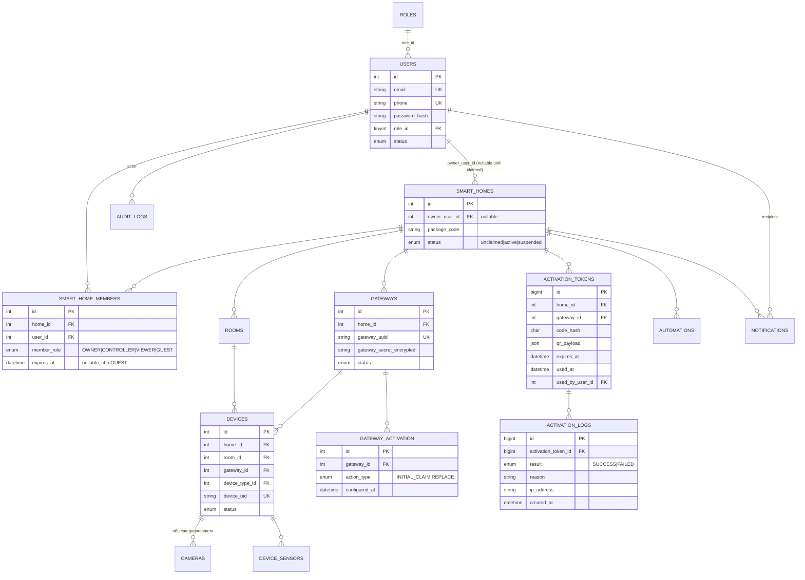

### 8.2. Chi tiết bảng mới / thay đổi trọng yếu

> Các bảng `rooms`, `device_types`, `sensor_types`, `device_sensors`, `telemetry`, `alerts`, `automation_history`, `firmware`, `ota_history` giữ nguyên thiết kế đã đặc tả tại `00_PROJECT_ANALYSIS_SMARTHOME.md` Phần 4.2 — không lặp lại ở đây. Phần dưới chỉ đặc tả các bảng **mới hoặc thay đổi cấu trúc** phục vụ mô hình Claim/Activation & Mobile-only.

#### `roles`
| Cột | Kiểu | Ràng buộc | Mô tả |
|---|---|---|---|
| id | TINYINT UNSIGNED | PK | |
| code | VARCHAR(32) | UNIQUE | `ADMIN`, `OPERATOR`, `USER` |
| channel | ENUM('dashboard','mobile') | NOT NULL | **Cột quyết định kênh truy cập** — `ADMIN`/`OPERATOR` → `dashboard`; `USER` → `mobile`. Middleware auth đọc cột này để chặn cross-channel login. |

#### `users`
| Cột | Kiểu | Ràng buộc | Mô tả |
|---|---|---|---|
| id | INT UNSIGNED | PK | |
| email | VARCHAR(190) | UNIQUE NULL | Bắt buộc với Admin/Operator; tuỳ chọn với User nếu dùng phone |
| phone | VARCHAR(20) | UNIQUE NULL | Bắt buộc với User (kênh OTP chính) |
| password_hash | VARCHAR(255) | NOT NULL | |
| role_id | TINYINT UNSIGNED | FK → roles.id | |
| status | ENUM('pending_verification','active','suspended') | DEFAULT 'pending_verification' | |
| created_at | DATETIME | DEFAULT CURRENT_TIMESTAMP | |

#### `smart_homes`
| Cột | Kiểu | Ràng buộc | Mô tả |
|---|---|---|---|
| id | INT UNSIGNED | PK | |
| owner_user_id | INT UNSIGNED | NULL, FK → users.id | **NULL cho tới khi được claim** — khác thiết kế trước (luôn có owner ngay khi tạo) |
| name | VARCHAR(128) | NOT NULL | Đặt tạm bởi Operator, khách đổi lại sau khi claim |
| package_code | VARCHAR(32) | NOT NULL | `KIT_A`, `KIT_B`... |
| location_prepared | VARCHAR(255) | NULL | Địa chỉ dự kiến lúc Operator tạo (thông tin nội bộ) |
| address_confirmed | VARCHAR(255) | NULL | Địa chỉ khách xác nhận sau khi claim |
| status | ENUM('unclaimed','active','suspended') | DEFAULT 'unclaimed' | |
| created_by | INT UNSIGNED | FK → users.id (Operator) | |
| claimed_at | DATETIME | NULL | |

**Index:** KEY(`status`), KEY(`owner_user_id`).

#### `smart_home_members`
| Cột | Kiểu | Ràng buộc | Mô tả |
|---|---|---|---|
| id | INT UNSIGNED | PK | |
| home_id | INT UNSIGNED | FK → smart_homes.id | |
| user_id | INT UNSIGNED | FK → users.id | |
| member_role | ENUM('OWNER','CONTROLLER','VIEWER','GUEST') | NOT NULL | |
| invited_by | INT UNSIGNED | NULL, FK → users.id | |
| expires_at | DATETIME | NULL | Bắt buộc với `GUEST` |
| created_at | DATETIME | DEFAULT CURRENT_TIMESTAMP | |

**Index:** UNIQUE(`home_id`,`user_id`).

#### `gateways`
| Cột | Kiểu | Ràng buộc | Mô tả |
|---|---|---|---|
| id | INT UNSIGNED | PK | |
| home_id | INT UNSIGNED | FK → smart_homes.id | |
| gateway_uuid | CHAR(36) | UNIQUE | |
| gateway_secret_encrypted | VARBINARY(512) | NOT NULL | Mã hoá bằng KMS/Vault, **không phải hash 1 chiều** (cần giải mã để tính HMAC) |
| status | ENUM('provisioning','unclaimed','active','blocked','retired') | DEFAULT 'provisioning' | `retired` dùng cho flow thay thế Gateway (Phần 15) |
| last_seen, last_ip, fail_count | ... | như thiết kế trước | |

#### `gateway_activation` *(lịch sử cấu hình vật lý — khác `activation_tokens`)*
| Cột | Kiểu | Ràng buộc | Mô tả |
|---|---|---|---|
| id | INT UNSIGNED | PK | |
| gateway_id | INT UNSIGNED | FK → gateways.id | |
| action_type | ENUM('INITIAL_PROVISION','REPLACE','FACTORY_RESET') | NOT NULL | |
| performed_by | INT UNSIGNED | FK → users.id (Operator) | |
| configured_at | DATETIME | DEFAULT CURRENT_TIMESTAMP | |
| notes | VARCHAR(255) | NULL | |

#### `activation_tokens` *(bảng lõi của cơ chế Claim)*
| Cột | Kiểu | Ràng buộc | Mô tả |
|---|---|---|---|
| id | BIGINT UNSIGNED | PK | |
| home_id | INT UNSIGNED | FK → smart_homes.id | |
| gateway_id | INT UNSIGNED | FK → gateways.id | |
| token_type | ENUM('INITIAL_CLAIM','GATEWAY_REPLACE','OWNERSHIP_TRANSFER') | NOT NULL | Dùng chung cơ chế cho cả 3 luồng (Phần 5, 15, 16) |
| code_hash | CHAR(64) | NOT NULL | SHA-256 của Activation Code |
| qr_payload | JSON | NOT NULL | Payload đã ký gửi trong QR |
| expires_at | DATETIME | NOT NULL | |
| used_at | DATETIME | NULL | |
| used_by_user_id | INT UNSIGNED | NULL, FK → users.id | |
| revoked_at | DATETIME | NULL | |
| created_by | INT UNSIGNED | FK → users.id (Operator/Admin) | |

**Index:** UNIQUE(`code_hash`), KEY(`home_id`,`token_type`), KEY(`expires_at`).

#### `activation_logs`
| Cột | Kiểu | Ràng buộc | Mô tả |
|---|---|---|---|
| id | BIGINT UNSIGNED | PK | |
| activation_token_id | BIGINT UNSIGNED | NULL, FK → activation_tokens.id | Null nếu mã không tồn tại (log cả trường hợp mã không có thật) |
| attempted_code_hash | CHAR(64) | NULL | Hash của mã được nhập, kể cả khi sai, để phát hiện tấn công dò mã |
| result | ENUM('SUCCESS','FAILED') | NOT NULL | |
| reason | VARCHAR(64) | NULL | `EXPIRED`, `ALREADY_USED`, `NOT_FOUND`, `RATE_LIMITED`, `REVOKED` |
| user_id | INT UNSIGNED | NULL, FK → users.id | |
| ip_address | VARCHAR(45) | NULL | |
| device_fingerprint | VARCHAR(128) | NULL | |
| created_at | DATETIME | DEFAULT CURRENT_TIMESTAMP | |

**Index:** KEY(`activation_token_id`), KEY(`ip_address`,`created_at`), KEY(`result`,`created_at`) — phục vụ phát hiện brute-force theo IP.

#### `cameras` *(mở rộng riêng cho `devices.category='camera'`)*
| Cột | Kiểu | Ràng buộc | Mô tả |
|---|---|---|---|
| id | INT UNSIGNED | PK | |
| device_id | INT UNSIGNED | UNIQUE, FK → devices.id | |
| stream_url | VARCHAR(512) | NULL | RTSP/HLS nội bộ hoặc qua relay cloud |
| resolution | VARCHAR(16) | NULL | |
| motion_detection_enabled | TINYINT(1) | DEFAULT 1 | |
| last_snapshot_url | VARCHAR(512) | NULL | |

#### `automations` *(đổi tên từ `automation_rules` cho ngắn gọn, giữ nguyên cấu trúc)*
Xem `00_PROJECT_ANALYSIS_SMARTHOME.md` mục 4.2.18 — không đổi.

#### `notifications`
Giữ nguyên thiết kế đã sửa ở tài liệu trước (`user_id` thay vì `target_role` cứng) — bổ sung cột `channel ENUM('push','in_app')` và `push_token_snapshot` để phục vụ gửi qua FCM/APNs.

#### `audit_logs` *(hành động quản trị — khác `activation_logs` và `security_logs`)*
| Cột | Kiểu | Ràng buộc | Mô tả |
|---|---|---|---|
| id | BIGINT UNSIGNED | PK | |
| actor_user_id | INT UNSIGNED | FK → users.id | Admin/Operator/Owner thực hiện hành động |
| action | VARCHAR(64) | NOT NULL | `HOME_CREATED`, `MEMBER_INVITED`, `GATEWAY_REPLACED`, `OWNERSHIP_TRANSFERRED`, `HOME_RESET` |
| target_type | VARCHAR(32) | NOT NULL | `smart_home`, `gateway`, `device`, `member` |
| target_id | INT UNSIGNED | NOT NULL | |
| meta | JSON | NULL | |
| created_at | DATETIME | DEFAULT CURRENT_TIMESTAMP | |

---

## 9. API

### 9.1. Namespace `/api/mobile/**` (JWT Bearer — chỉ role USER)

| Method | Endpoint | Mô tả |
|---|---|---|
| POST | `/api/mobile/auth/register` | Đăng ký tài khoản khách hàng |
| POST | `/api/mobile/auth/login` | Đăng nhập, trả access + refresh token |
| POST | `/api/mobile/auth/refresh` | Làm mới access token |
| POST | `/api/mobile/auth/logout` | Thu hồi refresh token |
| POST | `/api/mobile/claim-home` | Claim bằng QR hoặc Activation Code (Bước 5-6) |
| POST | `/api/mobile/scan-qr` | (tuỳ chọn) decode/validate QR phía server trước khi claim thật, dùng để hiển thị preview "Bạn sắp thêm nhà: ..." trước khi xác nhận |
| POST | `/api/mobile/activate` | Xác nhận claim sau preview (tách bước preview/confirm cho UX an toàn hơn) |
| GET | `/api/mobile/my-homes` | Danh sách nhà user sở hữu/tham gia |
| GET | `/api/mobile/homes/:id` | Chi tiết 1 nhà (chỉ nếu là thành viên) |
| GET | `/api/mobile/homes/:id/rooms` | |
| GET | `/api/mobile/homes/:id/devices` | |
| PATCH | `/api/mobile/devices/:id` | Đổi tên thiết bị |
| PATCH | `/api/mobile/rooms/:id` | Đổi tên phòng |
| POST | `/api/mobile/devices/:id/commands` | Điều khiển relay/camera snapshot |
| GET | `/api/mobile/devices/:id/telemetry` | Lịch sử sensor |
| GET | `/api/mobile/devices/:id/camera/stream` | Lấy link stream camera |
| GET/POST/PATCH/DELETE | `/api/mobile/homes/:id/automations` | |
| GET/PATCH | `/api/mobile/notifications` | |
| POST | `/api/mobile/homes/:id/members/invite` | Mời thành viên |
| DELETE | `/api/mobile/homes/:id/members/:memberId` | Xoá thành viên |
| POST | `/api/mobile/homes/:id/transfer-ownership` | Khởi tạo chuyển nhượng (Phần 16) |
| POST | `/api/mobile/homes/:id/replace-gateway` | Khởi tạo thay Gateway (Phần 15) |
| GET/PATCH | `/api/mobile/profile` | |

### 9.2. Namespace `/api/dashboard/**` (Session cookie — chỉ ADMIN/OPERATOR)

| Method | Endpoint | Role | Mô tả |
|---|---|---|---|
| POST | `/api/dashboard/auth/login` | Public (chỉ chấp nhận role dashboard) | |
| POST | `/api/dashboard/smart-homes` | OPERATOR, ADMIN | Tạo Home unclaimed (Bước 1) |
| GET | `/api/dashboard/smart-homes` | ADMIN (tất cả) / OPERATOR (được cấp quyền + unclaimed đang xử lý) | |
| POST | `/api/dashboard/smart-homes/:id/generate-activation` | OPERATOR, ADMIN | Sinh QR/Activation Code (Bước 3) |
| POST | `/api/dashboard/gateways/:id/provision` | OPERATOR | Ghi nhận đã flash firmware xong |
| POST | `/api/dashboard/gateways/:id/replace` | OPERATOR (có ticket), ADMIN | Sinh token thay thế Gateway |
| GET | `/api/dashboard/devices` | ADMIN (toàn hệ thống), OPERATOR (được cấp quyền) | Fleet monitoring |
| POST | `/api/dashboard/firmware` | ADMIN | |
| POST | `/api/dashboard/devices/:id/ota` | ADMIN, OPERATOR (được cấp quyền) | |
| GET | `/api/dashboard/activation-logs` | ADMIN | Điều tra gian lận kích hoạt |
| GET | `/api/dashboard/audit-logs` | ADMIN | |
| POST | `/api/dashboard/operator-access` | ADMIN | Cấp quyền hỗ trợ có thời hạn cho Operator |
| POST | `/api/dashboard/support-tickets/:id/warranty` | OPERATOR, ADMIN | Khởi tạo RMA (Phần 14) |

### 9.3. Namespace `/api/device/**` (HMAC — firmware, không đổi nguyên lý)

Giữ nguyên `/api/device/data`, nhưng `/api/device/sensors` (endpoint hiện đang rò rỉ toàn hệ thống) được thay bằng `/api/device/gateways/:gateway_uuid/whitelist` — **chỉ trả danh sách thiết bị thuộc đúng `home_id` của gateway đó**, vá triệt để lỗ hổng đã nêu ở `00_PROJECT_ANALYSIS_SMARTHOME.md` mục 1.5.#1.

---

## 10. SECURITY

| Hạng mục | Chính sách |
|---|---|
| Activation Code | 1 lần dùng, hết hạn 180 ngày, hash SHA-256, rate-limit 5/mã/giờ + 20/tài khoản/ngày, log toàn bộ (Phần 5.2) |
| QR payload | Ký (HMAC/JWS) chống giả mạo hình thức; backend không tin nội dung QR để quyết định quyền — chỉ dùng để tra `code_ref` |
| Gateway Secret | Không bao giờ trả về Mobile App qua bất kỳ endpoint nào; mã hoá at-rest (KMS/Vault); chỉ Operator thao tác trực tiếp lúc flash firmware tại kho |
| Mobile Auth | JWT access token 15 phút + refresh token 30 ngày (rotate mỗi lần dùng, phát hiện reuse → thu hồi toàn bộ session) |
| Dashboard Auth | HttpOnly cookie, SameSite=strict, giữ nguyên cơ chế hiện tại |
| Cross-channel protection | Middleware kiểm tra `roles.channel` — tài khoản `USER` gọi `/api/dashboard/**` → 403; tài khoản `ADMIN/OPERATOR` gọi `/api/mobile/**` → 403 |
| Operator quyền hạn | Không có quyền mặc định trên Home đã claim — chỉ qua `operator_home_access` có `expires_at` + `reason` bắt buộc, mọi hành động ghi `audit_logs` |
| MQTT | Topic namespace theo `home/{home_id}/gateway/{gateway_uuid}/...`; broker cần ACL theo home (kế thừa khuyến nghị `00_PROJECT_ANALYSIS_SMARTHOME.md` mục 4.4, điểm 5) |
| Ownership Transfer / Gateway Replace | Dùng lại cơ chế `activation_tokens` (khác `token_type`) — cùng chuẩn bảo mật: 1 lần dùng, hết hạn ngắn hơn (7 ngày), log đầy đủ |

---

## 11. RBAC ĐẦY ĐỦ

### 11.1. Ma trận kết hợp Role hệ thống × Role trong Home

| Hành động | ADMIN | OPERATOR (có access) | OWNER | CONTROLLER | VIEWER | GUEST |
|---|:---:|:---:|:---:|:---:|:---:|:---:|
| Tạo Smart Home (unclaimed) | ✅ | ✅ | ❌ | ❌ | ❌ | ❌ |
| Claim Smart Home | ❌ (không có tài khoản mobile) | ❌ | ✅ (chính mình) | — | — | — |
| Điều khiển relay/thiết bị | ✅ (debug, có audit) | ❌ | ✅ | ✅ | ❌ | ⚠️ giới hạn |
| Xem Camera | ✅ (cần lý do, audit) | ⚠️ cần khách đồng ý tường minh | ✅ | ✅ | ✅ | ⚠️ theo cấu hình |
| Mời/Xoá thành viên | ❌ | ❌ | ✅ | ❌ | ❌ | ❌ |
| Chuyển quyền sở hữu | ❌ (chỉ hỗ trợ tình huống đặc biệt qua ticket) | ❌ | ✅ | ❌ | ❌ | ❌ |
| Thay thế Gateway | ✅ | ✅ (thực hiện hộ, cần Owner xác nhận trong app) | ✅ (xác nhận) | ❌ | ❌ | ❌ |
| Xem OTA/Firmware | ✅ | ✅ | ❌ | ❌ | ❌ | ❌ |
| Xem Activation/Audit Logs | ✅ | ⚠️ phạm vi được cấp | ❌ | ❌ | ❌ | ❌ |

---

## 12. MOBILE APP FLOW

### 12.1. Information Architecture

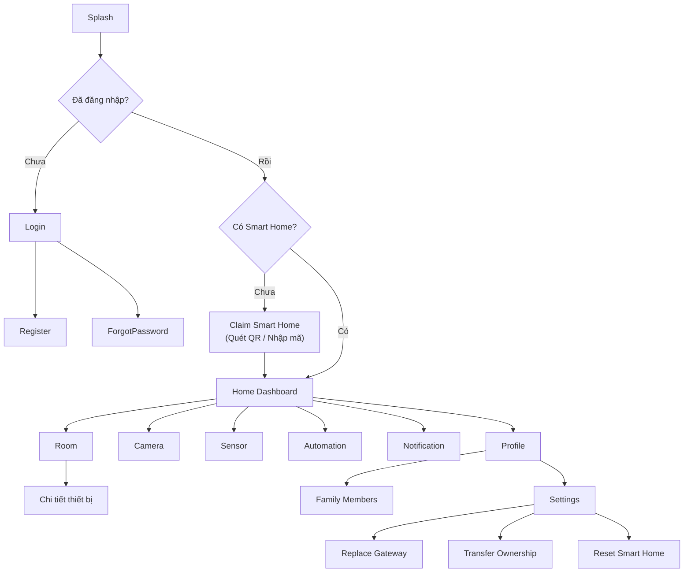

### 12.2. Danh sách màn hình chính

| Màn hình | Nội dung |
|---|---|
| Login / Register | Email hoặc SĐT + OTP, hoặc password |
| Claim Smart Home | Quét QR (camera) hoặc nhập Activation Code, có bước "Preview" trước khi xác nhận claim |
| Home Dashboard | Trạng thái tổng quan nhà đang chọn (chuyển đổi nếu có nhiều nhà) |
| Room | Danh sách phòng → danh sách thiết bị trong phòng |
| Camera | Xem trực tiếp Door Camera + lịch sử chuyển động |
| Sensor | Biểu đồ nhiệt độ/độ ẩm/gas theo thời gian |
| Automation | Tạo/sửa/xoá kịch bản tự động |
| Notification | Trung tâm thông báo (push + in-app) |
| Family Members | Danh sách thành viên + mời/xoá + đổi role |
| Profile | Thông tin cá nhân, đổi mật khẩu |
| Settings | Replace Gateway, Transfer Ownership, Reset Home, Xoá tài khoản |

---

## 13. WEB DASHBOARD FLOW

### 13.1. Admin

```
Dashboard tổng quan hệ thống
├── Khách hàng (Customers) — danh sách, chi tiết
├── Smart Homes (toàn hệ thống, cả unclaimed lẫn active)
├── Kho thiết bị (Inventory) — nhập kho, gán serial
├── Fleet Devices (toàn bộ thiết bị)
├── Firmware & OTA
├── Users & Roles (quản lý Admin/Operator)
├── Operator Access Grants (cấp/thu hồi quyền hỗ trợ)
├── Activation Logs / Audit Logs / Security Logs
└── Cấu hình hệ thống
```

### 13.2. Operator

```
Dashboard hỗ trợ (ticket đang xử lý)
├── Chuẩn bị Kit (nhập kho, cấu hình Gateway, sinh QR/Activation Code)
├── Smart Homes đang unclaimed do mình tạo
├── Nhà được cấp quyền hỗ trợ (Assigned Homes, có expires_at)
├── Device Health (phạm vi được cấp quyền)
├── OTA (đẩy firmware)
└── Warranty / RMA Tickets
```

> **Không có bất kỳ menu "Customer View" hay "Login as User" nào trong Dashboard** — nếu Operator cần xem góc nhìn khách hàng để hỗ trợ, phải qua `operator_home_access` (có audit), hiển thị dữ liệu trong chính giao diện Operator, không giả lập đăng nhập vào tài khoản khách hàng.

---

## 14. QUY TRÌNH BẢO HÀNH

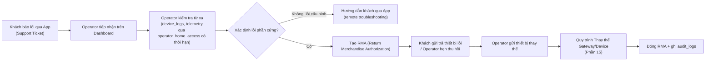

---

## 15. QUY TRÌNH THAY THẾ GATEWAY

Nguyên tắc cốt lõi: **danh tính của 1 Smart Home gắn với `smart_homes.id`, không gắn với Gateway vật lý** — vì vậy thay Gateway không được phép buộc khách phải claim lại từ đầu.

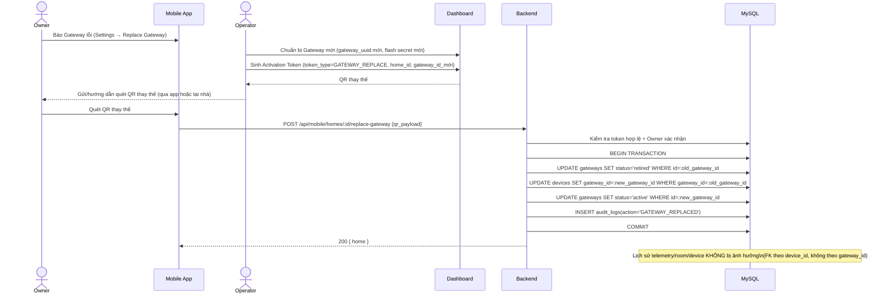

---

## 16. QUY TRÌNH RESET VÀ CHUYỂN QUYỀN SỞ HỮU SMART HOME

### 16.1. Factory Reset (Owner tự thực hiện hoặc Admin hỗ trợ trường hợp bất khả kháng)

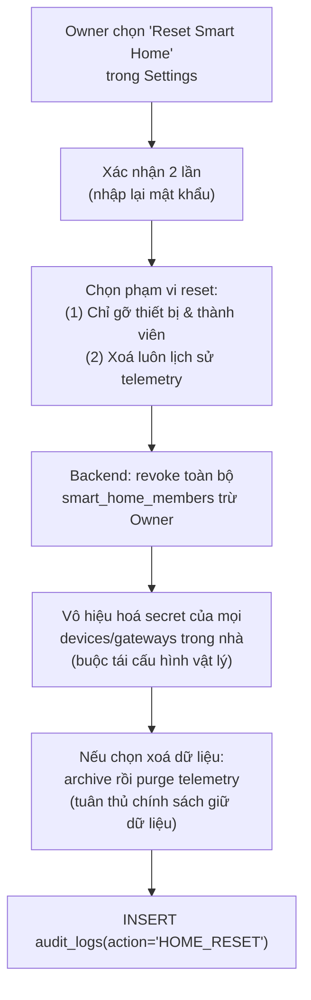

### 16.2. Ownership Transfer (bán nhà / tặng lại kit cho người khác)

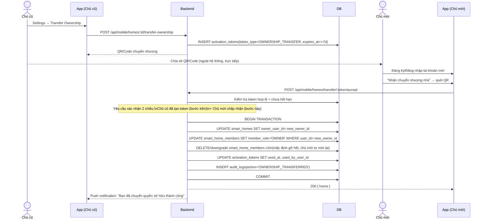

**Nguyên tắc an toàn:** mặc định sau khi chuyển nhượng, **toàn bộ thành viên cũ (kể cả chủ cũ) bị gỡ quyền truy cập** — chủ mới phải chủ động mời lại ai họ muốn giữ. Đây là default an toàn hơn (tránh chủ cũ vẫn xem được camera nhà đã bán), khác với hành vi "giữ nguyên danh sách" chỉ nên là tuỳ chọn rõ ràng chủ mới tự bật.

---

## 17. ĐÁNH GIÁ MỨC ĐỘ TRƯỞNG THÀNH SẢN PHẨM

### 17.1. Đối chiếu với chuẩn ngành

| Tiêu chí | Tuya / Xiaomi / Aqara / SmartThings | Thiết kế trong tài liệu này | Đánh giá |
|---|---|---|---|
| Tách biệt App khách hàng vs Dashboard vận hành | ✅ Có (App riêng cho end-user, admin portal riêng cho hãng/OEM) | ✅ Đã thiết kế đúng nguyên tắc này | **Đạt chuẩn** |
| Cơ chế Claim/Pairing QR + mã dự phòng | ✅ | ✅ (Phần 3, 5) | **Đạt chuẩn** |
| Multi-user / Family sharing với phân quyền | ✅ (Tuya: Owner/Member/Guest tương tự) | ✅ (Owner/Controller/Viewer/Guest) | **Đạt chuẩn** |
| Ownership transfer trong app | ✅ (Xiaomi Home, Aqara đều có) | ✅ (Phần 16) | **Đạt chuẩn** |
| Gateway/Hub thay thế không mất dữ liệu | ✅ | ✅ (Phần 15) | **Đạt chuẩn** |
| BLE/Matter commissioning | ✅ (các nền tảng lớn đang chuẩn hoá theo Matter) | ❌ Chưa có — dùng QR/Code thuần Wi-Fi provisioning | **Thiếu — roadmap dài hạn** |
| Local control khi mất Internet | ✅ (SmartThings, Home Assistant Cloud mạnh nhất ở điểm này) | ⚠️ Chưa thiết kế — hiện phụ thuộc hoàn toàn cloud backend | **Thiếu — rủi ro trải nghiệm khi mất mạng WAN** |
| End-to-end encryption cho camera stream | ✅ | ⚠️ Chưa đặc tả chi tiết (mới có `stream_url`, chưa có DRM/token ngắn hạn cho stream) | **Cần bổ sung ở Phase Camera** |
| Chuẩn hoá thiết bị bên thứ 3 (Matter/Zigbee) | ✅ (SmartThings, Home Assistant Cloud là chuẩn mở nhất) | ❌ Chỉ hỗ trợ thiết bị ESP32 tự phát triển | **Chấp nhận được ở giai đoạn đầu — là chiến lược "closed ecosystem" giống Xiaomi/Aqara ban đầu** |
| Cloud-to-cloud API cho tích hợp Google Home/Alexa | ✅ | ❌ Chưa có | **Thiếu — cần cho Phase mở rộng thị trường** |
| SLA/monitoring vận hành (uptime broker, backend) | ✅ | ⚠️ Chưa đặc tả (chưa có observability/alerting hạ tầng) | **Cần bổ sung trước khi scale thật** |

### 17.2. Kết luận

**Thiết kế trong tài liệu này đã đủ chuẩn để làm nền tảng phát triển MVP thương mại** cho một Smart Home Kit đóng gói sẵn, bán trực tiếp/qua đại lý, với mô hình sở hữu rõ ràng, RBAC đúng chuẩn ngành, và cơ chế claim an toàn tương đương Tuya/Xiaomi ở giai đoạn ra mắt đầu tiên (single-vendor hardware, chưa cần tương thích thiết bị bên thứ 3).

**Chưa đủ chuẩn để cạnh tranh trực tiếp với SmartThings/Home Assistant Cloud ở tính năng nâng cao** — cụ thể còn thiếu: (1) local control độc lập cloud, (2) chuẩn hoá Matter/BLE commissioning, (3) tích hợp trợ lý ảo bên thứ 3, (4) observability hạ tầng cấp production. Đây là các hạng mục **nên đưa vào roadmap Phase 2 sau khi MVP ổn định** (không chặn ra mắt sản phẩm đầu tiên), xem Phần 18.

---

## 18. GHI CHÚ TRIỂN KHAI / LIÊN KẾT ROADMAP

Tài liệu này **bổ sung** cho roadmap đã đề xuất tại `00_PROJECT_ANALYSIS_SMARTHOME.md` Phần 12, với thứ tự ưu tiên điều chỉnh:

1. **Trước Phase 3 (Smart Home Module) của roadmap cũ**, cần chèn thêm: thiết kế & triển khai `activation_tokens`/`activation_logs`/`gateway_activation`, tách namespace API `/api/mobile/**` vs `/api/dashboard/**`, đổi cơ chế auth Mobile sang JWT Bearer + refresh token (thay cookie hiện tại).
2. Phần 15 (Thay thế Gateway) và Phần 16 (Reset/Chuyển quyền) nên triển khai **cùng Phase 5 (Device Module)** vì dùng chung transaction pattern "reassign devices theo home/gateway".
3. Local control độc lập cloud, BLE/Matter commissioning, tích hợp Google Home/Alexa — đưa vào **Phase 11+ (ngoài phạm vi roadmap 10-phase hiện tại)**, chỉ nên đầu tư sau khi có đủ khách hàng để chứng minh nhu cầu thị trường.
