# 03_BACKEND_REFACTOR_SMARTHOME.md

> Kiến trúc Backend — từ **IoT Demo (Gateway → Device → Sensor → Dashboard)** sang **Commercial Smart Home Platform** vận hành hàng nghìn Smart Home.
> Vai trò biên soạn: Principal Software Architect / Senior Backend Engineer / IoT Solution Architect / Cloud Architect / Technical Lead.
> Tài liệu **chỉ thiết kế — không viết code, không sửa code**. Ràng buộc chặt với 3 tài liệu đã có trong repo — tài liệu này **không lặp lại toàn bộ chi tiết DB/RBAC/Provisioning** đã đặc tả ở đó mà **tham chiếu + bổ sung lớp Service/Module/API/Event Flow** còn thiếu:
> - [`00_PROJECT_ANALYSIS_SMARTHOME.md`](00_PROJECT_ANALYSIS_SMARTHOME.md) — schema DB đề xuất, RBAC 3 role, so sánh mô hình cũ/mới.
> - [`01_SMART_HOME_PRODUCT_ARCHITECTURE.md`](01_SMART_HOME_PRODUCT_ARCHITECTURE.md) — Claim/Activation flow, tách namespace API Mobile/Dashboard, RBAC theo Home.
> - [`02_SMART_HOME_WIFI_PROVISIONING.md`](02_SMART_HOME_WIFI_PROVISIONING.md) — Gateway/Node/Camera provisioning, Key Hierarchy, ESP-NOW/Local-AP topology.
> - [`05_FRONTEND_REFACTOR_SMARTHOME.md`](05_FRONTEND_REFACTOR_SMARTHOME.md) — IA/Dashboard Admin-Operator, để đối chiếu API nào Dashboard cần gọi.
>
> Toàn bộ source code backend thực tế đã được đọc: `backend/src/{app.ts,server.ts}`, `config/{db,env,migrate}.ts`, `middleware/{verifyJWT,rbac,validateDevice}.ts`, `routes/{index,auth,devices,data.routes,sensors.routes,dashboard,audit,users,notifications,health.routes}.ts`, `services/{hmacService,mqttDataService,mqttTracker,deviceStatus,notificationService,auditLogger}.ts`, `scripts/seed.ts`, `database/migrations/001_schema.sql`, `backend/package.json`.

---

## MỤC LỤC

0. [Tóm tắt điều hành](#0-tóm-tắt-điều-hành)
1. [Review Backend hiện tại](#1-review-backend-hiện-tại)
2. [Bảng tổng hợp vấn đề](#2-bảng-tổng-hợp-vấn-đề)
3. [Nguyên tắc kiến trúc mới](#3-nguyên-tắc-kiến-trúc-mới)
4. [Kiến trúc tổng thể & Module Diagram](#4-kiến-trúc-tổng-thể--module-diagram)
5. [Domain Design](#5-domain-design)
6. [Service Design — 22 module](#6-service-design--22-module)
7. [Authentication Design](#7-authentication-design)
8. [RBAC & Permission Matrix](#8-rbac--permission-matrix)
9. [API Design](#9-api-design)
10. [MQTT Topic Design](#10-mqtt-topic-design)
11. [OTA Design](#11-ota-design)
12. [Automation & Scene Design](#12-automation--scene-design)
13. [Notification Design](#13-notification-design)
14. [Logging Design](#14-logging-design)
15. [Monitoring Design](#15-monitoring-design)
16. [Event Flow / Sequence Diagrams](#16-event-flow--sequence-diagrams)
17. [Security Design](#17-security-design)
18. [AI-Ready Design](#18-ai-ready-design)
19. [Roadmap Refactor](#19-roadmap-refactor)

---

## 0. TÓM TẮT ĐIỀU HÀNH

Backend hiện tại (`backend/src/`, 22 file) là một **Express monolith không có kiến trúc lớp (layerless)**: route handler gọi thẳng `mysql2/promise` bằng raw SQL, không có Controller/Service/Repository/Domain Model tách biệt. Đây là điều chấp nhận được cho 1 đồ án 8 route module, nhưng **không thể mở rộng an toàn** cho nền tảng nhiều khách hàng vì:

1. **Không có ranh giới khách hàng (tenant isolation) ở bất kỳ tầng nào** — `GET /api/devices` trả toàn bộ thiết bị hệ thống, `GET /api/device/sensors` trả **secret_key của mọi sensor `active` trong toàn hệ thống** cho bất kỳ gateway nào xác thực HMAC hợp lệ (`sensors.routes.ts:24-26`) — lỗ hổng nghiêm trọng nhất, sẽ khai hoả ngay khi có khách hàng thứ hai.
2. **Không có module nào trong 22 module được yêu cầu** (Customer, Smart Home, Room, Provision, Activation, Pairing, Automation, Scene, Schedule, OTA, Firmware, Camera, Monitoring, AI) tồn tại trong code hiện tại — toàn bộ đều cần xây mới.
3. **Logic xác thực & ingest bị viết trùng lặp 2 lần độc lập** (`middleware/validateDevice.ts` và `services/mqttDataService.ts`) — tự nhận rủi ro drift trong comment nhưng chưa refactor thành 1 service dùng chung.
4. **`ws` là dependency chết** (khai báo trong `package.json:27` nhưng không có import nào trong toàn bộ `src/` — đã grep xác nhận) — không có kênh real-time (WebSocket/SSE) nào cho Dashboard, mọi cập nhật dựa vào SWR polling phía frontend.

Tài liệu này thiết kế lại backend theo **kiến trúc phân lớp (Layered/Clean Architecture) + Domain-Driven theo module nghiệp vụ**, giữ nguyên các nguyên lý bảo mật tốt đã có (HMAC 2 lớp, dual-broker MQTT, chống timing attack, chống replay, auto-block) nhưng tổ chức lại thành 22 service độc lập, tách namespace API theo kênh (`/dashboard`, `/mobile`, `/device`), và mở rộng MQTT/OTA/Automation/Monitoring/Logging còn thiếu hoàn toàn.

---

## 1. REVIEW BACKEND HIỆN TẠI

### 1.1. Project Structure & Folder Structure

```
backend/src/
├── app.ts                  Express app, middleware toàn cục, rate limiter
├── server.ts                Entry point, khởi động migration + MQTT services
├── config/{db,env,migrate}.ts
├── middleware/{verifyJWT,rbac,validateDevice}.ts
├── routes/                  9 route module — route = nơi chứa TOÀN BỘ logic nghiệp vụ
│   ├── auth.ts, devices.ts, data.routes.ts, sensors.routes.ts
│   ├── dashboard.ts, audit.ts, users.ts, notifications.ts, health.routes.ts
├── services/                 5 file — thực chất là "helper function", không phải service layer đúng nghĩa
│   ├── hmacService.ts, mqttDataService.ts, mqttTracker.ts
│   ├── deviceStatus.ts, notificationService.ts, auditLogger.ts
└── scripts/seed.ts
```

| Nhận xét | Đánh giá |
|---|---|
| Không có `controllers/` | Route handler **là** controller — trộn routing, validation, business logic, SQL query, response formatting trong cùng 1 hàm (ví dụ `devices.ts:17-87` dài 70 dòng làm cả 5 việc trên). |
| Không có `repositories/`/`models/`/`entities/` | Không có lớp trừu tượng hoá truy cập dữ liệu — mọi nơi tự viết `pool.execute(...)` với SQL string riêng, không có kiểu dữ liệu domain (`Device`, `User` chỉ là `any[]` từ kết quả query). |
| `services/` đặt sai tên | `hmacService.ts`, `auditLogger.ts` là utility function thuần tuý (đúng vai trò), nhưng `mqttDataService.ts` **vừa là network listener vừa là business logic ingest** — vi phạm Single Responsibility ngay trong tên gọi "service". |
| Không có `mqtt/`, `socket/`, `ota/`, `automation/`, `camera/` thư mục nào | Đúng như mục tiêu đề bài chỉ ra — các module này **chưa tồn tại**, không phải "cần refactor" mà là "cần xây mới hoàn toàn". |
| `dist/` được commit song song `src/` | Thư mục build (`backend/dist/`) tồn tại cùng cấp — cần xác nhận `.gitignore` loại trừ, tránh lệch code build/nguồn khi review. |

### 1.2. Layer Architecture

**Không có kiến trúc phân lớp.** Luồng thực thi mọi request hiện tại:

```
Request → Express Router → [validate inline] → pool.execute(raw SQL) → [format response inline] → Response
```

Không có tầng nào đứng giữa Router và Database Driver. Hệ quả trực tiếp:
- **Không test được business logic độc lập với HTTP/DB** — muốn unit test "logic khoá thiết bị sau 5 lần thất bại" phải mock toàn bộ Express request/response và MySQL pool cùng lúc.
- **Không tái sử dụng được logic giữa HTTP và MQTT** — chính vì không có Service layer nên `validateDevice.ts` (HTTP) và `mqttDataService.ts` (MQTT) phải **copy y hệt** toàn bộ khối "verify gateway → verify sensor → check type → check status → insert → prune → update last_seen" (so sánh `data.routes.ts:31-119` với `mqttDataService.ts:84-148` — logic giống nhau ~90%, khác nhau chỉ ở cách log lỗi).

### 1.3. Dependency

| Vấn đề | Chi tiết |
|---|---|
| Không có ORM/Query Builder | `mysql2/promise` thuần — mọi route tự viết SQL, không có migration schema versioning ngoài 1 mảng `migrations[]` chạy tuần tự thủ công (`config/migrate.ts`) — chấp nhận được ở quy mô nhỏ, **không đủ an toàn** khi 20+ bảng mới cần thêm theo mô hình Home/Room. |
| `pool` được import trực tiếp ở **10/10 route+service file** | Không có Dependency Injection — mọi module phụ thuộc cứng vào `config/db.ts` singleton, không thể inject mock/test double, không thể có multi-database (ví dụ tách riêng DB Telemetry sau này). |
| `ws` khai báo nhưng không dùng | Xác nhận bằng grep toàn bộ `backend/src` — không có `import ... from "ws"` nào. Dependency chết, cần loại bỏ hoặc dùng thật cho real-time (Phần 15/16). |
| `uuid` khai báo nhưng không thấy dùng trong các file đã đọc | Cùng nhóm dependency có khả năng chết — cần audit lại khi refactor. |
| Circular risk thấp | Cấu trúc phẳng khiến không có circular dependency, nhưng cũng vì *không có* module boundary nào để vi phạm. |

### 1.4. API

| Vấn đề | Vị trí |
|---|---|
| 1 namespace API duy nhất cho mọi client (Dashboard nội bộ + Firmware thiết bị) | `routes/index.ts:24-32` — `/api/devices`, `/api/dashboard`, `/api/users` (session cookie) và `/api/device/data`, `/api/device/sensors` (HMAC) tồn tại chung 1 router `/api`, không tách namespace theo kênh xác thực như `01_SMART_HOME_PRODUCT_ARCHITECTURE.md` Phần 1.1 yêu cầu (`/api/dashboard/**` vs `/api/mobile/**` vs `/api/device/**`). |
| `GET /api/devices` không phân trang, không lọc theo chủ sở hữu | `devices.ts:90-110` — trả **toàn bộ** thiết bị hệ thống trong 1 response, `ORDER BY created_at DESC` không `LIMIT`. Ở quy mô hàng chục nghìn thiết bị sẽ vừa chậm vừa rò rỉ dữ liệu chéo khách hàng. |
| SQL nội suy trực tiếp `LIMIT`/`OFFSET` | `devices.ts:139` — `LIMIT ${limit} OFFSET ${offset}` dùng template string thay vì parameter binding. Vì `limit`/`offset` đã ép kiểu số nên **không khai thác được SQL injection**, nhưng là anti-pattern nguy hiểm nếu code sau này copy sang chỗ chưa ép kiểu. |
| REST không nhất quán response envelope | Có route trả `{ devices: [...] }`, có route trả `{ device: {...}, recent_data: [...] }`, có route trả `{ success: true }` — không có chuẩn envelope (`{ data, meta, error }`) thống nhất. |
| Không có versioning API | Không có `/api/v1/` — khi thêm namespace mobile/dashboard mới, cần khoá version ngay từ đầu để tránh breaking change ảnh hưởng cả 2 kênh cùng lúc. |
| Không có OpenAPI/Swagger spec | Không tìm thấy file đặc tả API nào — khó đồng bộ hợp đồng API giữa Backend/Frontend/Mobile khi đội ngũ mở rộng. |

### 1.5. MQTT

| Vấn đề | Chi tiết |
|---|---|
| 2 broker, không TLS, `allow_anonymous true` | Đã xác nhận qua đường dẫn `mosquitto/broker1/mosquitto.conf`, `mosquitto/broker2/mosquitto.conf` (nội dung đã thẩm định ở `02_SMART_HOME_WIFI_PROVISIONING.md` mục 20, điểm 11) — chấp nhận được cho demo, **không chấp nhận được cho production thương mại**. |
| Topic không namespace theo khách hàng | `gateway/+/data` (broker2), `local/sensors/+/data` (broker1) — không có `home_id` trong topic, không thể áp ACL theo khách hàng ở tầng broker (`mqttDataService.ts:174`). |
| Chỉ có 1 topic ("data") — không có `command`/`status`/`heartbeat`/`ota`/`provision` | Toàn bộ giao tiếp hiện tại là **1 chiều** (thiết bị → cloud). Không có cơ chế gửi lệnh xuống thiết bị (bật/tắt relay), không có OTA qua MQTT, không có heartbeat riêng biệt (trạng thái online suy ra từ `last_seen` cập nhật mỗi lần có dữ liệu — không phân biệt được "thiết bị mất kết nối" và "thiết bị active nhưng không có gì để gửi"). |
| `mqttTracker.ts` phụ thuộc vào định dạng log `$SYS` của Mosquitto | Regex parse chuỗi log (`CONNECT_RE` ở `mqttTracker.ts:6`) — cách lấy IP thiết bị **rất giòn** (brittle), phụ thuộc định dạng log nội bộ của 1 phiên bản broker cụ thể, gãy ngay khi đổi broker (EMQX/VerneMQ) hoặc đổi cấu hình log level. |
| Trùng lặp logic 100% với `validateDevice.ts` | Đã nêu ở mục 1.2 — vá 1 chỗ, chỗ kia vẫn giữ lỗ hổng cũ nếu quên sửa đồng thời. |

### 1.6. Authentication

| Vấn đề | Chi tiết |
|---|---|
| 1 cơ chế JWT duy nhất cho mọi role | `auth.ts:52-56` — JWT ký bằng `JWT_SECRET`, hết hạn cứng 8h, lưu trong cookie `HttpOnly`/`SameSite=strict` — đúng chuẩn cho Dashboard nội bộ, nhưng **không có Refresh Token**, không có cơ chế đăng xuất phía server (không có bảng token blacklist/revocation — `logout` chỉ xoá cookie phía client, JWT vẫn hợp lệ đến khi hết hạn nếu bị đánh cắp). |
| Không phân biệt Mobile/Dashboard auth | Toàn bộ thiết kế hiện tại giả định **chỉ có nhân viên nội bộ đăng nhập** — đúng với `01_SMART_HOME_PRODUCT_ARCHITECTURE.md` (User dùng Mobile, không dùng cookie này) nhưng cơ chế Mobile Auth (JWT Bearer + Refresh Token) **hoàn toàn chưa tồn tại** trong code. |
| Gateway/Device Authentication đã tốt về nguyên lý, hẹp về phạm vi | `hmacService.ts` — HMAC-SHA256, `timingSafeEqual`, cửa sổ chống replay ±300s là thiết kế **đúng chuẩn ngành** (tương đương AWS SigV4). Tuy nhiên secret key được lưu **plaintext trong cột `devices.secret_key`** (`001_schema.sql:34`) — đủ dùng để backend tự tính lại HMAC nhưng vi phạm nguyên tắc "không lưu secret dạng đọc được trực tiếp"; nên mã hoá tại rest (theo đúng khuyến nghị `01_SMART_HOME_PRODUCT_ARCHITECTURE.md` mục 5.3: "encrypted-at-rest bằng KMS/Vault", không phải plaintext như hiện tại). |
| Không có Activation Token nào | Toàn bộ cơ chế Claim/Activation đặc tả ở `01_SMART_HOME_PRODUCT_ARCHITECTURE.md` Phần 5 **chưa có bất kỳ dòng code nào** — cần xây từ đầu. |
| Chống user-enumeration tốt | `auth.ts:28-31` — dùng `dummyHash` compare khi username không tồn tại để giữ thời gian phản hồi hằng định — **điểm cộng bảo mật đáng giữ nguyên**, hiếm gặp trong đồ án sinh viên. |

### 1.7. Authorization (RBAC)

| Vấn đề | Chi tiết |
|---|---|
| 2 role cứng ở tầng DB | `users.role ENUM('admin','operator')` (`001_schema.sql:19`) — không có role `USER` (khách hàng), không có bảng `roles`/`permissions` tách rời — thêm 1 permission mới phải sửa ENUM + deploy lại. |
| `requireRole()` chỉ kiểm tra role hệ thống, không kiểm tra phạm vi tài nguyên | `middleware/rbac.ts:7-16` — Operator có `requireRole("admin","operator")` thì có quyền **ngang Admin trên MỌI thiết bị của MỌI khách hàng** (`devices.ts:196-199`, `271-274`) — không có khái niệm "quyền truy cập theo `home_id` có thời hạn" (`operator_home_access` đã thiết kế ở tài liệu DB nhưng chưa có middleware nào thực thi). |
| Danh sách event-type/role trùng lặp cứng ở 2 nơi | `audit.ts:8-25` định nghĩa `VALID_EVENT_TYPES`/`ALLOWED_EVENT_TYPES_BY_ROLE` hard-code trong file route — **và** frontend `AuditPage.tsx` có bản sao chép tay y hệt (đã nêu ở `05_FRONTEND_REFACTOR_SMARTHOME.md` mục 1.8) — không có nguồn sự thật duy nhất (single source of truth), rủi ro drift cao khi thêm loại log mới. |

### 1.8. Logging

| Vấn đề | Chi tiết |
|---|---|
| 1 bảng `audit_log` gộp mọi loại sự kiện | `001_schema.sql:79-90` — `event_type VARCHAR(64)` tự do, gộp chung sự kiện bảo mật (`GATEWAY_AUTH_FAIL`), sự kiện nghiệp vụ (`DEVICE_REGISTER`), và sự kiện dữ liệu tần suất cao (`DATA_RECV`) trong cùng 1 bảng — khác mục đích, khác vòng đời retention, khác đối tượng xem (Admin vs Operator vs hệ thống điều tra bảo mật). |
| `logDataRecvWithPrune` tự giới hạn 150 bản ghi/thiết bị bằng transaction | `auditLogger.ts:23-64` — pattern đúng đắn (transaction-safe prune, tránh phình bảng), nhưng đang áp dụng **cho log** thay vì cho **telemetry** — bản chất `DATA_RECV` là sự kiện log về việc nhận dữ liệu, không phải chỗ nên giới hạn 150 bản ghi kiểu time-series (nên tách hẳn ra khỏi bảng audit — xem `DATABASE_REFACTOR` liên quan). |
| Không có Provision Log, MQTT Log, Automation Log, OTA Log, API Log, System Log riêng | Toàn bộ 9 loại log yêu cầu ở đề bài (Gateway/Provision/Device/Security/API/Audit/Automation/MQTT/OTA) hiện **chỉ có 1 bảng chung `audit_log`** — cần tách theo Phần 14. |
| Log ghi bằng `try/catch` nuốt lỗi âm thầm | `auditLogger.ts:16-18`, `notificationService.ts:30-32` — đúng nguyên tắc "logging không được làm crash luồng chính", nhưng hiện **không có cơ chế nào giám sát khi chính logging thất bại liên tục** (không có fallback ghi file/stderr có cấu trúc, không có metric đếm số lần log lỗi) — nếu DB quá tải, toàn bộ audit trail có thể im lặng biến mất mà không ai biết. |

### 1.9. Scalability

| Vấn đề | Chi tiết |
|---|---|
| `connectionLimit: 10` cứng | `config/db.ts:16` — không cấu hình theo tải thực tế, không dùng biến môi trường; ở quy mô nhiều instance backend, tổng connection tới MySQL có thể vượt giới hạn `max_connections` nếu scale ngang mà không kiểm soát. |
| Rate limiter in-memory (`express-rate-limit`) | `app.ts:29-55` — đúng cho 1 instance duy nhất, **sai hoàn toàn khi chạy nhiều pod/container** (mỗi instance đếm rate limit riêng, kẻ tấn công có thể vượt giới hạn thật bằng cách round-robin qua nhiều instance) — cần chuyển sang Redis-backed store (`rate-limit-redis`) khi scale ngang. |
| Cache "online device" in-memory (`Set<number>`) | `deviceStatus.ts:6` — cùng vấn đề: chỉ đúng khi có 1 instance backend; nhiều instance sẽ có nhiều cache lệch nhau, dashboard các client khác nhau thấy trạng thái khác nhau tuỳ instance nào phục vụ request. |
| `sensor_data` giới hạn cứng 150 bản ghi/thiết bị | `data.routes.ts:91-97`, `mqttDataService.ts:115-121` — đủ cho biểu đồ realtime ngắn hạn, **không đủ cho báo cáo lịch sử dài hạn** (30/90 ngày) mà sản phẩm thương mại cần — cần kiến trúc rollup/partition riêng (đã phác thảo ở `00_PROJECT_ANALYSIS_SMARTHOME.md` mục 4.4, sẽ cụ thể hoá thêm ở Phần 11/14 bên dưới cho phần Log). |
| Không có message queue ngoài MQTT | Không có Kafka/RabbitMQ/Redis Streams cho các luồng nghiệp vụ nội bộ (OTA rollout hàng loạt, gửi notification hàng loạt) — mọi xử lý hàng loạt hiện tại phải làm tuần tự trong 1 request HTTP, dễ timeout khi số lượng thiết bị lớn. |

### 1.10. Maintainability / Code Smell

| # | Code Smell | Vị trí |
|---|---|---|
| 1 | Hàm route dài 70-100 dòng làm nhiều việc (routing + validate + SQL + log + notify + response) | `devices.ts:17-87`, `data.routes.ts:17-133` |
| 2 | Magic number lặp lại ở 2 nơi (`BLOCK_THRESHOLD = 5`) | `validateDevice.ts:11`, `mqttDataService.ts:11` |
| 3 | Danh sách hằng số nghiệp vụ hard-code trong route thay vì bảng danh mục | `audit.ts:8-25` (event types), `devices.ts:32` (`device_type !== "sensor" && !== "gateway"`) |
| 4 | Ép kiểu `any`/`(req as any).user` lặp lại ở hầu hết route | Toàn bộ route file — không có type `AuthenticatedRequest` dùng chung, mất type-safety mà TypeScript đáng lẽ phải bảo vệ |
| 5 | Comment tự nhận nợ kỹ thuật nhưng chưa xử lý | `mqttDataService.ts:2-3` ("Hai đường phải luôn đồng bộ logic xác thực khi có thay đổi") — dấu hiệu rõ ràng của duplicated logic chưa refactor |
| 6 | Response shape không nhất quán | Đã nêu ở mục 1.4 |

### 1.11. SOLID

| Nguyên tắc | Vi phạm |
|---|---|
| **S — Single Responsibility** | Mọi route handler vi phạm — 1 hàm vừa validate input, vừa truy vấn DB, vừa ghi audit log, vừa tạo notification, vừa format response (ví dụ `devices.ts` PATCH `/status` — 70 dòng, 5 trách nhiệm). |
| **O — Open/Closed** | Thêm 1 loại thiết bị mới (camera/relay) đòi hỏi sửa trực tiếp `if (device_type !== "sensor" && device_type !== "gateway")` (`devices.ts:32`) ở nhiều route — không mở rộng được mà không sửa code đã có. |
| **L — Liskov Substitution** | Không áp dụng rõ ràng (không có class hierarchy/interface nào để vi phạm) — nhưng đây cũng chính là dấu hiệu **thiếu trừu tượng hoá domain** hoàn toàn. |
| **I — Interface Segregation** | Không có interface nào được định nghĩa cho Service/Repository — không thể áp dụng nguyên tắc này vì chưa có ranh giới module. |
| **D — Dependency Inversion** | Vi phạm nặng nhất — mọi route/service phụ thuộc trực tiếp vào `pool` cụ thể (`import pool from "../config/db"`) thay vì phụ thuộc vào 1 interface `DeviceRepository`/`AuditLogRepository` trừu tượng. Không thể swap implementation (ví dụ chuyển sang Redis cache cho HMAC lookup) mà không sửa mọi nơi gọi trực tiếp. |

### 1.12. Clean Architecture

Không có ranh giới Domain/Application/Infrastructure/Presentation nào tồn tại. Áp dụng mô hình vòng tròn Clean Architecture để chỉ rõ khoảng trống:

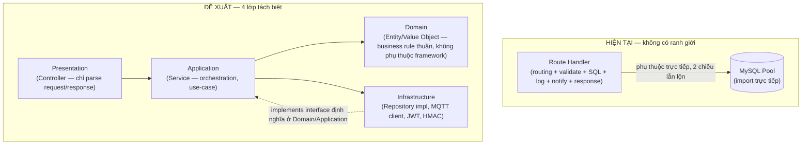

**Kết luận:** codebase hiện tại nằm hoàn toàn ở trạng thái "Transaction Script" (Fowler) — chấp nhận được cho CRUD đơn giản 8 route, **không đủ khi số lượng use-case tăng lên 22 module** như yêu cầu đề bài — bắt buộc chuyển sang kiến trúc phân lớp trước khi thêm domain mới, nếu không nợ kỹ thuật sẽ nhân lên theo cấp số nhân số route mới.

### 1.13. Domain Separation

**Không có domain nào được phân tách.** `devices` là bảng duy nhất gánh cả 2 khái niệm hoàn toàn khác nhau về vòng đời và quyền sở hữu: **Gateway** (hạ tầng mạng, thuộc về 1 Smart Home) và **Sensor** (thiết bị đo lường, thuộc về 1 Room trong Smart Home) — được phân biệt chỉ bằng 1 cột ENUM `device_type`. Không có khái niệm `Customer`, `SmartHome`, `Room` ở bất kỳ đâu trong code — đúng như tài liệu `00_PROJECT_ANALYSIS_SMARTHOME.md` Phần 2 đã kết luận, đây là vấn đề gốc rễ cần giải quyết trước mọi vấn đề khác.

### 1.14. Đánh giá theo góc nhìn AI-Ready

> Nhìn lại toàn bộ 22 file backend **thuần qua lăng kính "có đủ khả năng sinh dữ liệu hành vi cho AI hay không"** — khác góc nhìn kiến trúc phân lớp/SOLID ở các mục trên. Thiết kế chi tiết đáp ứng các khoảng trống này ở Phần 18.

| Khả năng cần cho AI | Hiện trạng | Kết luận |
|---|---|---|
| Ghi nhận lệnh điều khiển thiết bị (bật/tắt/chỉnh độ sáng) | Không tồn tại — chỉ có 1 chiều dữ liệu thiết bị→cloud (`POST /api/device/data`, `mqttDataService.ts`), không có API/topic nào cho chiều cloud→thiết bị, vì firmware hiện tại không có relay/actuator | **Thiếu hoàn toàn — phụ thuộc cứng vào `device_commands` (Phần 5) + MQTT `command` topic (Phần 10) trước khi AI có gì để học** |
| Phân biệt nguồn hành động (manual/automation/voice/...) | Không có — `devices.ts` PATCH `/:id/status` và `mqttDataService.ts` không có khái niệm `source`, chỉ biết "ai gọi API" chứ không biết "loại hành vi" | Thiếu — thiết kế ở Phần 18.2 (Event Envelope) |
| Lưu trạng thái trước/sau mỗi thay đổi (`previous_state`/`new_state`) | Không có — `deviceStatus.ts` chỉ giữ 1 cache trạng thái hiện tại (`Set<number>`), không có lịch sử chuyển trạng thái | Thiếu — thiết kế ở Phần 18.2-18.3 |
| Event-driven / Event Bus | Không có — mọi thay đổi trạng thái (`devices.ts:196-268`) gọi hàm trực tiếp tuần tự (ghi audit log → tạo notification), không phải publish event cho nhiều subscriber độc lập | Thiếu — thiết kế ở Phần 18.2 |
| Log hành vi sử dụng (khác log bảo mật) | Không có — `audit_log` chỉ có 9 loại sự kiện thiên về bảo mật/vận hành, không loại nào mang ý nghĩa hành vi (`LIGHT_TURNED_ON`, `BRIGHTNESS_CHANGED`) | Thiếu — thiết kế ở Phần 18.3 |
| Giữ lịch sử dài hạn (không tự xoá) | Không — `DATA_RECV` (loại gần nhất với "dữ liệu sử dụng") bị giới hạn cứng 150 bản ghi/thiết bị qua `logDataRecvWithPrune` (`auditLogger.ts:23-64`), phá huỷ chính xác loại dữ liệu chuỗi thời gian dài hạn AI cần nhất | Thiếu — vi phạm trực tiếp nguyên tắc "Raw Data không được ghi đè" (Phần 18.1) |

**Kết luận:** hệ thống hiện tại **hoàn toàn chưa sẵn sàng cho AI** — không phải vì thiếu 1-2 cột, mà vì thiếu cả tầng dữ liệu hành vi (chỉ có tầng dữ liệu đo lường). Đây không phải bất thường ở giai đoạn hiện tại (MVP phần cứng chỉ có sensor), nhưng là lý do bắt buộc phải thiết kế đúng **ngay từ đầu giai đoạn thương mại hoá** — xem thiết kế đầy đủ ở Phần 18.

---

## 2. BẢNG TỔNG HỢP VẤN ĐỀ

| # | Vấn đề | Mức độ | Vị trí | Hướng khắc phục |
|---|---|---|---|---|
| 1 | `GET /api/device/sensors` rò rỉ secret_key toàn hệ thống cho mọi gateway | **Nghiêm trọng — bảo mật multi-tenant** | `sensors.routes.ts:24-26` | Phần 9.3 — thay bằng whitelist theo `home_id`/`gateway_id` |
| 2 | Không có domain Customer/SmartHome/Room | Nghiêm trọng | Toàn bộ schema + route | Phần 5 |
| 3 | RBAC chỉ 2 role, Operator quyền ngang Admin trên mọi dữ liệu | Nghiêm trọng | `rbac.ts`, mọi route dùng `requireRole` | Phần 8 |
| 4 | Không có layer Service/Repository — Transaction Script thuần | Cao | Toàn bộ `routes/*.ts` | Phần 3, 4 |
| 5 | Logic xác thực+ingest trùng lặp 2 nơi (HTTP vs MQTT) | Cao | `validateDevice.ts` vs `mqttDataService.ts` | Phần 6.10 — hợp nhất vào `DeviceIngestService` |
| 6 | Secret key lưu plaintext trong DB | Cao (bảo mật) | `001_schema.sql:34` | Phần 17 |
| 7 | Không có Refresh Token, không có Mobile Auth | Cao | `auth.ts` | Phần 7 |
| 8 | Không có Provision/Activation/Pairing service nào | Nghiêm trọng | — chưa tồn tại | Phần 6.7–6.9, 16 |
| 9 | MQTT chỉ có topic "data" 1 chiều, không TLS, không ACL theo home | Nghiêm trọng | `mqttDataService.ts`, mosquitto conf | Phần 10, 17 |
| 10 | Không có OTA/Firmware module | Nghiêm trọng | — chưa tồn tại | Phần 11 |
| 11 | Không có Automation/Scene/Schedule module | Cao | — chưa tồn tại | Phần 12 |
| 12 | Notification hard-code `target_role='admin'` | Trung bình | `notificationService.ts:20`, `notifications.ts` | Phần 13 |
| 13 | 1 bảng `audit_log` gộp mọi loại log | Cao | `001_schema.sql:79-90` | Phần 14 |
| 14 | Rate limiter & cache online-device chỉ đúng khi chạy 1 instance | Cao (scalability) | `app.ts`, `deviceStatus.ts` | Phần 18 — chuyển Redis |
| 15 | Không có Monitoring module (RSSI/CPU/Memory/WiFi/MQTT) | Cao | — chưa tồn tại | Phần 15 |
| 16 | `ws` dependency chết, không có kênh real-time nào cho Dashboard | Trung bình | `package.json:27` | Phần 15/16 — dùng cho Live Monitoring |
| 17 | `connectionLimit: 10` cứng, không theo tải | Trung bình | `db.ts:16` | Phần 18 |
| 18 | Không tách namespace API theo kênh (Dashboard/Mobile/Device) | Nghiêm trọng | `routes/index.ts` | Phần 9 |
| 19 | Không có Camera module | Trung bình (chưa MVP bắt buộc) | — chưa tồn tại | Phần 6.19 |
| 20 | `mqttTracker.ts` phụ thuộc định dạng log `$SYS` giòn, dễ gãy khi đổi broker | Thấp-Trung bình | `mqttTracker.ts:6` | Phần 15 — thay bằng heartbeat topic chuẩn |
| 21 | Không có Device Command capability (chiều điều khiển cloud→thiết bị) | Nghiêm trọng (chặn AI) | — chưa tồn tại | Phần 18.1 — phụ thuộc `device_commands` + MQTT `command` topic |
| 22 | Không có Event Bus/Event Sourcing, không phân biệt nguồn hành động (`source`), không lưu `previous_state`/`new_state` | Cao (chặn AI) | Toàn bộ route handler | Phần 18.2 — Event Envelope + Event Store |

---

## 3. NGUYÊN TẮC KIẾN TRÚC MỚI

1. **Phân lớp bắt buộc: Controller → Service → Repository → Domain Entity.** Controller chỉ parse/validate request và gọi Service; Service chứa toàn bộ business rule; Repository là lớp duy nhất được phép biết SQL; Domain Entity là kiểu dữ liệu thuần, không phụ thuộc Express/MySQL.
2. **1 domain = 1 module.** Mỗi module trong Phần 6 sở hữu route/controller/service/repository riêng, giao tiếp với module khác qua interface rõ ràng (không import chéo repository của module khác).
3. **Tenant isolation là ràng buộc ở tầng Repository, không phải "nhớ lọc" ở tầng route.** Mọi query trên bảng thuộc phạm vi 1 Smart Home bắt buộc nhận `home_id` làm tham số bắt buộc (compile-time), không optional.
4. **1 nguồn sự thật cho logic xác thực thiết bị.** `DeviceIngestService` dùng chung cho cả đường HTTP fallback và đường MQTT chính — xoá bỏ duplicate logic đã nêu ở vấn đề #5.
5. **Namespace API tách theo kênh xác thực**, không tách theo tài nguyên: `/api/dashboard/**` (session cookie, Admin/Operator), `/api/mobile/**` (JWT Bearer, User), `/api/device/**` (HMAC, firmware) — đúng nguyên tắc đã chốt ở `01_SMART_HOME_PRODUCT_ARCHITECTURE.md`.
6. **Danh mục (device_type, sensor_type, room_type, event_type log, permission) đều là dữ liệu trong bảng, không hard-code trong code.**
7. **Mọi hành động Operator trên 1 Smart Home cụ thể đi qua Policy Check `operator_home_access`** — không có "quyền ngầm định" theo role hệ thống đơn thuần.
8. **Log được phân loại theo mục đích và vòng đời (retention) khác nhau**, không gộp chung 1 bảng.

---

## 4. KIẾN TRÚC TỔNG THỂ & MODULE DIAGRAM

```mermaid
flowchart TB
    subgraph CLIENTS["Client Layer"]
        WEB["Web Dashboard\n(Admin/Operator)"]
        MOB["Mobile App\n(User)"]
        FW["Firmware\n(Gateway/Node/Camera)"]
    end

    subgraph EDGE["Edge"]
        NGX["Nginx / API Gateway\nRate-limit theo namespace (Redis-backed)"]
    end

    subgraph API["API Layer (Controller)"]
        DAPI["/api/dashboard/**"]
        MAPI["/api/mobile/**"]
        DVAPI["/api/device/**"]
    end

    subgraph APP["Application Layer (22 Service Module — Phần 6)"]
        AUTH["Auth Service"]
        RBAC["RBAC Service"]
        CUST["Customer Service"]
        HOME["Smart Home Service"]
        ROOM["Room Service"]
        GW["Gateway Service"]
        PROV["Provision Service"]
        ACT["Activation Service"]
        PAIR["Pairing Service"]
        DEV["Device Service"]
        TEL["Telemetry Service"]
        NOTI["Notification Service"]
        AUTO["Automation Service"]
        SCENE["Scene Service"]
        SCHED["Schedule Service"]
        OTA["OTA Service"]
        FW_SVC["Firmware Service"]
        CAM["Camera Service"]
        MON["Monitoring Service"]
        AUD["Audit Service"]
        LOG["Log Service"]
        AI["AI Service (Reserved)"]
    end

    subgraph INFRA["Infrastructure Layer"]
        REPO[("Repository Layer\n(1 repo / bảng, SQL tập trung)")]
        MQTTC["MQTT Client Wrapper"]
        JWTLIB["JWT/HMAC/Crypto Utils"]
        QUEUE["Job Queue\n(BullMQ/Redis — OTA rollout, bulk notify)"]
        CACHE["Redis Cache\n(online-device, rate-limit, session)"]
    end

    subgraph DATA["Data Layer"]
        SQLDB[("MySQL 8\nSchema mới — xem 04_DATABASE_REFACTOR_SMARTHOME.md")]
        TSDB[("Time-series Store\n(rollup/partition — Telemetry)")]
        OBJSTORE[("Object Storage\nFirmware binary, Camera snapshot")]
    end

    subgraph IOT["IoT / MQTT Layer"]
        BK1["Broker 1 — Sensor↔Gateway (ESP-NOW/Local, không TLS bắt buộc nội bộ)"]
        BK2["Broker 2 — Gateway↔Backend (TLS bắt buộc, ACL theo home_id)"]
    end

    WEB --> NGX --> DAPI
    MOB --> NGX --> MAPI
    FW --> BK1 --> BK2 --> DVAPI

    DAPI & MAPI --> AUTH & RBAC
    DAPI --> CUST & HOME & ROOM & GW & PROV & ACT & OTA & FW_SVC & AUTO & SCENE & SCHED & MON & AUD & LOG & NOTI
    MAPI --> HOME & ROOM & DEV & TEL & AUTO & SCENE & NOTI & PAIR
    DVAPI --> DEV & TEL & GW & PAIR & OTA & CAM

    APP --> REPO
    APP --> MQTTC
    APP --> QUEUE
    APP --> CACHE
    REPO --> SQLDB
    TEL --> TSDB
    FW_SVC --> OBJSTORE
    CAM --> OBJSTORE
    MQTTC <--> BK2
```

**Nguyên tắc đọc diagram:** lớp `APP` (22 service) là nơi duy nhất chứa business rule; lớp `API` chỉ điều hướng request tới đúng service theo namespace; lớp `INFRA`/`DATA` bị đảo hướng phụ thuộc (Dependency Inversion) — Service định nghĩa interface Repository cần, Infrastructure implement interface đó, không phải ngược lại như code hiện tại.

---

## 5. DOMAIN DESIGN

> Chi tiết đầy đủ từng bảng/cột đã đặc tả ở `00_PROJECT_ANALYSIS_SMARTHOME.md` Phần 4 và `01_SMART_HOME_PRODUCT_ARCHITECTURE.md` Phần 8 — phần này chỉ tóm tắt **ranh giới domain** để phân định phạm vi của 22 service ở Phần 6, tránh 2 service đọc/ghi chồng lấn cùng 1 bảng.

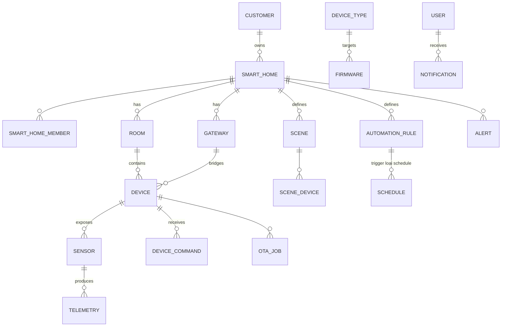

| Domain | Sở hữu bảng chính | Ranh giới |
|---|---|---|
| **Identity & Access** | `users`, `roles`, `permissions`, `role_permissions` | Không biết gì về Smart Home — chỉ quản lý danh tính + quyền hệ thống |
| **Customer & Home** | `customers` (nếu tách khỏi `users`), `smart_homes`, `smart_home_members`, `operator_home_access` | Sở hữu khái niệm "ai truy cập được nhà nào" |
| **Spatial** | `rooms`, `room_types` | Thuộc 1 `smart_home_id`, không biết gì về Gateway/MQTT |
| **Infrastructure thiết bị** | `gateways`, `devices`, `device_types`, `sensor_types`, `device_sensors` | Biết `room_id`/`home_id` nhưng không chứa business rule tự động hoá |
| **Telemetry** | `telemetry`, `telemetry_hourly_rollup`, `telemetry_daily_rollup` | Tách biệt hoàn toàn khỏi domain thiết bị để cho phép archive/partition độc lập |
| **Provisioning** | `activation_tokens`, `activation_logs`, `gateway_provision`, `device_pairing`, `wifi_profiles` | Vòng đời riêng (tồn tại ngắn hạn), không lẫn với domain vận hành hàng ngày |
| **Automation** | `automation_rules`, `automation_conditions`, `automation_actions`, `automation_history`, `scenes`, `scene_devices`, `schedules` | Đọc dữ liệu Device/Telemetry qua interface, không được viết thẳng vào bảng device |
| **OTA** | `firmware`, `ota_jobs`, `ota_history` | Biết `device_type_id`, không biết gateway cụ thể nào đang chạy gì tại runtime (hỏi Monitoring) |
| **Notification** | `notifications`, `notification_logs` | Chỉ nhận sự kiện từ service khác qua interface `publish(event)`, không tự query DB nghiệp vụ |
| **Monitoring** | Không có bảng riêng (đọc `last_seen`, `rssi`, `mqtt_connected` snapshot) + cache Redis | Chỉ đọc, không ghi domain khác |
| **Logging/Audit** | `audit_logs`, `gateway_logs`, `provision_logs`, `mqtt_logs`, `security_logs`, `automation_logs`, `ota_logs`, `api_logs`, `activity_logs` | Ghi-only từ góc nhìn service khác (write-append), đọc qua Log Service |

---

## 6. SERVICE DESIGN — 22 MODULE

| # | Service | Trách nhiệm chính | Phụ thuộc | Ghi chú kế thừa từ code hiện tại |
|---|---|---|---|---|
| 1 | **Auth Service** | Đăng nhập Dashboard (session cookie) + Đăng nhập Mobile (JWT+Refresh), đăng xuất, refresh token rotation | User Repository, JWT util, Redis (refresh token store) | Kế thừa cơ chế chống user-enumeration (`dummyHash`) từ `auth.ts:28-31` — **giữ nguyên nguyên lý này** |
| 2 | **RBAC Service** | Kiểm tra permission theo `role_id` + `operator_home_access`; cấp/thu hồi quyền Operator có thời hạn | Roles/Permissions Repository, Home Access Repository | Thay thế hoàn toàn `middleware/rbac.ts` hiện tại (chỉ check role tĩnh) |
| 3 | **Customer Service** | CRUD khách hàng, tra cứu lịch sử mua hàng/kích hoạt | Customer Repository, Smart Home Service (read-only) | Module hoàn toàn mới |
| 4 | **Smart Home Service** | CRUD Smart Home, quản lý `smart_home_members`, chuyển quyền sở hữu | Smart Home Repository, Room Service | Module hoàn toàn mới — thay thế tư duy "devices phẳng" |
| 5 | **Room Service** | CRUD Room trong 1 Smart Home, gán/di chuyển Device giữa các Room | Room Repository, Device Service (interface) | Module hoàn toàn mới |
| 6 | **Gateway Service** | CRUD Gateway, cập nhật trạng thái/firmware/RSSI, factory reset, replace gateway | Gateway Repository, Monitoring Service | Kế thừa 1 phần logic status từ `devices.ts` (khi `device_type='gateway'`) |
| 7 | **Provision Service** | Tạo Smart Home `unclaimed`, sinh cấu trúc Room/Device theo template Package, xuất kho | Smart Home Service, Room Service, Gateway Service, Activation Service | Module hoàn toàn mới (đặc tả đầy đủ ở `01_SMART_HOME_PRODUCT_ARCHITECTURE.md` Phần 5) |
| 8 | **Activation Service** | Sinh/validate Activation Token + QR, xử lý Claim Home, Gateway Replace, Ownership Transfer | Activation Token Repository, Smart Home Service | Module hoàn toàn mới |
| 9 | **Pairing Service** | Xử lý Node/Camera Pairing (ESP-NOW/Local-AP), whitelist theo `home_id`, cửa sổ pairing có thời hạn | Device Pairing Repository, MQTT Client | Module hoàn toàn mới, đặc tả kỹ thuật ở `02_SMART_HOME_WIFI_PROVISIONING.md` Phần 9 |
| 10 | **Device Service** | CRUD Device (Sensor/Relay/Camera/Door Contact...), đổi tên, gán Room, đổi trạng thái | Device Repository, Device Type Repository | Kế thừa phần lớn logic `devices.ts` GET/PATCH/DELETE, tổng quát hoá khỏi ENUM cứng |
| 11 | **Telemetry Service** | Nhận dữ liệu cảm biến chuẩn hoá theo `sensor_type`, query lịch sử, trigger rollup | Telemetry Repository, Time-series Store | Thay thế `sensor_data` phẳng — tổng quát hoá khỏi `temperature`/`humidity` hard-code |
| 12 | **Notification Service** | Nhận event từ mọi service khác, quyết định kênh gửi (Push/Email/In-app), lưu lịch sử | Notification Repository, Push Gateway (FCM/APNs), Email Provider | Mở rộng từ `notificationService.ts` — bỏ hard-code `target_role='admin'`, gửi theo `user_id` |
| 13 | **Automation Service** | Đánh giá Rule Engine (IF Condition THEN Action), CRUD rule | Automation Repository, Device Service (để thực thi action), Telemetry Service (để đánh giá condition) | Module hoàn toàn mới |
| 14 | **Scene Service** | CRUD Scene (nhóm nhiều lệnh thiết bị chạy cùng lúc, kích hoạt thủ công/1 chạm) | Scene Repository, Device Service | Module hoàn toàn mới |
| 15 | **Schedule Service** | Trigger theo thời gian (cron-like) cho Automation/Scene | Schedule Repository, job scheduler (node-cron/BullMQ repeatable job) | Module hoàn toàn mới |
| 16 | **OTA Service** | Điều phối rollout firmware, theo dõi tiến trình, rollback | OTA Job Repository, Firmware Service, MQTT Client, Job Queue | Module hoàn toàn mới |
| 17 | **Firmware Service** | CRUD phiên bản firmware, checksum, lưu trữ binary | Firmware Repository, Object Storage | Module hoàn toàn mới |
| 18 | **Camera Service** | Quản lý metadata Camera, snapshot request, motion event | Camera Repository, Object Storage, MQTT Client | Module hoàn toàn mới (theo `cameras` table ở `01_SMART_HOME_PRODUCT_ARCHITECTURE.md` mục 8.2) |
| 19 | **Monitoring Service** | Tổng hợp trạng thái realtime: Gateway online/offline, RSSI, CPU/Memory (nếu firmware báo cáo), MQTT connection, heartbeat | Redis Cache, MQTT Client (subscribe heartbeat topic) | Thay thế `deviceStatus.ts` (cache in-memory 1-instance) bằng Redis-backed, thêm chỉ số mới |
| 20 | **Audit Service** | Ghi & truy vấn sự kiện bảo mật/nghiệp vụ quan trọng cần bằng chứng (ai làm gì, khi nào) | Audit Log Repository | Kế thừa `auditLogger.ts` — tách khỏi `DATA_RECV` tần suất cao (chuyển log đó sang Log Service/Monitoring) |
| 21 | **Log Service** | Ghi & truy vấn 9 loại log vận hành (Gateway/Provision/Device/API/MQTT/Automation/OTA/System/Error), quản lý retention | Log Repository (nhiều bảng), tuỳ chọn ELK/Loki | Mở rộng khỏi 1 bảng `audit_log` hiện tại — xem Phần 14 |
| 22 | **AI Service (Reserved)** | *Hiện thực hoá chi tiết ở Phần 18*: Behavior Log Projector, Feature Engineering, Inference, Recommendation — quan sát hành vi, phát hiện mẫu, đề xuất Automation (không bao giờ tự điều khiển) | Telemetry Service, Log Service (read-only), Event Bus | Chưa scope MVP để chạy model thật (V3) — nhưng **Event Sourcing/Behavior Logging phải bật từ V2** (Phần 18.8) để tích luỹ dữ liệu ngay từ đầu |

---

## 7. AUTHENTICATION DESIGN

### 7.1. Tổng quan 5 luồng xác thực độc lập

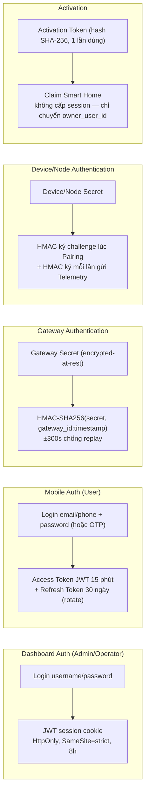

### 7.2. Bảng so sánh 5 cơ chế

| Kênh | Định danh | Cơ chế | Thời hạn | Lưu trữ phía client | Revocation |
|---|---|---|---|---|---|
| Dashboard (Admin/Operator) | `username` | JWT trong HttpOnly Cookie | 8h (giữ nguyên như hiện tại) | Cookie — không truy cập được từ JS | Xoá cookie + (mới) danh sách token bị thu hồi trong Redis kiểm tra ở `verifyJWT` |
| Mobile (User) | `email`/`phone` | Access Token (JWT, 15 phút) + Refresh Token (random 256-bit, lưu hash trong DB, rotate mỗi lần dùng) | 15 phút / 30 ngày | Keychain (iOS) / Keystore (Android) | Refresh Token revoke theo thiết bị hoặc theo user (đăng xuất toàn bộ thiết bị) |
| Gateway | `gateway_uuid` | HMAC-SHA256(gateway_secret, gateway_id:timestamp), `timingSafeEqual` | N/A (mỗi request tự ký lại) | Secret trong NVS (flash encryption) | Đổi secret khi Replace Gateway |
| Device/Node | `device_uid` | HMAC ký bởi Node Secret, challenge-response lúc pairing | N/A | Secret trong NVS | Đổi secret khi Reset Node |
| Activation | `code_ref`/QR payload | Token ngẫu nhiên, chỉ lưu hash SHA-256, 1 lần dùng, hết hạn 180 ngày | 180 ngày hoặc tới khi dùng | Không lưu phía client (in trên tem) | `revoked_at` set thủ công bởi Admin/Operator |

### 7.3. Nguyên tắc thiết kế Auth Service

1. **Không dùng chung 1 middleware `verifyJWT` cho cả Dashboard và Mobile** — 2 guard riêng biệt (`verifyDashboardSession`, `verifyMobileBearerToken`) dù cùng dựa trên `jsonwebtoken`, vì khác nguồn token (cookie vs header `Authorization: Bearer`) và khác vòng đời (8h vs 15 phút + refresh).
2. **Refresh Token rotation bắt buộc + phát hiện reuse** — mỗi lần refresh, token cũ bị vô hiệu ngay; nếu 1 refresh token đã dùng bị gọi lại (dấu hiệu bị đánh cắp) → thu hồi toàn bộ session của user đó, ghi Security Log mức Critical.
3. **`JWT_SECRET` tách riêng cho Dashboard và Mobile** (2 secret khác nhau) — nếu 1 secret bị lộ, không ảnh hưởng kênh còn lại.
4. **Gateway/Device Secret giữ nguyên nguyên lý HMAC hiện có** (đã đúng chuẩn) nhưng chuyển từ lưu plaintext (`devices.secret_key` hiện tại) sang **mã hoá tại rest** bằng KMS/Vault — backend cần giải mã tạm thời trong RAM để tính lại HMAC, không bao giờ ghi log giá trị đã giải mã.

---

## 8. RBAC & PERMISSION MATRIX

### 8.1. 3 role hệ thống

| Role | Kênh đăng nhập | Sở hữu Smart Home |
|---|---|---|
| **ADMIN** | Dashboard | Không — quản trị toàn nền tảng |
| **OPERATOR** | Dashboard | Không — chỉ truy cập tạm thời qua `operator_home_access` (có `reason`+`expires_at`) |
| **USER** | Mobile | Có (Owner/Controller/Viewer/Guest trong từng Home — RBAC 2 tầng, xem `01_SMART_HOME_PRODUCT_ARCHITECTURE.md` Phần 7) |

### 8.2. Permission Matrix (rút gọn theo module — chi tiết đầy đủ ở `00_PROJECT_ANALYSIS_SMARTHOME.md` mục 5.2)

| Permission | ADMIN | OPERATOR (có access) | USER (Owner) |
|---|:---:|:---:|:---:|
| `customer:manage` | ✅ | 👁 view-only | ❌ |
| `smart_home:create` (provisioning) | ✅ | ✅ | ❌ (chỉ Claim, không tự tạo mới) |
| `smart_home:update/delete` | ✅ | ❌ | ✅ (nhà mình) |
| `room:manage` | ✅ | ❌ | ✅ (nhà mình) |
| `device:register` | ✅ | ✅ (khi provisioning) | ✅ (nhà mình, gán vào room) |
| `device:control` | ✅ (debug, có audit) | ❌ | ✅ (nhà mình) |
| `gateway:factory_reset/replace` | ✅ | ✅ (được cấp quyền, cần Owner xác nhận) | ✅ (xác nhận) |
| `automation:manage` | ✅ (đọc mọi rule) | ❌ | ✅ (nhà mình) |
| `ota:upload_firmware` | ✅ | ❌ | ❌ |
| `ota:deploy` | ✅ (toàn hệ thống) | ✅ (phạm vi được cấp quyền) | ❌ |
| `log:security/authentication/activity` | ✅ | ❌ | ❌ |
| `log:gateway/device/provision/automation/ota` | ✅ | ✅ (phạm vi được cấp quyền) | ❌ |
| `notification:manage_own` | ✅ | ✅ | ✅ |
| `operator_access:grant/revoke` | ✅ | ❌ | ❌ |

### 8.3. Cơ chế thực thi mới — thay thế `requireRole()` tĩnh

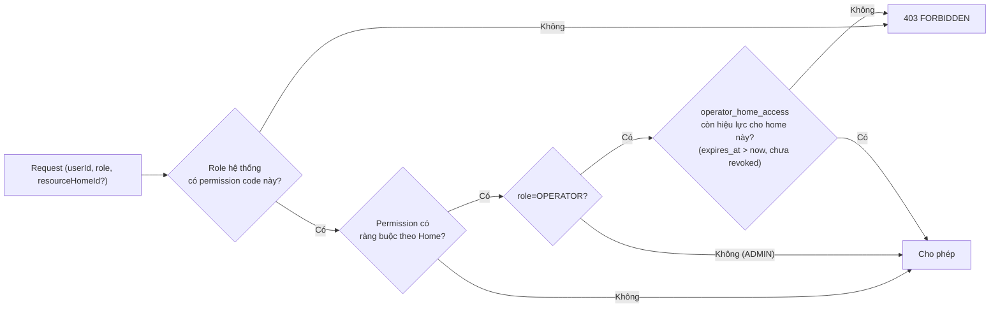

Đây là khác biệt cốt lõi so với `middleware/rbac.ts` hiện tại: **permission check không dừng lại ở role tĩnh**, mà tiếp tục kiểm tra phạm vi tài nguyên (`home_id`) đối với Operator — giải quyết đúng vấn đề #3 ở Phần 2.

---

## 9. API DESIGN

### 9.1. Nguyên tắc phân nhóm

Theo đúng yêu cầu, phân nhóm namespace (thay thế hoàn toàn `routes/index.ts` hiện tại — 1 router phẳng cho mọi kênh):

```
/api/auth/**            – Public (login/refresh/logout) — tách route con theo dashboard|mobile
/api/dashboard/**        – Session cookie, ADMIN|OPERATOR only
/api/mobile/**           – JWT Bearer, USER only
/api/device/**           – HMAC, firmware only (không phải user)
```

### 9.2. `/api/dashboard/**` (Admin/Operator)

| Method | Endpoint | Role | Service |
|---|---|---|---|
| GET/POST | `/dashboard/customers` | ADMIN, OPERATOR (view) | Customer Service |
| GET | `/dashboard/customers/:id` | ADMIN, OPERATOR | Customer Service |
| GET/POST | `/dashboard/smart-homes` | ADMIN, OPERATOR | Smart Home Service |
| GET | `/dashboard/smart-homes/:id` | ADMIN, OPERATOR (có access) | Smart Home Service |
| POST | `/dashboard/smart-homes/:id/generate-activation` | ADMIN, OPERATOR | Activation Service |
| GET/POST | `/dashboard/rooms`, `/dashboard/smart-homes/:id/rooms` | ADMIN, OPERATOR | Room Service |
| GET | `/dashboard/gateways`, `/dashboard/gateways/:id` | ADMIN, OPERATOR | Gateway Service, Monitoring Service |
| POST | `/dashboard/gateways/:id/provision` | OPERATOR | Provision Service |
| POST | `/dashboard/gateways/:id/replace` | OPERATOR (ticket), ADMIN | Activation Service |
| POST | `/dashboard/gateways/:id/restart`, `/factory-reset` | ADMIN, OPERATOR (access) | Gateway Service |
| GET/PATCH/DELETE | `/dashboard/devices`, `/dashboard/devices/:id` | ADMIN, OPERATOR (access) | Device Service |
| GET | `/dashboard/automation` | ADMIN, OPERATOR (read) | Automation Service |
| GET/POST | `/dashboard/firmware` | ADMIN | Firmware Service |
| POST | `/dashboard/ota/deploy`, `/dashboard/ota/:jobId/rollback` | ADMIN, OPERATOR (access) | OTA Service |
| GET | `/dashboard/logs/{gateway,device,provision,mqtt,security,auth,activity,automation,ota,error}` | ADMIN (toàn bộ), OPERATOR (5 loại vận hành) | Log Service |
| GET | `/dashboard/monitoring/overview`, `/dashboard/monitoring/mqtt-status` | ADMIN, OPERATOR | Monitoring Service |
| GET/POST | `/dashboard/notifications` | ADMIN, OPERATOR | Notification Service |
| GET/POST/DELETE | `/dashboard/team`, `/dashboard/team/access` (operator_home_access) | ADMIN | RBAC Service |
| GET | `/dashboard/stats` | ADMIN, OPERATOR (biến thể khác nhau) | tổng hợp nhiều service |

### 9.3. `/api/mobile/**` (User) — tóm tắt, chi tiết đầy đủ ở `01_SMART_HOME_PRODUCT_ARCHITECTURE.md` mục 9.1

| Method | Endpoint | Service |
|---|---|---|
| POST | `/mobile/auth/register`, `/login`, `/refresh`, `/logout` | Auth Service |
| POST | `/mobile/claim-home` | Activation Service |
| GET | `/mobile/my-homes`, `/mobile/homes/:id` | Smart Home Service |
| GET/PATCH | `/mobile/homes/:id/rooms`, `/mobile/rooms/:id` | Room Service |
| GET/PATCH | `/mobile/homes/:id/devices`, `/mobile/devices/:id` | Device Service |
| POST | `/mobile/devices/:id/commands` | Device Service (publish MQTT command) |
| GET | `/mobile/devices/:id/telemetry` | Telemetry Service |
| GET/POST/PATCH/DELETE | `/mobile/homes/:id/automations`, `/mobile/homes/:id/scenes` | Automation Service, Scene Service |
| GET/PATCH | `/mobile/notifications` | Notification Service |
| POST/DELETE | `/mobile/homes/:id/members` | Smart Home Service |
| POST | `/mobile/homes/:id/replace-gateway`, `/transfer-ownership` | Activation Service |
| POST/GET | `/mobile/provision/**`, `/mobile/pair-node/**` | Provision Service, Pairing Service |

### 9.4. `/api/device/**` (HMAC — Firmware)

| Method | Endpoint | Thay đổi so với hiện tại |
|---|---|---|
| POST | `/device/telemetry` | Thay `POST /api/device/data` — payload chuẩn hoá theo `sensor_type`, không còn field `data` tự do |
| GET | `/device/gateways/:gateway_uuid/whitelist` | **Thay thế** `GET /api/device/sensors` đang rò rỉ toàn hệ thống — chỉ trả node thuộc đúng `home_id` của gateway đó (vá vấn đề #1) |
| POST | `/device/commands/:id/ack` | Mới — Node xác nhận đã thực thi lệnh |
| GET/POST | `/device/ota/**` | Mới — Node kiểm tra bản firmware mới, báo cáo tiến trình |
| POST | `/device/heartbeat` | Mới — tách khỏi telemetry, gửi định kỳ dù không có dữ liệu cảm biến mới |

### 9.5. Response Envelope chuẩn hoá

Tất cả API mới tuân theo 1 envelope thống nhất (thay vì mỗi route tự định hình dạng như hiện tại):

```
Thành công: { "data": <object|array>, "meta"?: { pagination... } }
Lỗi:        { "error": { "code": "SNAKE_CASE", "message": "..." } }
```

---

## 10. MQTT TOPIC DESIGN

### 10.1. Nguyên tắc naming convention

```
home/{home_id}/gateway/{gateway_uuid}/...
```

Mọi topic đều bắt đầu bằng `home_id` — đây là thay đổi quan trọng nhất so với hiện tại (`gateway/+/data` không có `home_id`) để broker có thể áp **ACL theo khách hàng** (mỗi gateway chỉ được publish/subscribe đúng namespace nhà của nó).

### 10.2. Bảng Topic đầy đủ

| Nhóm | Topic pattern | Chiều | QoS | Retained | Ghi chú |
|---|---|---|---|---|---|
| **Telemetry** | `home/{home_id}/gateway/{gw}/device/{dev}/telemetry` | Device → Cloud | 1 | Không | Payload chuẩn hoá `{sensor_type, value, ts}` |
| **Command** | `home/{home_id}/gateway/{gw}/device/{dev}/command` | Cloud → Device | 1 | Không | `{command_id, action, payload}` |
| **Command Ack** | `home/{home_id}/gateway/{gw}/device/{dev}/command/ack` | Device → Cloud | 1 | Không | `{command_id, status, ts}` |
| **Status** | `home/{home_id}/gateway/{gw}/device/{dev}/status` | Device → Cloud | 1 | **Có** | Trạng thái cuối cùng biết được (online/offline/relay state) — retained để subscriber mới join thấy ngay trạng thái hiện tại |
| **Heartbeat** | `home/{home_id}/gateway/{gw}/heartbeat` | Gateway → Cloud | 0 | Không | Định kỳ 15-30s, payload nhẹ `{rssi, uptime, node_count}` — thay thế cơ chế suy luận online từ `last_seen` hiện tại |
| **Provision** | `home/{home_id}/gateway/{gw}/provision/{event}` | 2 chiều | 1 | Không | `event ∈ {wifi_status, node_pair_request, node_pair_result}` |
| **OTA** | `home/{home_id}/gateway/{gw}/ota/{command\|progress\|result}` và `.../device/{dev}/ota/{...}` | 2 chiều | 1 (command/result), 0 (progress) | Không | Progress tần suất cao nên QoS0 chấp nhận mất gói |
| **Notification (local)** | `home/{home_id}/gateway/{gw}/notification` | Cloud → Gateway | 1 | Không | Dùng cho cảnh báo cục bộ (còi báo động), không thay thế Push Notification cho Mobile |
| **Camera** | `home/{home_id}/gateway/{gw}/device/{dev}/camera/{snapshot\|event}` | Device → Cloud | 1 | Không | `event` cho motion detection, `snapshot` cho ảnh đính kèm (metadata, ảnh thật lưu Object Storage) |
| **Pairing** | `home/{home_id}/gateway/{gw}/pairing/{request\|response}` | 2 chiều nội bộ (chủ yếu ESP-NOW, không qua MQTT cloud) | — | — | Ghi ở đây để đối chiếu — pairing thật diễn ra local (Phần 9 `02_SMART_HOME_WIFI_PROVISIONING.md`), MQTT chỉ nhận **kết quả** pairing báo cáo lên (`provision/node_pair_result`) |
| **System** | `$SYS/broker/#` | Broker → nội bộ | 0 | — | Chỉ dùng cho Monitoring Service theo dõi health broker, **không dùng để suy luận IP thiết bị bằng regex** như `mqttTracker.ts` hiện tại (thay bằng field `ip` tự báo trong Heartbeat payload) |

### 10.3. QoS & Retain — nguyên tắc chọn

| Loại dữ liệu | QoS | Lý do |
|---|---|---|
| Telemetry, Command, Ack, Status, OTA command/result | QoS 1 | Cần đảm bảo "at least once" — mất lệnh điều khiển hay mất xác nhận OTA gây hậu quả nghiệp vụ |
| Heartbeat, OTA progress | QoS 0 | Tần suất cao, mất 1 gói không quan trọng vì gói kế tiếp sẽ đến ngay |
| Status | Retained | Subscriber mới (Dashboard vừa mở, Mobile vừa mở app) cần biết ngay trạng thái hiện tại mà không phải chờ sự kiện tiếp theo |

### 10.4. Migration từ topic hiện tại

| Hiện tại | Mới | Ghi chú |
|---|---|---|
| `local/sensors/+/data` (Broker 1) | Giữ nguyên tầng vật lý Sensor↔Gateway (ESP-NOW nội bộ, không qua MQTT cloud theo `02_SMART_HOME_WIFI_PROVISIONING.md`) | Không đổi — đây là giao tiếp cục bộ, không phải MQTT cloud |
| `gateway/+/data` (Broker 2) | `home/{home_id}/gateway/{gw}/device/{dev}/telemetry` | Cần script migrate: gateway cũ phải update firmware để publish theo topic mới có `home_id` |

---

## 11. OTA DESIGN

### 11.1. Domain Model tóm tắt (chi tiết bảng ở `00_PROJECT_ANALYSIS_SMARTHOME.md` mục 4.2.20-21)

- **Firmware**: `id, device_type_id, version (semver), binary_url, checksum_sha256, release_notes, is_stable`.
- **OTA Job**: 1 lần rollout, phạm vi (toàn hệ thống / theo home / theo gateway/device cụ thể), trạng thái tổng (`pending/running/completed/failed_partial`).
- **OTA History**: 1 dòng / thiết bị / job — trạng thái riêng từng thiết bị (`pending/downloading/applied/failed/rolled_back`).

### 11.2. Flow rollout

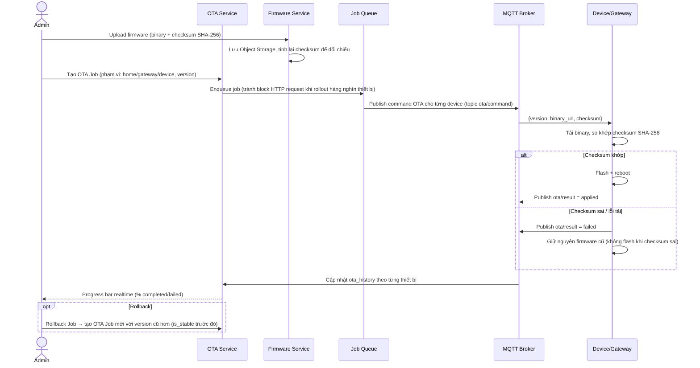

### 11.3. Nguyên tắc

1. **Checksum SHA-256 là điều kiện bắt buộc trước khi flash** — thiết bị tự verify, không tin tưởng backend đã verify hộ (defense-in-depth).
2. **Rollback không "undo" — luôn tạo OTA Job mới trỏ về version ổn định trước đó** — giữ lịch sử đầy đủ, không xoá `ota_history` cũ.
3. **Rollout hàng loạt luôn qua Job Queue (async)**, không xử lý đồng bộ trong 1 HTTP request — tránh timeout khi target hàng nghìn thiết bị.
4. **`is_stable` là cờ thủ công do Admin gắn sau khi rollout thử nghiệm ổn định** — không tự động đánh dấu ngay khi upload.

---

## 12. AUTOMATION & SCENE DESIGN

### 12.1. Rule Engine — mô hình IF/Condition/Action

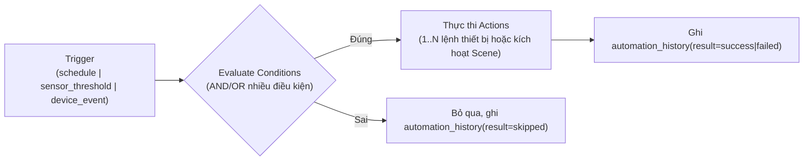

- **Condition**: tách bảng riêng `automation_conditions` (không nhét JSON tự do như thiết kế sơ bộ ban đầu) để hỗ trợ nhiều điều kiện AND/OR, mỗi dòng `{sensor_type, operator, value, room_id?}`.
- **Action**: tách bảng riêng `automation_actions`, mỗi dòng `{device_id hoặc scene_id, command, payload}` — 1 rule có thể có nhiều action tuần tự.
- **Schedule**: trigger loại `schedule` tham chiếu bảng `schedules` riêng (cron expression hoặc `{days_of_week, time}`), được `Schedule Service` đánh thức Automation Service đúng giờ.
- **Scene**: nhóm nhiều lệnh thiết bị chạy 1 lần khi kích hoạt thủ công (không cần Condition) — bảng `scenes` + `scene_devices` (device + lệnh cố định), có thể được gọi làm **Action** của 1 Automation Rule (ví dụ "Rule: 22h → kích hoạt Scene Ngủ").

### 12.2. Engine thực thi ở đâu

- **MVP:** đánh giá rule tại Backend (Automation Service subscribe Telemetry Service qua event nội bộ, đánh giá điều kiện, publish Command qua MQTT) — đơn giản, đủ dùng khi số rule/nhà còn ít.
- **Khi scale lớn (roadmap dài hạn):** cân nhắc đẩy rule engine đơn giản (ngưỡng nhiệt độ, lịch giờ cố định) **xuống chính Gateway** để giảm độ trễ và giảm tải Cloud — Cloud chỉ đồng bộ rule definition xuống Gateway, Gateway tự đánh giá cục bộ khi mất kết nối Internet tạm thời (tăng khả năng chịu lỗi — nhà vẫn tự động hoá được dù mất mạng).

---

## 13. NOTIFICATION DESIGN

### 13.1. Kênh gửi

| Kênh | Dùng cho | Nhà cung cấp gợi ý |
|---|---|---|
| **Push (Mobile)** | Cảnh báo thiết bị, automation kích hoạt, mời thành viên | FCM (Android) / APNs (iOS) |
| **Email** | Kích hoạt tài khoản, cảnh báo bảo mật nghiêm trọng, báo cáo bảo hành | SMTP/SendGrid/SES |
| **In-app (System)** | Toàn bộ thông báo hiển thị trong Notification Center (Dashboard) và Mobile | Lưu bảng `notifications`, đọc qua polling/WebSocket |
| **Local (MQTT notification topic)** | Còi báo động cục bộ tại nhà (không cần Internet để kêu) | Xem Phần 10.2 |

### 13.2. Phân loại Severity (thống nhất với thiết kế Notification Center ở `05_FRONTEND_REFACTOR_SMARTHOME.md` mục 9.10)

| Severity | Ví dụ sự kiện | Kênh mặc định |
|---|---|---|
| **Critical** | Gateway mất kết nối > 30 phút, cảnh báo khói/gas, OTA fleet thất bại hàng loạt | Push + Email + In-app |
| **Warning** | 1 thiết bị OTA thất bại, RSSI yếu kéo dài, refresh token reuse phát hiện | Push + In-app |
| **Info** | Home mới kích hoạt, thành viên mới tham gia | In-app |
| **Success** | OTA hoàn tất, provisioning hoàn tất | In-app |

### 13.3. Nguyên tắc kiến trúc

- **Notification Service không tự quyết định "khi nào gửi"** — mọi service khác (Automation, OTA, Monitoring, Activation) **publish event nội bộ** (`event bus` đơn giản trong process hoặc Redis Pub/Sub khi nhiều instance), Notification Service subscribe và quyết định kênh/nội dung theo `severity` + tuỳ chọn nhận thông báo của user.
- **Bỏ hoàn toàn `target_role='admin'` hard-code** (vấn đề #12) — thay bằng `user_id` cụ thể; với thông báo cấp hệ thống gửi mọi Admin, publish tới **danh sách user_id có role=ADMIN tại thời điểm gửi** (query động), không hard-code chuỗi role.

---

## 14. LOGGING DESIGN

### 14.1. Tách bảng theo mục đích & vòng đời (thay thế 1 bảng `audit_log` hiện tại)

| Loại Log | Mục đích | Nguồn ghi | Retention đề xuất |
|---|---|---|---|
| **Gateway Log** | Sự kiện vòng đời Gateway (online/offline, restart, factory reset, replace) | Gateway Service, Monitoring Service | 90 ngày |
| **Device Log** | Sự kiện vòng đời Device (đăng ký, đổi trạng thái, xoá, đổi room) | Device Service | 90 ngày |
| **Provision Log** | Toàn bộ bước Provisioning/Pairing/WiFi setup | Provision Service, Pairing Service | 180 ngày (trùng thời hạn Activation Token) |
| **MQTT Log** | Kết nối/ngắt kết nối broker, lỗi publish/subscribe, ACL violation | MQTT Client Wrapper, Monitoring Service | 30 ngày (tần suất cao) |
| **Security Log** | HMAC auth fail, replay attack, privilege escalation, refresh token reuse | Auth Service, RBAC Service, Device Ingest (qua HMAC) | 365 ngày (yêu cầu điều tra dài hạn) |
| **Authentication Log** | Đăng nhập/đăng xuất thành công & thất bại (Dashboard + Mobile) | Auth Service | 365 ngày |
| **User Activity Log** | Hành động nghiệp vụ của user/admin/operator (CRUD Home/Room/Device...) | Mọi Application Service (ghi qua Audit Service) | 365 ngày |
| **Automation Log** | Rule được đánh giá, kết quả thực thi | Automation Service | 90 ngày |
| **OTA Log** | Từng bước rollout, lỗi tải/flash | OTA Service | 180 ngày |
| **API Log** | Request/response cấp hệ thống (status code, latency) — phục vụ vận hành, không phải audit | Middleware logging tập trung (thay `morgan("dev")` hiện tại bằng structured logger) | 14-30 ngày |
| **Error Log** | Exception không mong đợi ở mọi tầng | Global error handler (`app.ts` error middleware hiện tại — mở rộng structured) | 30-90 ngày |

### 14.2. Nguyên tắc

1. **Log ghi-only, append-only** — không service nghiệp vụ nào được `UPDATE`/`DELETE` log ngoài Log Service (qua API xoá có kiểm soát dành cho Admin, kế thừa pattern `DELETE /api/audit-log/by-type` hiện tại nhưng áp dụng đúng bảng tương ứng).
2. **Log không được chặn luồng chính (fire-and-forget với timeout)** — kế thừa đúng nguyên tắc `try/catch` nuốt lỗi đã có ở `auditLogger.ts`, nhưng bổ sung **metric đếm số lần ghi log thất bại** (Phần 15) để không mất khả năng giám sát khi chính logging gặp sự cố.
3. **Log tần suất cao (MQTT, API) nên ghi vào hệ thống chuyên dụng** (ví dụ Loki/ELK) thay vì MySQL — MySQL chỉ giữ các loại log cần truy vấn có cấu trúc/join với domain data (Security, Activity, Provision).
4. **`DATA_RECV`/Telemetry log tách hẳn khỏi Audit** — không còn là 1 loại "log" mà là dữ liệu nghiệp vụ chính (Telemetry Service, Phần 6.11), tránh lặp lại vấn đề bảng `audit_log` hiện tại đang gánh cả vai trò lưu trữ time-series.

---

## 15. MONITORING DESIGN

### 15.1. Chỉ số cần theo dõi

| Nhóm | Chỉ số | Nguồn dữ liệu |
|---|---|---|
| **Gateway Status** | online/offline, thời điểm last heartbeat | Heartbeat topic (Phần 10.2) → Redis cache → fallback MySQL snapshot |
| **RSSI** | Cường độ tín hiệu WiFi Gateway, tín hiệu ESP-NOW từng Node | Heartbeat payload / Provision Log |
| **CPU/Memory** | Tải phần cứng ESP32 (nếu firmware hỗ trợ báo cáo) | Heartbeat payload mở rộng (tuỳ chọn, không bắt buộc MVP) |
| **WiFi** | SSID (đã mask 1 phần), trạng thái kết nối Station | Heartbeat / Provision Log |
| **MQTT** | Trạng thái kết nối broker của từng Gateway, tổng số client đang connect (từ `$SYS`) | MQTT Client Wrapper + `$SYS/broker/clients/connected` |
| **Heartbeat** | Tần suất, độ trễ giữa các lần heartbeat (phát hiện gateway "chập chờn") | Time-series nhỏ trong Redis (sorted set theo timestamp) |

### 15.2. Kiến trúc — thay thế `deviceStatus.ts` + `mqttTracker.ts` hiện tại

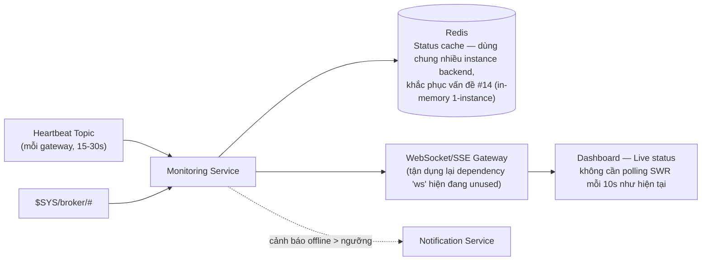

**Điểm cải tiến cốt lõi:** tận dụng đúng dependency `ws` hiện đang khai báo nhưng chết trong `package.json` (vấn đề #16) để mở kênh real-time thật cho Dashboard thay vì polling SWR mỗi 10 giây như hiện tại (`useDashboardStats.ts` phía frontend) — giảm tải API, giảm độ trễ hiển thị trạng thái Gateway/Device.

---

## 16. EVENT FLOW / SEQUENCE DIAGRAMS

### 16.1. Provision Flow (tóm tắt — chi tiết đầy đủ ở `01_SMART_HOME_PRODUCT_ARCHITECTURE.md` Phần 5)

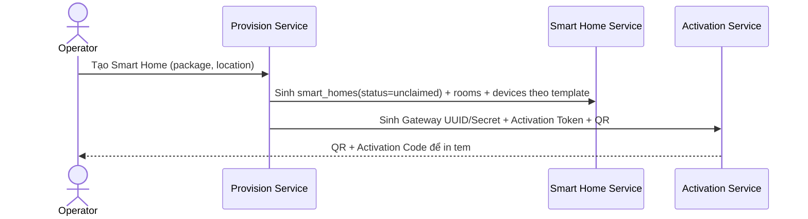

### 16.2. Claim/Activation Flow — tham chiếu nguyên vẹn `01_SMART_HOME_PRODUCT_ARCHITECTURE.md` mục 6.1 (không lặp lại ở đây).

### 16.3. Telemetry Ingest Flow — hợp nhất HTTP + MQTT qua 1 Service duy nhất (vá vấn đề #5)

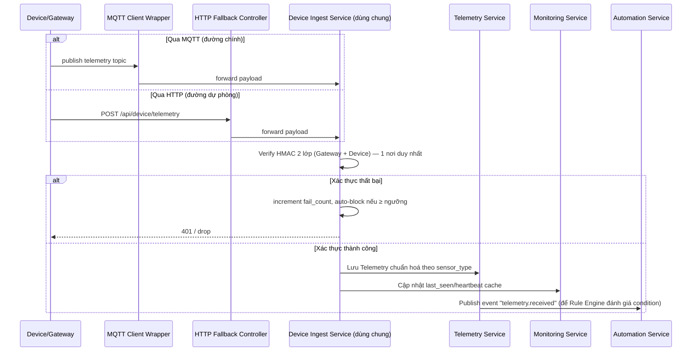

**Đây là thay đổi kiến trúc quan trọng nhất ở tầng ingest:** cả 2 đường vào (MQTT/HTTP) đều gọi chung `Device Ingest Service` — xoá bỏ hoàn toàn code trùng lặp giữa `validateDevice.ts` và `mqttDataService.ts` hiện tại.

### 16.4. OTA Flow — xem Phần 11.2 (đã có sequence diagram riêng).

### 16.5. Monitoring/Alert Flow

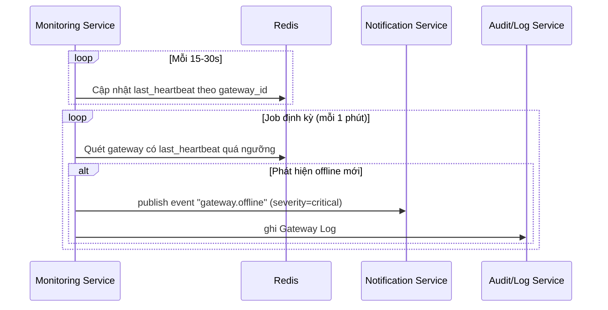

---

## 17. SECURITY DESIGN

| Hạng mục | Thiết kế |
|---|---|
| **TLS cho MQTT** | Broker 2 (Gateway↔Backend) bắt buộc TLS 1.2+ trong production — vá vấn đề #9 (hiện tại `allow_anonymous true`, không TLS). Broker 1 (Sensor↔Gateway nội bộ qua ESP-NOW) không bắt buộc TLS vì không phải giao thức IP/MQTT thật theo `02_SMART_HOME_WIFI_PROVISIONING.md`. |
| **HTTPS** | Toàn bộ API (`/api/dashboard`, `/api/mobile`, `/api/device`) bắt buộc TLS ở tầng Nginx/Load Balancer, không có ngoại lệ. |
| **JWT** | 2 secret riêng biệt cho Dashboard/Mobile (Phần 7.3), thời hạn ngắn cho Mobile Access Token (15 phút). |
| **Refresh Token** | Random 256-bit, chỉ lưu hash trong DB, rotate mỗi lần dùng, phát hiện reuse → thu hồi toàn bộ session (Phần 7.3). |
| **Gateway Secret / Device Secret** | Mã hoá tại rest (KMS/Vault) — vá vấn đề #6 (hiện đang lưu plaintext ở cột `devices.secret_key`). |
| **Activation Token** | Chỉ lưu hash SHA-256, 1 lần dùng, hết hạn, rate-limit theo mã & theo tài khoản (đầy đủ ở `01_SMART_HOME_PRODUCT_ARCHITECTURE.md` mục 5.2). |
| **Audit Log** | Ghi 100% hành động nhạy cảm (đăng nhập, đổi quyền, cấp `operator_home_access`, xoá thiết bị) — không thể xoá bởi chính actor đã thực hiện hành động đó (chỉ Admin khác mới xoá được, và bản thân hành động xoá log cũng phải được ghi lại — "log của việc xoá log"). |
| **Rate Limiting** | Chuyển từ in-memory (`express-rate-limit` hiện tại — vấn đề #14) sang Redis-backed store để đúng khi scale ngang nhiều instance. |
| **Input Validation** | Chuẩn hoá bằng schema validation library (zod/joi) ở tầng Controller — thay thế các hàm `sanitize()` tự viết rải rác (`devices.ts:9-12`) bằng 1 lớp validation nhất quán cho toàn bộ 22 module. |

---

## 18. AI-READY DESIGN

> Thiết kế Backend theo hướng **AI-Ready** — không phải Chatbot, mà là hệ thống học thói quen sử dụng Smart Home và đề xuất/tự tạo Automation. **Nguyên tắc bất biến:** AI **không bao giờ tự động điều khiển thiết bị** — chỉ quan sát → phát hiện mẫu hành vi → dự đoán thói quen → đề xuất → chờ người dùng xác nhận → khi đó mới tạo `automation_rules`. Bảng dữ liệu đầy đủ (17 bảng) đặc tả ở `04_DATABASE_REFACTOR_SMARTHOME.md` Phần 7.12 — phần dưới đây là thiết kế **Service/Pipeline/Event Flow** tương ứng.

### 18.1. Dữ liệu còn thiếu để phục vụ AI

| Nhóm | Dữ liệu cần bổ sung | Phụ thuộc |
|---|---|---|
| **1. Device Command Data** | Ghi mọi lệnh điều khiển (bật/tắt, brightness, fan_speed, target_temperature) kèm `previous_state`/`new_state` | Cần `device_commands` (đã có ở DB doc) + firmware hỗ trợ relay/actuator (ngoài phạm vi Backend/DB) |
| **2. Source Attribution** | Mọi hành động phải gắn `source ∈ {manual, automation, voice, mobile, dashboard, ai_suggested}` | Không phụ thuộc phần cứng — chỉ cần Backend ghi đúng ngay từ đầu |
| **3. Temporal Context** | `weekday`, `is_weekend`, `is_holiday`, `season` tính sẵn tại thời điểm ghi log, không suy luận lúc truy vấn | Cần bảng `calendar_holidays` (danh mục ngày lễ theo địa phương) |
| **4. Environmental Context** | `ambient_light`, `motion`, `humidity` đi kèm mỗi hành vi điều khiển (không chỉ lưu riêng lẻ) | Phụ thuộc cảm biến môi trường mở rộng — DB có chỗ chứa sẵn (nullable) dù chưa có phần cứng |
| **5. Presence/Occupancy Data** | Thời điểm về nhà/rời nhà, phòng nào đang có người | Phụ thuộc cảm biến chuyển động/camera hoặc suy luận gián tiếp từ device usage pattern |
| **6. Outcome/Feedback Data** | Người dùng có chấp nhận đề xuất Automation của AI hay không, có sửa lại ngưỡng AI đề xuất hay không | Không phụ thuộc phần cứng — chỉ cần UI xác nhận |

**Nguyên tắc đáp ứng "không sửa Database trong tương lai":** mọi cột phụ thuộc phần cứng chưa có ở giai đoạn hiện tại (`ambient_light`, `motion`, `door_status`, `camera_status`) đều được thiết kế **nullable ngay từ ngày đầu** trong `user_behavior_logs` — khi phần cứng mới được thêm vào, Backend chỉ cần bắt đầu điền giá trị vào đúng cột đã có sẵn, không cần `ALTER TABLE`.

### 18.2. Event Sourcing — CQRS-lite

Hệ thống dùng mô hình **lai (hybrid)**, không phải Event Sourcing thuần (tái tạo state hoàn toàn từ replay — quá phức tạp cho hệ thống vận hành thiết bị vật lý thời gian thực):

- **Bảng trạng thái hiện tại** (`device_status`, `smart_homes`, `devices`...) vẫn là nguồn sự thật cho state hiện tại — API đọc trạng thái luôn đọc từ đây, nhanh, không cần replay event.
- **Event Store** (bảng `events` — `04_DATABASE_REFACTOR_SMARTHOME.md` mục 7.12) là nguồn sự thật bổ sung, bất biến (append-only), đầy đủ lịch sử — phục vụ (a) audit/replay khi điều tra, (b) nguồn nguyên liệu thô duy nhất cho toàn bộ pipeline AI.
- Mọi thay đổi state đều **ghi đồng thời** vào bảng trạng thái (đọc nhanh) **và** Event Store (AI/audit) trong cùng 1 transaction ở tầng Service — không có trường hợp nào state đổi mà không sinh event.

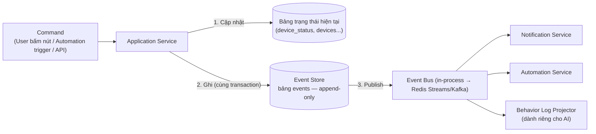

**Event Envelope chuẩn** (mọi event đều có cấu trúc chung): `event_id, event_type, schema_version, occurred_at, recorded_at, home_id, room_id, device_id, actor_type (user|system|automation_rule|ai_recommendation|device), actor_id, source (manual|automation|voice|mobile|dashboard|ai_suggested), payload`.

**Danh mục Event (Event Catalog):**

| Domain | Event | Actor điển hình | Ghi chú payload chính |
|---|---|---|---|
| **Auth** | `UserLoginEvent`, `UserLogoutEvent` | user | `channel` (dashboard/mobile), `ip_address` |
| **Gateway** | `GatewayConnectedEvent`, `GatewayDisconnectedEvent` | device | `rssi`, `firmware_version` |
| **Device — điều khiển** | `DeviceTurnOnEvent`, `DeviceTurnOffEvent`, `BrightnessChangedEvent`, `FanSpeedChangedEvent`, `TemperatureChangedEvent` | user, automation_rule | `previous_state`, `new_state`, `device_type` |
| **Device — cảm biến/an ninh** | `DoorOpenedEvent`, `DoorClosedEvent`, `MotionDetectedEvent`, `CameraViewedEvent` | device, user | `duration` (cho CameraViewedEvent) |
| **Automation** | `RuleCreatedEvent`, `AutomationExecutedEvent` | user, ai_recommendation | `rule_id`, `result` |
| **Notification** | `NotificationOpenedEvent` | user | `notification_id`, `latency` |
| **OTA** | `OTAStartedEvent`, `OTACompletedEvent` | system | `firmware_version`, `status` |
| **Provisioning** | `WiFiChangedEvent`, `ProvisionCompletedEvent`, `ClaimHomeCompletedEvent` | user, device | Tham chiếu `gateway_id`/`activation_token_id` |
| **AI** | `RecommendationGeneratedEvent`, `RecommendationConfirmedEvent`, `RecommendationRejectedEvent` | ai_recommendation, user | `recommendation_id`, `predicted_habit` |

> Danh mục mở rộng được bằng cách thêm giá trị `event_type` mới — không cần `ALTER TABLE` vì `events.event_type` là `VARCHAR`, không phải ENUM cứng.

**Event Bus — lộ trình:** MVP dùng in-process event emitter (đủ dùng 1 instance); khi scale nhiều instance chuyển sang **Redis Streams** (tận dụng lại Redis đã dùng cho cache/rate-limit ở Phần 15) — Kafka chỉ cân nhắc khi khối lượng event thật sự lớn (hàng triệu/ngày) và cần replay/partition phức tạp hơn.

### 18.3. Behavior Logging

**Nguyên tắc:** Event Store lưu sự kiện thô, tối giản. **Behavior Log Projector** (1 subscriber của Event Bus) nhận event thô, **làm giàu thêm ngữ cảnh** (tra `weekday`/`is_holiday`/`season`, tra `ambient_light`/`motion` gần nhất nếu có cảm biến, tính `latency` cho notification...) rồi ghi vào `user_behavior_logs` (bảng trung tâm — đặc tả đầy đủ ở `04_DATABASE_REFACTOR_SMARTHOME.md` mục 7.12) — 1 bảng phẳng, tối ưu cho feature engineering đọc trực tiếp mà không cần join/parse JSON lồng nhau.

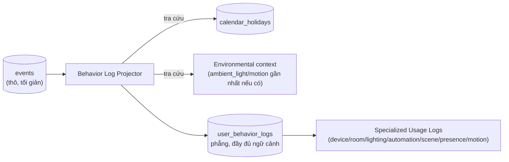

Ví dụ ghi thực tế theo kịch bản "20:00 bật đèn phòng khách 90% → giảm dần → tắt lúc 05:00": mỗi lần đổi độ sáng sinh 1 dòng `user_behavior_logs` với `previous_state`/`new_state` tham chiếu đúng giá trị dòng trước — lặp lại qua nhiều ngày cho phép Feature Engineering (18.4) tính trực tiếp "đường cong độ sáng theo giờ trong ngày".

Song song `user_behavior_logs`, hệ thống chiếu tiếp sang các bảng **hẹp, chuyên biệt** (cùng ghi từ Behavior Log Projector, không thay thế bảng trung tâm): `device_usage_logs` (thời lượng ON→OFF), `room_usage_logs` (hoạt động theo phòng), `lighting_usage_logs` (độ sáng theo giờ), `automation_execution_logs`, `scene_execution_logs`, `presence_logs` (arrived/left, `detection_method` phân biệt độ tin cậy — suy luận gián tiếp khi chưa có motion sensor thật), `motion_logs` (nullable tới khi có phần cứng).

### 18.4. AI Feature Store & Dataset

**Feature Store — Generic Entity-Attribute-Value (EAV), không phải bảng cột cứng:** nếu mỗi feature là 1 cột riêng (`preferred_brightness`, `average_sleep_time`...), thêm feature mới sẽ phải `ALTER TABLE`. Do đó `feature_store` thiết kế dạng EAV mở rộng `(entity_type, entity_id, feature_name, feature_value, value_type, computed_at)` — thêm feature mới chỉ là thêm dòng dữ liệu. Tách `feature_definitions` (catalog, đọc bởi Data Scientist, thay đổi hiếm) khỏi `feature_store` (giá trị đã tính, ghi bởi batch job, đổi liên tục) để versioning độc lập.

Danh mục feature chính (tính batch hàng ngày, xem đầy đủ ở `04_DATABASE_REFACTOR_SMARTHOME.md` mục 7.12): `daily_usage`, `room_usage`, `device_usage`, `preferred_brightness`/`preferred_temperature` (theo khung giờ, rolling 30 ngày), `average_sleep_time`/`average_wakeup_time`, `average_home_arrival`/`average_home_leave`, `night_mode_usage`, `energy_usage`, `automation_usage`, `scene_usage`.

**Dataset — "view export", không phải nguồn dữ liệu gốc:** `training_dataset` chỉ lưu metadata (khoảng thời gian, phiên bản feature set, loại model, `storage_uri` trỏ Object Storage dạng Parquet) — dữ liệu thật do ETL job xuất từ `user_behavior_logs` + `feature_store`, tách khỏi MySQL để không tải OLTP bằng truy vấn phân tích nặng. Hai hình dạng xuất, cùng 1 nguồn, không cần đổi schema khi đổi loại model:

| Hình dạng | Dùng cho |
|---|---|
| Tabular phẳng (1 dòng = 1 sự kiện, feature tổng hợp theo cửa sổ cố định) | Random Forest, XGBoost, LightGBM |
| Sequential theo cửa sổ thời gian (nhóm theo `home_id, device_id, ngày`, sắp xếp theo `time`) | LSTM, Transformer |

Cột nhãn quan trọng nhất trong dataset là `source` — lọc "chỉ học từ hành vi thủ công thật, bỏ qua kết quả do chính automation cũ gây ra" (tránh AI học lại chính rule cũ như thể đó là thói quen mới).

### 18.5. Data Pipeline

```mermaid
flowchart LR
    DEV["Device\n(Sensor/Relay/Camera)"] --> MQTT["MQTT\n(topic telemetry/command/status)"]
    MQTT --> BE["Backend\nDevice Ingest Service"]
    BE --> BUS["Event Bus"]
    BUS --> STORE[("Event Store\nevents — append-only")]
    STORE --> PROJ["Behavior Log Projector"]
    PROJ --> BLOG[("user_behavior_logs\n+ Specialized Usage Logs")]
    BLOG --> FE["Feature Engineering Job\n(batch, hàng ngày/hàng giờ)"]
    FE --> FSTORE[("Feature Store")]
    FSTORE --> DSEXPORT["Dataset Export Job"]
    BLOG --> DSEXPORT
    DSEXPORT --> TDS[("training_dataset\n(metadata) + Object Storage (Parquet)")]
    TDS --> TRAIN["Model Training\n(offline, ngoài phạm vi Backend runtime)"]
    TRAIN --> REGISTRY[("model_versions\n(reserved)")]
    REGISTRY --> INFER["Inference Service"]
    FSTORE -.->|"feature realtime tại thời điểm dự đoán"| INFER
    INFER --> PRED[("prediction_history")]
    PRED --> REC["Recommendation Engine\n(18.6)"]
    REC --> RECHIST[("recommendation_history")]
    RECHIST -->|"User Confirm"| AUTOMATION[("automation_rules")]
    RECHIST -->|"User Reject/Feedback"| FEEDBACK[("user_feedback")]
    FEEDBACK -.->|"vòng lặp cải thiện model"| TRAIN
```

**Ranh giới batch vs realtime:** Realtime (Device→MQTT→Backend→Event Bus→Event Store→Behavior Log, độ trễ mili-giây tới giây); Batch (Feature Engineering/Dataset Export/Model Training, chạy định kỳ, không chặn luồng ingest chính); Inference đọc `feature_store` đã tính sẵn kết hợp state hiện tại, không tính lại feature mỗi lần dự đoán.

### 18.6. Recommendation Engine — an toàn tuyệt đối, AI không bao giờ tự điều khiển

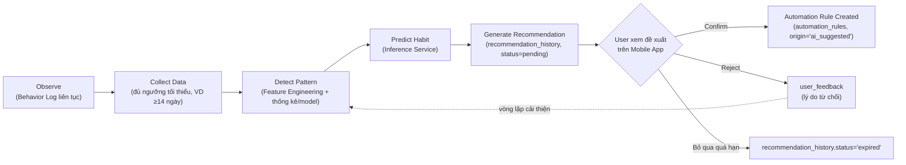

Không nhánh nào đi thẳng từ "Predict Habit" tới thực thi lệnh thiết bị — **mọi con đường phải qua User Confirm**. Ràng buộc kiến trúc cứng: Recommendation Service **không có quyền ghi `device_commands`**, chỉ có quyền ghi `recommendation_history`; chỉ hành động của chính người dùng mới có quyền ghi `automation_rules`.

`recommendation_history` có vòng đời `pending → confirmed | rejected | expired`, tham chiếu `prediction_history` để truy vết ngược **acceptance rate** (% đề xuất được chấp nhận) — thước đo chất lượng quan trọng nhất cho sản phẩm dạng gợi ý, quan trọng hơn độ chính xác thống kê thuần tuý. Khi user từ chối/chỉnh sửa trước khi xác nhận, giá trị chỉnh sửa (`user_feedback.modified_value`) có giá trị làm nhãn tốt hơn cả dữ liệu hành vi thô cho chu kỳ huấn luyện tiếp theo (active learning).

**Ngưỡng an toàn:** không sinh đề xuất nếu chưa đủ ví dụ lặp lại (VD ≥10-14 lần trong 14-30 ngày); chỉ sinh khi `confidence_score` vượt ngưỡng cấu hình được; giới hạn số đề xuất/tuần cho 1 nhà để tránh spam.

### 18.7. Sequence Diagram

**Ingest + Behavior Logging (realtime):**

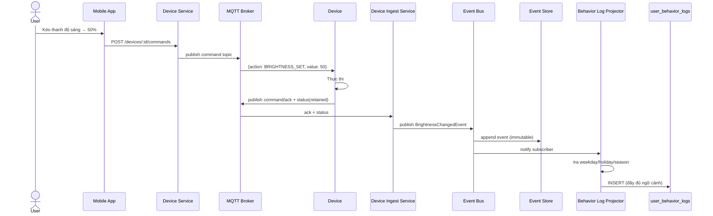

**Recommendation Generation + Confirm:**

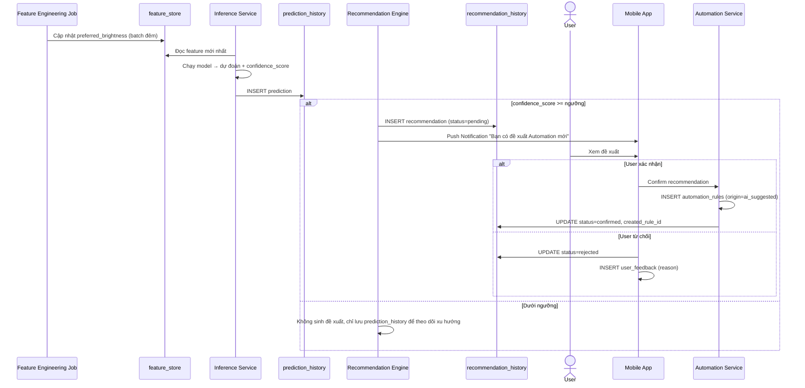

### 18.8. Mermaid Architecture tổng thể

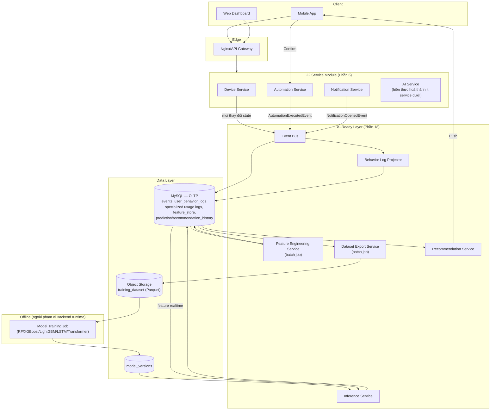

### 18.9. Roadmap tích hợp AI-Ready (V2 → V3)

| Version | Phạm vi | Điều kiện AI |
|---|---|---|
| **V1 (hiện tại)** | Đo lường thuần, không có điều khiển, không có automation | Baseline đang review |
| **V2 — Rule Engine (Phần 12)** | IF/Condition/Action thủ công; **bắt đầu triển khai Event Sourcing + Behavior Logging ngay từ phase này** dù chưa có AI nào chạy | Chưa có model — nhưng bắt buộc bật `events`/`user_behavior_logs` **từ ngày đầu vận hành thương mại**, vì dữ liệu lịch sử không "bật hồi tố" được |
| **V2.5 — Feature Store & Dataset khởi động** | Feature Engineering Job chạy nền, Dataset Export Job xuất thử để khảo sát chất lượng dữ liệu | Phát hiện sớm dữ liệu thiếu/lệch trước khi đầu tư train model thật |
| **V3 — AI Behavior Learning** | Inference Service + Recommendation Engine đầy đủ; model đầu tiên nên chọn phạm vi hẹp (VD `preferred_brightness` 1 loại phòng) trước khi mở rộng | Yêu cầu tối thiểu ≥30-60 ngày dữ liệu behavior log liên tục của 1 nhà |
| **V3.1 — Mở rộng loại habit** | Thêm dần feature còn lại (giờ ngủ/thức dậy, giờ về/rời nhà, energy_usage) theo thứ tự phần cứng sẵn sàng | DB đã có sẵn chỗ chứa (nullable) từ V2 |
| **V3.2 — Active Learning & Model Registry** | Vòng lặp `user_feedback` → retrain định kỳ; `model_versions` mở rộng (A/B test, rollback model) | Yêu cầu đủ khối lượng `recommendation_history`/`user_feedback` để acceptance rate có ý nghĩa thống kê |

**Nguyên tắc xuyên suốt:** Event Sourcing, Behavior Logging, và Feature Store phải được triển khai từ **V2 (Rule Engine)**, không chờ tới V3 (AI) — giá trị dữ liệu hành vi tăng theo độ dài lịch sử tích luỹ được.

---

## 19. ROADMAP REFACTOR

| Phase | Nội dung | Vì sao ưu tiên |
|---|---|---|
| **Phase 0 — Kiến trúc nền tảng** | Thiết lập Layered Architecture (Controller/Service/Repository/Domain); tách `Device Ingest Service` dùng chung cho HTTP+MQTT (vá vấn đề #5); chuẩn hoá response envelope; validation schema tập trung | Mọi domain mới đều build trên nền tảng này — làm sai ở đây sẽ nhân nợ kỹ thuật lên 22 module |
| **Phase 1 — Vá lỗ hổng bảo mật khẩn cấp** | Vá `GET /api/device/sensors` rò rỉ secret toàn hệ thống (#1); mã hoá secret tại rest (#6); tách JWT secret Dashboard/Mobile | Rủi ro cao nhất, phải xong **trước khi có khách hàng thứ hai** dù các phase khác chưa xong |
| **Phase 2 — Domain Customer/Home/Room** | Customer Service, Smart Home Service, Room Service, Device Service tổng quát hoá khỏi ENUM cứng | Nền tảng nghiệp vụ cốt lõi — mọi API/MQTT/Automation sau này đều tham chiếu `home_id`/`room_id` |
| **Phase 3 — Provisioning & Activation** | Provision Service, Activation Service, Pairing Service, RBAC Service (`operator_home_access`) | Điều kiện để bắt đầu bán hàng loạt theo mô hình Claim đã thiết kế |
| **Phase 4 — MQTT redesign** | Topic mới có `home_id`, TLS Broker 2, tách Heartbeat khỏi Telemetry, bỏ `mqttTracker.ts` regex giòn | Cần thiết trước khi scale số lượng gateway lớn |
| **Phase 5 — Gateway/Monitoring/Auth Mobile** | Gateway Service đầy đủ, Monitoring Service (Redis + WebSocket thật, tận dụng `ws`), Auth Service Mobile (Refresh Token) | Đáp ứng yêu cầu Dashboard mới (`05_FRONTEND_REFACTOR_SMARTHOME.md`) và Mobile App bắt đầu nối API thật |
| **Phase 6 — OTA & Firmware** | OTA Service, Firmware Service, Job Queue (BullMQ/Redis) | Cần thiết khi fleet đủ lớn để phải cập nhật hàng loạt |
| **Phase 7 — Logging tách bảng** | Log Service với 9+ loại log riêng, retention riêng, tách khỏi `audit_log` gộp hiện tại | Dọn nợ kỹ thuật logging, đáp ứng yêu cầu Logs Center mới ở Dashboard |
| **Phase 8 — Automation/Scene/Schedule** | Automation Service (MVP rule engine đơn giản), Scene Service, Schedule Service | Tính năng giá trị cao, nhưng phụ thuộc Phase 2 (Device/Room) đã ổn định |
| **Phase 9 — Notification nâng cấp** | Bỏ `target_role='admin'` hard-code, thêm Push (FCM/APNs), severity chuẩn hoá | Song song Phase 8, không chặn phase khác |
| **Phase 10 — Camera & AI-Ready hạ tầng (Phần 18)** | Camera Service (metadata + snapshot); Event Bus + Event Store + Behavior Log Projector (Phần 18.2-18.3) — **bắt đầu ngay khi Phase 2 (Domain Home/Room) xong**, không chờ tới Phase 10 mới bật ghi dữ liệu hành vi | Camera không MVP bắt buộc, nhưng Event Sourcing/Behavior Logging nên bật sớm nhất có thể (ngay sau Phase 2) vì dữ liệu lịch sử không "bật hồi tố" được — xem Phần 18.9 |
| **Phase 11 — Scalability hardening** | Redis-backed rate limiter, connection pool theo tải thực tế, partition/rollup Telemetry (xem tài liệu Database riêng) | Chỉ cấp thiết khi lưu lượng thực tế tiệm cận giới hạn hiện tại — không chặn các phase nghiệp vụ |
| **Phase 12 — AI Behavior Learning (Phần 18.6, V3)** | Feature Engineering Job, Inference Service, Recommendation Engine chạy model thật | Yêu cầu tối thiểu 30-60 ngày dữ liệu Behavior Log liên tục — chỉ khả thi sau khi Phase 10 đã chạy đủ lâu |

**Nguyên tắc xuyên suốt:** Phase 0–2 là nền tảng bắt buộc đi trước; Phase 1 (vá bảo mật) có thể chạy song song Phase 0 vì mức độ khẩn cấp; các phase từ 4 trở đi có thể triển khai song song bởi các nhóm khác nhau một khi ranh giới module (Phần 6) đã rõ ràng; phần Event Sourcing/Behavior Logging của Phase 10 nên tách ra chạy sớm song song Phase 2-3 thay vì chờ đúng thứ tự số — đây là ngoại lệ có chủ đích vì chi phí trì hoãn ghi dữ liệu hành vi cao hơn nhiều so với trì hoãn Camera Service.
