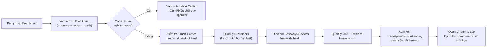
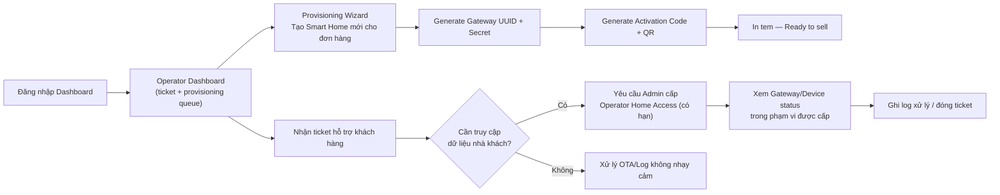

# 05_FRONTEND_REFACTOR_SMARTHOME.md

> Thiết kế lại toàn diện Frontend — từ **IoT Device Management Console** sang **Commercial Smart Home Platform (Admin/Operator Web Console)**.
> Vai trò biên soạn: Principal Product Designer / Senior UX / Senior Frontend Architect / Smart Home PM / Solution Architect.
> Tài liệu này **chỉ thiết kế — không viết code, không sửa code**. Nó ràng buộc chặt với 3 tài liệu kiến trúc đã có trong repo:
> - [`00_PROJECT_ANALYSIS_SMARTHOME.md`](00_PROJECT_ANALYSIS_SMARTHOME.md) — mô hình dữ liệu `Customer → Smart Home → Room → Device → Sensor → Telemetry`, RBAC 3 role.
> - [`01_SMART_HOME_PRODUCT_ARCHITECTURE.md`](01_SMART_HOME_PRODUCT_ARCHITECTURE.md) — nguyên tắc **User = Mobile only, Dashboard = Admin/Operator only**, Claim/Activation flow.
> - [`02_SMART_HOME_WIFI_PROVISIONING.md`](02_SMART_HOME_WIFI_PROVISIONING.md) — Gateway/Node/Camera provisioning, không thuộc phạm vi UI Dashboard nhưng Dashboard cần màn hình theo dõi (Provision Status, OTA).
>
> Toàn bộ source code frontend thực tế đã được đọc: `frontend/src/app/**`, `frontend/src/features/{auth,dashboard,devices,users,audit,logs,notifications}/**`, `frontend/src/widgets/app-shell/**`, `frontend/src/shared/**`, `frontend/src/app/globals.css`.
>
> **Ghi chú (2026-09-23):** Phần review hiện trạng (Phần 1–2) phản ánh code frontend tại commit `407eb1d` (2026-07-11), **trước** đợt refactor ở `06_FRONTEND_REFACTOR_PROGRESS.md` (commit `ccdfb89`). Nhiều file được trích dẫn đã bị xoá/viết lại sau đó — số dòng `file:line` có thể không còn khớp với code hiện tại.

---

## MỤC LỤC

0. [Tóm tắt điều hành](#0-tóm-tắt-điều-hành)
1. [Review toàn bộ giao diện hiện tại](#1-review-toàn-bộ-giao-diện-hiện-tại)
2. [Bảng tổng hợp vấn đề](#2-bảng-tổng-hợp-vấn-đề)
3. [Nguyên tắc thiết kế mới](#3-nguyên-tắc-thiết-kế-mới)
4. [Information Architecture & Sitemap mới](#4-information-architecture--sitemap-mới)
5. [Sidebar mới](#5-sidebar-mới)
6. [Admin Flow / Operator Flow / User Flow (tham chiếu Mobile)](#6-admin-flow--operator-flow--user-flow-tham-chiếu-mobile)
7. [Wireframe dạng text — từng trang](#7-wireframe-dạng-text--từng-trang)
8. [Component Tree](#8-component-tree)
9. [Thiết kế chi tiết từng trang](#9-thiết-kế-chi-tiết-từng-trang)
10. [Đề xuất UI Component / Design System components](#10-đề-xuất-ui-component--design-system-components)
11. [Màu sắc](#11-màu-sắc)
12. [Typography](#12-typography)
13. [Spacing & Layout Grid](#13-spacing--layout-grid)
14. [Icon Mapping](#14-icon-mapping)
15. [Design System tổng hợp](#15-design-system-tổng-hợp)
16. [Responsive — đánh giá & đề xuất](#16-responsive--đánh-giá--đề-xuất)
17. [Roadmap Refactor UI](#17-roadmap-refactor-ui)

---

## 0. TÓM TẮT ĐIỀU HÀNH

Giao diện hiện tại (`frontend/src/features/{dashboard,devices,users,audit,logs}`) là một **admin console quản lý thiết bị phẳng** — đúng bản chất đồ án IoT: 1 sidebar 4-5 mục, 1 bảng `devices` chia tab Gateway/Sensor, không có khái niệm khách hàng, nhà, phòng. Về mặt UI framework (Next.js App Router, feature-sliced, TailwindCSS v4, next-themes dark mode, SWR) codebase **đã đủ tốt về kỹ thuật** — vấn đề không nằm ở công nghệ mà ở **mô hình thông tin (Information Architecture)** phía sau nó.

Ba thay đổi tư duy cốt lõi của tài liệu này:

| # | Từ (hiện tại) | Sang (đề xuất) |
|---|---|---|
| 1 | Sidebar tổ chức theo **thiết bị mạng** (Dashboard/Devices/Audit/Users) | Sidebar tổ chức theo **thực thể kinh doanh** (Smart Homes/Customers/Gateways/Rooms/Devices/Automation/OTA/Logs) |
| 2 | 1 Dashboard chung cho mọi role đăng nhập được | **2 Dashboard tách biệt hoàn toàn**: Admin Dashboard (business + system health) và Operator Dashboard (operations + support) |
| 3 | 1 bảng Device phẳng, phân loại Gateway/Sensor | Phân cấp **Customer → Smart Home → Room → Device → Sensor → Telemetry**, Device luôn thuộc 1 Room |

Dashboard này **không phục vụ khách hàng cuối** — người dùng cuối dùng Mobile App (đã thiết kế ở `01_SMART_HOME_PRODUCT_ARCHITECTURE.md` Phần 12). Mọi màn hình trong tài liệu này được thiết kế thuần cho **ADMIN** (vận hành nền tảng) và **OPERATOR** (hỗ trợ kỹ thuật/kho vận).

---

## 1. REVIEW TOÀN BỘ GIAO DIỆN HIỆN TẠI

### 1.1. Sidebar & Navigation — [`Sidebar.tsx`](../frontend/src/widgets/app-shell/Sidebar.tsx)

| Tiêu chí | Đánh giá |
|---|---|
| UX | 4 mục phẳng (Dashboard/Thiết bị/Audit Log/Người dùng), không có nhóm, không có phân cấp — phù hợp app nhỏ, **không phù hợp platform có 15+ module** như yêu cầu mới. |
| UI | Sạch, tối giản, dark mode đầy đủ — **điểm cộng đáng giữ lại** (component pattern tốt). |
| Navigation | Không hỗ trợ collapse, không hỗ trợ nhóm con (section header), không hỗ trợ badge số lượng (ví dụ "Alerts (3)"). |
| Information Architecture | Sai gốc rễ: điều hướng theo **loại thiết bị kỹ thuật** (`Cpu` icon dùng chung cho mọi "Thiết bị") thay vì theo **đơn vị kinh doanh** (Nhà/Khách hàng/Phòng). |
| Khả năng mở rộng | Thêm mục mới phải sửa cứng mảng `NAV_LINKS` (không đọc từ RBAC), không phân biệt nav theo role — Operator thấy y hệt Admin. |
| Vấn đề | `NAV_LINKS` trong `Sidebar.tsx:10-15` và `NAV_ITEMS` trong [`constants.ts`](../frontend/src/widgets/app-shell/constants.ts) là **hai danh sách điều hướng trùng lặp, không đồng bộ** (constants.ts có thêm "Logs" nhưng Sidebar.tsx thì không dùng nó) — dấu hiệu rõ của kiến trúc đang được sửa dở dang. |

### 1.2. Header — [`Header.tsx`](../frontend/src/widgets/app-shell/Header.tsx)

| Tiêu chí | Đánh giá |
|---|---|
| UX | Đồng hồ realtime to bản chiếm chỗ (`ClockDisplay`) — trang trí hơn là hữu ích cho vận hành; giống dashboard "trình chiếu" hơn dashboard làm việc. |
| Notification | Chỉ hiện với `isAdmin` (`Header.tsx:116`) — Operator **không thấy được thông báo nào**, dù Operator là người trực tiếp xử lý cảnh báo/ticket hỗ trợ theo yêu cầu mới. Đây là lỗi thiết kế cần sửa ngay. |
| Breadcrumb | [`Breadcrumb.tsx`](../frontend/src/widgets/app-shell/Breadcrumb.tsx) dùng bảng tra cứu cứng `ROUTE_LABELS` — không tự sinh được breadcrumb cho cấu trúc lồng sâu mới (`Smart Homes / Nhà Quận 7 / Rooms / Phòng khách / Đèn trần`). |
| Thiếu | Không có ô tìm kiếm toàn cục (global search) — với hàng nghìn Smart Home/Device, Admin/Operator cần tìm nhanh theo `home_id`, `gateway_uid`, tên khách hàng, số điện thoại. |
| Thiếu | Không có bộ chọn ngữ cảnh (ví dụ "đang xem theo quyền hỗ trợ nhà nào" cho Operator có `operator_home_access`). |

### 1.3. Login — [`LoginPage.tsx`](../frontend/src/features/auth/pages/LoginPage.tsx)

| Tiêu chí | Đánh giá |
|---|---|
| UI | Nền gradient tím-hồng (`from-[#c850c0] to-[#4158d0]`), bo tròn 999px cho input, font "Poppins-Bold" — phong cách **template UI Bootstrap/Dribbble năm 2018**, hoàn toàn lệch khỏi định hướng "Enterprise/IoT Dashboard hiện đại, sạch" mà dự án hướng tới (Grafana/ThingsBoard/Azure IoT Central không dùng gradient sặc sỡ này). |
| Business | Form chỉ có `username`/`password` — đúng cho Admin/Operator nội bộ (không cần OTP/social login vì đây không phải Mobile App khách hàng) — **giữ nguyên tinh thần đơn giản là đúng**, chỉ cần đổi lại thẩm mỹ. |
| Thiếu | Không phân biệt "Đây là Dashboard nội bộ — khách hàng vui lòng dùng Mobile App" — nếu 1 khách hàng lỡ vào nhầm URL dashboard, không có thông điệp định hướng. |

### 1.4. Dashboard — [`DashboardPage.tsx`](../frontend/src/features/dashboard/pages/DashboardPage.tsx)

| Tiêu chí | Đánh giá |
|---|---|
| UX | 1 Dashboard duy nhất cho mọi role — copy "Welcome back, {user}. **IoT device management**, alerts and security monitoring" (`DashboardPage.tsx:34-38`) tự bạch đúng bản chất hiện tại: **device management tool**, không phải business platform. |
| KPI | 4 thẻ: Total Gateway / Total Sensor / Gateway Online / Sensor Online (`useDashboardStats.ts`) — thiếu hoàn toàn các chỉ số kinh doanh: **Tổng khách hàng, Tổng Smart Home, Doanh thu/Kích hoạt mới, Cảnh báo, Firmware/OTA, MQTT Status**. |
| Business Flow | Không phản ánh mô hình bán hàng (Provisioning/Activation) — Admin xem dashboard này không biết được bao nhiêu Home đang `unclaimed` chờ bán, bao nhiêu vừa `activated`. |
| Redundant | "Device resiliency" card (`DashboardPage.tsx:74-90`) lặp lại y hệt 4 số liệu KPI phía trên — không thêm giá trị thông tin. |
| Thiếu | "Recent events" (`DashboardPage.tsx:113-121`) là card rỗng cứng — không nối dữ liệu thật (dead UI). |
| Role-check | Dùng `canCreateDevice` để hiện nút "+ Add Device" ngay trên Dashboard (`DashboardPage.tsx:40-47`) — hành động tạo thiết bị bị trộn lẫn vào trang tổng quan, sai nguyên tắc "Dashboard = xem tổng quan, không phải nơi thao tác nghiệp vụ chi tiết". |

### 1.5. Devices List — [`DevicesPage.tsx`](../frontend/src/features/devices/pages/DevicesPage.tsx)

| Tiêu chí | Đánh giá |
|---|---|
| UX | Tab Gateway/Sensor (`DevicesPage.tsx:42,188-213`) đúng bản chất "Device/Gateway/Node Manager" đã bị `00_PROJECT_ANALYSIS_SMARTHOME.md` Phần 2 chỉ ra là **sai đơn vị quản lý**. Khách hàng/Operator không nghĩ theo "danh sách Gateway toàn hệ thống" mà nghĩ theo "nhà nào có gateway gì". |
| Data model | Bảng liệt kê thiết bị **không có cột Nhà/Khách hàng/Phòng sở hữu** — đúng như lỗ hổng tenant isolation đã nêu ở `00_PROJECT_ANALYSIS_SMARTHOME.md` mục 1.5.#6. Nếu giữ nguyên UI này khi có nhiều khách hàng, Admin sẽ thấy **một bảng khổng lồ trộn lẫn thiết bị của mọi nhà** không lọc được theo `home_id`. |
| Thao tác | Khóa/Mở khóa/Xóa/Kích hoạt (`DevicesPage.tsx:299-323`) là hành động **cấp hệ thống** phù hợp Admin, nhưng Operator hiện có quyền y hệt (`canUpdateDeviceStatus`) trên **mọi thiết bị của mọi khách hàng** — vi phạm nguyên tắc least-privilege (`operator_home_access` có `expires_at`/`reason` chưa được phản ánh ở UI này chút nào). |
| Đăng ký thiết bị | `AddDeviceModal.tsx` _(đã xoá ở commit `ccdfb89`)_ chỉ hỏi Tên/Loại(sensor|gateway)/Vị trí tự do (text) — không có bước chọn **Smart Home** hoặc **Room**, khớp với lỗi thiết kế `devices.location VARCHAR` tự do đã nêu ở tài liệu DB. |
| Bảo mật UI | `RegisterModal.tsx` _(đã xoá ở commit `ccdfb89`)_ hiển thị **Secret Key dạng plaintext trên UI** để copy — đúng với thiết kế backend hiện tại nhưng **mâu thuẫn trực tiếp** với `01_SMART_HOME_PRODUCT_ARCHITECTURE.md` mục 5.3 ("API không có bất kỳ endpoint nào trả `gateway_secret` cho client") — UI này phải bị loại bỏ hoàn toàn trong mô hình mới (secret chỉ tồn tại lúc Operator flash tại kho, không qua Dashboard). |

### 1.6. Device Detail — [`DeviceDetailPage.tsx`](../frontend/src/features/devices/pages/DeviceDetailPage.tsx)

| Tiêu chí | Đánh giá |
|---|---|
| UX | Trang chi tiết 1 thiết bị đơn lẻ, không có breadcrumb ngữ cảnh "thuộc nhà nào/phòng nào" — khi có Room, trang này phải nằm *trong* ngữ cảnh Nhà → Phòng, không phải đứng độc lập theo `/devices/:id`. |
| Data | Hard-code field `payload?.temperature`/`payload?.humidity` (`DeviceDetailPage.tsx:251,257`) — không mở rộng được cho camera, relay, cảm biến khói/gas như đã cảnh báo ở `00_PROJECT_ANALYSIS_SMARTHOME.md` mục 1.5.#10. Component [`SensorChart.tsx`](../frontend/src/features/devices/components/SensorChart.tsx) cùng vấn đề (dòng 52-55 chỉ đọc 2 field cố định). |
| Thiếu | Không có UI điều khiển thiết bị (bật/tắt relay) — đúng vì Admin/Operator hiếm khi cần điều khiển trực tiếp, nhưng cũng không có nút "Yêu cầu snapshot camera để debug" hay "Xem lịch sử OTA của thiết bị này" mà Operator cần khi hỗ trợ. |
| CSS bug nhỏ | Toàn trang này **không có class `dark:` nào** (khác hẳn các trang còn lại đã có dark mode đầy đủ) — ví dụ `text-gray-900` ở dòng 141 không có `dark:text-slate-100` — bằng chứng code đã "chạy trước, dark mode thêm sau" nhưng bỏ sót trang này. |

### 1.7. Users — `UsersPage.tsx` _(đã xoá ở commit `ccdfb89`)_

| Tiêu chí | Đánh giá |
|---|---|
| Khái niệm | "Users" ở đây thực chất là **quản lý tài khoản nhân viên nội bộ** (`admin`/`operator`), không phải khách hàng — tên trang gây hiểu lầm nghiêm trọng khi Sidebar mới có thêm mục "Customers" thật sự. Cần đổi tên rõ ràng thành "Nhân viên" / "Team Members" / "Staff Accounts" để tránh trộn với module Customer mới. |
| RBAC | Chỉ `admin` mới thấy trang (check phía client dòng 229) — đúng hướng, nhưng thiếu vai trò "gán Operator vào Smart Home cụ thể" (`operator_home_access`) — đây mới là màn hình RBAC quan trọng nhất cần bổ sung trong mô hình mới, hiện chưa tồn tại ở đâu cả. |
| UI | Modal đổi mật khẩu & tạo tài khoản làm tốt (validate rõ ràng, có empty state) — **giữ nguyên pattern component này**, chỉ cần thêm field "Role" (Admin/Operator) khi tạo thay vì ngầm định operator. |

### 1.8. Audit Log — `AuditPage.tsx` _(đã xoá ở commit `ccdfb89`)_ & `LogsPage.tsx` _(đã xoá ở commit `ccdfb89`)_

| Tiêu chí | Đánh giá |
|---|---|
| Chức năng | `AuditPage.tsx` là trang **được làm kỹ nhất trong toàn bộ hệ thống hiện tại** (filter, phân trang, bulk delete, empty state, toast, event-type theo role) — đáng làm mẫu UI pattern cho các trang Log mới. |
| Trùng lặp | `LogsPage.tsx` là **trang chết hoàn toàn** — comment tự nhận "placeholder – hiện chỉ hiển thị bảng rỗng" (`LogsPage.tsx:3`), route `/logs` tồn tại trong `constants.ts` nhưng không có trong `Sidebar.tsx` (mục 1.1) → **2 nguồn sự thật về nav không khớp nhau, và 1 route rỗng bị treo**. Đây là nợ kỹ thuật cần dọn trước khi thêm 9 loại log mới (Gateway/Device/Provision/MQTT/Security/Authentication/User Activity/Automation/OTA/Error) theo yêu cầu. |
| Vấn đề bảo mật UI | `EVENT_TYPES_BY_ROLE` (`AuditPage.tsx:18-27`) là **bản sao chép tay từ backend**, tự nhận trong comment là "chỉ để UX, backend vẫn thực thi" — chấp nhận được nhưng rủi ro drift cao khi thêm nhiều loại log mới; cần cân nhắc lấy danh mục này qua API thay vì hard-code 2 nơi. |
| Thiếu | Không có阈 phân loại theo cấp độ nghiêm trọng kiểu Notification Center (Critical/Warning/Info/Success) — `EVENT_STYLES` (`AuditLogTable.tsx:15-25`) chỉ tô màu theo loại sự kiện cụ thể, không theo severity chuẩn hoá. |

### 1.9. Notification — [`useNotifications.ts`](../frontend/src/features/notifications/hooks/useNotifications.ts) + dropdown trong Header

| Tiêu chí | Đánh giá |
|---|---|
| Kiến trúc | Chỉ tồn tại dưới dạng **dropdown nhỏ trong Header** (`Header.tsx:132-168`), không có trang riêng `/notifications` — không đủ cho khối lượng thông báo ở quy mô platform (hàng nghìn nhà, hàng trăm cảnh báo/ngày). |
| Data | `TYPE_META` (`Header.tsx:41-48`) chỉ có 6 loại gắn với thiết bị (LOGIN/DEVICE_REGISTER/DEVICE_BLOCKED/...) — không có notification cấp độ **kinh doanh** (khách hàng mới kích hoạt, warranty request, OTA fleet thất bại hàng loạt). |
| RBAC | Giới hạn `isAdmin` mới thấy (đã nêu ở 1.2) — cần mở cho Operator với tập loại thông báo phù hợp vai trò (ticket hỗ trợ, cảnh báo thiết bị được cấp quyền). |

### 1.10. Design Tokens hiện tại — [`globals.css`](../frontend/src/app/globals.css)

| Tiêu chí | Đánh giá |
|---|---|
| Màu | `--background: #F6F8FB` (sáng)/`#0f172a` (tối) — nền xám-xanh nhạt kiểu SaaS chung chung, **không có màu thương hiệu** (brand color) nào được định nghĩa ở tầng token — toàn bộ `blue-600`/`violet-600`/`emerald-600`/`amber-600`/`red-600` được rải trực tiếp khắp các file (`bg-blue-600`, `text-violet-600`...) chứ không qua biến CSS. Đây là **nợ kỹ thuật thiết kế lớn nhất**: đổi màu thương hiệu hiện tại phải sửa hàng trăm chỗ hard-code thay vì sửa 1 file token. |
| Font | Chỉ khai báo `--font-sans`/`--font-mono` (Geist) — không có thang chữ (type scale) chuẩn hoá, kích thước chữ rải rác `text-lg`/`text-sm`/`text-2xl`/`text-[11px]`/`text-[10px]` tự do trong từng component. |
| Spacing | Không có token spacing riêng — dùng trực tiếp Tailwind mặc định, khá nhất quán (`p-4`, `gap-3`, `rounded-md`) nhưng không hề được đặt tên/tài liệu hoá thành design system chính thức. |

---

## 2. BẢNG TỔNG HỢP VẤN ĐỀ

| # | Vấn đề | Mức độ | Trang/File | Hướng khắc phục (xem phần liên quan) |
|---|---|---|---|---|
| 1 | 1 Dashboard chung cho mọi role, không tách Admin/Operator | Nghiêm trọng | `DashboardPage.tsx` | Phần 9.1, 9.2 |
| 2 | Sidebar tổ chức theo thiết bị mạng, không theo Home/Room/Customer | Nghiêm trọng | `Sidebar.tsx` | Phần 5 |
| 3 | Devices không thuộc Room/Home nào — bảng phẳng toàn cục | Nghiêm trọng | `DevicesPage.tsx`, `AddDeviceModal.tsx` | Phần 9.6–9.7 |
| 4 | Secret Key hiển thị plaintext trên Dashboard UI | Nghiêm trọng (bảo mật) | `RegisterModal.tsx` | Phần 9.6 — loại bỏ hoàn toàn |
| 5 | 2 nguồn khai báo Nav không khớp nhau (`Sidebar.tsx` vs `constants.ts`) | Trung bình | Cả 2 file | Phần 5 — 1 nguồn duy nhất theo RBAC |
| 6 | `/logs` là trang chết (placeholder rỗng) trong khi cần 10 loại log | Nghiêm trọng | `LogsPage.tsx` | Phần 9.11 |
| 7 | Notification chỉ có dropdown, chỉ Admin thấy | Trung bình | `Header.tsx`, `useNotifications.ts` | Phần 9.12 |
| 8 | Không có module Customer | Nghiêm trọng | — (chưa tồn tại) | Phần 9.5 |
| 9 | Không có Provisioning/Activation UI | Nghiêm trọng | — (chưa tồn tại) | Phần 9.8 |
| 10 | Không có Automation Rule Engine UI | Cao | — (chưa tồn tại) | Phần 9.13 |
| 11 | Không có OTA UI | Cao | — (chưa tồn tại) | Phần 9.14 |
| 12 | Trang "Users" thực chất là nhân viên nội bộ, tên gây nhầm với Customer | Trung bình | `UsersPage.tsx` | Đổi tên "Team Members", tách khỏi Customer |
| 13 | Không có UI cho `operator_home_access` (cấp quyền hỗ trợ có thời hạn) | Cao | — (chưa tồn tại) | Phần 9.15 |
| 14 | Login page thẩm mỹ lệch tông Enterprise (gradient tím, bo tròn 999px) | Thấp | `LoginPage.tsx` | Phần 9.16 |
| 15 | Không có màu thương hiệu ở tầng token, màu rải rác hard-code | Trung bình | `globals.css` + toàn bộ component | Phần 11, 15 |
| 16 | `DeviceDetailPage.tsx` thiếu toàn bộ class dark mode | Thấp | `DeviceDetailPage.tsx` | Dọn kỹ thuật khi refactor trang |
| 17 | Hard-code field `temperature`/`humidity`, không mở rộng loại sensor khác | Cao | `DeviceDetailPage.tsx`, `SensorChart.tsx` | Phần 9.7 — sensor theo `sensor_type` động |
| 18 | Không có Global Search | Trung bình | `Header.tsx` | Phần 9 (Header mới) |
| 19 | Dashboard trộn hành động nghiệp vụ ("+ Add Device") vào trang tổng quan | Thấp | `DashboardPage.tsx` | Tách hành động ra trang quản lý tương ứng |

---

## 3. NGUYÊN TẮC THIẾT KẾ MỚI

1. **Dashboard chỉ dành cho ADMIN và OPERATOR.** Không tồn tại bất kỳ màn hình nào trong Dashboard hướng tới khách hàng cuối. Nếu 1 tài khoản `role=USER` cố truy cập → màn hình chặn rõ ràng "Vui lòng sử dụng Mobile App" (không chỉ trả lỗi 403 câm lặng).
2. **Đơn vị điều hướng là thực thể kinh doanh, không phải thiết bị mạng.** Cây thông tin luôn đi theo `Customer → Smart Home → Room → Device → Sensor`, Gateway là chi tiết kỹ thuật nằm *bên trong* 1 Smart Home, không phải mục ngang hàng với Home.
3. **Admin nhìn Business + System Health. Operator nhìn Operations + Support.** Không dùng chung 1 Dashboard, không dùng chung 1 bộ KPI.
4. **RBAC phải hiện diện trên UI, không chỉ ở backend.** Mọi hành động Operator thực hiện trên 1 Smart Home cụ thể phải thể hiện rõ "đang thao tác trong phạm vi quyền truy cập tạm thời, hết hạn lúc X, lý do Y" — phản ánh đúng bảng `operator_home_access`.
5. **Không hiển thị secret/credential nhạy cảm qua Dashboard.** Gateway Secret/Device Secret không bao giờ xuất hiện trên bất kỳ màn hình nào (kế thừa nguyên tắc bảo mật ở `01_SMART_HOME_PRODUCT_ARCHITECTURE.md`).
6. **Mọi danh mục (loại phòng, loại thiết bị, loại log, loại sự kiện) phải là dữ liệu có thể mở rộng qua UI quản trị, không hard-code trong component.**
7. **Thẩm mỹ: Enterprise IoT Dashboard — sạch, ít màu, nhiều khoảng trắng/xám, màu nhấn (đỏ/cam/vàng) chỉ dùng cho trạng thái và hành động, không dùng để trang trí.**

---

## 4. INFORMATION ARCHITECTURE & SITEMAP MỚI

```mermaid
flowchart TD
    ROOT["Web Dashboard\n(ADMIN / OPERATOR only)"]

    ROOT --> DASH["Dashboard\n(2 biến thể theo role)"]
    ROOT --> HOMES["Smart Homes"]
    ROOT --> CUST["Customers"]
    ROOT --> GW["Gateways"]
    ROOT --> DEV["Devices"]
    ROOT --> AUTO["Automation"]
    ROOT --> OTA["OTA / Firmware"]
    ROOT --> NOTIF["Notification Center"]
    ROOT --> LOGS["Logs"]
    ROOT --> TEAM["Team & Access"]
    ROOT --> SETTINGS["Settings"]
    ROOT --> PROFILE["Profile"]

    HOMES --> HOME_LIST["Danh sách Smart Home"]
    HOMES --> HOME_DETAIL["Chi tiết Smart Home"]
    HOME_DETAIL --> HD_ROOMS["Rooms"]
    HOME_DETAIL --> HD_DEVICES["Devices theo Room"]
    HOME_DETAIL --> HD_MEMBERS["Members (Owner/Controller/Viewer/Guest)"]
    HOME_DETAIL --> HD_AUTO["Automation của nhà này"]
    HOME_DETAIL --> HD_HISTORY["History / Timeline"]
    HOME_DETAIL --> HD_CAM["Camera"]
    HOME_DETAIL --> HD_LOG["Log của nhà này"]
    HOMES --> PROVISION["Provisioning Wizard\n(Create → Generate → QR → Ready-to-sell)"]

    CUST --> CUST_LIST["Danh sách Khách hàng"]
    CUST --> CUST_DETAIL["Chi tiết Khách hàng"]
    CUST_DETAIL --> CD_HOMES["Smart Home đã mua"]
    CUST_DETAIL --> CD_WARRANTY["Bảo hành"]
    CUST_DETAIL --> CD_ACTLOG["Lịch sử kích hoạt"]

    GW --> GW_LIST["Danh sách Gateway"]
    GW --> GW_DETAIL["Chi tiết Gateway\n(RSSI/Firmware/WiFi/MQTT/Provision/Pair/Node Count)"]

    DEV --> DEV_LIST["Danh sách Device (fleet-wide)"]
    DEV --> DEV_DETAIL["Chi tiết Device"]

    LOGS --> L_GW["Gateway Log"]
    LOGS --> L_DEV["Device Log"]
    LOGS --> L_PROV["Provision Log"]
    LOGS --> L_MQTT["MQTT Log"]
    LOGS --> L_SEC["Security Log"]
    LOGS --> L_AUTH["Authentication Log"]
    LOGS --> L_ACT["User Activity Log"]
    LOGS --> L_AUTO["Automation Log"]
    LOGS --> L_OTA["OTA Log"]
    LOGS --> L_ERR["Error Log"]

    TEAM --> T_STAFF["Nhân viên (Admin/Operator)"]
    TEAM --> T_ROLES["Roles & Permissions"]
    TEAM --> T_ACCESS["Operator Home Access\n(cấp quyền hỗ trợ có thời hạn)"]

    SETTINGS --> S_GEN["General"]
    SETTINGS --> S_DEVTYPE["Device Types / Sensor Types (danh mục)"]
    SETTINGS --> S_ROOMTYPE["Room Types (danh mục)"]
    SETTINGS --> S_MQTT["MQTT Broker Config"]
```



### 4.1. Sitemap phẳng (route dự kiến)

| Route | Trang | Vai trò xem |
|---|---|---|
| `/dashboard` | Dashboard (tự chuyển biến thể theo role) | Admin, Operator |
| `/smart-homes` | Danh sách Smart Home | Admin, Operator (giới hạn theo access) |
| `/smart-homes/new` | Provisioning Wizard | Admin, Operator |
| `/smart-homes/:id` | Chi tiết Smart Home (tab con) | Admin, Operator (nếu có access) |
| `/customers` | Danh sách Khách hàng | Admin, Operator |
| `/customers/:id` | Chi tiết Khách hàng | Admin, Operator |
| `/gateways` | Danh sách Gateway (fleet-wide) | Admin, Operator |
| `/gateways/:id` | Chi tiết Gateway | Admin, Operator |
| `/devices` | Danh sách Device (fleet-wide, filter theo home) | Admin, Operator |
| `/devices/:id` | Chi tiết Device | Admin, Operator |
| `/automation` | Danh sách Automation Rule (toàn hệ thống, filter theo home) | Admin, Operator (read-only gợi ý) |
| `/ota` | Firmware & OTA Console | Admin (toàn quyền), Operator (deploy theo access) |
| `/notifications` | Notification Center | Admin, Operator |
| `/logs/*` | 10 loại log (tab hoặc route con) | Admin (toàn bộ), Operator (giới hạn phạm vi) |
| `/team` | Nhân viên nội bộ (đổi tên khỏi "Users") | Admin |
| `/team/access` | Operator Home Access | Admin |
| `/settings/*` | Cấu hình hệ thống/danh mục | Admin |
| `/profile` | Hồ sơ cá nhân (đổi mật khẩu, 2FA) | Admin, Operator |
| `/login`, `/forgot-password` | Auth | Public |

---

## 5. SIDEBAR MỚI

### 5.1. Nguyên tắc

- Sidebar phải **đọc từ 1 nguồn cấu hình duy nhất**, lọc theo role tại runtime — thay thế tình trạng `Sidebar.tsx` và `constants.ts` lệch nhau hiện tại.
- Nhóm theo **section có tiêu đề nhỏ** (giống Xiaomi Cloud Console / ThingsBoard) thay vì danh sách phẳng — vì số mục tăng từ 4 lên ~15.
- Có thể **thu gọn (collapse)** thành dải icon-only cho màn hình dưới 1280px.
- Badge số lượng cho các mục cần chú ý ngay (Cảnh báo chưa xử lý, Ticket mở, OTA đang chạy).

### 5.2. Cấu trúc đề xuất — biến thể ADMIN

```
[Logo]  Smart Home Platform

TỔNG QUAN
  ▸ Dashboard

KINH DOANH
  ▸ Smart Homes                 (badge: X chờ kích hoạt)
  ▸ Customers
  ▸ Provisioning                (tạo Home mới / sinh QR)

HẠ TẦNG THIẾT BỊ
  ▸ Gateways                    (badge: X offline)
  ▸ Devices
  ▸ OTA & Firmware              (badge: X đang deploy)

TỰ ĐỘNG HOÁ
  ▸ Automation Rules

GIÁM SÁT & NHẬT KÝ
  ▸ Notification Center         (badge: X chưa đọc)
  ▸ Logs
      - Gateway Log
      - Device Log
      - Provision Log
      - MQTT Log
      - Security Log
      - Authentication Log
      - User Activity Log
      - Automation Log
      - OTA Log
      - Error Log

QUẢN TRỊ HỆ THỐNG
  ▸ Team & Roles
  ▸ Operator Access             (cấp quyền hỗ trợ có thời hạn)
  ▸ Settings

──────────────
[Avatar] Tên · ADMIN            [⋮ Logout]
```

### 5.3. Cấu trúc đề xuất — biến thể OPERATOR (thu gọn, không có nhóm "Kinh doanh"/"Quản trị hệ thống")

```
[Logo]  Smart Home Platform

TỔNG QUAN
  ▸ Dashboard (Operator)

HỖ TRỢ KHÁCH HÀNG
  ▸ Customers                   (chỉ xem, không sửa)
  ▸ Smart Homes                 (chỉ nhà được cấp quyền + nhà đang provision)
  ▸ Provisioning                (tạo Home mới cho đơn hàng)

HẠ TẦNG THIẾT BỊ
  ▸ Gateways
  ▸ Devices
  ▸ OTA & Firmware              (deploy trong phạm vi được cấp quyền)

GIÁM SÁT
  ▸ Notification Center         (badge: X ticket/cảnh báo)
  ▸ Logs
      - Gateway Log
      - Device Log
      - Provision Log
      - Automation Log
      - OTA Log

CÁ NHÂN
  ▸ Profile

──────────────
[Avatar] Tên · OPERATOR          [⋮ Logout]
```

**Khác biệt cốt lõi:** Operator không thấy "Customers" ở góc độ chỉnh sửa/xoá, không thấy "Team & Roles", không thấy toàn bộ 10 loại log (chỉ 5 loại liên quan vận hành/hỗ trợ), không thấy "Security Log"/"Authentication Log"/"User Activity Log" (thuộc phạm vi điều tra bảo mật nội bộ — chỉ Admin).

---

## 6. ADMIN FLOW / OPERATOR FLOW / USER FLOW (THAM CHIẾU MOBILE)

### 6.1. Admin Flow — vòng lặp vận hành nền tảng hàng ngày



### 6.2. Operator Flow — chuẩn bị kho + hỗ trợ khách hàng



### 6.3. User Flow (tham chiếu — thực thi trên Mobile App, không thuộc Dashboard)

> Đã đặc tả đầy đủ ở `01_SMART_HOME_PRODUCT_ARCHITECTURE.md` Phần 12. Dashboard **không có bất kỳ màn hình nào** trong luồng này — chỉ liệt kê ở đây để Admin/Operator hiểu rõ ranh giới trách nhiệm giữa 2 kênh:

```
Khách hàng: Tải App → Đăng ký → Claim Home (QR/Code) → Setup WiFi → Pair Node → Điều khiển nhà
Dashboard (Admin/Operator) chỉ xuất hiện ở khâu CHUẨN BỊ (trước khi bán) và HỖ TRỢ (sau khi bán) — không bao giờ ở giữa trải nghiệm sử dụng hàng ngày của khách hàng.
```

---

## 7. WIREFRAME DẠNG TEXT — TỪNG TRANG

### 7.1. Admin Dashboard

```
┌─────────────────────────────────────────────────────────────────────────┐
│ Dashboard                                          [🔍 Search] [🔔3] [☾] │
├─────────────────────────────────────────────────────────────────────────┤
│ Xin chào, Admin An                                                       │
│ Tổng quan nền tảng — cập nhật realtime mỗi 10s                          │
│                                                                           │
│ ┌──────────┐ ┌──────────┐ ┌──────────┐ ┌──────────┐ ┌──────────┐       │
│ │Customers │ │SmartHomes│ │ Gateway  │ │  Device  │ │  Alert   │       │
│ │  1,204   │ │  1,340   │ │Online/Off│ │Online/Off│ │  Open    │       │
│ │ +18 tuần │ │ 96 unclaim│ │1,190/150│ │6,700/540 │ │    7     │       │
│ └──────────┘ └──────────┘ └──────────┘ └──────────┘ └──────────┘       │
│                                                                           │
│ ┌───────────────────────────┐ ┌───────────────────────────────────────┐│
│ │ System Health              │ │ Top Errors (7 ngày)                   ││
│ │ ─────────────────────────  │ │ ───────────────────────────────────── ││
│ │ MQTT Broker 1   ● Healthy  │ │ 1. GATEWAY_AUTH_FAIL        42 lần    ││
│ │ MQTT Broker 2   ● Healthy  │ │ 2. WIFI_PROV_FAILED         31 lần    ││
│ │ MySQL           ● Healthy  │ │ 3. NODE_PAIR_TIMEOUT        19 lần    ││
│ │ API Latency p95  128ms     │ │ 4. OTA_FAILED                8 lần    ││
│ │ Redis           ● Healthy  │ │                          [Xem tất cả] ││
│ └───────────────────────────┘ └───────────────────────────────────────┘│
│                                                                           │
│ ┌───────────────────────────┐ ┌───────────────────────────────────────┐│
│ │ Firmware Rollout           │ │ Recent Activities                     ││
│ │ Gateway FW 2.3.1  ▓▓▓▓▓░ 82%│ │ 09:41 Home #1204 activated            ││
│ │ Node FW 1.8.0     ▓▓░░░░ 34%│ │ 09:38 Operator Huy granted access...  ││
│ │              [Quản lý OTA] │ │ 09:20 Firmware 2.3.1 deployed to 12   ││
│ └───────────────────────────┘ └───────────────────────────────────────┘│
└─────────────────────────────────────────────────────────────────────────┘
```

### 7.2. Operator Dashboard

```
┌─────────────────────────────────────────────────────────────────────────┐
│ Dashboard (Operator)                              [🔍 Search] [🔔5] [☾] │
├─────────────────────────────────────────────────────────────────────────┤
│ Xin chào, Operator Huy                                                   │
│                                                                           │
│ ┌──────────┐ ┌──────────┐ ┌──────────┐ ┌──────────┐                    │
│ │Provision │ │ Đang hỗ  │ │  Ticket  │ │  Alert   │                    │
│ │  Queue   │ │trợ (access)│  mở     │ │ cần xử lý│                    │
│ │    5     │ │    3     │ │    9     │ │    4     │                    │
│ └──────────┘ └──────────┘ └──────────┘ └──────────┘                    │
│                                                                           │
│ ┌────────────────────────────────────────────────────────────────────┐ │
│ │ Provisioning Queue                                    [+ Tạo Home]  │ │
│ │ ────────────────────────────────────────────────────────────────── │ │
│ │ KIT_A #1341   unclaimed   Chờ in tem       [Generate QR]            │ │
│ │ KIT_B #1342   unclaimed   Đã in tem        [Đánh dấu đã xuất kho]   │ │
│ └────────────────────────────────────────────────────────────────────┘ │
│                                                                           │
│ ┌────────────────────────────────────────────────────────────────────┐ │
│ │ Nhà đang hỗ trợ (Operator Home Access)                               │ │
│ │ ────────────────────────────────────────────────────────────────── │ │
│ │ Nhà Quận 7 · hết hạn 2026-07-09 14:00 · Lý do: Gateway mất kết nối  │ │
│ │ Nhà Bình Thạnh · hết hạn 2026-07-08 09:00 · Lý do: OTA thất bại     │ │
│ └────────────────────────────────────────────────────────────────────┘ │
└─────────────────────────────────────────────────────────────────────────┘
```

### 7.3. Smart Homes — Danh sách

```
┌─────────────────────────────────────────────────────────────────────────┐
│ Smart Homes                                    [+ Tạo Smart Home mới]   │
│ [Tất cả ▾][Unclaimed][Active][Suspended]   [🔍 Tìm theo tên/mã/SĐT]     │
├─────────────────────────────────────────────────────────────────────────┤
│ Home            Chủ nhà        Gói      Trạng thái   Gateway   Rooms    │
│ ───────────────────────────────────────────────────────────────────────│
│ Nhà Quận 7 #1204 Nguyễn Văn A  KIT_A    ● Active      ● Online   4      │
│ Nhà Bình T. #1205 —            KIT_A    ○ Unclaimed   — chưa gán  4      │
│ Nhà Thủ Đức #1206 Trần Thị B  KIT_B    ● Active      ○ Offline  3      │
└─────────────────────────────────────────────────────────────────────────┘
```

### 7.4. Smart Home Detail

```
┌─────────────────────────────────────────────────────────────────────────┐
│ ← Smart Homes  /  Nhà Quận 7 #1204                     ● Active         │
├─────────────────────────────────────────────────────────────────────────┤
│ [Thông tin] [Rooms] [Devices] [Members] [Automation] [Camera]           │
│ [Notification] [History] [Log]                                          │
├─────────────────────────────────────────────────────────────────────────┤
│ Thông tin                                                                │
│ ┌───────────────────────────┐ ┌────────────────────────────────────────┐│
│ │ Owner: Nguyễn Văn A        │ │ Gateway: ESP32-GW-A1B2 · ● Online      ││
│ │ SĐT: 09xxxxxxx             │ │ Firmware: 2.3.1  ·  RSSI: -52dBm       ││
│ │ Địa chỉ: 12 Nguyễn Văn Linh│ │ Last seen: 2 phút trước                ││
│ │ Kích hoạt: 2026-03-11      │ │ [Xem chi tiết Gateway →]               ││
│ └───────────────────────────┘ └────────────────────────────────────────┘│
│                                                                           │
│ Rooms (4)                                                                │
│ ┌───────────┐ ┌───────────┐ ┌───────────┐ ┌───────────┐                │
│ │Phòng khách│ │ Phòng ngủ │ │   Bếp     │ │ Cửa chính │                │
│ │ 2 thiết bị│ │ 1 thiết bị│ │ 2 thiết bị│ │ 1 camera  │                │
│ └───────────┘ └───────────┘ └───────────┘ └───────────┘                │
└─────────────────────────────────────────────────────────────────────────┘
```

### 7.5. Room Management (trong Smart Home Detail → tab Rooms → click 1 room)

```
┌─────────────────────────────────────────────────────────────────────────┐
│ ← Nhà Quận 7  /  Phòng khách                          [+ Thêm thiết bị] │
├─────────────────────────────────────────────────────────────────────────┤
│  💡 Đèn trần        ● Online   Relay    [Xem chi tiết]                  │
│  🌀 Quạt trần        ● Online   Relay    [Xem chi tiết]                  │
│  🌡️ Cảm biến nhiệt/ẩm ● Online  Sensor   [Xem chi tiết]                  │
└─────────────────────────────────────────────────────────────────────────┘
```

### 7.6. Gateway Detail

```
┌─────────────────────────────────────────────────────────────────────────┐
│ ← Gateways  /  ESP32-GW-A1B2C3D4                        ● Online        │
├─────────────────────────────────────────────────────────────────────────┤
│ Thuộc: Nhà Quận 7 #1204 (Nguyễn Văn A)                                  │
│                                                                           │
│ ┌─────────────┐ ┌─────────────┐ ┌─────────────┐ ┌─────────────┐        │
│ │ RSSI        │ │ Firmware    │ │ WiFi SSID   │ │ MQTT        │        │
│ │ -52 dBm     │ │ v2.3.1      │ │ Home_5G(●)  │ │ ● Connected │        │
│ └─────────────┘ └─────────────┘ └─────────────┘ └─────────────┘        │
│ ┌─────────────┐ ┌─────────────┐ ┌─────────────┐ ┌─────────────┐        │
│ │ Last Seen   │ │ Provision   │ │ Pair Status │ │ Node Count  │        │
│ │ 2 phút trước│ │ ✓ Provisioned│ │ 4/4 paired  │ │     4       │        │
│ └─────────────┘ └─────────────┘ └─────────────┘ └─────────────┘        │
│                                                                           │
│ [OTA cho Gateway này] [Restart] [Factory Reset] [Xem Provision Log]     │
└─────────────────────────────────────────────────────────────────────────┘
```

### 7.7. Provisioning Wizard (5 bước)

```
Step 1/5 ──●───○───○───○───○── Step 5/5
┌─────────────────────────────────────────────────────────────────────────┐
│ Tạo Smart Home mới                                                       │
│ Home Name: [___________]  Package: [KIT_A ▾]  Location kho: [_______]  │
│                                                    [Huỷ]   [Tiếp tục →] │
└─────────────────────────────────────────────────────────────────────────┘
   ↓ Step 2: Hệ thống tự sinh Rooms + Devices theo template KIT_A (preview cây)
   ↓ Step 3: Gán Gateway UUID (tự sinh) — Operator nhập kết quả flash firmware
   ↓ Step 4: Generate Activation Code + QR Code (preview QR để in)
   ↓ Step 5: Xác nhận "Ready to sell" → in tem → xuất kho
```

### 7.8. Customer Detail

```
┌─────────────────────────────────────────────────────────────────────────┐
│ ← Customers  /  Nguyễn Văn A                                             │
├─────────────────────────────────────────────────────────────────────────┤
│ 09xxxxxxx · a@email.com · Tham gia: 2026-03-11                          │
│                                                                           │
│ Smart Home đã mua (2)        Bảo hành                Lịch sử kích hoạt  │
│ ─────────────────────       ────────────             ─────────────────  │
│ Nhà Quận 7 #1204 · Active   KIT_A hết hạn 2027-03     2026-03-11 SUCCESS│
│ Nhà Vũng Tàu #1290 · Active KIT_B hết hạn 2027-06     2026-06-02 SUCCESS│
└─────────────────────────────────────────────────────────────────────────┘
```

### 7.9. Logs Center (10 loại — dạng tab)

```
┌─────────────────────────────────────────────────────────────────────────┐
│ Logs                                                                     │
│ [Gateway][Device][Provision][MQTT][Security][Auth][Activity]            │
│ [Automation][OTA][Error]                                                 │
├─────────────────────────────────────────────────────────────────────────┤
│ [Bộ lọc: Thời gian | Severity | Home | Gateway]           [Xuất CSV]   │
│ Thời gian     Loại            Home/Gateway     Mức độ    Chi tiết       │
│ ───────────────────────────────────────────────────────────────────────│
│ 09:41:02      GATEWAY_AUTH_FAIL  GW-A1B2       Critical   {...}         │
└─────────────────────────────────────────────────────────────────────────┘
```

### 7.10. Notification Center

```
┌─────────────────────────────────────────────────────────────────────────┐
│ Notification Center                          [Đánh dấu đã đọc tất cả]  │
│ [Tất cả][Critical][Warning][Info][Success]        [🔍 Tìm kiếm]        │
├─────────────────────────────────────────────────────────────────────────┤
│ 🔴 Critical  Gateway GW-A1B2 mất kết nối > 30 phút     2 phút trước     │
│ 🟡 Warning   OTA fleet firmware 2.3.1 — 3 thiết bị lỗi  15 phút trước   │
│ 🔵 Info      Home #1290 vừa được kích hoạt              1 giờ trước     │
│ 🟢 Success   Bulk OTA hoàn tất cho 120 gateway           3 giờ trước    │
└─────────────────────────────────────────────────────────────────────────┘
```

### 7.11. Automation Rule Builder

```
┌─────────────────────────────────────────────────────────────────────────┐
│ Automation Rules  /  Nhà Quận 7                          [+ Tạo Rule]   │
├─────────────────────────────────────────────────────────────────────────┤
│  IF   [Nhiệt độ ▾]  [Bếp ▾]   [ > ▾ ]  [30] °C                          │
│  THEN [Bật ▾]  [Quạt trần - Bếp ▾]                                       │
│  [+ Thêm điều kiện]                          [Huỷ]   [Lưu Rule]         │
│                                                                           │
│  Danh sách Rule đang hoạt động:                                         │
│  ● Bếp > 30°C → Bật quạt              [Bật/Tắt ⏻] [Sửa] [Xoá]          │
│  ● Cửa mở sau 22h → Gửi cảnh báo      [Bật/Tắt ⏻] [Sửa] [Xoá]          │
└─────────────────────────────────────────────────────────────────────────┘
```
*(Ghi chú: giao diện kéo-thả dạng flow-builder — xem 9.13 — chỉ nên đầu tư ở Phase 3, MVP dùng form IF/THEN đơn giản trên là đủ và nhanh hơn để triển khai)*

### 7.12. OTA / Firmware Console

```
┌─────────────────────────────────────────────────────────────────────────┐
│ OTA & Firmware                                        [+ Upload Firmware]│
│ [Gateway Firmware][Node Firmware]                                        │
├─────────────────────────────────────────────────────────────────────────┤
│ Version   Loại       Stable   Deploy đến           Tiến trình  Thao tác │
│ ───────────────────────────────────────────────────────────────────────│
│ 2.3.1     Gateway    ✓        1,190 gateway         82% ▓▓▓▓▓░ [Rollback]│
│ 2.3.0     Gateway    ✓        —                     100%       [History] │
│ 1.8.0     Node       ✓        6,700 node            34% ▓▓░░░░ [Rollback]│
└─────────────────────────────────────────────────────────────────────────┘
```

---

## 8. COMPONENT TREE

```
frontend/src/
├── app/
│   ├── (account)/{login,forgot-password}/page.tsx
│   └── (private)/
│       ├── dashboard/page.tsx                → chọn Admin/Operator variant theo role
│       ├── smart-homes/{page.tsx, new/page.tsx, [id]/page.tsx}
│       ├── customers/{page.tsx, [id]/page.tsx}
│       ├── gateways/{page.tsx, [id]/page.tsx}
│       ├── devices/{page.tsx, [id]/page.tsx}
│       ├── automation/page.tsx
│       ├── ota/page.tsx
│       ├── notifications/page.tsx
│       ├── logs/{gateway,device,provision,mqtt,security,auth,activity,automation,ota,error}/page.tsx
│       ├── team/{page.tsx, access/page.tsx}
│       ├── settings/page.tsx
│       └── profile/page.tsx
│
├── widgets/app-shell/
│   ├── Sidebar.tsx           → đọc NAV_CONFIG theo role, hỗ trợ collapse + section + badge
│   ├── Header.tsx            → + GlobalSearch, Notification cho cả Admin/Operator
│   ├── Breadcrumb.tsx        → sinh động theo tên thực thể (Home/Room/Device), không chỉ route tĩnh
│   └── RoleGuard.tsx (mới)   → chặn route theo role, hiện thông điệp "Dùng Mobile App" cho USER
│
├── features/
│   ├── dashboard/
│   │   ├── admin/{AdminDashboardPage, KpiRow, SystemHealthCard, TopErrorsCard, FirmwareRolloutCard, RecentActivityCard}
│   │   └── operator/{OperatorDashboardPage, ProvisionQueueCard, MyAccessCard, TicketCard}
│   │
│   ├── smart-homes/
│   │   ├── pages/{SmartHomeListPage, SmartHomeDetailPage, ProvisioningWizardPage}
│   │   ├── components/{HomeCard, HomeStatusBadge, HomeTabs, RoomGrid, RoomCard, MemberList, HomeTimeline}
│   │   └── hooks/{useSmartHomes, useSmartHomeDetail, useRooms}
│   │
│   ├── customers/
│   │   ├── pages/{CustomerListPage, CustomerDetailPage}
│   │   └── components/{CustomerCard, PurchasedHomesTable, WarrantyTable, ActivationHistoryTable}
│   │
│   ├── gateways/
│   │   ├── pages/{GatewayListPage, GatewayDetailPage}
│   │   └── components/{GatewayStatusGrid, GatewayActionsBar}
│   │
│   ├── devices/  (giữ lại pattern hiện có, mở rộng)
│   │   ├── pages/{DeviceListPage, DeviceDetailPage}
│   │   └── components/{DeviceStatusBadge (giữ), OnlineIndicator (giữ), SensorChart (tổng quát hoá theo sensor_type)}
│   │
│   ├── automation/
│   │   ├── pages/AutomationPage
│   │   └── components/{RuleForm, RuleList, RuleToggle}
│   │
│   ├── ota/
│   │   ├── pages/OtaPage
│   │   └── components/{FirmwareTable, UploadFirmwareModal, RolloutProgress}
│   │
│   ├── notifications/ (mở rộng từ hook hiện có thành trang đầy đủ)
│   │   └── pages/NotificationCenterPage
│   │
│   ├── logs/ (thay thế LogsPage placeholder)
│   │   ├── pages/LogCategoryPage (dùng chung 1 component, truyền category)
│   │   └── components/LogTable (tổng quát hoá từ AuditLogTable hiện có — pattern tốt, tái sử dụng)
│   │
│   ├── team/ (đổi tên từ "users")
│   │   ├── pages/{TeamListPage, OperatorAccessPage}
│   │   └── components/{StaffTable (= UsersPage hiện tại, đổi tên), OperatorAccessGrantModal}
│   │
│   └── auth/ (giữ nguyên phần lớn — LoginPage chỉ đổi thẩm mỹ)
│
└── shared/ui/ (giữ + mở rộng — xem Phần 10)
```

**Nguyên tắc tái sử dụng quan trọng:** `AuditLogTable.tsx` hiện tại là component chất lượng tốt nhất trong codebase (filter/pagination/empty-state/JSON detail) — nên **tổng quát hoá thành `LogTable` dùng chung cho cả 10 loại log mới**, không viết lại từ đầu.

---

## 9. THIẾT KẾ CHI TIẾT TỪNG TRANG

### 9.1. Admin Dashboard

- **Mục tiêu:** cho Admin bức tranh toàn cảnh nền tảng trong < 5 giây nhìn lướt.
- **KPI Row (5 thẻ):** Total Customers, Total Smart Homes (kèm số `unclaimed`), Gateway Online/Offline, Device Online/Offline, Open Alerts.
- **System Health panel:** trạng thái MQTT Broker 1 & 2, MySQL, Redis, API latency p95 — tái sử dụng token trạng thái (●Healthy/●Degraded/●Down) nhất quán với `DeviceStatusBadge`.
- **Top Errors:** bảng rút gọn 5 dòng lỗi nhiều nhất 7 ngày, click → điều hướng sang `/logs/error` đã áp filter sẵn.
- **Firmware Rollout:** progress bar theo % thiết bị đã cập nhật, click → `/ota`.
- **Recent Activities:** feed hoạt động thật (nối `activity_logs`), không phải card rỗng như hiện tại.
- **Loại bỏ:** nút "+ Add Device" khỏi Dashboard (chuyển hẳn về trang Devices/Provisioning).

### 9.2. Operator Dashboard

- **KPI Row (4 thẻ):** Provisioning Queue, Đang hỗ trợ (số Home có `operator_home_access` còn hiệu lực), Ticket mở, Alert cần xử lý.
- **Provisioning Queue card:** danh sách Home `unclaimed` đang chờ Operator xử lý (generate QR, đánh dấu xuất kho) — link trực tiếp vào Wizard.
- **"Nhà đang hỗ trợ" card:** hiển thị rõ **hạn truy cập còn lại** và **lý do được cấp quyền** cho từng Home — đây là điểm UI bắt buộc phải có để phản ánh đúng mô hình `operator_home_access` (hiện chưa tồn tại ở bất kỳ đâu trong UI hiện tại).
- **Không hiển thị:** số liệu kinh doanh toàn hệ thống (tổng doanh thu, tổng khách hàng) — đúng yêu cầu "Operator không cần xem Business".

### 9.3. Smart Homes — Danh sách

- Bảng chính: Home name, Chủ nhà (hoặc "—" nếu `unclaimed`), Package, Trạng thái (`unclaimed`/`active`/`suspended`), Gateway status, số Rooms.
- Filter theo trạng thái dạng tab (Tất cả/Unclaimed/Active/Suspended) — pattern tương tự tab Gateway/Sensor hiện có trong `DevicesPage.tsx` (giữ lại pattern UI, đổi đối tượng lọc).
- Với Operator: danh sách tự động giới hạn theo `operator_home_access` + các Home đang trong hàng đợi provisioning do chính Operator đó tạo.
- Action "+ Tạo Smart Home mới" → mở Provisioning Wizard (Phần 9.8), không phải modal nhanh như `AddDeviceModal` hiện tại (vì tạo Home là quy trình nhiều bước, không phải form đơn).

### 9.4. Smart Home Detail

- Header: tên nhà, badge trạng thái, breadcrumb `Smart Homes / Nhà Quận 7`.
- Tab: **Thông tin | Rooms | Devices | Members | Automation | Camera | Notification | History | Log**.
- Tab "Thông tin": Owner, địa chỉ, ngày kích hoạt (trái) + Gateway summary card (phải) — click Gateway card → điều hướng `/gateways/:id`.
- Tab "Rooms": lưới thẻ Room (icon theo `room_type`), mỗi thẻ hiện số thiết bị + click vào để xem Room Management (9.5).
- Tab "Members": danh sách `smart_home_members` với vai trò OWNER/CONTROLLER/VIEWER/GUEST — **read-only cho Admin/Operator** (khách hàng tự quản lý qua Mobile App, Dashboard chỉ xem để hỗ trợ, không có nút "Invite" ở đây).
- Tab "History": timeline các sự kiện quan trọng của nhà này (kích hoạt, đổi gateway, OTA, cảnh báo) — dạng vertical timeline.

### 9.5. Room Management

- Không phải trang route riêng — là **view lồng trong Smart Home Detail** (đúng nguyên tắc "Device luôn nằm trong Room", Room luôn nằm trong Home).
- Mỗi Room hiển thị danh sách Device dạng list, icon theo loại thiết bị thực tế (💡 Light / 🌀 Fan / 🌡️ Sensor / 🚪 Door Contact), trạng thái Online/Offline, nút "Xem chi tiết" → `/devices/:id` (vẫn giữ trang chi tiết device độc lập để xem sâu telemetry/log, nhưng breadcrumb của trang đó phải hiện `Nhà Quận 7 / Phòng khách / Đèn trần`).
- Admin/Operator có thể "Thêm thiết bị vào phòng này" — nhưng **không sinh secret key trên UI** (secret chỉ sinh lúc Operator provision tại kho — xem 9.8), thao tác này ở Dashboard thực chất là "gán lại room_id cho thiết bị đã tồn tại", không phải "tạo thiết bị mới".

### 9.6. Device Management (fleet-wide list + detail)

- Danh sách `/devices` giữ lại phần lớn UI pattern tốt của `DevicesPage.tsx` hiện tại (toolbar tìm kiếm, bảng, trạng thái, action lock/unlock) nhưng:
  - Thêm cột **Smart Home** và **Room** (click điều hướng ngược lên Home Detail).
  - Bỏ tab Gateway/Sensor cứng, thay bằng filter theo `device_type` (danh mục mở, không ENUM cứng): Sensor, Relay, Camera, Door Contact...
  - Bỏ hoàn toàn modal "Đăng ký thiết bị" kiểu sinh secret key hiển thị plaintext (`RegisterModal.tsx`) — thay bằng luồng Provisioning (9.8) diễn ra ở khâu kho vận, không phải thao tác tự do trên Dashboard vận hành hàng ngày.
- Trang chi tiết Device: tổng quát hoá theo `sensor_type` thay vì hard-code `temperature`/`humidity` — hiển thị đúng biểu đồ/đơn vị cho loại cảm biến của thiết bị đó (kế thừa bảng `sensor_types`/`device_sensors` trong `00_PROJECT_ANALYSIS_SMARTHOME.md`).

### 9.7. Gateway Management

- Trang chi tiết gồm đúng 8 nhóm chỉ số yêu cầu: **Gateway Status, RSSI, Firmware, WiFi, MQTT, Last Seen, Provision Status, Pair Status, Node Count** + hành động **OTA, Restart, Factory Reset**.
- Layout dạng lưới thẻ chỉ số (giống `InfoCell` pattern đã có ở `DeviceDetailPage.tsx` — tái sử dụng).
- 3 hành động nguy hiểm (Restart/Factory Reset) bắt buộc qua `ConfirmDialog` (component đã có, chất lượng tốt, giữ nguyên).

### 9.8. Provisioning Wizard

- 5 bước tuyến tính, có thanh tiến trình (stepper) trên cùng — đúng chuỗi: **Create Smart Home → Generate Gateway → Generate Activation Code → Generate QR Code → Ready to Sell**.
- Bước 2 hiển thị **preview cây Room/Device tự sinh theo template Package** (KIT_A/KIT_B) — cho Operator xác nhận trước khi chốt, không phải nhập tay từng thiết bị.
- Bước 4: hiển thị QR để Operator in — **không hiển thị Gateway Secret dạng chữ ở bước này** (đúng nguyên tắc `01_SMART_HOME_PRODUCT_ARCHITECTURE.md` mục 5.3 — secret chỉ tồn tại lúc flash firmware qua công cụ nội bộ riêng, không qua Dashboard).
- Bước 5: xác nhận "Ready to sell" → Home chuyển trạng thái sẵn sàng xuất kho, xuất hiện trong Provisioning Queue của Operator Dashboard.

### 9.9. Customer Module

- `CustomerListPage`: bảng Tên, SĐT/Email, số Smart Home sở hữu, ngày tham gia, trạng thái tài khoản.
- `CustomerDetailPage`: 3 khối — **Purchased Smart Homes** (bảng link sang Home Detail), **Warranty** (bảng gói bảo hành theo từng Home, ngày hết hạn), **Activation History** (log các lần claim, cả thành công/thất bại — nối `activation_logs`).
- Đây là module **hoàn toàn mới**, không có tiền thân trong code hiện tại — cần tách biệt rõ khỏi "Team" (nhân viên nội bộ) để tránh nhầm lẫn đã nêu ở mục 1.7.

### 9.10. Notification Center (nâng cấp từ dropdown)

- Trang riêng `/notifications`, dropdown Header chỉ còn là "quick preview 5 mục mới nhất + link Xem tất cả".
- Phân loại chuẩn hoá theo **severity**: Critical (đỏ) / Warning (cam-vàng) / Info (xanh dương) / Success (xanh lá) — thay vì chỉ phân loại theo `type` kỹ thuật như hiện tại (`TYPE_META` trong `Header.tsx`).
- Filter + Search — tái sử dụng pattern filter đã làm tốt ở `AuditPage.tsx`.
- Mở cho cả Operator (hiện chỉ Admin thấy) với tập loại thông báo phù hợp (ticket, cảnh báo thiết bị thuộc phạm vi được cấp quyền).

### 9.11. Logs Center (10 loại)

- 1 layout dùng chung, khác nhau ở cột hiển thị theo từng loại log + tập filter tương ứng. Tái sử dụng toàn bộ pattern UI đã tốt của `AuditPage.tsx`/`AuditLogTable.tsx` (filter card, phân trang, bulk action cho Admin, toast).
- Route con theo category: `/logs/gateway`, `/logs/device`, `/logs/provision`, `/logs/mqtt`, `/logs/security`, `/logs/auth`, `/logs/activity`, `/logs/automation`, `/logs/ota`, `/logs/error`.
- Operator chỉ thấy 5 route con (Gateway/Device/Provision/Automation/OTA) trong Sidebar (mục 5.3) — Security/Auth/Activity Log là phạm vi điều tra nội bộ, chỉ Admin.
- **Audit Log hiện tại không biến mất** — nó trở thành hợp phần của "Security Log" + "User Activity Log" mới (tách theo mục đích thay vì gộp 1 bảng như đã phân tích ở `00_PROJECT_ANALYSIS_SMARTHOME.md` Phần 9).

### 9.12. Automation Rule Engine

- MVP: form **IF/THEN** đơn giản (điều kiện: loại sensor + phòng + toán tử + ngưỡng; hành động: lệnh + thiết bị đích) — đủ dùng, triển khai nhanh, khớp với `automation_rules.trigger_config`/`action_config` dạng JSON đã thiết kế.
- Giao diện kéo-thả (drag-and-drop flow builder) **chỉ nên đầu tư ở Phase sau** khi đã có nhiều loại trigger/action hơn — tránh đầu tư sớm vào UI phức tạp cho tập rule còn đơn giản (IF 1 điều kiện → THEN 1 hành động).
- Danh sách rule có công tắc bật/tắt nhanh (giữ pattern toggle nhất quán với `DeviceStatusBadge`).

### 9.13. OTA / Firmware Console

- 2 tab: Gateway Firmware / Node Firmware (do 2 loại thiết bị có vòng đời firmware độc lập).
- Bảng version kèm progress bar rollout (% thiết bị đã cập nhật) — tái sử dụng pattern progress bar đã có ở `DevicesPage.tsx` (thanh % active/total).
- Hành động: Upload, Deploy (chọn phạm vi: toàn hệ thống / theo Home / theo Gateway cụ thể), Rollback, xem History.
- Operator chỉ thấy nút Deploy cho phạm vi mình có `operator_home_access`; Upload firmware mới **chỉ Admin**.

### 9.14. Team & Operator Access

- `TeamListPage` = `UsersPage.tsx` hiện tại, đổi tên hiển thị "Nhân viên"/"Team Members", giữ nguyên toàn bộ pattern modal đổi mật khẩu/tạo tài khoản (chất lượng tốt), chỉ thêm field chọn Role khi tạo.
- `OperatorAccessPage` — **màn hình hoàn toàn mới**, quan trọng bậc nhất về bảo mật: Admin cấp quyền Operator truy cập 1 Smart Home cụ thể, bắt buộc nhập **Lý do** + **Thời hạn**, danh sách hiển thị quyền đang hiệu lực/đã hết hạn/đã thu hồi, nút "Thu hồi ngay".

### 9.15. Login Page

- Giữ nguyên cấu trúc 2 cột (form bên phải, minh hoạ bên trái) và toàn bộ logic (`useAuth`, xử lý lỗi 401/429) — **chỉ thay thẩm mỹ**: bỏ gradient tím-hồng, bỏ bo tròn 999px, chuyển sang nền xám nhạt/trắng + khối form bo góc vừa phải (8-12px), tông màu theo bảng màu Enterprise mới (Phần 11).
- Thêm dòng phụ nhỏ dưới tiêu đề: "Cổng quản trị nội bộ — Khách hàng vui lòng sử dụng ứng dụng di động Smart Home" để định hướng đúng ngay từ màn hình đầu tiên.

---

## 10. ĐỀ XUẤT UI COMPONENT / DESIGN SYSTEM COMPONENTS

| Component | Trạng thái | Ghi chú |
|---|---|---|
| `Button` | Đã có ([`Button.tsx`](../frontend/src/shared/ui/Button.tsx)) | Giữ nguyên API (`variant`/`size`), chỉ đổi màu `default` từ blue sang màu brand mới (Phần 11) |
| `ConfirmDialog` | Đã có, chất lượng tốt | Giữ nguyên, dùng cho mọi hành động nguy hiểm mới (Factory Reset, Rollback OTA, Thu hồi Operator Access) |
| `Dialog`, `Input`, `Select` | Đã có (chưa đọc chi tiết nhưng tồn tại trong `shared/ui`) | Chuẩn hoá lại theo token màu/spacing mới |
| `StatsCard` | Đã có ([`StatsCard.tsx`](../frontend/src/features/dashboard/components/StatsCard.tsx)) | Tái sử dụng cho mọi KPI row (Admin/Operator Dashboard, Customer/Home list) |
| `DeviceStatusBadge`, `OnlineIndicator` | Đã có | Tổng quát hoá thành `StatusBadge` dùng chung cho Home/Gateway/Device/OTA status |
| `LogTable` (mới, từ `AuditLogTable`) | Cần tổng quát hoá | Nhận `columns` động theo loại log |
| `Stepper` (mới) | Chưa có | Dùng cho Provisioning Wizard (5 bước) |
| `Timeline` (mới) | Chưa có | Dùng cho Smart Home History, Customer Activation History |
| `SeverityBadge` (mới) | Chưa có | Critical/Warning/Info/Success — dùng cho Notification Center + Logs |
| `ProgressBar` (mới, tách từ inline style hiện có) | Cần tách thành component riêng | Hiện đang viết trực tiếp `style={{width: ...}}` trong `DevicesPage.tsx` — nên thành 1 component `ProgressBar` dùng chung cho OTA rollout, Firmware progress |
| `EmptyState` (mới, rút từ pattern lặp lại) | Cần tách thành component riêng | Hiện mỗi trang tự viết lại khối "icon xám + text + nút hành động" (DevicesPage, UsersPage, AuditLogTable) — nên tách 1 component chung |
| `Toast` (mới, rút từ pattern lặp lại) | Cần tách thành component riêng | Hiện mỗi trang tự quản lý `useState<Toast>` + `setTimeout` riêng (DevicesPage, AuditPage) — nên có `ToastProvider` toàn cục |
| `RoleGuard` (mới) | Chưa có | Bọc route, chặn theo role, hiện thông điệp phù hợp thay vì check `if (role !== "admin")` rải rác trong từng page (như `UsersPage.tsx:229`) |
| `GlobalSearch` (mới) | Chưa có | Header — tìm theo Home/Customer/Gateway/Device |

---

## 11. MÀU SẮC

### 11.1. Nguyên tắc

Tông chủ đạo theo yêu cầu: **Đỏ, Cam, Vàng, Trắng, Xám, Dark Gray** — không dùng nhiều màu. Đây thực chất là **hướng màu thương hiệu của Tuya IoT Platform** (cam làm brand color chủ đạo) kết hợp nền trung tính kiểu Grafana/ThingsBoard (xám/dark gray chiếm phần lớn diện tích UI, màu nhấn chỉ dùng cho trạng thái/hành động).

### 11.2. Bảng màu token

| Token | Light | Dark | Vai trò |
|---|---|---|---|
| `--color-brand` | `#F4600E` (Cam đậm) | `#FB8A45` | Hành động chính (nút Submit, nút "+"), link active, thẻ đang chọn |
| `--color-brand-soft` | `#FFF1E8` | `#3A2416` | Nền nhấn nhẹ cho brand (badge, hover) |
| `--color-critical` | `#D92D20` (Đỏ) | `#F97066` | Trạng thái Critical/Offline/Danger/Xoá |
| `--color-critical-soft` | `#FEF3F2` | `#4C1D1B` | Nền badge critical |
| `--color-warning` | `#F79009` (Cam-vàng) | `#FDB022` | Trạng thái Warning/Blocked/Chờ xử lý |
| `--color-warning-soft` | `#FFFAEB` | `#4A2E05` | Nền badge warning |
| `--color-success` | `#079455` (Xanh lá — dùng tối thiểu, chỉ cho "Online/Success") | `#47CD89` | Trạng thái Online/Active/Success |
| `--color-success-soft` | `#ECFDF3` | `#0D3321` | Nền badge success |
| `--color-info` | `#4B5563` (Xám xanh, KHÔNG dùng blue chủ đạo như hiện tại) | `#9CA3AF` | Thông tin trung tính (thay cho `blue-600` lạm dụng hiện tại) |
| `--color-gray-50…900` | Thang xám Tailwind chuẩn | Đảo ngược cho dark | Nền, viền, text phụ — **chiếm phần lớn diện tích UI** |
| `--color-surface` | `#FFFFFF` | `#111827` (dark gray, không dùng đen tuyệt đối) | Nền card/bảng |
| `--color-canvas` | `#F7F7F8` | `#0B0F17` | Nền toàn trang |

### 11.3. Quy tắc dùng màu

1. **Nền trang & nền card luôn là Trắng/Xám/Dark Gray** — không dùng brand color làm nền lớn.
2. **Cam (brand)** chỉ dùng cho: nút hành động chính, mục nav đang active, logo, tab đang chọn.
3. **Đỏ** chỉ dùng cho: Offline/Critical/Xoá/Nguy hiểm — không dùng cho bất kỳ mục đích trang trí nào khác (khác với hiện tại `red-600` bị dùng tràn lan chỉ vì "cần màu nổi bật").
4. **Vàng/Cam nhạt (warning)** dùng cho: Blocked, Pending, đang xử lý, cảnh báo chưa nghiêm trọng.
5. **Xanh lá (success)** dùng tối giản — chỉ 1 sắc duy nhất cho mọi trạng thái "tốt" (Online/Active/Success), không phối thêm violet/blue như bảng màu hiện tại (`DevicesPage.tsx` đang dùng cả `blue-600` cho Gateway lẫn `violet-600` cho Sensor — nên thay bằng 1 màu trung tính + icon khác biệt, để dành màu cho trạng thái, không dùng màu để phân loại danh mục).
6. **Bỏ hoàn toàn `violet`/`purple`/`amber` rải rác không theo hệ thống** hiện có trong `UsersPage.tsx` (role badge), `Header.tsx` (notification icon), `AuditLogTable.tsx` (event style) — toàn bộ quy về 6 token ở trên.

---

## 12. TYPOGRAPHY

| Cấp | Kích thước | Weight | Dùng cho |
|---|---|---|---|
| Display | 24px / 32px line-height | 700 | Tiêu đề trang lớn (hiếm dùng, ví dụ màn hình chào) |
| H1 | 18px / 26px | 600 | Tiêu đề trang (`<h1>` mỗi page — hiện đang là `text-lg font-semibold`, giữ nguyên kích thước này, chuẩn hoá thành token) |
| H2 | 14px / 20px | 600 | Tiêu đề card/section |
| Body | 14px / 20px | 400–500 | Nội dung chính, bảng dữ liệu |
| Caption | 12px / 16px | 500 | Label phụ, timestamp, badge |
| Micro/Eyebrow | 11px / 14px, uppercase, tracking-wide | 600 | Nhãn nhóm (đã dùng tốt & nhất quán trong code hiện tại, ví dụ "SYSTEM HEALTH", "PROVISION STATUS" — **giữ nguyên pattern này**, chỉ chuẩn hoá thành 1 token thay vì lặp lại class Tailwind thủ công ở từng file) |
| Mono | 12–13px | 400 | Device ID, Gateway UUID, mã kích hoạt, JSON chi tiết log |

Font hệ: giữ nguyên **Geist Sans** (đã cấu hình ở `layout.tsx`/`globals.css`) — phù hợp phong cách Enterprise/IoT hiện đại, không cần đổi.

---

## 13. SPACING & LAYOUT GRID

| Token | Giá trị | Dùng cho |
|---|---|---|
| `space-1` | 4px | Khoảng cách icon-text sát nhau |
| `space-2` | 8px | Padding trong badge, gap nhỏ |
| `space-3` | 12px | Gap giữa các thẻ KPI, padding card nhỏ |
| `space-4` | 16px | Padding chuẩn của card/table cell (đã dùng nhất quán: `p-4`, `px-4 py-2.5`) |
| `space-6` | 24px | Khoảng cách giữa các section lớn trong trang |
| Radius nhỏ | 6px (`rounded-md`) | Card, input, button — **giữ nguyên**, đây là điểm tốt hiện tại, không đổi sang bo tròn lớn kiểu Login page cũ |
| Radius trung | 8–10px | Modal, Wizard step card |
| Sidebar width | 240px (đã có `SIDEBAR_WIDTH` trong `constants.ts`) | Giữ nguyên, thêm biến thể collapsed 64px |
| Content max-width | Không giới hạn cứng, dùng `px-5 sm:px-6 lg:px-7` hiện tại | Giữ nguyên — đã responsive hợp lý theo breakpoint |
| Table row height | 44–48px (`py-2.5`–`py-3`) | Giữ nguyên mật độ hiện tại — phù hợp dashboard vận hành cần thấy nhiều dòng/màn hình |

Grid KPI: `grid gap-3` với breakpoint `sm:grid-cols-2 xl:grid-cols-4|5` — pattern đã đúng trong `DashboardPage.tsx`, áp dụng lại cho mọi trang list mới (Smart Homes, Customers, Gateways).

---

## 14. ICON MAPPING

> Thư viện icon: tiếp tục dùng **Lucide** (đã có sẵn trong dependency, nhất quán toàn bộ code hiện tại).

| Khái niệm | Icon Lucide | Ghi chú |
|---|---|---|
| Dashboard | `LayoutDashboard` | Giữ nguyên |
| Smart Home | `Home` | Mới — thay cho việc không có icon nhà nào hiện tại |
| Customer | `UserCircle` hoặc `Contact` | Mới — phân biệt rõ với `Users` (nhân viên nội bộ) |
| Room | `DoorOpen` (phòng nói chung), theo `room_type`: `Sofa` (phòng khách), `BedDouble` (phòng ngủ), `CookingPot`/`ChefHat` (bếp), `DoorClosed` (cửa), `Car` (garage), `Trees` (garden), `Bath` (bathroom), `Briefcase` (office) | Icon động theo danh mục `room_type` |
| Gateway | `Router` hoặc `Server` (giữ `Server` đã dùng quen thuộc) | Giữ `Server` cho nhất quán với code hiện tại |
| Device (chung) | `Cpu` | Giữ nguyên |
| Light | `Lightbulb` | Mới |
| Fan | `Fan` | Mới |
| Relay/Switch | `ToggleLeft` | Mới |
| Camera | `Camera` | Mới |
| Door / Door contact | `DoorClosed` | Mới |
| Temperature | `Thermometer` | Đã dùng ở `DeviceDetailPage.tsx` — giữ |
| Humidity | `Droplets` | Đã dùng — giữ |
| Gas/Smoke | `Wind` hoặc `AlertOctagon` | Mới |
| Notification | `Bell` | Giữ nguyên |
| Automation | `Workflow` hoặc `Zap` | Mới — `Zap` gợi ý "hành động tự động" trực quan hơn |
| OTA/Firmware | `UploadCloud` hoặc `RefreshCcw` | Mới |
| Security Log | `ShieldAlert` | Đã dùng ở `AuditPage.tsx` — giữ |
| MQTT Log | `Radio` | Đã dùng ở `DashboardPage.tsx` cho "Sensor Online" — tái dùng hợp lý cho MQTT |
| Provisioning | `QrCode` | Mới |
| Team/Roles | `Shield`, `Users` | Giữ nguyên (đã dùng ở Sidebar hiện tại) |
| Operator Access | `KeyRound` | Đã dùng ở `UsersPage.tsx` cho đổi mật khẩu — tái dùng ý nghĩa "quyền truy cập tạm thời" hợp lý |
| Settings | `Settings` | Mới |

---

## 15. DESIGN SYSTEM TỔNG HỢP

| Hạng mục | Quyết định |
|---|---|
| Framework | Next.js App Router (giữ nguyên) |
| Styling | TailwindCSS v4 (giữ nguyên) — nhưng **chuyển toàn bộ màu hard-code sang CSS variable/theme token** trong `globals.css` (Phần 11) thay vì rải `bg-blue-600` trực tiếp trong ~15 file như hiện tại |
| Icon | Lucide (giữ nguyên) |
| Dark mode | `next-themes`, class-based (giữ nguyên — đã làm tốt và nhất quán ở hầu hết trang, chỉ cần bổ sung cho `DeviceDetailPage.tsx` đang thiếu) |
| Data fetching | SWR (giữ nguyên — pattern `useXxxList`/`useXxxDetail` theo feature-sliced đã tốt, áp dụng lại cho mọi domain mới) |
| Charting | Recharts (giữ nguyên, tổng quát hoá `SensorChart` theo `sensor_type` thay vì hard-code) |
| Component primitives | `shared/ui/*` (Button, Dialog, Input, Select, ConfirmDialog) — giữ, bổ sung `StatusBadge`, `SeverityBadge`, `ProgressBar`, `EmptyState`, `Toast provider`, `Stepper`, `Timeline`, `RoleGuard`, `GlobalSearch` |
| Cấu trúc thư mục | Feature-sliced (`features/<domain>/{api,hooks,pages,components,providers,types}`) — **giữ nguyên nguyên tắc này**, mở rộng thêm domain mới theo đúng khuôn mẫu cũ (đã được `00_PROJECT_ANALYSIS_SMARTHOME.md` mục 1.4 xác nhận là pattern tốt) |

---

## 16. RESPONSIVE — ĐÁNH GIÁ & ĐỀ XUẤT

### 16.1. Hiện trạng

| Điểm | Đánh giá |
|---|---|
| Layout chính | `DashboardLayout` dùng `ml-60` cố định cho nội dung (bù trừ sidebar `fixed w-60`) — **không co lại khi sidebar ẩn**, và **không có chế độ mobile nào** (không có hamburger menu, sidebar luôn chiếm 240px kể cả trên màn hình < 768px). Đây là thiếu sót đáng kể vì Admin/Operator vẫn có lúc cần thao tác nhanh trên tablet/điện thoại (ví dụ Operator kiểm tra ticket khi đang di chuyển). |
| Bảng dữ liệu | Đã có `overflow-x-auto` nhất quán ở mọi bảng (Devices/Users/Audit) — **điểm tốt**, tránh vỡ layout trên màn hẹp, giữ nguyên pattern này cho mọi bảng mới (Logs, Smart Homes, Customers). |
| Grid KPI | Dùng breakpoint `sm:`/`xl:` hợp lý (`grid-cols-2 xl:grid-cols-4`) — co giãn tốt ở tablet, **giữ nguyên**. |
| Modal | Modal dùng `max-w-*` + `p-4` viền ngoài — chấp nhận được trên mobile nhưng Wizard 5 bước mới (Provisioning) cần thiết kế riêng cho màn hẹp (stepper dọc thay vì ngang). |

### 16.2. Đề xuất cải thiện

1. **Sidebar responsive 3 chế độ:** Desktop rộng (240px, đầy đủ label) → Desktop hẹp/Tablet ngang (64px, icon-only, tooltip khi hover) → Mobile (ẩn hoàn toàn, mở bằng hamburger + overlay full-screen).
2. **`ml-60` cố định phải chuyển sang biến CSS** (`--sidebar-width`) để đồng bộ khi collapse, tránh phải sửa nhiều nơi.
3. **Header trên mobile:** ẩn `ClockDisplay` (trang trí, không cần thiết ở màn hẹp), thu gọn Breadcrumb thành chỉ hiện cấp cha gần nhất + nút "←".
4. **Bảng dữ liệu mật độ cao (Logs, Devices fleet-wide) trên mobile:** cân nhắc chuyển từ `<table>` sang danh sách dạng card xếp dọc (mỗi dòng = 1 card thông tin) dưới breakpoint `sm` — vì bảng nhiều cột (Gateway: RSSI/Firmware/WiFi/MQTT...) sẽ không đọc được dù có scroll ngang.
5. **Provisioning Wizard:** dưới `md`, đổi stepper ngang thành stepper dọc thu gọn (chỉ hiện bước hiện tại + số thứ tự "Bước 3/5"), vì đây là quy trình Operator có thể cần làm ngay tại kho bằng tablet.
6. **KPI card:** dưới breakpoint `sm`, giữ `grid-cols-2` (đã đúng) thay vì ép `grid-cols-1` — mật độ thông tin cao vẫn là ưu tiên cho công cụ vận hành, không cần "thoáng" như app tiêu dùng.

---

## 17. ROADMAP REFACTOR UI

| Phase | Nội dung | Vì sao ưu tiên |
|---|---|---|
| **Phase 0 — Design Foundation** | Thiết lập token màu/typography/spacing trong `globals.css`; tách `StatusBadge`, `SeverityBadge`, `ProgressBar`, `EmptyState`, `Toast provider` thành component dùng chung; hợp nhất 1 nguồn khai báo Nav (xoá lệch giữa `Sidebar.tsx`/`constants.ts`) | Mọi refactor UI sau này phụ thuộc vào nền tảng token — làm trước để tránh sửa lại 2 lần |
| **Phase 1 — Sidebar & Dashboard tách role** | Sidebar mới theo Phần 5; tách Admin Dashboard/Operator Dashboard theo Phần 9.1–9.2; thêm `RoleGuard` chặn route theo role | Đây là thay đổi tư duy cốt lõi nhất mà yêu cầu đề bài nhấn mạnh — làm sớm để toàn đội (kể cả backend) thấy rõ hướng đi mới |
| **Phase 2 — Smart Home / Room / Device phân cấp** | Trang Smart Homes (list + detail + Room tab), tổng quát hoá Device list/detail theo `sensor_type`, xoá bỏ UI hiển thị Secret Key plaintext | Vá đúng lỗ hổng tenant isolation nghiêm trọng nhất đã nêu ở `00_PROJECT_ANALYSIS_SMARTHOME.md` — vừa là vấn đề UX vừa là vấn đề bảo mật |
| **Phase 3 — Customer & Provisioning** | Module Customer hoàn toàn mới; Provisioning Wizard 5 bước | Điều kiện tiên quyết để vận hành mô hình bán hàng (Claim/Activation) đã thiết kế ở `01_SMART_HOME_PRODUCT_ARCHITECTURE.md` |
| **Phase 4 — Gateway Console & OTA** | Trang Gateway Detail đầy đủ 8 chỉ số; OTA Console | Cần thiết khi bắt đầu bán hàng loạt — không thể quản lý fleet hàng nghìn thiết bị bằng bảng phẳng hiện tại |
| **Phase 5 — Logs Center & Notification Center** | Tổng quát hoá `AuditLogTable` thành `LogTable` dùng chung cho 10 loại log; nâng cấp Notification dropdown thành trang đầy đủ, mở cho Operator | Dọn nợ kỹ thuật `LogsPage.tsx` chết + đáp ứng yêu cầu phân loại log chi tiết |
| **Phase 6 — Team & Operator Access** | Đổi tên "Users" → "Team"; màn hình `OperatorAccessPage` cấp quyền có thời hạn | Hoàn thiện mảnh ghép RBAC cuối cùng — least-privilege cho Operator |
| **Phase 7 — Automation (MVP form)** | Form IF/THEN đơn giản, danh sách rule + toggle | Tính năng giá trị cao nhưng không chặn các phase trước — làm sau khi hạ tầng Home/Room/Device đã ổn định |
| **Phase 8 — Responsive hardening & Login rebrand** | Sidebar 3 chế độ responsive; đổi thẩm mỹ Login page; bảng → card trên mobile cho các trang mật độ cao | Hoàn thiện trải nghiệm biên, không chặn chức năng cốt lõi nên xếp cuối |
| **Phase 9 (tuỳ chọn, dài hạn)** | Automation dạng kéo-thả (flow builder) khi tập trigger/action đã phong phú | Chỉ đầu tư khi MVP form IF/THEN đã không còn đủ biểu đạt |

**Nguyên tắc xuyên suốt roadmap:** mỗi phase đều **có thể ship độc lập** (không chặn phase sau bắt đầu), và **Phase 0–2 phải đi trước mọi phase khác** vì chúng thay đổi nền tảng thông tin (IA) mà mọi trang còn lại phụ thuộc vào.
