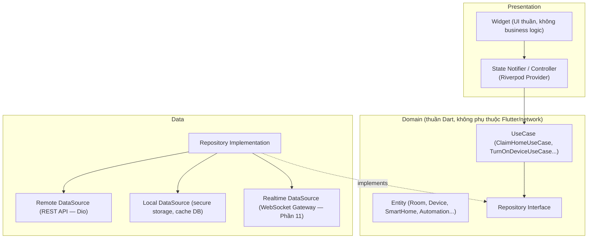
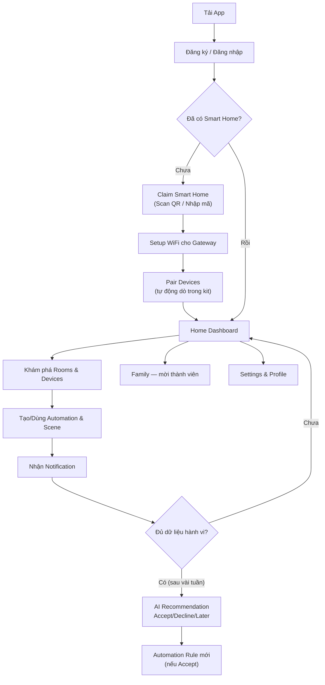
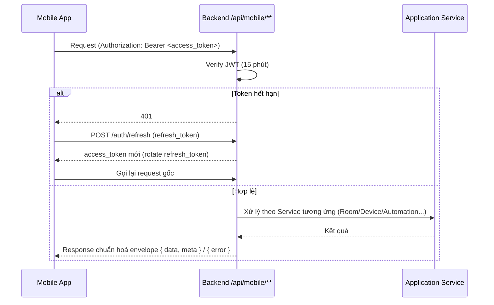
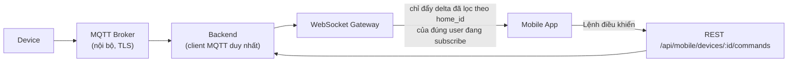
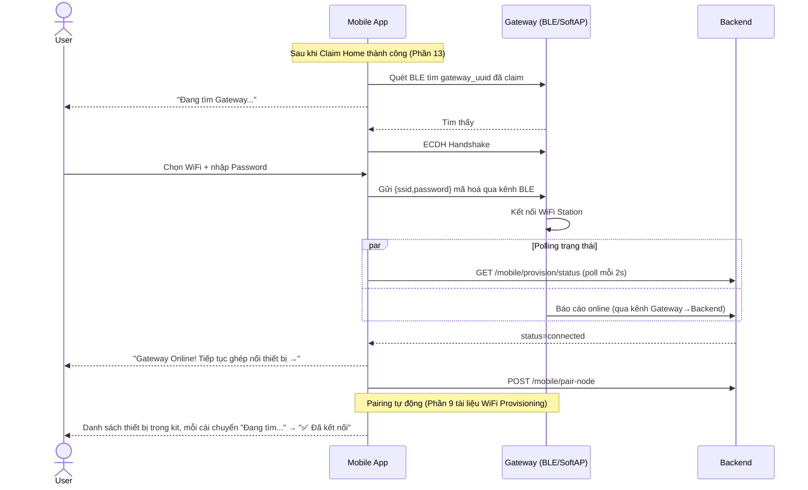
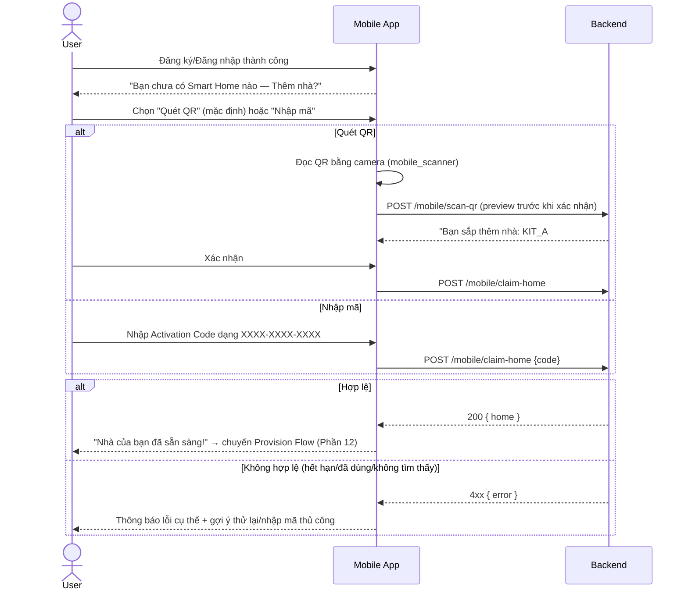
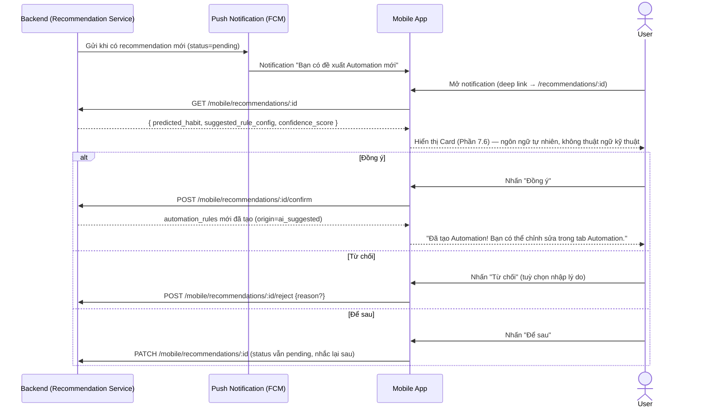

# 07_MOBILE_APP_ARCHITECTURE.md

> Thiết kế lại Mobile App — từ **UI mockup tĩnh (Flutter default template + 5 màn hình demo)** sang **ứng dụng chính thức của khách hàng trên nền tảng Smart Home thương mại**.
> Vai trò biên soạn: Principal Mobile Architect / Principal UX Designer / Senior Flutter Developer / Smart Home Product Manager / Solution Architect.
> Tài liệu **chỉ thiết kế — không viết code, không sửa code**. Ràng buộc chặt với 4 tài liệu đã có trong repo — **không lặp lại** mà tham chiếu:
> - [`01_SMART_HOME_PRODUCT_ARCHITECTURE.md`](01_SMART_HOME_PRODUCT_ARCHITECTURE.md) — nguyên tắc "User = Mobile only", Claim/Activation Flow (Phần 5-6), RBAC theo Home (Owner/Controller/Viewer/Guest — Phần 7), API `/api/mobile/**` (Phần 9.1).
> - [`02_SMART_HOME_WIFI_PROVISIONING.md`](02_SMART_HOME_WIFI_PROVISIONING.md) — WiFi Provisioning kỹ thuật (BLE/SoftAP, ESP-NOW, Key Hierarchy), Mobile UX (Phần 16).
> - [`03_BACKEND_REFACTOR_SMARTHOME.md`](03_BACKEND_REFACTOR_SMARTHOME.md) — Auth Service (JWT+Refresh Token Mobile), MQTT Topic Design (Phần 10).
> - [`03_BACKEND_REFACTOR_SMARTHOME.md`](03_BACKEND_REFACTOR_SMARTHOME.md) mục 18.6 — Recommendation Engine (Observe→Confirm), nguyên tắc AI không tự điều khiển.
>
> Toàn bộ source code Mobile thực tế đã được đọc: `mobile/pubspec.yaml`, `mobile/lib/main.dart`, `app.dart`, `core/theme/app_theme.dart`, và toàn bộ 7 feature hiện có (`auth`, `home`, `rooms`, `notifications`, `profile`, `about`, `shell`) — tổng cộng 16 file Dart.
>
> **Ghi chú (2026-09-23):** Phần 1 (hiện trạng) phản ánh code Mobile tại commit `407eb1d` (2026-07-11). Commit `dee7752` sau đó đã bổ sung mock data (phòng có thiết bị, `devices/`, `door/`, `mock_household`...) — nay là 26 file Dart / 9 feature; một số trích dẫn `file:line` ở mục 1.4–1.5 không còn khớp (VD phòng hard-code đã chuyển sang `rooms/data/mock_rooms.dart`, nút "Đăng xuất 123456" đã được sửa). Các kết luận kiến trúc (chỉ 2 dependency, không state management/networking/MQTT, `MockAuthService` gọi trực tiếp, điều hướng bằng `Navigator.push` thủ công) **vẫn đúng**.

---

## MỤC LỤC

1. [Đánh giá App hiện tại](#1-đánh-giá-app-hiện-tại)
2. [Kiến trúc App mới](#2-kiến-trúc-app-mới)
3. [User Journey](#3-user-journey)
4. [Navigation](#4-navigation)
5. [Information Architecture](#5-information-architecture)
6. [Sitemap](#6-sitemap)
7. [Wireframe dạng Text](#7-wireframe-dạng-text)
8. [Component Tree](#8-component-tree)
9. [Feature List](#9-feature-list)
10. [API Flow](#10-api-flow)
11. [MQTT Flow](#11-mqtt-flow)
12. [Provision Flow](#12-provision-flow)
13. [Claim Smart Home Flow](#13-claim-smart-home-flow)
14. [AI Recommendation Flow](#14-ai-recommendation-flow)
15. [Offline Flow](#15-offline-flow)
16. [Push Notification Flow](#16-push-notification-flow)
17. [Security Flow](#17-security-flow)
18. [Roadmap phát triển](#18-roadmap-phát-triển)

---

## 1. ĐÁNH GIÁ APP HIỆN TẠI

### 1.1. Project Structure & Folder Structure

```
mobile/lib/
├── main.dart                 runApp(MyApp())
├── app.dart                   MaterialApp, home: LoginPage() cứng
├── core/theme/app_theme.dart  1 file duy nhất — ColorScheme.fromSeed(Colors.blue)
└── features/
    ├── auth/            data/mock_auth_service.dart, models/mock_user.dart, presentation/pages/login_page.dart
    ├── home/            presentation/pages/home_page.dart
    ├── rooms/           models/room.dart, presentation/{pages/{room_list,room_detail},widgets/room_card}.dart
    ├── notifications/   presentation/pages/notification_page.dart
    ├── profile/         presentation/pages/profile_page.dart
    ├── about/           presentation/pages/about_page.dart
    └── shell/           presentation/{pages/app_shell_page, widgets/bottom_nav_bar}.dart
```

**Nhận xét cấu trúc:** Đây **đã là** cấu trúc feature-first (`features/<domain>/{data,models,presentation}`) — đúng định hướng, đáng giữ nguyên nguyên tắc tổ chức này khi mở rộng. Tuy nhiên cấu trúc con **không nhất quán giữa các feature**: `auth` có `data/` + `models/`, `rooms` chỉ có `models/`, còn `home`/`notifications`/`profile`/`about` **chỉ có `presentation/`** — không có bất kỳ feature nào có đủ 3 tầng `data/domain/presentation` đúng nghĩa Clean Architecture.

### 1.2. `pubspec.yaml` — bằng chứng rõ nhất về mức độ "mockup"

Toàn bộ dependency: `flutter`, `cupertino_icons`. **Không có bất kỳ package nào** cho: state management (Provider/Riverpod/Bloc), networking (`http`/`dio`), MQTT (`mqtt_client`), push notification (`firebase_messaging`), camera/video (`camera`/`video_player`), biometric (`local_auth`), secure storage (`flutter_secure_storage`), routing (`go_router`), QR scan (`mobile_scanner`), BLE (`flutter_blue_plus`). Đây không phải là thiếu sót cần "sửa" — đây là **bằng chứng xác nhận app hiện tại đúng là 1 bản UI prototype thuần tuý**, đúng như `00_PROJECT_ANALYSIS_SMARTHOME.md` mục 1.5.#16 đã kết luận.

### 1.3. Architecture

Không có kiến trúc phân lớp nào. `MockAuthService` (`mock_auth_service.dart`) là 1 class `static` chứa 1 tài khoản hard-code (`admin@smarthome.local`/`admin123`), được `LoginPage` import và gọi **trực tiếp** (`login_page.dart:29`) — không qua interface/repository, không thể thay thế bằng implementation thật (gọi API) mà không sửa `LoginPage`. Vi phạm Dependency Inversion ngay ở tầng nhỏ nhất của app.

### 1.4. Navigation

100% dùng `Navigator.of(context).push(MaterialPageRoute(...))` thủ công (`login_page.dart:46-50`, `room_list_page.dart:50-55`) — không có route table, không có tên route, không dùng `go_router`/`auto_route`. **Hệ quả nghiêm trọng nhất:** không có cách nào để **deep link** — không thể mở thẳng "màn hình chi tiết thiết bị X" từ 1 push notification (chặn cứng yêu cầu ở Phần 16), không thể xử lý "quay lại đúng màn hình" khi app bị kill và mở lại từ notification.

### 1.5. UI / UX

| Vấn đề | Vị trí |
|---|---|
| 4 phòng hard-code cứng trong code (`Room(name: 'Phòng khách', ...)`), không có dữ liệu thật | `room_list_page.dart:10-15` |
| Mọi phòng đều rỗng — không có thiết bị nào bên trong | `room_detail_page.dart:27` — text tĩnh "Chưa có thiết bị nào trong phòng này" |
| Notification Page là màn hình tĩnh, không danh sách, không phân loại | `notification_page.dart:30` — text tĩnh "Bạn chưa có thông báo mới" |
| **Lẫn vai trò Operator vào App khách hàng** | `about_page.dart:49-70` — nút "Kết nối Bluetooth" để OTA **Gateway** (hành vi kỹ thuật viên/Operator), không phải hành vi khách hàng cuối — vi phạm trực tiếp nguyên tắc "App này dành cho khách hàng, không phải công cụ kỹ thuật" đã nêu trong yêu cầu |
| Text debug/lỗi sót lại chưa dọn | `profile_page.dart:36` — nút ghi "Đăng xuất **123456**" (rõ ràng là placeholder debug, không phải nội dung chủ đích) |
| Hard-code "Hello Admin" bất kể vai trò thật | `home_page.dart:24` — không phản ánh đúng user (vì hệ thống mock chỉ có 1 tài khoản admin, chưa từng thử với vai trò khác) |
| Theme mặc định Material 3 seed xanh dương | `app_theme.dart:7` — không có dark mode, không theo tone màu thương hiệu (Đỏ/Cam/Vàng/Xám) yêu cầu cho platform |

### 1.6. Performance / Scalability / Maintainability

Không áp dụng được ở mức độ hiện tại vì **không có dữ liệu động, không có network call nào** — mọi màn hình render tức thời từ hằng số cứng. Về Maintainability: cấu trúc feature-first là điểm khởi đầu tốt, nhưng thiếu tách `domain`/`data` khiến khi thêm API thật sẽ phải viết lại gần như toàn bộ logic trong các file `presentation/pages/*.dart` hiện tại (UI và logic gọi dữ liệu đang trộn lẫn hoàn toàn — ví dụ `_handleLogin()` trong `login_page.dart:26-51` vừa validate form, vừa gọi service, vừa điều hướng, vừa hiển thị lỗi — tất cả trong 1 hàm của Widget).

### 1.7. Clean Architecture / State Management

Không tuân thủ Clean Architecture (không Entity/UseCase/Repository interface). State Management chỉ là `setState` cục bộ trong `StatefulWidget` (`_AppShellPageState._selectedIndex`, `_LoginPageState._isPasswordVisible`) — không có state toàn cục nào (theme, phiên đăng nhập, Smart Home đang chọn, trạng thái kết nối mạng) được chia sẻ xuyên suốt app; `MockUser user` hiện tại được truyền tay qua constructor giữa các trang (`AppShellPage(user: user)` → `HomePage(user: user)` → ...) — cách làm này **không mở rộng được** khi cần nhiều nguồn state độc lập (Auth state, Home state, Connectivity state, Theme state) cùng tồn tại.

### 1.8. API / MQTT / Push Notification / Camera

Cả 4 mục này **hoàn toàn không tồn tại** trong code hiện tại (đã xác nhận qua `pubspec.yaml` không có dependency tương ứng — mục 1.2).

### 1.9. Bảng tổng hợp vấn đề

| # | Vấn đề | Mức độ |
|---|---|---|
| 1 | Không có state management, network, MQTT, push, camera nào | Nghiêm trọng — cần xây từ đầu |
| 2 | Navigation không hỗ trợ deep link | Nghiêm trọng — chặn Push Notification Action |
| 3 | Cấu trúc feature không nhất quán (thiếu domain/data ở hầu hết feature) | Cao |
| 4 | Lẫn vai trò Operator (OTA Bluetooth) vào App khách hàng | Cao — sai định hướng sản phẩm |
| 5 | Rooms/Devices hard-code, không có mô hình dữ liệu thật nối Backend | Nghiêm trọng |
| 6 | Text debug sót lại ("Đăng xuất 123456") | Thấp |
| 7 | Theme không có dark mode, không theo tone màu thương hiệu | Trung bình |
| 8 | `MockAuthService` phụ thuộc cứng, không qua interface | Cao (chặn viết test, chặn thay API thật) |

---

## 2. KIẾN TRÚC APP MỚI

### 2.1. Clean Architecture 3 lớp — áp dụng nhất quán cho MỌI feature



**Nguyên tắc:** mọi feature mới (Rooms, Devices, Automation, Camera...) đều theo đúng khuôn `presentation/{pages,widgets,controllers} + domain/{entities,usecases,repositories} + data/{repositories_impl,datasources,models}` — thay thế cấu trúc thiếu nhất quán hiện tại (mục 1.1).

### 2.2. State Management — chọn Riverpod

| Tiêu chí | Riverpod | Bloc |
|---|---|---|
| Boilerplate | Ít hơn — không cần class Event/State riêng cho mọi tương tác nhỏ | Nhiều hơn — phù hợp team quen tư duy event-driven nghiêm ngặt |
| Dependency Injection | Có sẵn qua `Provider`/`ref.watch` — không cần thư viện DI riêng | Cần kết hợp `get_it`/`injectable` |
| Test | Dễ override provider trong test | Cần mock Bloc/Cubit riêng |
| Phù hợp luồng realtime (MQTT relay qua WebSocket) | `StreamProvider`/`AsyncNotifier` xử lý tự nhiên | `Bloc` với `Stream` cũng làm được nhưng nhiều boilerplate hơn |
| Kế thừa từ code hiện tại | Thay thế toàn bộ `setState` hiện có — không có gì để giữ lại | — |

**Quyết định:** dùng **Riverpod** (kèm `flutter_riverpod` + `riverpod_generator` cho compile-safe code) làm state management chính thức — phù hợp nhất với khối lượng state đa dạng, nhiều nguồn (Auth/Home/Device/Realtime/Automation/AI Recommendation) mà app cần quản lý đồng thời.

### 2.3. Repository Pattern — 1 repository / domain, không phụ thuộc trực tiếp API cụ thể

| Repository | Domain | Nguồn dữ liệu |
|---|---|---|
| `AuthRepository` | Đăng nhập/đăng ký/refresh token/biometric | REST `/api/mobile/auth/**` + Secure Storage |
| `SmartHomeRepository` | Danh sách nhà, chi tiết nhà, claim | REST `/api/mobile/**` |
| `RoomRepository` | CRUD phòng | REST |
| `DeviceRepository` | Danh sách/chi tiết/điều khiển thiết bị | REST (lệnh) + Realtime DataSource (trạng thái) |
| `AutomationRepository` | Rule/Scene | REST |
| `NotificationRepository` | Danh sách thông báo, đánh dấu đã đọc | REST + Push (FCM) |
| `CameraRepository` | Snapshot, live view URL, lịch sử | REST + Object Storage URL |
| `RecommendationRepository` | Đề xuất AI | REST |
| `ProvisionRepository` | WiFi Provisioning, Pairing | Local API (BLE/SoftAP — Phần 12) + REST (đồng bộ trạng thái) |

---

## 3. USER JOURNEY



---

## 4. NAVIGATION

### 4.1. `go_router` — thay thế `Navigator.push` thủ công

| Stack | Route | Guard |
|---|---|---|
| **Auth Stack** | `/login`, `/register`, `/verify-otp`, `/forgot-password` | Chưa đăng nhập |
| **Onboarding Stack** | `/claim-home`, `/provision-wifi`, `/pair-devices` | Đã đăng nhập, chưa có Home nào |
| **Main Shell (Bottom Nav)** | `/home`, `/rooms`, `/automation`, `/notifications`, `/profile` | Đã đăng nhập + đã có ≥1 Home |
| **Chi tiết (push trên Shell)** | `/rooms/:roomId`, `/devices/:deviceId`, `/camera/:deviceId`, `/family`, `/settings/**` | Kế thừa guard Main Shell |

### 4.2. Bottom Navigation mới (thay thế 5 tab hiện tại)

| Hiện tại | Mới | Lý do đổi |
|---|---|---|
| Home / Room / Notifications / **About** / Profile | Home / Room / **Automation** / Notifications / Profile | "About" (thông tin ứng dụng, kèm cả nút OTA Bluetooth sai đối tượng — mục 1.5) chuyển vào `Settings` (truy cập từ Profile), nhường chỗ tab cho "Automation" — chức năng lõi khách hàng dùng hàng ngày, xứng đáng ở bottom nav hơn "About" |

### 4.3. Deep Link

`go_router` hỗ trợ path pattern nhận từ Push Notification payload (Phần 16): `smarthome://devices/42` (Motion Detected → mở thẳng Camera của thiết bị đó), `smarthome://recommendations/17` (AI Recommendation → mở thẳng card đề xuất).

---

## 5. INFORMATION ARCHITECTURE

```mermaid
flowchart TD
    ROOT["Mobile App"]
    ROOT --> AUTH["Auth"]
    ROOT --> ONB["Onboarding"]
    ROOT --> HOME["Home Dashboard"]
    ROOT --> ROOMS["Rooms"]
    ROOT --> AUTO["Automation & Scene"]
    ROOT --> NOTIF["Notifications"]
    ROOT --> PROFILE["Profile"]

    AUTH --> A1["Register/Login"]
    AUTH --> A2["Verify OTP"]
    AUTH --> A3["Forgot Password"]
    AUTH --> A4["Biometric Setup"]

    ONB --> O1["Claim Home (QR/Code)"]
    ONB --> O2["WiFi Provisioning"]
    ONB --> O3["Pair Devices"]

    HOME --> H1["Weather/Temperature/Humidity"]
    HOME --> H2["Gateway Status"]
    HOME --> H3["Quick Scene"]
    HOME --> H4["Favorite Devices"]
    HOME --> H5["Camera Preview"]
    HOME --> H6["Recent Activities"]
    HOME --> H7["AI Recommendation Card"]

    ROOMS --> R1["Room List"]
    R1 --> R2["Room Detail"]
    R2 --> R3["Device Control"]
    R2 --> R4["Camera Live View"]

    AUTO --> AU1["Rule List (IF/THEN)"]
    AUTO --> AU2["Rule Builder"]
    AUTO --> AU3["Scene List"]
    AUTO --> AU4["Scene Builder"]

    PROFILE --> P1["Thông tin cá nhân"]
    PROFILE --> P2["Smart Home đang sở hữu/tham gia"]
    PROFILE --> P3["Family & Members"]
    PROFILE --> P4["Settings"]
    P4 --> P4a["WiFi/Gateway"]
    P4 --> P4b["Notification"]
    P4 --> P4c["Language/Theme"]
    P4 --> P4d["Security"]
    P4 --> P4e["About"]
```



---

## 6. SITEMAP

| Route | Màn hình | Ghi chú |
|---|---|---|
| `/login`, `/register`, `/verify-otp`, `/forgot-password` | Auth | Public |
| `/claim-home` | Scan QR / Nhập Activation Code | Sau khi login, chưa có Home |
| `/provision-wifi/:gatewayId` | Setup WiFi Gateway | Sau khi claim |
| `/pair-devices/:gatewayId` | Pairing Node/Camera | Sau khi Gateway online |
| `/home` | Home Dashboard | Tab chính |
| `/rooms`, `/rooms/:id` | Danh sách/chi tiết phòng | Tab chính |
| `/devices/:id` | Device Control | Push từ Room Detail |
| `/camera/:id` | Camera Live View | Push từ Room/Home |
| `/automation`, `/automation/new` | Rule Engine | Tab chính |
| `/scenes`, `/scenes/new` | Scene | Trong tab Automation |
| `/notifications` | Notification Center | Tab chính |
| `/recommendations/:id` | AI Recommendation Detail | Push từ Notification/Home |
| `/profile` | Hồ sơ | Tab chính |
| `/family` | Quản lý thành viên | Từ Profile |
| `/settings/**` | Cài đặt | Từ Profile |

---

## 7. WIREFRAME DẠNG TEXT

### 7.1. Claim Smart Home

```
┌───────────────────────────────┐
│  ←  Thêm Smart Home            │
├───────────────────────────────┤
│                                │
│      [   QR Scanner Frame  ]   │
│                                │
│   Quét mã QR trên hộp sản phẩm │
│                                │
│   ── hoặc ──                   │
│                                │
│   [ Nhập mã kích hoạt: ____ ]  │
│   [        Xác nhận        ]  │
└───────────────────────────────┘
```

### 7.2. WiFi Provisioning

```
┌───────────────────────────────┐
│  Kết nối Gateway                │
├───────────────────────────────┤
│  ● Đang tìm Gateway qua BLE...  │
│  ✓ Đã tìm thấy: GW-7F3A         │
│                                │
│  Chọn WiFi:  [ Home_5G      ▾] │
│  Mật khẩu:   [ ************  ] │
│                                │
│  [       Kết nối        ]      │
│                                │
│  ● Đang gửi thông tin...        │
│  ● Đang kết nối Gateway...      │
│  ✓ Gateway Online!              │
└───────────────────────────────┘
```

### 7.3. Home Dashboard

```
┌───────────────────────────────┐
│  Nhà Quận 7            🔔 3    │
│  ☀ 29°C · Độ ẩm 68%            │
├───────────────────────────────┤
│  Gateway: ● Online              │
├───────────────────────────────┤
│  Quick Scene                    │
│  [🌙 Ngủ] [🎬 Xem phim] [🏠 Về nhà]│
├───────────────────────────────┤
│  Thiết bị yêu thích              │
│  [💡90%] [🌀 Lv2] [🔒 Đã khoá]   │
├───────────────────────────────┤
│  📷 Camera cửa chính     [Xem] │
│  ┌─────────────────────────┐   │
│  │      (preview ảnh)       │   │
│  └─────────────────────────┘   │
├───────────────────────────────┤
│  💡 Gợi ý từ AI                 │
│  "Bạn thường giảm đèn phòng     │
│  khách còn 50% lúc 21:30."      │
│  [Tạo Automation?] [Bỏ qua]     │
├───────────────────────────────┤
│  Hoạt động gần đây               │
│  21:05 Cửa chính đã khoá         │
│  20:40 Bật đèn phòng khách       │
└───────────────────────────────┘
```

### 7.4. Room Detail (đầy đủ thiết bị, khác trạng thái rỗng hiện tại)

```
┌───────────────────────────────┐
│  ←  Phòng khách                │
├───────────────────────────────┤
│  💡 Đèn trần         [●━━━ 90%]│
│  🌀 Quạt trần        [Lv 2  ▾] │
│  🎛 Rèm cửa          [Mở  ▾]   │
│  🌡 Nhiệt độ/Độ ẩm    28°C·65% │
│  📷 Camera                     │
│  ┌─────────────────────────┐   │
│  │      (live preview)      │   │
│  └─────────────────────────┘   │
│  Automation của phòng này (2)   │
└───────────────────────────────┘
```

### 7.5. Device Control — theo loại thiết bị

| Loại | UI điều khiển |
|---|---|
| Light (on/off) | Toggle switch |
| Dimmer/RGB Light | Slider độ sáng (0-100%) + color wheel picker |
| Fan | Slider tốc độ (Off/1/2/3) hoặc dial |
| Curtain | Slider vị trí (0-100% mở) + nút Mở hẳn/Đóng hẳn |
| Door Lock | Toggle Khoá/Mở khoá + xác nhận (biometric nếu bật) trước khi mở khoá từ xa |
| Relay (chung) | Toggle switch |
| Temperature/Humidity (cảm biến, read-only) | Gauge/số hiển thị + biểu đồ xu hướng 24h |
| Motion/Smoke/Gas (cảm biến an ninh) | Card trạng thái + lịch sử phát hiện + ngưỡng cảnh báo cấu hình được |
| Camera | Nút "Xem trực tiếp", "Chụp ảnh", "Xem lịch sử" |

### 7.6. AI Recommendation Card

```
┌───────────────────────────────┐
│  💡  Gợi ý từ AI                │
│                                │
│  "Bạn thường giảm độ sáng      │
│  đèn phòng khách xuống 50%     │
│  vào lúc 21:30 mỗi tối."        │
│                                │
│  Tạo Automation để tự động     │
│  làm việc này?                  │
│                                │
│  [ Đồng ý ] [ Từ chối ] [Để sau]│
└───────────────────────────────┘
```

### 7.7. Family & Members

```
┌───────────────────────────────┐
│  Thành viên nhà                [+ Mời]│
├───────────────────────────────┤
│  👤 Bạn (Chủ nhà)      OWNER    │
│  👤 Vợ                CONTROLLER│
│  👤 Con                VIEWER   │
│  👤 Người giúp việc    GUEST (hết hạn 18:00)│
└───────────────────────────────┘
```

---

## 8. COMPONENT TREE

```
mobile/lib/
├── core/
│   ├── theme/ (app_theme.dart — mở rộng: light/dark, color tokens Đỏ/Cam/Vàng/Xám)
│   ├── router/ (app_router.dart — go_router config + guard)
│   ├── network/ (dio_client.dart, api_endpoints.dart, interceptors: auth/refresh/logging)
│   ├── realtime/ (websocket_client.dart — Phần 11)
│   ├── storage/ (secure_storage.dart — token, local_cache.dart — offline)
│   └── di/ (provider bootstrap cho Riverpod)
│
└── features/
    ├── auth/            {domain: entities/User, usecases/Login,Register,VerifyOtp,RefreshToken,BiometricLogin; data: repositories_impl, datasources/AuthRemoteDataSource; presentation: pages, controllers}
    ├── onboarding/       {claim_home, wifi_provisioning, device_pairing} — mỗi cụm theo đủ 3 lớp
    ├── smart_home/       Danh sách/chi tiết Home, chuyển đổi Home đang xem (nếu sở hữu nhiều nhà)
    ├── rooms/            Room List/Detail — mở rộng model Room hiện tại (chỉ có name/icon) thành đầy đủ (id, room_type, devices[])
    ├── devices/          Device Control theo loại (widgets riêng: LightControl, FanControl, CurtainControl, LockControl, SensorCard)
    ├── automation/        Rule Builder, Scene Builder
    ├── camera/            LiveView, Snapshot, History
    ├── notifications/    Notification Center (thay thế trang tĩnh hiện tại) + phân loại severity
    ├── recommendations/  AI Recommendation Card/Detail (feature mới)
    ├── family/            Member list/invite (feature mới)
    ├── profile/           Thông tin cá nhân, đổi mật khẩu/avatar
    ├── settings/          WiFi/Gateway/Notification/Language/Theme/Security/About (gộp "about" cũ vào đây)
    └── shell/             AppShellPage + BottomNavBar (giữ nguyên pattern hiện có — đã tốt)
```

**Nguyên tắc giữ lại:** `shell/` (AppShellPage + BottomNavBar) hiện tại đã đúng hướng (tách UI thuần, dùng `AnimatedSwitcher`) — giữ nguyên pattern, chỉ đổi danh sách tab (Phần 4.2).

---

## 9. FEATURE LIST

| Nhóm | Tính năng |
|---|---|
| Auth | Đăng ký, Đăng nhập, OTP verify, Quên mật khẩu, Ghi nhớ đăng nhập, Đăng nhập sinh trắc học (FaceID/Fingerprint) |
| Onboarding | Claim Home (QR/Code), WiFi Provisioning, Device Pairing |
| Home Dashboard | Thời tiết, Nhiệt độ/Độ ẩm, Trạng thái Gateway, Quick Scene, Thiết bị yêu thích, Camera preview, Hoạt động gần đây, AI Recommendation |
| Rooms | Danh sách phòng theo `room_type`, chi tiết phòng, danh sách thiết bị trong phòng |
| Device Control | Light/Dimmer/RGB, Fan, Curtain, Door Lock, Relay, cảm biến (Temperature/Humidity/Motion/Smoke/Gas) |
| Automation | Rule Builder (IF Condition → THEN Action), bật/tắt rule, lịch sử chạy |
| Scene | Danh mục Scene dựng sẵn (Sleep/Movie/Reading/Away/Home/Party/Dinner/Morning) + tự tạo |
| AI Recommendation | Card đề xuất, Accept/Decline/Later, xem giải thích ("vì sao AI đề xuất") |
| Camera | Live View, Screenshot, Record, History, Motion Detection alert |
| Notification Center | Phân loại severity, filter, đánh dấu đã đọc, deep link |
| Family | Owner/Admin/Member/Guest, mời qua SĐT/email, thu hồi quyền, Guest có hạn dùng |
| Profile | Thông tin cá nhân, đổi mật khẩu/avatar, danh sách Smart Home sở hữu/tham gia, Security (đăng xuất toàn bộ thiết bị) |
| Settings | WiFi/Gateway (đổi WiFi, replace Gateway), Notification preference, Ngôn ngữ, Theme (Light/Dark), Privacy, About |
| Offline handling | Banner trạng thái, cache trạng thái cuối, optimistic UI có rollback |

---

## 10. API FLOW

App chỉ gọi đúng 1 namespace: **`/api/mobile/**`** (JWT Bearer — đã thiết kế đầy đủ ở `01_SMART_HOME_PRODUCT_ARCHITECTURE.md` mục 9.1 và `03_BACKEND_REFACTOR_SMARTHOME.md` mục 9.3) — không bao giờ gọi `/api/dashboard/**` hay `/api/device/**` (2 namespace đó dành cho Web Dashboard và Firmware).



Mọi lệnh điều khiển thiết bị (`POST /mobile/devices/:id/commands`) đi qua REST, **không đi qua kênh realtime** — kênh realtime (Phần 11) chỉ dùng để **nhận** trạng thái cập nhật, không dùng để **gửi** lệnh (giữ 1 đường ghi duy nhất qua REST để dễ áp RBAC/rate-limit/audit, tách biệt đường đọc real-time tốc độ cao).

---

## 11. MQTT FLOW

### 11.1. Câu hỏi cốt lõi: App có nên kết nối MQTT trực tiếp không?

| Tiêu chí | Phương án A — Mobile kết nối MQTT trực tiếp | Phương án B — Mobile không kết nối MQTT, chỉ qua Backend |
|---|---|---|
| Độ trễ | Thấp nhất (1 hop) | Thêm 1 hop qua Backend relay (chục-trăm ms, không đáng kể cho use-case Smart Home) |
| Bảo mật | Phải mở Broker ra Internet công cộng cho hàng nghìn Mobile client — bề mặt tấn công lớn; cần TLS + ACL theo `home_id` cho **mỗi thiết bị di động** (không chỉ Gateway cố định) | Broker chỉ giao tiếp nội bộ Backend↔Gateway (đã thiết kế TLS+ACL ở `03_BACKEND_REFACTOR_SMARTHOME.md` Phần 17) — Mobile không bao giờ chạm trực tiếp Broker |
| Quản lý credential | Cần cấp + xoay vòng MQTT credential riêng cho **hàng nghìn thiết bị di động** (phức tạp hơn nhiều so với quản lý JWT vốn đã có sẵn) | Dùng lại đúng JWT/RBAC đã có — không thêm cơ chế auth mới |
| Ổn định kết nối | Mobile network chuyển đổi WiFi↔4G liên tục → connect/disconnect dồn dập vào Broker, tốn tài nguyên Broker ở quy mô lớn | Backend (server, mạng ổn định) là client MQTT duy nhất — Mobile chỉ giữ 1 kết nối HTTP/WebSocket bền hơn nhiều so với giữ phiên MQTT trên mạng di động |
| Kiểm soát/Audit | Khó áp dụng lại toàn bộ RBAC theo Home đã thiết kế ở tầng Backend (phải làm lại ở tầng Broker ACL) | Tái sử dụng 100% RBAC/Audit đã có ở Backend |
| Enrich dữ liệu trước khi hiển thị | Không — Mobile nhận telemetry thô, phải tự xử lý | Có — Backend có thể lọc/tổng hợp trước khi đẩy (chỉ đẩy state đã đổi, không đẩy toàn bộ luồng thô) |

### 11.2. Quyết định: **Phương án B — Mobile không bao giờ kết nối MQTT trực tiếp**

Backend là **client MQTT duy nhất** (đúng kiến trúc đã chốt ở `03_BACKEND_REFACTOR_SMARTHOME.md`). Mobile nhận cập nhật realtime qua **kênh WebSocket riêng do chính Backend cung cấp** (tận dụng lại đúng hạ tầng WebSocket Gateway đã thiết kế cho Monitoring Service ở `03_BACKEND_REFACTOR_SMARTHOME.md` Phần 15 — dùng chung 1 hạ tầng cho cả Dashboard lẫn Mobile, không xây 2 kênh realtime song song).



### 11.3. Fallback khi không có WebSocket (mạng yếu)

Mobile tự động **fallback sang polling REST định kỳ** (VD mỗi 10-15 giây cho trạng thái thiết bị đang mở trên màn hình) khi kết nối WebSocket bị rớt — không chặn UI, chỉ giảm độ tươi (freshness) của dữ liệu hiển thị.

---

## 12. PROVISION FLOW

> Chi tiết kỹ thuật đầy đủ (BLE/SoftAP, ECDH, ESP-NOW) đã có ở `02_SMART_HOME_WIFI_PROVISIONING.md` Phần 7-9. Phần dưới đây là **luồng UI/UX cụ thể phía Mobile**.



**Nguyên tắc UX cốt lõi (kế thừa nguyên vẹn từ `02_SMART_HOME_WIFI_PROVISIONING.md`):** màn hình nhập WiFi chỉ xuất hiện **đúng 1 lần** trong toàn bộ luồng — Pairing Node/Camera hoàn toàn tự động, không có màn hình nhập thông tin mạng nào khác.

---

## 13. CLAIM SMART HOME FLOW



---

## 14. AI RECOMMENDATION FLOW

> Ràng buộc cứng kế thừa từ `03_BACKEND_REFACTOR_SMARTHOME.md` mục 18.6: **AI không bao giờ tự điều khiển** — Mobile chỉ hiển thị đề xuất và gửi phản hồi người dùng.



**Nguyên tắc UX:** Card đề xuất luôn diễn đạt bằng **ngôn ngữ hành vi tự nhiên** ("Bạn thường...") thay vì thuật ngữ kỹ thuật ("Model dự đoán với confidence 0.87...") — độ tin cậy kỹ thuật chỉ hiển thị khi người dùng bấm "Vì sao AI đề xuất điều này?" (progressive disclosure).

---

## 15. OFFLINE FLOW

| Tình huống | Biểu hiện | Xử lý UX |
|---|---|---|
| **App mất mạng** (không gọi được Backend API) | Không tải được gì | Banner đỏ cố định "Không có kết nối Internet" + hiển thị dữ liệu cache cuối cùng (đọc từ Local DataSource) ở trạng thái mờ (dimmed), không cho thao tác điều khiển |
| **Backend còn sống nhưng Gateway offline** (`device_status.mqtt_connected=false`) | API vẫn trả dữ liệu, nhưng trạng thái thiết bị là "cuối cùng biết được", không realtime | Banner vàng "Gateway ngoại tuyến — dữ liệu có thể không cập nhật" trên toàn bộ màn hình Home/Room của đúng Smart Home đó; nút điều khiển vẫn hiện nhưng disable kèm tooltip giải thích |
| **WebSocket rớt nhưng Backend/Gateway vẫn ổn** | Không nhận cập nhật realtime | Tự động fallback polling REST (Phần 11.3), không hiện banner (người dùng không cần biết chi tiết kỹ thuật này) |
| **Gửi lệnh điều khiển nhưng không nhận ack kịp thời** | Optimistic UI đã đổi trạng thái ngay khi bấm | Timeout (VD 5s) → nếu không nhận `command/ack` tương ứng, tự động rollback UI về trạng thái trước đó + toast "Không thể thực hiện, vui lòng thử lại" |

**Nguyên tắc:** phân biệt rõ ràng 3 tầng lỗi (App↔Backend, Backend↔Gateway, Lệnh↔Ack) — không gộp chung thành 1 thông báo lỗi mơ hồ, vì mỗi loại cần hành động khắc phục khác nhau từ phía người dùng (kiểm tra mạng điện thoại / kiểm tra Internet nhà / thử lại thao tác).

---

## 16. PUSH NOTIFICATION FLOW

| Hạng mục | Thiết kế |
|---|---|
| **Nhà cung cấp** | Firebase Cloud Messaging (Android + iOS qua APNs) |
| **Background** | FCM background handler nhận payload, cập nhật badge count, không cần mở app |
| **Foreground** | Hiển thị in-app banner tuỳ biến (không dùng notification hệ thống khi app đang mở) — cho phép hành động ngay (VD "Xem Camera" khi có Motion Detected) |
| **Deep Link** | Payload chứa `route` (VD `/recommendations/17`, `/devices/42`) → `go_router` điều hướng thẳng khi user tap notification, kể cả khi app đã bị kill hoàn toàn (cold start) |
| **Action Button** | Native notification action: "Xem" / "Bỏ qua" cho Motion; "Đồng ý" / "Từ chối" cho AI Recommendation — xử lý được **ngay trên notification** không cần mở app (Android quick reply actions, iOS notification actions) |
| **Phân loại theo severity** | Nhất quán với `03_BACKEND_REFACTOR_SMARTHOME.md` Phần 13 — Critical (Cửa mở bất thường, Khói/Gas) rung + âm thanh riêng; Info/Success chỉ badge, không làm phiền |

---

## 17. SECURITY FLOW

| Hạng mục | Thiết kế |
|---|---|
| **Access Token** | JWT 15 phút, giữ trong RAM (Riverpod state), không ghi ổ đĩa |
| **Refresh Token** | 30 ngày, rotate mỗi lần dùng, lưu trong **Keychain (iOS) / Keystore (Android)** qua `flutter_secure_storage` — không bao giờ lưu Local Storage/SharedPreferences thường |
| **Biometric Login** | `local_auth` — FaceID/Fingerprint **không thay thế** bước đăng nhập đầu tiên bằng mật khẩu, chỉ dùng để **mở khoá lại phiên đã đăng nhập** (unlock refresh token đã lưu) sau khi app bị khoá/thoát |
| **Remember Login** | Refresh token còn hạn + biometric bật → tự động khôi phục phiên khi mở app, không cần nhập lại mật khẩu |
| **Certificate Pinning** | Khuyến nghị bật cho production (chống MITM trên mạng công cộng) — không bắt buộc MVP |
| **Không lưu secret Gateway/Device** | Kế thừa nguyên tắc `01_SMART_HOME_PRODUCT_ARCHITECTURE.md` mục 5.3 — Mobile không bao giờ nhận/lưu `gateway_secret` dưới bất kỳ hình thức nào |
| **Đăng xuất toàn bộ thiết bị** | Trong Settings → Security — gọi API thu hồi toàn bộ refresh token của user (phát hiện thiết bị lạ đăng nhập) |

---

## 18. ROADMAP PHÁT TRIỂN

| Version | Nội dung | Điều kiện |
|---|---|---|
| **V0 (hiện tại)** | UI mockup tĩnh, mock auth, không nối Backend | Baseline đang review |
| **V1 — Nền tảng thật** | Clean Architecture 3 lớp, Riverpod, `go_router`, Auth thật (JWT+Refresh+Biometric), Claim Home, WiFi Provisioning, Device Pairing | Phụ thuộc Backend đã có `/api/mobile/**` (Phần 9 `03_BACKEND_REFACTOR_SMARTHOME.md` Phase 3) |
| **V2 — Điều khiển thiết bị thật** | Room/Device thật (thay hard-code), Device Control theo từng loại, kênh Realtime (WebSocket), Offline handling | Phụ thuộc `device_commands` + MQTT `command` topic đã triển khai ở Backend |
| **V3 — Automation & Scene** | Rule Builder, Scene, Family/Member (Owner/Controller/Viewer/Guest) | Phụ thuộc `automation_rules`/`scenes` Backend đã có |
| **V4 — Camera & Notification đầy đủ** | Live View, Snapshot, Push Notification (FCM) với Deep Link + Action Button | Phụ thuộc Camera Service Backend |
| **V5 — AI Recommendation** | Card đề xuất, Accept/Decline/Later, giải thích "vì sao" | Phụ thuộc đủ dữ liệu hành vi tích luỹ (`03_BACKEND_REFACTOR_SMARTHOME.md` mục 18 — tối thiểu 30-60 ngày Behavior Log) |
| **V6 — Hoàn thiện trải nghiệm** | Dark Mode đầy đủ theo Design System (Đỏ/Cam/Vàng/Xám), Responsive Tablet, Certificate Pinning, đa ngôn ngữ | Không chặn tính năng lõi — hoàn thiện sau khi V1-V5 ổn định |

**Nguyên tắc xuyên suốt:** mỗi version phụ thuộc trực tiếp vào 1 phần tương ứng đã sẵn sàng ở Backend (đã thiết kế ở 4 tài liệu trước) — Mobile không nên "đi trước" xây UI cho tính năng mà Backend chưa có API tương ứng, tránh lặp lại đúng sai lầm hiện tại (UI đẹp nhưng rỗng, không nối được gì thật).
