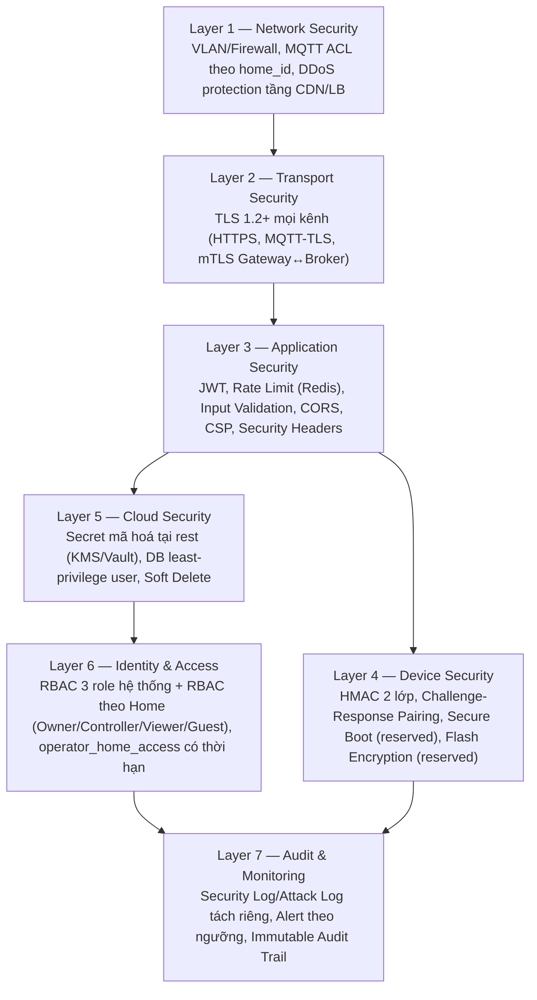
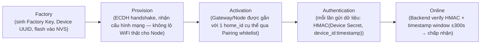
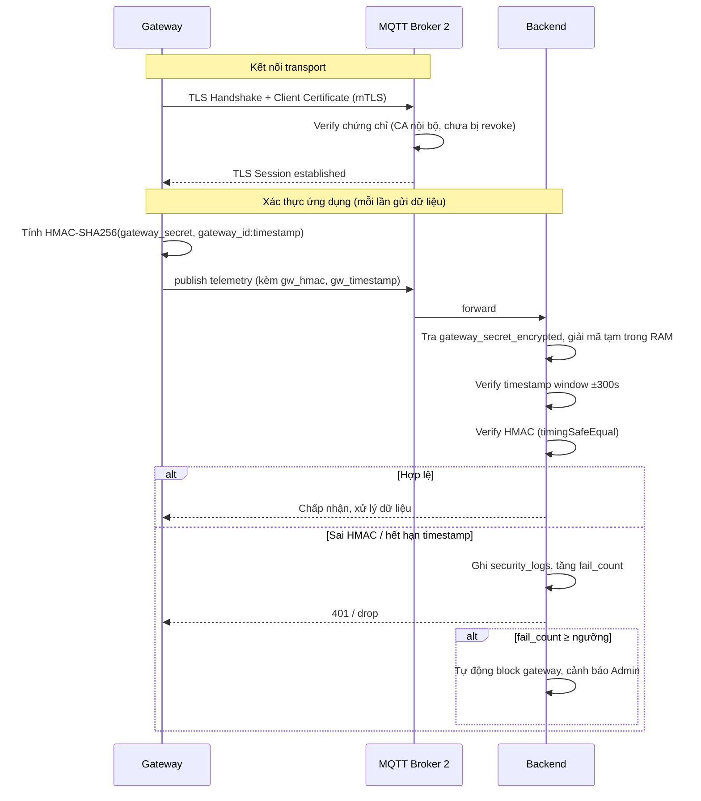
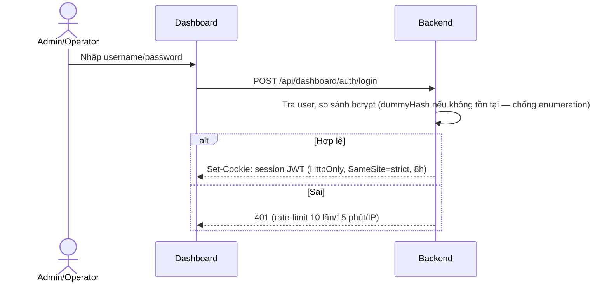
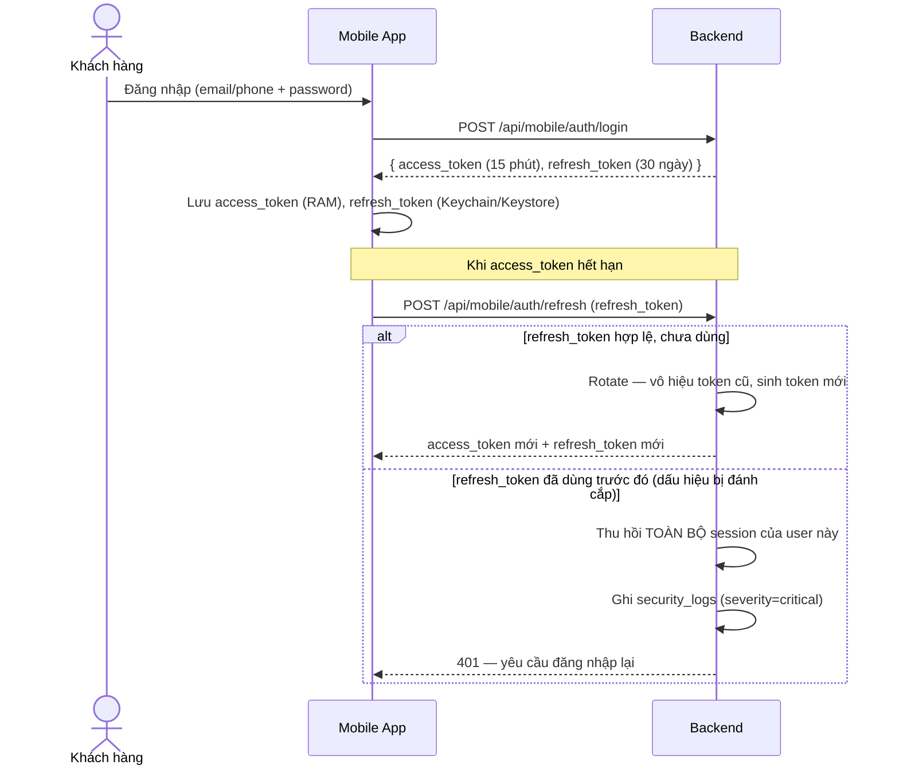
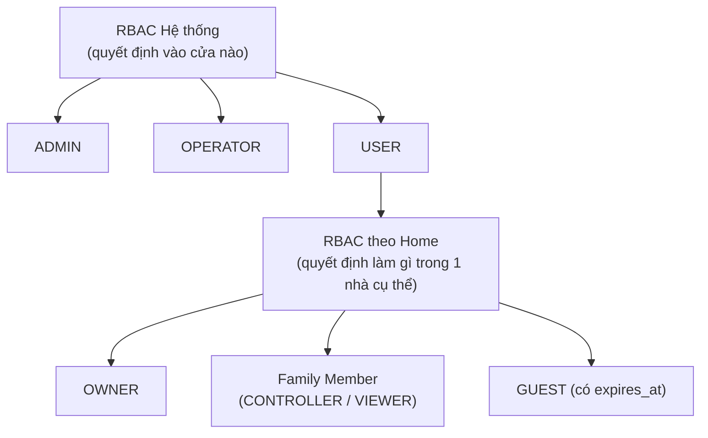
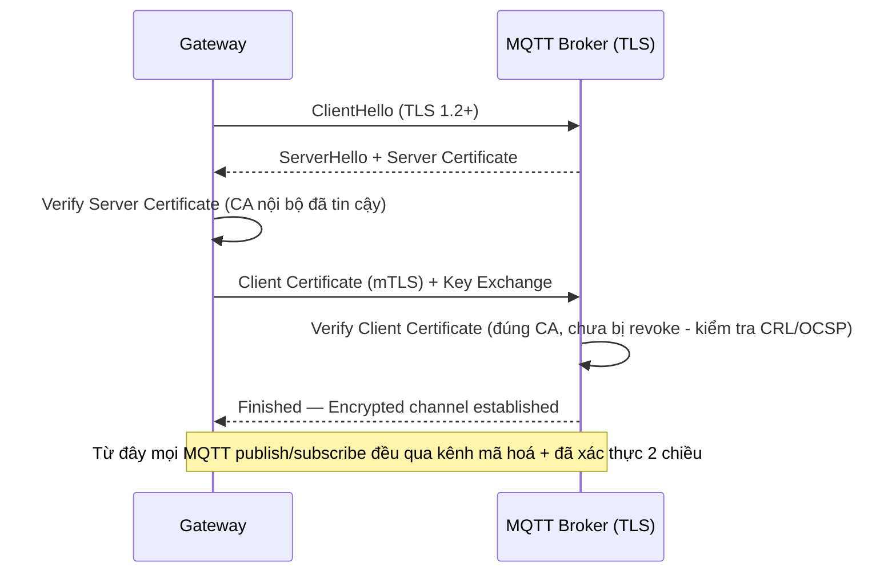
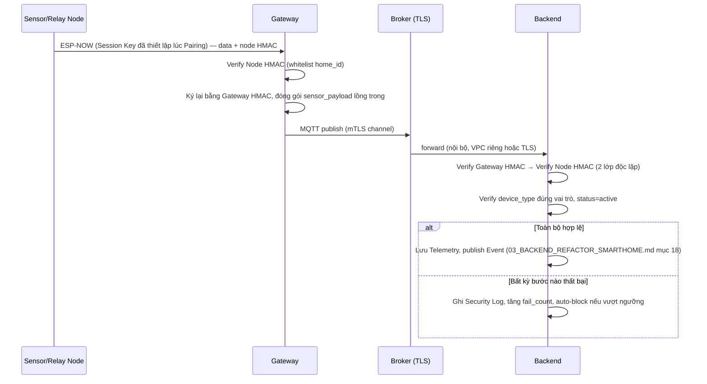
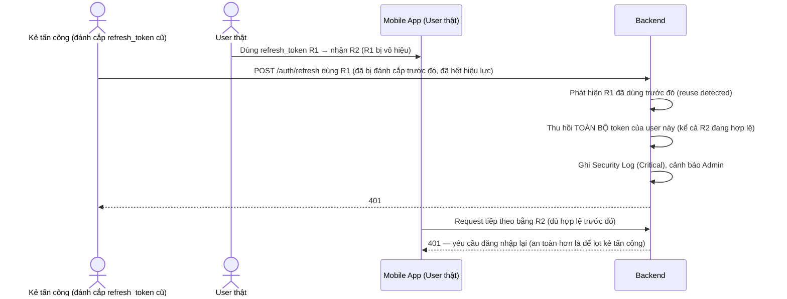

# 09_SECURITY_ARCHITECTURE.md

> Kiến trúc bảo mật toàn diện cho **Commercial Smart Home Platform** — không chỉ đáp ứng yêu cầu đồ án, mà chịu được áp lực của sản phẩm thật bán ra thị trường với hàng nghìn khách hàng.
> Vai trò biên soạn: Principal Security Architect / IoT Security Architect / Cyber Security Engineer / Embedded Security Engineer / Solution Architect.
> Tài liệu **chỉ thiết kế kiến trúc — không viết code**. Đây là **lớp tổng hợp bảo mật xuyên suốt**, hợp nhất các phần bảo mật đã rải rác ở 6 tài liệu trước thành 1 mô hình duy nhất, nhất quán, đồng thời bổ sung Threat Model/Attack Scenarios/Layer Model chưa từng được trình bày tập trung:
> - [`00_PROJECT_ANALYSIS_SMARTHOME.md`](00_PROJECT_ANALYSIS_SMARTHOME.md), [`01_SMART_HOME_PRODUCT_ARCHITECTURE.md`](01_SMART_HOME_PRODUCT_ARCHITECTURE.md), [`02_SMART_HOME_WIFI_PROVISIONING.md`](02_SMART_HOME_WIFI_PROVISIONING.md) — HMAC 2 lớp, Key Hierarchy, Claim/Activation Token.
> - [`03_BACKEND_REFACTOR_SMARTHOME.md`](03_BACKEND_REFACTOR_SMARTHOME.md) Phần 7-8-17, [`04_DATABASE_REFACTOR_SMARTHOME.md`](04_DATABASE_REFACTOR_SMARTHOME.md) Phần 12, [`07_MOBILE_APP_ARCHITECTURE.md`](07_MOBILE_APP_ARCHITECTURE.md) Phần 17, [`08_EMBEDDED_ARCHITECTURE_ESP_IDF.md`](08_EMBEDDED_ARCHITECTURE_ESP_IDF.md) Phần 19 — thiết kế bảo mật riêng từng tầng.
>
> Toàn bộ source code hệ thống (Backend 22 file, Database schema gốc, Frontend ~60 file, Mobile 16 file, Firmware gateway-node/sensor-node) đã được đọc đầy đủ trong quá trình biên soạn các tài liệu trên — phần Review dưới đây tổng hợp lại đúng các bằng chứng cụ thể (file:line) đã phát hiện, nhìn dưới góc độ bảo mật xuyên suốt toàn hệ thống thay vì theo từng thành phần riêng lẻ.

---

## MỤC LỤC

0. [Tóm tắt điều hành](#0-tóm-tắt-điều-hành)
1. [Đánh giá bảo mật hệ thống hiện tại](#1-đánh-giá-bảo-mật-hệ-thống-hiện-tại)
2. [Bảng tổng hợp lỗ hổng](#2-bảng-tổng-hợp-lỗ-hổng)
3. [Kiến trúc Security nhiều lớp](#3-kiến-trúc-security-nhiều-lớp)
4. [MQTT Security](#4-mqtt-security)
5. [Device Authentication Flow](#5-device-authentication-flow)
6. [Gateway Authentication Flow](#6-gateway-authentication-flow)
7. [User Authentication Flow](#7-user-authentication-flow)
8. [RBAC & Permission Matrix](#8-rbac--permission-matrix)
9. [API Security](#9-api-security)
10. [Secret Management](#10-secret-management)
11. [Key Management & Rotation](#11-key-management--rotation)
12. [Database Security](#12-database-security)
13. [Firmware Security](#13-firmware-security)
14. [Logging & Security Monitoring](#14-logging--security-monitoring)
15. [Threat Model](#15-threat-model)
16. [Attack Scenarios](#16-attack-scenarios)
17. [Sequence Diagrams](#17-sequence-diagrams)
18. [Roadmap phát triển bảo mật](#18-roadmap-phát-triển-bảo-mật)

---

## 0. TÓM TẮT ĐIỀU HÀNH

Hệ thống hiện tại đã có **3 nền tảng bảo mật đúng hướng**: HMAC-SHA256 2 lớp (Sensor→Gateway→Backend, chống timing attack bằng `crypto.timingSafeEqual`/so sánh constant-time tự viết ở firmware), RBAC 2 role (admin/operator qua `requireRole()` middleware), và MQTT có phân tách 2 broker theo defense-in-depth. Đây là nền tảng **tốt hơn mức trung bình của đồ án sinh viên** — đáng được ghi nhận và **giữ nguyên nguyên lý** khi thương mại hoá.

Tuy nhiên, khi nhìn xuyên suốt toàn hệ thống (không chỉ 1 thành phần), lộ ra **4 lỗ hổng cấu trúc nghiêm trọng nhất**, đủ để loại bỏ khả năng thương mại hoá nếu không vá trước khi có khách hàng thứ hai:

1. **Rò rỉ secret toàn hệ thống**: `GET /api/device/sensors` trả `secret_key` **plaintext của mọi sensor `active` trong toàn bộ hệ thống** cho bất kỳ gateway nào xác thực HMAC hợp lệ — không phân biệt khách hàng nào sở hữu gateway nào (`sensors.routes.ts:24-26`).
2. **Secret lưu plaintext ở cả 3 tầng**: Database (`devices.secret_key VARCHAR(64)` không mã hoá), Firmware (`config_gw.h`/`config_1.h` hard-code compile vào binary — file đã `.gitignore` nên không commit, nhưng secret vẫn plaintext trong binary), và UI (`RegisterModal.tsx` hiển thị secret dạng chữ để copy trên Dashboard).
3. **Không có TLS ở bất kỳ đâu trong toàn bộ luồng thiết bị**: MQTT không TLS (`allow_anonymous true`), HTTP không TLS (`http://` cho `BACKEND_SENSORS_URL`), Backend↔Frontend chưa xác nhận bắt buộc HTTPS ở tầng ứng dụng.
4. **RBAC không có khái niệm phạm vi tài nguyên**: Operator có quyền ngang Admin trên **mọi thiết bị của mọi khách hàng** — không có ràng buộc theo `home_id`, vi phạm nguyên tắc least-privilege bắt buộc cho SOC2/ISO 27001 nếu sản phẩm mở rộng sang thị trường yêu cầu tuân thủ.

Tài liệu này thiết kế mô hình bảo mật **7 lớp** (Network/Transport/Application/Device/Cloud/Identity/Audit) để vá triệt để 4 vấn đề trên và các vấn đề nhỏ hơn, đồng thời giữ nguyên các quyết định bảo mật đã đúng.

---

## 1. ĐÁNH GIÁ BẢO MẬT HỆ THỐNG HIỆN TẠI

### 1.1. Authentication

| Thành phần | Hiện trạng | Đánh giá |
|---|---|---|
| Dashboard (Admin/Operator) | JWT trong HttpOnly Cookie, `SameSite=strict`, hết hạn cứng 8h (`auth.ts:52-62`) | Đúng chuẩn cho session nội bộ; **thiếu** Refresh Token, thiếu cơ chế revoke phía server (đăng xuất chỉ xoá cookie client, JWT vẫn hợp lệ tới khi hết hạn nếu bị đánh cắp) |
| Mobile (User) | **Không tồn tại** — Mobile App hiện tại chỉ có `MockAuthService` hard-code 1 tài khoản (`mock_auth_service.dart`), chưa nối API thật | Thiếu hoàn toàn — chưa có JWT Bearer + Refresh Token cho kênh Mobile |
| Chống user-enumeration | `dummyHash` compare khi username không tồn tại (`auth.ts:28-31`) | **Điểm cộng bảo mật đáng giữ** — giữ thời gian phản hồi hằng định dù user tồn tại hay không |
| Password Hash | bcrypt cost 12 (`users.ts:47`, `seed.ts:9`) | Đúng chuẩn hiện hành (OWASP khuyến nghị cost ≥ 10-12 cho bcrypt) |
| Biometric | Không tồn tại (chưa có Mobile thật) | Reserved — thiết kế ở Phần 7.4 |

### 1.2. Authorization

`middleware/rbac.ts` — `requireRole(...roles)` chỉ so khớp `user.role` tĩnh, **không kiểm tra phạm vi tài nguyên**: `requireRole("admin", "operator")` cho Operator quyền thao tác trên `PATCH /api/devices/:id/status` và `DELETE` **không giới hạn theo chủ sở hữu thiết bị** (`devices.ts:196-199, 271-274`) — đây là lỗ hổng leo thang đặc quyền theo chiều ngang (horizontal privilege escalation) tiềm ẩn ngay khi có nhiều khách hàng: Operator được giao xử lý ticket của khách hàng A hoàn toàn có thể (về mặt kỹ thuật) thao tác trên thiết bị của khách hàng B mà không có bất kỳ rào cản nào.

### 1.3. MQTT

| Vấn đề | Bằng chứng |
|---|---|
| Không TLS | `mosquitto/broker1/mosquitto.conf`, `broker2/mosquitto.conf` — `allow_anonymous true`, không cấu hình `cafile`/`certfile`/`keyfile` |
| Không phân quyền theo topic (ACL) | Không có file ACL nào được cấu hình — bất kỳ client nào kết nối được vào broker đều subscribe/publish được mọi topic |
| Topic không namespace theo khách hàng | `gateway/+/data`, `local/sensors/+/data` — không có `home_id`, không thể áp ACL theo khách hàng dù có cấu hình ACL sau này |
| Firmware dùng `PubSubClient` không TLS | `mqtt_client.cpp`/`mqtt_sender.cpp` dùng `WiFiClient` thuần (không phải `WiFiClientSecure`) |

### 1.4. API

| Vấn đề | Bằng chứng |
|---|---|
| Rate limiting đã có nhưng in-memory | `express-rate-limit` (`app.ts:29-55`) — chỉ đúng khi chạy 1 instance, không scale ngang |
| CORS cấu hình đúng hướng nhưng hẹp | `cors({ origin: process.env.FRONTEND_URL, credentials: true })` (`app.ts:17-22`) — chỉ 1 origin cố định, chưa tính tới nhiều kênh (Dashboard + tương lai domain khác) |
| SQL Injection | Không phát hiện injection thật (đa số dùng `pool.execute` với parameter binding), nhưng **`LIMIT ${limit} OFFSET ${offset}`** nội suy trực tiếp chuỗi (`devices.ts:139`) — an toàn hiện tại vì đã ép kiểu số, nhưng là anti-pattern nguy hiểm nếu bị copy sang chỗ khác chưa ép kiểu |
| Input validation | Có sanitize thủ công rải rác (`sanitize()` trong `devices.ts:9-12`) — không có schema validation library thống nhất (zod/joi) |
| Helmet | Đã bật (`app.ts:14`) — headers cơ bản (X-Frame-Options, X-Content-Type-Options...) đã có, **điểm cộng** |
| CSRF | `SameSite=strict` cookie đã giảm đáng kể rủi ro CSRF cho Dashboard — chưa có CSRF token bổ sung nhưng với `SameSite=strict` + `credentials` origin cố định thì rủi ro còn lại thấp |
| XSS | Frontend dùng React/Next.js (tự động escape JSX) — rủi ro XSS phản chiếu thấp ở tầng UI hiện tại, nhưng chưa có Content-Security-Policy tường minh |

### 1.5. Gateway / Device (Firmware)

Đã đánh giá chi tiết ở `08_EMBEDDED_ARCHITECTURE_ESP_IDF.md` Phần 1 — tổng hợp lại các điểm bảo mật cốt lõi:

| Vấn đề | Mức độ |
|---|---|
| WiFi SSID/Password hard-code, compile vào binary (`config_gw.h`, `config_1.h`) — file đã `.gitignore`, không commit git | Nghiêm trọng |
| Gateway/Sensor Secret lưu plaintext trong file cấu hình (`GW_SECRET_KEY`, `KNOWN_SENSORS[]`) | Nghiêm trọng |
| Không NVS — không thể xoay vòng bí mật mà không re-flash | Nghiêm trọng |
| Không Provisioning (SoftAP/BLE) — mỗi thiết bị phải flash tay | Cao (chặn bán hàng loạt, gián tiếp là vấn đề bảo mật vì không kiểm soát được vòng đời credential) |
| HMAC 2 lớp — thuật toán đúng, constant-time compare tự viết (`safeEq64()` trong `forwarder.cpp:13-17`) | **Điểm cộng — giữ nguyên** |
| Không Secure Boot / Flash Encryption | Reserved cho giai đoạn sau (không MVP bắt buộc nhưng phải có lộ trình) |

### 1.6. Database

`devices.secret_key VARCHAR(64) NOT NULL` (`001_schema.sql:34`) — **plaintext, không mã hoá tại rest**. Không có Soft Delete (mọi thao tác xoá dùng `DELETE FROM ...` cứng — `devices.ts:291-293`, `users.ts:108`) — mất khả năng điều tra/khôi phục sau sự cố, và vi phạm nguyên tắc "Audit trail phải bền vững" khi bản ghi gốc bị xoá vĩnh viễn ngay cả log tham chiếu tới nó vẫn còn (`audit_log.device_id` có thể trỏ tới thiết bị đã xoá, FK `ON DELETE SET NULL` khiến mất luôn liên kết điều tra).

### 1.7. Mobile

Đã đánh giá đầy đủ ở `07_MOBILE_APP_ARCHITECTURE.md` — hiện tại **hoàn toàn là mockup**, `MockAuthService` hard-code, không Secure Storage, không Biometric, không TLS Pinning — vì chưa có kết nối mạng thật nên chưa phát sinh rủi ro thật, nhưng đây chính là **cơ hội thiết kế đúng từ đầu** (Phần 7.4) thay vì vá sau.

### 1.8. Frontend (Dashboard)

`RegisterModal.tsx` hiển thị `secret_key` dạng plaintext trên UI để Admin/Operator copy (`AddDeviceModal.tsx:62`, `RegisterModal.tsx:70-72`) — đúng với thiết kế backend hiện tại nhưng là **hành vi UI cần loại bỏ hoàn toàn** khi chuyển sang mô hình Provisioning mới (secret không bao giờ nên xuất hiện trên bất kỳ màn hình Dashboard nào — đã nêu ở `05_FRONTEND_REFACTOR_SMARTHOME.md` mục 1.5).

### 1.9. Logging / Secret Management / Key Management

| Hạng mục | Hiện trạng |
|---|---|
| Logging | 1 bảng `audit_log` duy nhất gộp mọi loại sự kiện — không tách Security Log/Authentication Log/Attack Log riêng biệt (`001_schema.sql:79-90`) |
| Secret Management | Không có khái niệm quản lý vòng đời secret — secret sinh ra 1 lần lúc đăng ký (`crypto.randomBytes(32).toString("hex")` — `devices.ts:40`), không bao giờ xoay vòng, không có KMS/Vault |
| Key Management | Không có phân biệt Factory Key/Provision Key/Session Key/Device Secret như đã thiết kế ở `02_SMART_HOME_WIFI_PROVISIONING.md` Phần 6 — thực tế hiện tại chỉ có **1 loại secret duy nhất** dùng suốt vòng đời thiết bị, không phân lớp |

---

## 2. BẢNG TỔNG HỢP LỖ HỔNG

| # | Lỗ hổng | Mức độ | Vị trí | Loại (theo Threat Model Phần 15) |
|---|---|---|---|---|
| 1 | Rò rỉ secret_key toàn hệ thống qua `/api/device/sensors` | **Critical** | `sensors.routes.ts:24-26` | Information Disclosure |
| 2 | Secret lưu plaintext (DB + Firmware + hiển thị UI) | **Critical** | `001_schema.sql`, `config_gw.h`, `RegisterModal.tsx` | Information Disclosure |
| 3 | Không TLS toàn bộ luồng thiết bị (MQTT + HTTP) | **Critical** | mosquitto conf, `mqtt_client.cpp`, `sensor_registry.cpp` | Tampering, Information Disclosure |
| 4 | RBAC không giới hạn phạm vi tài nguyên (Operator = Admin trên mọi dữ liệu) | **Critical** | `rbac.ts`, mọi route dùng `requireRole` | Elevation of Privilege |
| 5 | WiFi credential hard-code compile vào binary | **Critical** | `config_gw.h`, `config_1.h` | Information Disclosure, Tampering |
| 6 | Không Refresh Token, không revoke JWT phía server | High | `auth.ts` | Spoofing (kéo dài cửa sổ tấn công nếu token bị đánh cắp) |
| 7 | MQTT broker `allow_anonymous true`, không ACL | High | mosquitto conf | Spoofing, Tampering |
| 8 | Rate limiter/cache in-memory không scale ngang | Medium | `app.ts`, `deviceStatus.ts` | Denial of Service (gián tiếp) |
| 9 | Không Soft Delete — mất dữ liệu điều tra vĩnh viễn | Medium | `devices.ts:291-293` | Repudiation |
| 10 | 1 bảng log gộp mọi loại sự kiện, không tách Security/Attack Log | Medium | `001_schema.sql:79-90` | Repudiation (khó điều tra) |
| 11 | Không Secure Boot/Flash Encryption | Medium (Reserved) | Firmware | Tampering |
| 12 | Mobile chưa có Secure Storage/Biometric (chưa phát sinh rủi ro vì chưa nối mạng thật) | Low (cơ hội thiết kế đúng) | Mobile | Spoofing |
| 13 | `LIMIT ${limit} OFFSET ${offset}` nội suy chuỗi SQL | Low (chưa khai thác được, nhưng anti-pattern) | `devices.ts:139` | Tampering (tiềm ẩn) |
| 14 | Không có KMS/Vault, không key rotation | High | Toàn hệ thống | Information Disclosure (kéo dài thời gian khai thác nếu lộ 1 lần) |

---

## 3. KIẾN TRÚC SECURITY NHIỀU LỚP

| Layer | Mục tiêu | Thành phần chính | Tài liệu chi tiết |
|---|---|---|---|
| 1. Network | Ngăn truy cập trái phép ở tầng mạng trước khi chạm ứng dụng | Firewall, VLAN cô lập MQTT broker, MQTT ACL theo `home_id`, giới hạn IP range cho Dashboard nội bộ (tuỳ chọn) | Phần 4 |
| 2. Transport | Mã hoá toàn bộ dữ liệu truyền tải, chống nghe lén/MITM | TLS 1.2+ (HTTPS, MQTT-TLS), mTLS Gateway↔Broker | Phần 4, 6 |
| 3. Application | Chống lạm dụng ở tầng logic ứng dụng | JWT, Rate Limit Redis-backed, Input Validation schema, CORS, CSP | Phần 9 |
| 4. Device | Xác thực & bảo vệ vòng đời thiết bị vật lý | HMAC, Challenge-Response, Secure Boot/Flash Encryption (reserved) | Phần 5, 13 |
| 5. Cloud | Bảo vệ dữ liệu lưu trữ và hạ tầng backend | Mã hoá tại rest, least-privilege DB user, Soft Delete | Phần 10, 12 |
| 6. Identity & Access | Đảm bảo đúng người/thiết bị chỉ làm đúng việc được phép | RBAC đa tầng, `operator_home_access` có thời hạn | Phần 8 |
| 7. Audit & Monitoring | Phát hiện & điều tra sự cố sau khi xảy ra | Log tách loại, Alert, Immutable trail | Phần 14 |

**Nguyên tắc Defense-in-Depth:** không có lớp nào được coi là "đủ" một mình — ví dụ dù Layer 2 (TLS) đã mã hoá kênh truyền, Layer 4 (HMAC ký payload) vẫn bắt buộc, vì TLS bảo vệ kênh truyền còn HMAC bảo vệ **tính toàn vẹn và nguồn gốc của chính nội dung nghiệp vụ** — 1 broker bị xâm nhập (dù có TLS) vẫn không giả mạo được dữ liệu vì không có secret để ký lại HMAC hợp lệ.

---

## 4. MQTT SECURITY

### 4.1. Thiết kế theo Broker

| Broker | Kênh | TLS | Xác thực Client | Ghi chú |
|---|---|---|---|---|
| Broker 1 (nội bộ Gateway↔Node) | ESP-NOW (không phải MQTT/IP theo thiết kế đã chốt ở `02_SMART_HOME_WIFI_PROVISIONING.md`) | N/A (không phải TCP/IP) | Challenge-Response + Session Key (ECDH) ở tầng ESP-NOW | Không áp dụng TLS vì không phải giao thức IP |
| Broker 2 (Gateway↔Backend) | MQTT over TLS 1.2+ | **Bắt buộc** | **mTLS** — mỗi Gateway có client certificate riêng ký bởi Internal CA, cấp lúc Provisioning | Đây là kết nối quan trọng nhất cần bảo vệ — Gateway là điểm biên duy nhất giữa nhà khách hàng và Cloud |
| Backend↔Broker (nội bộ Cloud) | MQTT over TLS (hoặc trust theo VPC riêng nếu cùng private network) | Khuyến nghị bật | Username/password nội bộ hoặc mTLS service-to-service | Backend là client MQTT duy nhất (đã chốt ở `07_MOBILE_APP_ARCHITECTURE.md` Phần 11 — Mobile không bao giờ kết nối MQTT trực tiếp) |

### 4.2. Vì sao chọn mTLS cho Gateway↔Broker (không chỉ username/password)

- Gateway là thiết bị **cố định, được cấp phép tại nhà máy/kho** — hoàn toàn khác Mobile client (di động, số lượng lớn, thay đổi liên tục) — phù hợp để quản lý certificate theo vòng đời thiết bị.
- mTLS cho **xác thực ở tầng transport độc lập** với HMAC ở tầng application — nếu 1 lớp bị vượt qua (VD credential username/password bị đoán được), lớp còn lại vẫn chặn được kết nối.
- Certificate có thể **thu hồi (revoke)** qua CRL/OCSP khi Gateway bị báo mất/xâm nhập — username/password không có cơ chế thu hồi tức thời tương đương ở tầng transport.

### 4.3. Topic Authorization (ACL)

Kế thừa Topic Design đã chốt ở `03_BACKEND_REFACTOR_SMARTHOME.md` Phần 10 (`home/{home_id}/gateway/{gw}/...`). ACL thực thi theo nguyên tắc: **mỗi Gateway chỉ được publish/subscribe đúng namespace `home_id` của chính nó** — cấu hình qua:

- **MVP:** Mosquitto Dynamic Security Plugin (built-in từ Mosquitto 2.x) — quản lý user/role/ACL qua API, không cần restart broker khi thêm Gateway mới.
- **Khi scale lớn:** cân nhắc chuyển sang **EMQX**/**VerneMQ** — hỗ trợ multi-tenant ACL native, HTTP Auth/ACL hook (broker gọi ngược Backend để xác thực mỗi lần connect/subscribe/publish, cho phép Backend là nguồn sự thật duy nhất về quyền hạn thay vì đồng bộ 2 nơi).

### 4.4. QoS & Reconnect Strategy

| Loại message | QoS | Reconnect |
|---|---|---|
| Telemetry, Command, Status | QoS 1 (at-least-once) | Backoff tăng dần (5s → 10s → 30s → tối đa 60s), giữ nguyên pattern retry đã có ở firmware hiện tại (`WIFI_RECONNECT_INTERVAL_MS`/`MQTT_RECONNECT_INTERVAL_MS`) nhưng đổi cố định sang backoff động |
| Heartbeat | QoS 0 | Không cần logic đặc biệt — mất 1 gói không quan trọng |
| Last Will and Testament (LWT) | QoS 1, retained | **Bổ sung mới** — hiện tại hoàn toàn chưa cấu hình; Gateway phải đăng ký LWT lúc connect để Broker tự publish "offline" ngay khi mất kết nối đột ngột (rút điện/crash), không phải chờ suy luận qua `last_seen` timeout như hiện tại |

---

## 5. DEVICE AUTHENTICATION FLOW

| Bước | Cơ chế | Chống lại |
|---|---|---|
| Factory | Factory Key duy nhất/thiết bị, không dùng trực tiếp mã hoá vận hành — chỉ ký chứng minh "hàng chính hãng" | Giả mạo thiết bị lạ tự xưng là hàng chính hãng |
| Provision | ECDH (Curve25519) thiết lập Session Key tạm thời, WiFi Password mã hoá bằng Session Key này trước khi gửi | Nghe lén WiFi Password trong lúc Provisioning |
| Activation | Whitelist `node_uid` theo `home_id` cụ thể (không phải whitelist toàn cục) | Node của khách hàng B bị "câu" nhầm vào Gateway của khách hàng A |
| Authentication | HMAC-SHA256(Device Secret, `device_id:timestamp`), cửa sổ ±300s, `timingSafeEqual` | Giả mạo Device (không biết secret), Replay Attack (timestamp cũ) |
| Online | Backend kiểm tra `device_type` đúng vai trò (sensor không được tự xưng gateway), `status='active'` | Privilege Escalation qua giả mạo loại thiết bị |

**Nguyên tắc:** mỗi bước sinh ra 1 loại khoá/token khác nhau với vòng đời khác nhau (Factory Key vĩnh viễn, Session Key theo phiên Provisioning ~10 phút, Device Secret theo vòng đời thiết bị, HMAC theo từng request) — không dùng 1 khoá duy nhất cho mọi mục đích (đúng Key Hierarchy đã thiết kế ở `02_SMART_HOME_WIFI_PROVISIONING.md` Phần 6, nay chính thức hoá thành 1 flow xuyên suốt).

---

## 6. GATEWAY AUTHENTICATION FLOW

**2 lớp độc lập:** lớp transport (mTLS — chứng minh "đây đúng là kết nối từ 1 thiết bị đã được cấp chứng chỉ hợp lệ") và lớp application (HMAC — chứng minh "mỗi gói tin cụ thể đúng là do Gateway sở hữu `gateway_secret` tạo ra, chưa bị replay"). Loại bỏ 1 lớp không làm sập lớp còn lại.

---

## 7. USER AUTHENTICATION FLOW

### 7.1. Dashboard (Admin/Operator) — giữ nguyên cơ chế đã đúng, bổ sung phần thiếu

**Bổ sung mới so với hiện tại:** cơ chế **revoke phía server** — lưu danh sách `jti` (JWT ID) đã đăng xuất chủ động trong Redis (TTL = thời gian còn lại của token) để `verifyJWT` kiểm tra thêm 1 bước "token này đã bị thu hồi chưa" trước khi chấp nhận, thay vì chỉ dựa vào việc token tự hết hạn sau 8h.

### 7.2. Mobile (User) — JWT + Refresh Token (thiết kế mới hoàn toàn)

### 7.3. Session Management

| Kênh | Thời hạn | Lưu trữ | Revoke |
|---|---|---|---|
| Dashboard | 8h | HttpOnly Cookie | Redis blacklist `jti` |
| Mobile Access Token | 15 phút | RAM | Tự hết hạn nhanh, không cần blacklist riêng |
| Mobile Refresh Token | 30 ngày, rotate mỗi lần dùng | Keychain (iOS)/Keystore (Android) | Phát hiện reuse → thu hồi toàn bộ |

### 7.4. Biometric (Reserved — thiết kế nguyên tắc, chưa triển khai)

FaceID/Fingerprint (`local_auth` trên Mobile) **không thay thế bước đăng nhập bằng mật khẩu đầu tiên** — chỉ dùng để mở khoá lại phiên đã đăng nhập (unlock Refresh Token đã lưu) sau khi app bị khoá — đã chốt nguyên tắc này ở `07_MOBILE_APP_ARCHITECTURE.md` Phần 17.

---

## 8. RBAC & PERMISSION MATRIX

### 8.1. Mô hình 2 tầng

### 8.2. Ma trận quyền hợp nhất

| Hành động | ADMIN | OPERATOR (có `operator_home_access`) | OWNER | Family Member (CONTROLLER) | Family Member (VIEWER) | GUEST |
|---|:---:|:---:|:---:|:---:|:---:|:---:|
| Quản lý hệ thống (users, firmware, roles) | ✅ | ❌ | ❌ | ❌ | ❌ | ❌ |
| Tạo Smart Home (Provisioning) | ✅ | ✅ | ❌ | ❌ | ❌ | ❌ |
| Claim Smart Home | ❌ | ❌ | ✅ (chính mình) | — | — | — |
| Sửa/Xoá Smart Home | ✅ | ❌ | ✅ | ❌ | ❌ | ❌ |
| Điều khiển thiết bị | ✅ (debug, có audit) | ❌ | ✅ | ✅ | ❌ | ⚠️ giới hạn thiết bị/phòng được chỉ định |
| Xem Camera | ✅ (cần lý do + audit) | ⚠️ cần khách đồng ý tường minh | ✅ | ✅ | ✅ | ⚠️ theo cấu hình |
| Xem Telemetry/Lịch sử | ✅ | ✅ (phạm vi được cấp quyền) | ✅ | ✅ | ✅ | ❌ |
| Tạo/Sửa Automation | ✅ (đọc mọi rule) | ❌ | ✅ | ✅ (không xoá rule người khác tạo) | ❌ | ❌ |
| Mời/Xoá thành viên | ❌ | ❌ | ✅ | ❌ | ❌ | ❌ |
| Chuyển quyền sở hữu / Thay Gateway | ❌ (chỉ hỗ trợ qua ticket) | ✅ (thực hiện hộ, cần Owner xác nhận) | ✅ | ❌ | ❌ | ❌ |
| Deploy OTA | ✅ (toàn hệ thống) | ✅ (phạm vi được cấp quyền) | ❌ | ❌ | ❌ | ❌ |
| Xem Security/Authentication Log | ✅ | ❌ | ❌ | ❌ | ❌ | ❌ |
| Xem Gateway/Device/Provision Log | ✅ | ✅ (phạm vi được cấp quyền) | ❌ | ❌ | ❌ | ❌ |
| Cấp/Thu hồi `operator_home_access` | ✅ | ❌ | ❌ | ❌ | ❌ | ❌ |

### 8.3. Nguyên tắc thực thi khác biệt so với hiện tại

1. **Operator không có quyền ngầm định trên bất kỳ Home nào** — mọi hành động phải qua kiểm tra `operator_home_access` còn hiệu lực (`expires_at > now`, chưa `revoked_at`) — vá triệt để vấn đề #4 ở Phần 2.
2. **GUEST bắt buộc có `expires_at`** — hết hạn tự động vô hiệu, không cần Owner nhớ thu hồi thủ công.
3. **Mọi thay đổi quyền (mời/xoá thành viên, cấp Operator access) đều ghi Audit Log** — không có ngoại lệ "hành động nhỏ không cần log".

---

## 9. API SECURITY

| Hạng mục | Thiết kế |
|---|---|
| **HTTPS** | Bắt buộc TLS 1.2+ ở tầng Nginx/Load Balancer cho toàn bộ `/api/**`, không có endpoint ngoại lệ chạy HTTP thuần (kể cả `/api/device/**` — hiện tại `BACKEND_SENSORS_URL` dùng `http://` cần chuyển hẳn sang HTTPS) |
| **JWT** | 2 secret riêng biệt Dashboard/Mobile (đã chốt ở `03_BACKEND_REFACTOR_SMARTHOME.md` Phần 7.3) — 1 secret bị lộ không ảnh hưởng kênh còn lại |
| **Rate Limit** | Chuyển từ `express-rate-limit` in-memory sang **Redis-backed** (`rate-limit-redis`) — đúng khi scale nhiều instance; giữ nguyên chiến lược phân tầng đã có (login: 10/15 phút/IP, device data: 60/phút/IP, API chung: 100/15 phút/IP) |
| **Input Validation** | Schema validation tập trung (zod/joi) ở tầng Controller cho mọi endpoint mới — thay thế `sanitize()` tự viết rải rác |
| **CORS** | Whitelist rõ ràng theo môi trường (dev/staging/production), không dùng wildcard `*`; `credentials: true` chỉ áp dụng cho origin đã whitelist |
| **CSRF** | `SameSite=strict` (đã có) + cân nhắc thêm CSRF token cho các hành động state-changing quan trọng (xoá Home, chuyển quyền sở hữu) như lớp phòng thủ bổ sung |
| **XSS** | React/Next.js tự escape JSX (đã có) + bổ sung **Content-Security-Policy** header tường minh qua Helmet, giới hạn nguồn script/style |
| **SQL Injection** | Parameter binding nhất quán 100% (loại bỏ hoàn toàn pattern nội suy chuỗi như `devices.ts:139`) |
| **Response Envelope** | Không rò rỉ stack trace/chi tiết lỗi nội bộ ra response production (hiện tại error handler `app.ts:70-77` trả `err.message` trực tiếp — cần ẩn message chi tiết ở production, chỉ log server-side) |

---

## 10. SECRET MANAGEMENT

| Loại Secret | Sinh ra khi nào | Lưu ở đâu | Ai được đọc |
|---|---|---|---|
| **Factory Key** | Lúc flash tại xưởng | NVS (Flash Encryption bảo vệ — reserved), không đồng bộ Cloud dạng có thể đọc lại | Không ai — chỉ dùng ký nội bộ, không cần trích xuất |
| **Gateway Secret / Device Secret** | Lúc Operator provision hoặc factory | NVS (mã hoá) ở thiết bị; **mã hoá tại rest bằng KMS/Vault** ở Cloud (bảng `gateway_secret`/`device_secret` tách riêng — `04_DATABASE_REFACTOR_SMARTHOME.md` Phần 7.4-7.5) | Chỉ service nội bộ xử lý HMAC (DB user riêng, least-privilege) |
| **JWT Secret (Dashboard/Mobile)** | Cấu hình lúc triển khai hệ thống | Biến môi trường / Secret Manager (không commit vào git — đã đúng ở `env.ts` validate `JWT_SECRET` tồn tại, nhưng cần đảm bảo giá trị thật nằm ngoài git) | Chỉ Backend process |
| **MQTT Credential (mTLS cert/key)** | Lúc Provisioning Gateway | NVS (thiết bị), Certificate Store nội bộ (Cloud CA) | Broker (verify), Backend (issue/revoke) |
| **Activation Token** | Lúc Operator tạo Smart Home | Chỉ lưu **hash SHA-256** (`code_hash`), không lưu plaintext bất kỳ đâu | Không ai đọc lại được bản gốc — chỉ so khớp hash |
| **API Secret (nếu có tích hợp bên thứ 3 — thời tiết, SMS OTP...)** | Cấu hình lúc tích hợp | Secret Manager | Chỉ service tích hợp tương ứng |

**Nguyên tắc bất biến:** không có secret nào (trừ Activation Token, vốn hash 1 chiều) được lưu ở dạng đọc trực tiếp được ngoài **đúng 1 nơi** (thiết bị vật lý sở hữu nó) và **đúng 1 bản sao mã hoá** ở Cloud dùng để xác thực — không nhân bản secret ra nhiều bảng/nhiều service như cách `KNOWN_SENSORS[]` hiện tại đang làm (firmware Gateway giữ luôn 1 bản cứng secret của mọi Sensor nó biết, thay vì chỉ giữ đủ để verify).

---

## 11. KEY MANAGEMENT & ROTATION

| Loại khoá | Chu kỳ xoay vòng | Kích hoạt bởi |
|---|---|---|
| Gateway/Device Secret | Không xoay định kỳ tự động (gắn với vòng đời thiết bị), nhưng **bắt buộc đổi khi**: Replace Gateway, Factory Reset, hoặc phát hiện dấu hiệu xâm nhập (`fail_count` vượt ngưỡng nhiều lần) | Sự kiện nghiệp vụ, không theo lịch |
| JWT Secret (Dashboard/Mobile) | Khuyến nghị xoay 6-12 tháng/lần | Lịch định kỳ (kèm chiến lược "grace period" chấp nhận cả secret cũ+mới trong thời gian ngắn để tránh đăng xuất hàng loạt đột ngột) |
| mTLS Client Certificate (Gateway) | Theo thời hạn chứng chỉ (khuyến nghị 1-2 năm), tự động renew qua kênh Provisioning nếu Gateway vẫn online trước khi hết hạn | Hết hạn hoặc thu hồi thủ công khi có sự cố |
| Refresh Token (Mobile) | Rotate **mỗi lần dùng** (không phải theo lịch — theo hành vi) | Mỗi request `/auth/refresh` |
| KMS Master Key (mã hoá secret tại rest) | Theo chính sách nhà cung cấp KMS (AWS KMS/HashiCorp Vault hỗ trợ tự động rotate key mã hoá dữ liệu mà không cần giải mã lại toàn bộ dữ liệu cũ — envelope encryption) | Lịch định kỳ theo KMS |

**Nguyên tắc:** khoá càng gần lớp ứng dụng/người dùng (Refresh Token) càng xoay vòng nhanh và tự động; khoá càng gần lớp vật lý/hạ tầng (Gateway Secret, Factory Key) càng xoay vòng chậm hơn nhưng có quy trình rõ ràng khi cần (Replace/Reset), không bao giờ "không có cách nào xoay vòng" như hiện trạng hiện tại.

---

## 12. DATABASE SECURITY

| Hạng mục | Thiết kế |
|---|---|
| **Encryption At Rest** | Secret (Gateway/Device) mã hoá AES-256 qua KMS/Vault (đã thiết kế ở `04_DATABASE_REFACTOR_SMARTHOME.md` Phần 12); cân nhắc bật Transparent Data Encryption (TDE) cấp độ MySQL instance cho toàn bộ dữ liệu nếu yêu cầu tuân thủ cao hơn (PCI-DSS-like) |
| **Password Hash** | bcrypt cost 12 — giữ nguyên, đã đúng chuẩn |
| **Audit Log** | Tách bảng `audit_logs` append-only, DB user ứng dụng chỉ có quyền `INSERT`, không `UPDATE`/`DELETE` (đã thiết kế ở `03_BACKEND_REFACTOR_SMARTHOME.md` Phần 14) |
| **Soft Delete** | Thay `DELETE FROM devices`/`DELETE FROM users` cứng bằng cột `deleted_at DATETIME NULL` — mọi query mặc định lọc `WHERE deleted_at IS NULL`, dữ liệu vật lý chỉ xoá hẳn qua job dọn dẹp định kỳ có kiểm soát (sau khi đã archive) — vá vấn đề #9 ở Phần 2 |
| **Sensitive Data Protection** | Trường nhạy cảm (secret, refresh token hash) tách bảng riêng, hạn chế DB user có quyền SELECT (least-privilege theo domain — đã nêu ở `04_DATABASE_REFACTOR_SMARTHOME.md` Phần 12) |
| **Connection Security** | Kết nối Backend↔MySQL qua TLS nội bộ nếu không cùng private network được cô lập vật lý/VPC |

---

## 13. FIRMWARE SECURITY

| Hạng mục | Thiết kế | So với hiện tại |
|---|---|---|
| **Firmware Signature** | Ký firmware bằng khoá RSA/ECDSA quản lý qua quy trình xưởng (HSM hoặc ký ly khai offline) — verify chữ ký trước khi chấp nhận OTA | Chưa có — hiện tại không có OTA nào |
| **Checksum** | SHA-256 verify trước khi flash (đã thiết kế ở `03_BACKEND_REFACTOR_SMARTHOME.md` Phần 11, `08_EMBEDDED_ARCHITECTURE_ESP_IDF.md` Phần 14) | Chưa có |
| **OTA Verification** | Checksum sai → không flash; App Rollback tự động (ESP-IDF built-in) nếu self-test sau flash thất bại | Chưa có |
| **Secure Boot (Reserved)** | Bootloader từ chối chạy firmware không đúng chữ ký — bật ở bản Production, khoá quản lý tách biệt khỏi môi trường build hàng ngày | Reserved — chưa triển khai, có lộ trình rõ (`08_EMBEDDED_ARCHITECTURE_ESP_IDF.md` Phần 19) |
| **Flash Encryption (Reserved)** | Mã hoá toàn bộ flash bằng khoá gắn eFuse chip — chống dump firmware vật lý (quan trọng nhất cho Camera Node, dễ bị tháo trộm nhất vì lắp ở cửa) | Reserved |

---

## 14. LOGGING & SECURITY MONITORING

### 14.1. Tách loại log theo mục đích bảo mật (kế thừa & mở rộng từ `03_BACKEND_REFACTOR_SMARTHOME.md` Phần 14)

| Loại Log | Nội dung | Retention | Bất biến (append-only)? |
|---|---|---|---|
| **Authentication Log** | Đăng nhập/đăng xuất thành công & thất bại (Dashboard + Mobile) | 365 ngày | Có |
| **Security Log** | HMAC auth fail, Replay Attack, Privilege Escalation, Refresh Token reuse | 365 ngày | Có |
| **Gateway Security Log** | Gateway auth fail, `fail_count` vượt ngưỡng, auto-block | 365 ngày | Có |
| **Device Security Log** | Sensor/Node auth fail, Pairing bị từ chối | 365 ngày | Có |
| **Provision Log** | Toàn bộ lượt Provisioning/Activation (cả thành công & thất bại) | 365 ngày (điều tra gian lận kích hoạt) | Có |
| **Attack Log** *(mới — tổng hợp cảnh báo mức cao)* | Mọi sự kiện được hệ thống tự động phân loại là **khả nghi** (nhiều lần auth fail liên tiếp từ 1 IP, brute-force pattern, dò mã kích hoạt hàng loạt) — tổng hợp từ Security/Gateway Security/Device Security/Authentication Log theo rule, không phải nguồn ghi độc lập | 365+ ngày | Có |

### 14.2. Alerting theo ngưỡng

| Điều kiện | Hành động tự động |
|---|---|
| ≥5 lần auth fail liên tiếp (Gateway/Device) trong 5 phút | Auto-block thiết bị (đã có — giữ nguyên `BLOCK_THRESHOLD=5`), ghi Attack Log |
| ≥10 lần login fail/IP trong 15 phút (đã có rate-limit chặn, bổ sung ghi nhận) | Ghi Security Log mức Warning, cảnh báo Admin nếu lặp lại nhiều IP khác nhau cùng pattern (dấu hiệu botnet) |
| ≥5 lần thử Activation Code sai/mã/giờ (đã thiết kế ở `01_SMART_HOME_PRODUCT_ARCHITECTURE.md` mục 5.2) | Khoá tạm 15 phút + ghi Attack Log |
| Refresh Token reuse phát hiện | Thu hồi toàn bộ session user, cảnh báo **Critical** tới Admin ngay lập tức (không chờ batch report) |

---

## 15. THREAT MODEL

> Áp dụng STRIDE (Spoofing, Tampering, Repudiation, Information Disclosure, Denial of Service, Elevation of Privilege) cho từng thành phần chính.

| Thành phần | Spoofing | Tampering | Repudiation | Info Disclosure | DoS | Elevation of Privilege |
|---|---|---|---|---|---|---|
| **Gateway** | Giả mạo Gateway khác (Phần 16.1) | Sửa payload trên đường truyền nếu không TLS | Không có LWT → khó chứng minh thời điểm mất kết nối thật | Rò rỉ secret qua endpoint không kiểm soát phạm vi | Gửi flood dữ liệu giả (đã có rate-limit `deviceDataLimiter`) | Gateway tự xưng quyền cao hơn (đã có check `device_type`) |
| **Device/Node** | Giả mạo Node trong Pairing (Phần 16.2) | Giả mạo giá trị cảm biến nếu secret bị lộ | Không phân biệt manual/automation nếu firmware chưa gắn `source` | Secret plaintext trong firmware (mục 1.5) | Ít rủi ro (Node không nhận request từ ngoài) | N/A (Node không có quyền hệ thống) |
| **MQTT Broker** | Client giả danh Gateway khác nếu không mTLS | Sniffing + inject nếu không TLS (Phần 16.4) | Không log connection nếu không bật broker logging | Sniffing toàn bộ traffic nếu không TLS | Broker bị flood connection từ client giả | Client leo quyền publish/subscribe topic không thuộc về mình nếu không ACL |
| **Backend API** | Token giả mạo nếu JWT secret yếu/lộ | Input không validate dẫn tới injection (thấp, đã dùng parameter binding) | Xoá cứng (không soft-delete) làm mất bằng chứng | Trả về dữ liệu vượt phạm vi quyền (mục 1.2) | Rate-limit hiện tại chỉ 1-instance | Operator thao tác vượt phạm vi Home (mục 1.2 — nghiêm trọng nhất) |
| **Dashboard (Frontend)** | Session hijack nếu cookie bị đánh cắp (XSS) | Man-in-the-browser (ít khả thi với React CSP đúng cấu hình) | — | Hiển thị secret plaintext trên UI (mục 1.8) | — | — |
| **Mobile App** | Chưa phát sinh (chưa nối mạng thật) | — | — | Chưa có Secure Storage (rủi ro khi triển khai thật nếu không thiết kế đúng — Phần 7.4) | — | — |
| **Database** | — | Sửa trực tiếp DB nếu credential lộ (ngoài phạm vi ứng dụng) | Xoá cứng dữ liệu | Secret plaintext (mục 1.6) | — | DB user 1 quyền duy nhất cho mọi service (chưa least-privilege) |

---

## 16. ATTACK SCENARIOS

### 16.1. Giả mạo Gateway (Gateway Spoofing)

**Kịch bản:** Kẻ tấn công dựng 1 thiết bị ESP32 tự xưng là Gateway của khách hàng khác, cố gắng publish dữ liệu giả hoặc đọc trộm dữ liệu qua topic không thuộc về mình.
**Mức độ khả thi hiện tại:** Trung bình — topic không namespace theo `home_id` (mục 1.3), không mTLS, chỉ cần biết `gateway_id` + `secret_key` (mà `secret_key` từng lộ qua endpoint `/api/device/sensors` — dù endpoint đó vốn để trả **sensor** secret, không phải gateway, nhưng cùng dạng lỗ hổng thiết kế).
**Giảm thiểu:** mTLS bắt buộc (Phần 4.2) + Topic ACL theo `home_id` (Phần 4.3) + HMAC vẫn giữ (Phần 5) — kẻ tấn công phải vượt qua **cả 3 lớp** đồng thời, không chỉ 1.

### 16.2. Giả mạo Device/Node (Device Spoofing)

**Kịch bản:** 1 Node giả mạo cố gắng Pair với Gateway của khách hàng để chèn dữ liệu cảm biến giả hoặc nhận lệnh điều khiển.
**Mức độ khả thi hiện tại:** Thấp trong Pairing thật (whitelist theo `home_id` + Challenge-Response Node Secret đã thiết kế ở `02_SMART_HOME_WIFI_PROVISIONING.md` Phần 9) — nhưng **firmware thực tế hiện tại chưa triển khai Pairing này** (Sensor Node nối thẳng WiFi, không qua ESP-NOW Pairing) nên thực tế hiện tại rủi ro cao hơn lý thuyết.
**Giảm thiểu:** Triển khai đúng Pairing Flow (Phần 13 `08_EMBEDDED_ARCHITECTURE_ESP_IDF.md`) trước khi bán hàng loạt.

### 16.3. Replay Attack

**Kịch bản:** Kẻ tấn công bắt được 1 gói tin HMAC hợp lệ, gửi lại nhiều lần để giả mạo dữ liệu hoặc gây nhiễu.
**Mức độ khả thi hiện tại:** Thấp — cửa sổ timestamp ±300s + kiểm tra `TIMESTAMP_EXPIRED` đã có ở cả Backend (`hmacService.ts`) và Firmware (`forwarder.cpp:73-80`) — **điểm mạnh hiện tại, giữ nguyên**.
**Cải thiện thêm:** cân nhắc bổ sung **nonce** (giá trị dùng 1 lần, lưu cache ngắn hạn ở Backend) cho các lệnh điều khiển quan trọng (mở khoá cửa) — dù timestamp window đã giảm rủi ro, nonce loại bỏ hoàn toàn khả năng replay trong cùng cửa sổ 300s.

### 16.4. MITM (Man-in-the-Middle)

**Kịch bản:** Kẻ tấn công trên cùng mạng LAN (hoặc kiểm soát router) chặn và sửa đổi traffic MQTT/HTTP giữa Gateway và Backend.
**Mức độ khả thi hiện tại:** **Cao** — không TLS ở bất kỳ đâu trong luồng thiết bị (mục 1.3, 1.5).
**Giảm thiểu:** TLS 1.2+ bắt buộc toàn bộ (Layer 2 — Phần 3), mTLS cho Gateway (Phần 4.2).

### 16.5. MQTT Sniffing

**Kịch bản:** Kẻ tấn công trong cùng mạng nghe lén toàn bộ payload MQTT (dù không sửa được vì có HMAC, vẫn đọc được nội dung nhiệt độ/độ ẩm/trạng thái nhà — rò rỉ thông tin riêng tư về thói quen sinh hoạt).
**Mức độ khả thi hiện tại:** Cao — không TLS.
**Giảm thiểu:** TLS bắt buộc (không chỉ chống sửa đổi mà còn chống đọc trộm nội dung riêng tư — quan trọng hơn cả chống giả mạo trong bối cảnh Smart Home vì dữ liệu hành vi rất nhạy cảm, liên quan trực tiếp tới `03_BACKEND_REFACTOR_SMARTHOME.md` mục 18 và `04_DATABASE_REFACTOR_SMARTHOME.md` mục 7.12).

### 16.6. Credential Leak (Rò rỉ Secret)

**Kịch bản:** Secret Key bị lộ qua (a) endpoint API thiết kế sai (`/api/device/sensors`), (b) firmware bị dump/đọc ngược, (c) commit nhầm vào git, (d) hiển thị plaintext trên Dashboard UI.
**Mức độ khả thi hiện tại:** **Rất cao — đã xảy ra ở cả 4 điểm** (mục 1.1-1.2 của Phần 2, đã xác nhận bằng bằng chứng code cụ thể).
**Giảm thiểu:** Vá endpoint (whitelist theo `home_id` — Phần 5), mã hoá tại rest (Phần 10), Flash Encryption (Phần 13), loại bỏ hiển thị secret trên UI (đã chốt ở `05_FRONTEND_REFACTOR_SMARTHOME.md`).

### 16.7. API Abuse

**Kịch bản:** Gọi API liên tục để dò thông tin (brute-force Activation Code, quét `device_id` tồn tại) hoặc gây quá tải.
**Mức độ khả thi hiện tại:** Trung bình — đã có rate-limit theo IP nhưng in-memory (mục 1.4), chưa có rate-limit theo tài khoản/theo mã cụ thể cho Activation Code.
**Giảm thiểu:** Redis-backed rate-limit (Phần 9), rate-limit riêng cho Activation theo cả IP và theo mã (đã thiết kế ở `01_SMART_HOME_PRODUCT_ARCHITECTURE.md` mục 5.2: 5 lần/mã/giờ, 20 lần/tài khoản/ngày).

### 16.8. Privilege Escalation

**Kịch bản:** Operator (hoặc tài khoản bị chiếm quyền ở mức Operator) thao tác trên dữ liệu/thiết bị của khách hàng ngoài phạm vi được giao.
**Mức độ khả thi hiện tại:** **Cao** — không có kiểm tra phạm vi Home nào (mục 1.2, vấn đề #4).
**Giảm thiểu:** `operator_home_access` bắt buộc + kiểm tra ở mọi endpoint Operator truy cập (Phần 8.3).

### 16.9. Brute Force

**Kịch bản:** Dò mật khẩu Dashboard/Mobile hoặc dò Activation Code.
**Mức độ khả thi hiện tại:** Thấp cho login (đã có rate-limit + bcrypt cost 12 làm chậm việc thử) — nhưng in-memory nên **có thể vượt qua bằng cách phân tán request qua nhiều instance backend** nếu scale ngang mà chưa chuyển Redis.
**Giảm thiểu:** Redis-backed rate-limit (Phần 9) là điều kiện bắt buộc trước khi scale ngang, không phải "nice-to-have".

---

## 17. SEQUENCE DIAGRAMS

### 17.1. MQTT TLS Handshake (Gateway↔Broker, mTLS)

### 17.2. Full Chain: Device → Gateway → Backend (kết hợp HMAC 2 lớp + TLS)

### 17.3. Phát hiện & Phản ứng Refresh Token Reuse

---

## 18. ROADMAP PHÁT TRIỂN BẢO MẬT

| Phase | Nội dung | Vì sao ưu tiên |
|---|---|---|
| **Phase 0 — Vá khẩn cấp (trước mọi việc khác)** | Vá `/api/device/sensors` (whitelist theo `home_id`), loại bỏ hiển thị secret trên Dashboard UI, xoá WiFi/Secret hard-code khỏi firmware compile vào binary | 4 vấn đề Critical ở Phần 2 — rủi ro khai hoả ngay khi có khách hàng thứ 2 |
| **Phase 1 — TLS toàn diện** | HTTPS bắt buộc mọi API, MQTT TLS cho Broker 2, mTLS Gateway | Nền tảng cho mọi lớp bảo mật khác — không có TLS thì HMAC chỉ chống giả mạo, không chống nghe lén |
| **Phase 2 — RBAC theo phạm vi (`operator_home_access`)** | Middleware kiểm tra phạm vi Home cho mọi hành động Operator | Vá Privilege Escalation nghiêm trọng nhất |
| **Phase 3 — Secret Management tập trung** | Mã hoá tại rest (KMS/Vault), tách bảng secret, least-privilege DB user | Điều kiện để Phase 0 không tái diễn dưới hình thức khác |
| **Phase 4 — Mobile Auth + Refresh Token** | JWT Bearer + Refresh Token rotation, Secure Storage, Biometric unlock | Điều kiện để Mobile App thật kết nối an toàn (`07_MOBILE_APP_ARCHITECTURE.md` V1) |
| **Phase 5 — Rate Limit & Cache Redis-backed** | Chuyển toàn bộ in-memory sang Redis | Điều kiện bắt buộc trước khi scale ngang nhiều instance |
| **Phase 6 — Logging & Monitoring đầy đủ** | Tách Security/Authentication/Attack Log, Alerting theo ngưỡng | Khả năng phát hiện & điều tra sự cố ở quy mô fleet lớn |
| **Phase 7 — Firmware Security nâng cao** | Firmware Signature, OTA Verification + Rollback | Điều kiện để sửa lỗi bảo mật từ xa an toàn cho thiết bị đã bán |
| **Phase 8 — Soft Delete & Immutable Audit** | Chuyển toàn bộ xoá cứng sang soft-delete, audit log append-only thực thi ở tầng DB permission | Chuẩn bị cho yêu cầu tuân thủ (compliance) nếu mở rộng thị trường |
| **Phase 9 (Reserved, dài hạn) — Secure Boot & Flash Encryption** | Bật ở dây chuyền sản xuất Production | Không MVP bắt buộc nhưng phải có lộ trình rõ ràng, không được "quên luôn" |
| **Phase 10 (Reserved, dài hạn) — Chứng nhận bảo mật** | Đánh giá theo chuẩn ngành (ioXt, Matter Security, hoặc SOC2 nếu mở rộng B2B) khi quy mô đủ lớn | Không cấp thiết ở giai đoạn khởi động nhưng cần biết trước các yêu cầu để không phải thiết kế lại từ đầu |

**Nguyên tắc xuyên suốt:** Phase 0 không thể trì hoãn dù chỉ 1 ngày sau khi có kế hoạch bán cho khách hàng thứ hai — đây là ranh giới giữa "đồ án chấp nhận được" và "sản phẩm thương mại có trách nhiệm với dữ liệu riêng tư của khách hàng thật". Các Phase 1-5 nên hoàn tất trước lô hàng thương mại đầu tiên; Phase 6-8 có thể hoàn thiện song song trong vài chu kỳ phát hành đầu; Phase 9-10 là đầu tư dài hạn, không chặn ra mắt sản phẩm.
