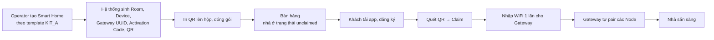

# 13_PRD_SMART_HOME.md

> **Product Requirements Document — Secure Smart Home Platform (V2)**
> Tài liệu này mô tả **sản phẩm phải làm được gì** ở phiên bản V2 (mục tiêu đồ án) và **khi nào coi là xong**. Tài liệu không mô tả cách hiện thực. Cách hiện thực đã có trong các tài liệu kiến trúc `00`–`10`, được dẫn chiếu ở từng yêu cầu.
> Bản tóm tắt 1 trang: [`12_PRODUCT_BRIEF.md`](12_PRODUCT_BRIEF.md).

| | |
|---|---|
| **Sản phẩm** | Secure Smart Home Platform |
| **Phiên bản** | V2 — MVP thương mại đầy đủ vòng đời |
| **Trạng thái tài liệu** | Draft v1.0 |
| **Chủ sở hữu** | Nguyễn Hoàng Đạt |
| **Cập nhật** | 2026-09-24 |
| **Người duyệt** | Giảng viên hướng dẫn (chưa duyệt) |

---

## MỤC LỤC

1. [Bối cảnh và vấn đề](#1-bối-cảnh-và-vấn-đề)
2. [Mục tiêu và phi mục tiêu](#2-mục-tiêu-và-phi-mục-tiêu)
3. [Người dùng và persona](#3-người-dùng-và-persona)
4. [Phạm vi và ưu tiên](#4-phạm-vi-và-ưu-tiên)
5. [Hành trình người dùng chính](#5-hành-trình-người-dùng-chính)
6. [Yêu cầu chức năng](#6-yêu-cầu-chức-năng)
7. [Yêu cầu phi chức năng](#7-yêu-cầu-phi-chức-năng)
8. [Chỉ số thành công](#8-chỉ-số-thành-công)
9. [Giả định và phụ thuộc](#9-giả-định-và-phụ-thuộc)
10. [Rủi ro](#10-rủi-ro)
11. [Quyết định sản phẩm và điều chỉnh so với Roadmap](#11-quyết-định-sản-phẩm-và-điều-chỉnh-so-với-roadmap)
12. [Câu hỏi còn mở](#12-câu-hỏi-còn-mở)
13. [Kế hoạch phát hành](#13-kế-hoạch-phát-hành)
14. [Truy vết yêu cầu → tài liệu kiến trúc](#14-truy-vết-yêu-cầu--tài-liệu-kiến-trúc)
15. [Thuật ngữ](#15-thuật-ngữ)

---

## 1. BỐI CẢNH VÀ VẤN ĐỀ

### 1.1. Đề tài

**"Thiết kế và xây dựng hệ thống nhà thông minh an toàn dựa trên IoT."** Nội dung đã đăng ký gồm 5 phần:

1. Xây dựng các nút IoT điều khiển đèn, quạt, cảm biến.
2. Phát triển Gateway IoT.
3. Xây dựng server và Web Dashboard.
4. Triển khai xác thực thiết bị, **mã hoá MQTT bằng TLS**, phân quyền người dùng.
5. **Tích hợp AI học thói quen sử dụng để tự động điều khiển thiết bị.**

### 1.2. Hiện trạng (Prototype)

| Lớp | Đã có | Còn thiếu / sai |
|---|---|---|
| Firmware | Gateway cầu nối 2 broker, sensor DHT22, HMAC ký payload | WiFi và secret viết cứng trong firmware, chưa có OTA/NVS, chưa có ESP-NOW |
| Backend | Express + TypeScript, HMAC 2 lớp, tự khoá thiết bị sau 5 lần xác thực lỗi | Không phân lớp, lộ secret sensor qua `sensors.routes.ts`, chưa tách namespace theo kênh |
| Database | 6 bảng | Bảng `devices` gộp Gateway và Sensor, chưa có Home/Room/Member |
| Web Dashboard | Đã refactor IA mới (Phase 0–7, xem [`06`](06_FRONTEND_REFACTOR_PROGRESS.md)) | Toàn bộ chạy trên mock data, chưa nối backend |
| Mobile | Giao diện mẫu | Chưa có state management, API hay xác thực thật |
| Bảo mật | HMAC đúng thuật toán | MQTT `allow_anonymous`, không TLS |

### 1.3. Vấn đề cần giải quyết

- **Với khách hàng:** chưa có cách tự cài đặt và sử dụng một bộ Smart Home mà không cần kỹ thuật viên.
- **Với doanh nghiệp vận hành:** chưa có quy trình chuẩn bị, bán, kích hoạt, bảo hành và cập nhật một bộ kit.
- **Với đề tài:** hai hạng mục đã đăng ký là **MQTT TLS** và **AI học thói quen** hiện chưa có phần nào chạy được.

---

## 2. MỤC TIÊU VÀ PHI MỤC TIÊU

### 2.1. Mục tiêu

| # | Mục tiêu | Đo bằng |
|---|---|---|
| G1 | Khách hàng tự cài đặt được bộ kit mà không cần hỗ trợ | Thời gian từ mở hộp đến điều khiển được thiết bị đầu tiên (mục 8) |
| G2 | Hệ thống an toàn ở mọi lớp, từ thiết bị đến ứng dụng | Không còn lỗ hổng mức Critical trong [`09`](09_SECURITY_ARCHITECTURE.md). MQTT có TLS |
| G3 | Mô hình dữ liệu đúng cho sản phẩm thương mại | Home → Room → Device → Sensor → Telemetry chạy end-to-end với dữ liệu thật |
| G4 | Đáp ứng đủ 5 nội dung đề tài | Mỗi nội dung có ít nhất 1 tính năng chạy thật (mục 14) |
| G5 | Kiến trúc mở rộng được lên Commercial mà không phải viết lại | Các lựa chọn V2 khớp với roadmap [`10`](10_SMART_HOME_PRODUCT_ROADMAP.md) |

### 2.2. Phi mục tiêu (không làm ở V2)

- Mô hình AI học máy thật (deep learning, dự đoán chuỗi thời gian). V2 chỉ làm gợi ý dựa trên thống kê (FR-7.4).
- Energy Analytics, trợ lý giọng nói (Google/Alexa), Matter/Thread, BLE Mesh.
- Bán thiết bị lẻ để mở rộng phòng. V2 chỉ bán theo kit.
- Hạ tầng Commercial/Enterprise: Kubernetes, Kafka, MQTT cluster, multi-region.
- Secure Boot và Flash Encryption trên thiết bị sản xuất hàng loạt.
- Ứng dụng Web cho khách hàng. Đây là quyết định có chủ đích, không phải thiếu sót (xem mục 11).

---

## 3. NGƯỜI DÙNG VÀ PERSONA

### 3.1. Vai trò hệ thống (quyết định kênh truy cập)

| Role | Kênh | Sở hữu nhà | Ghi chú |
|---|---|---|---|
| `ADMIN` | Web Dashboard | Không | Toàn quyền hệ thống |
| `OPERATOR` | Web Dashboard | Không | Chỉ vào được nhà của khách khi được cấp quyền có thời hạn |
| `USER` | Mobile App | Có (Owner/Member) | Không bao giờ có phiên đăng nhập Web |

### 3.2. Vai trò trong một Smart Home

| Role | Điều khiển | Xem camera/sensor | Tự động hoá | Quản lý thành viên | Chuyển quyền / xoá nhà |
|---|:---:|:---:|:---:|:---:|:---:|
| `OWNER` | ✅ | ✅ | Tạo / sửa / xoá | ✅ | ✅ |
| `CONTROLLER` | ✅ | ✅ | Tạo / sửa rule của mình | ❌ | ❌ |
| `VIEWER` | ❌ | ✅ | Chỉ xem | ❌ | ❌ |
| `GUEST` | Chỉ thiết bị được chỉ định, có hạn | Theo cấu hình | ❌ | ❌ | ❌ |

### 3.3. Persona

**P1 — Anh Minh, chủ hộ, 35 tuổi.** Nhân viên văn phòng, không rành kỹ thuật, dùng điện thoại thành thạo. Mua kit để tắt đèn và quạt từ xa, đồng thời muốn biết khi có người lạ trước cửa.
*Nỗi đau:* từng mua thiết bị phải cài WiFi riêng cho từng cái, mất cả buổi tối. *Cần:* cài một lần, chạy ngay.

**P2 — Chị Lan, vợ anh Minh.** Muốn điều khiển mọi thứ nhưng không cần quản lý tài khoản. **Bà Hoa, mẹ anh Minh.** Chỉ cần xem nhiệt độ phòng ngủ.
*Cần:* được mời vào nhà bằng một đường link, dùng ngay.

**P3 — Tuấn, Operator.** Mỗi ngày chuẩn bị 10–20 bộ kit tại kho và xử lý ticket khi khách báo thiết bị mất kết nối.
*Cần:* tạo nhà nhanh theo template, thấy ngay gateway nào offline, đẩy firmware hàng loạt.

**P4 — Admin hệ thống.** Quản lý nhân sự Operator, phát hành firmware, điều tra sự cố bảo mật.
*Cần:* audit log đầy đủ, không sửa được, lọc được.

---

## 4. PHẠM VI VÀ ƯU TIÊN

Ưu tiên theo MoSCoW, căn cứ [`10`](10_SMART_HOME_PRODUCT_ROADMAP.md) §10 và có 2 điều chỉnh ở mục 11.

| Epic | Nội dung | Ưu tiên |
|---|---|:---:|
| E1 | Tài khoản và xác thực (2 kênh tách biệt) | **MUST** |
| E2 | Operator chuẩn bị Smart Home (unclaimed) | **MUST** |
| E3 | Claim Smart Home (QR / Activation Code) | **MUST** |
| E4 | WiFi Provisioning và Node Pairing | SHOULD |
| E5 | Điều khiển và giám sát thiết bị | **MUST** |
| E6 | Thành viên gia đình và phân quyền theo nhà | MUST (RBAC) / SHOULD (mời qua link) |
| E7 | Tự động hoá và AI gợi ý thói quen | SHOULD |
| E8 | Thông báo | SHOULD |
| E9 | Vận hành: giám sát Gateway, OTA | SHOULD |
| E10 | Log và Audit | MUST (Security/Activation) / COULD (8 loại còn lại) |
| E11 | Quản trị hệ thống (Admin) | **MUST** |
| E12 | Bảo mật lớp thiết bị và truyền tải | **MUST** |
| — | Camera live view | COULD (demo bằng snapshot) |

---

## 5. HÀNH TRÌNH NGƯỜI DÙNG CHÍNH

### J1 — Từ kho đến tay khách hàng (Operator → Khách hàng)

### J2 — Sử dụng hằng ngày (Khách hàng)

Mở app → thấy tổng quan nhà (nhiệt độ, thiết bị đang bật, cảnh báo) → vào phòng → bật/tắt đèn, quạt → nhận push khi có chuyển động ở cửa hoặc thiết bị mất kết nối.

### J3 — Chia sẻ cho gia đình (Owner → Thành viên)

Owner chọn "Mời thành viên" → nhập số điện thoại/email và chọn role → thành viên nhận link → đăng ký hoặc đăng nhập → tự động vào nhà với đúng quyền.

### J4 — Hệ thống gợi ý thói quen (AI)

Sau khoảng 1–2 tuần sử dụng, app hiển thị: *"Bạn thường tắt đèn phòng khách lúc khoảng 23:00. Tạo tự động hoá?"* → Chấp nhận để tạo rule, hoặc Bỏ qua để hệ thống không gợi ý lại mẫu này.

### J5 — Hỗ trợ sự cố (Operator)

Dashboard báo Gateway offline → Operator xem Gateway Detail (RSSI, last seen, firmware) → nếu cần vào nhà khách thì yêu cầu quyền truy cập có thời hạn → xử lý → quyền tự hết hạn.

---

## 6. YÊU CẦU CHỨC NĂNG

Quy ước: **FR-x.y**, ưu tiên **M**/**S**/**C** (Must/Should/Could). Tiêu chí nghiệm thu viết theo dạng *Cho trước / Khi / Thì*.

### E1 — Tài khoản và xác thực

| ID | Yêu cầu | Ưu tiên |
|---|---|:---:|
| FR-1.1 | Khách hàng đăng ký tài khoản trên Mobile bằng email hoặc số điện thoại + mật khẩu. Tài khoản mới luôn có `role=USER` | M |
| FR-1.2 | Mobile dùng Access Token (15 phút) và Refresh Token (30 ngày, xoay vòng mỗi lần dùng), lưu trong Keychain/Keystore | M |
| FR-1.3 | Web Dashboard dùng session cookie `HttpOnly`, `SameSite=Strict`, chỉ cấp cho `ADMIN`/`OPERATOR` | M |
| FR-1.4 | Tài khoản `USER` đăng nhập Web nhận lỗi `USE_MOBILE_APP`. Tài khoản `ADMIN`/`OPERATOR` gọi `/api/mobile/*` bị từ chối | M |
| FR-1.5 | Đăng xuất trên Mobile thu hồi Refresh Token phía server | M |
| FR-1.6 | Quên mật khẩu qua OTP email/SMS | C |

**Nghiệm thu FR-1.4:** *Cho trước* tài khoản `role=USER` hợp lệ, *khi* gọi `POST /api/dashboard/auth/login`, *thì* nhận `403 { error: "USE_MOBILE_APP" }`, không có cookie nào được set và sự kiện được ghi vào Security Log.

### E2 — Operator chuẩn bị Smart Home

| ID | Yêu cầu | Ưu tiên |
|---|---|:---:|
| FR-2.1 | Operator tạo Smart Home với: tên tạm, gói (`KIT_A`/`KIT_B`), địa điểm, tên chủ dự kiến (chỉ là ghi chú). Trạng thái ban đầu là `unclaimed` | M |
| FR-2.2 | Hệ thống tự sinh Room và Device theo template của gói trong **một transaction** | M |
| FR-2.3 | Hệ thống sinh `gateway_uuid` ngẫu nhiên (không đoán được) và `gateway_secret` 32 byte. Secret chỉ hiển thị cho công cụ flash nội bộ, không bao giờ hiển thị trên UI Dashboard | M |
| FR-2.4 | Hệ thống sinh Activation Code 12 ký tự Crockford Base32 dạng `XXXX-XXXX-XXXX` và QR có chữ ký. QR không chứa secret | M |
| FR-2.5 | Operator in được tem QR + Activation Code | S |
| FR-2.6 | Operator/Admin thu hồi được Activation Code chưa dùng (hộp lỗi, thu hồi trước khi bán) | S |
| FR-2.7 | Wizard 5 bước: Create Home → Preview Room/Device → Generate Gateway → Activation/QR → Ready to Sell | M |

**Nghiệm thu FR-2.2:** *Cho trước* gói `KIT_A`, *khi* Operator hoàn tất bước 1 của wizard, *thì* nhà mới có đúng 4 Room (Door, Living Room, Bedroom, Kitchen), 1 Gateway và 4 Node gán đúng phòng. Nếu bất kỳ bước nào lỗi thì không có bản ghi nào được tạo.

### E3 — Claim Smart Home

| ID | Yêu cầu | Ưu tiên |
|---|---|:---:|
| FR-3.1 | Khách chọn "Thêm Smart Home", mặc định mở camera quét QR | M |
| FR-3.2 | Khách có thể chuyển sang nhập Activation Code thủ công. Ô nhập tự thêm dấu gạch và không phân biệt hoa/thường | M |
| FR-3.3 | Backend kiểm tra theo thứ tự: mã tồn tại → chưa dùng/chưa thu hồi → chưa hết hạn (mặc định 180 ngày) → nhà còn `unclaimed` → chưa vượt rate-limit | M |
| FR-3.4 | Claim thành công trong **một transaction**: gán `owner_user_id`, tạo member `OWNER`, đánh dấu mã đã dùng, nhà chuyển `active` | M |
| FR-3.5 | Lỗi trả mã cụ thể: `NOT_FOUND`, `ALREADY_USED`, `EXPIRED`, `RATE_LIMITED`. App hiển thị thông điệp dễ hiểu kèm hướng xử lý | M |
| FR-3.6 | Rate-limit: tối đa 5 lần thử/mã/giờ, 20 lần/tài khoản/ngày. Vượt ngưỡng thì khoá 15 phút và ghi Security Log | M |
| FR-3.7 | 100% lượt thử (thành công và thất bại) ghi `activation_logs` kèm IP, user, kết quả, lý do | M |

**Nghiệm thu FR-3.4:** *Cho trước* 2 tài khoản cùng gửi một mã hợp lệ gần như đồng thời, *khi* cả 2 request tới backend, *thì* đúng 1 tài khoản trở thành Owner và tài khoản còn lại nhận `ALREADY_USED`.

### E4 — WiFi Provisioning và Node Pairing

| ID | Yêu cầu | Ưu tiên |
|---|---|:---:|
| FR-4.1 | Sau khi claim, app hướng dẫn đưa Gateway vào chế độ provisioning và gửi SSID/mật khẩu WiFi qua **BLE** (ưu tiên) hoặc SoftAP (dự phòng) | S |
| FR-4.2 | Màn hình nhập WiFi xuất hiện **đúng 1 lần** trong toàn bộ quá trình cài đặt kit | S |
| FR-4.3 | Gateway tự pair các Node trong kit qua ESP-NOW, không cần thao tác của khách. App hiển thị tiến độ từng Node | S |
| FR-4.4 | Mật khẩu WiFi của khách lưu trong NVS của Gateway và không gửi lên backend | M |
| FR-4.5 | Đổi WiFi: khi Gateway offline, app hướng dẫn vào lại provisioning mode. Node **không** phải pair lại | S |
| FR-4.6 | Camera kết nối qua Local AP Bridge của Gateway, không nhận WiFi thật của khách | C |
| FR-4.7 | Mọi bước provisioning/pairing ghi `provision_logs` | S |

### E5 — Điều khiển và giám sát thiết bị

| ID | Yêu cầu | Ưu tiên |
|---|---|:---:|
| FR-5.1 | Màn hình Home: danh sách phòng, số thiết bị đang bật, nhiệt độ/độ ẩm mới nhất, cảnh báo đang mở | M |
| FR-5.2 | Màn hình Room: danh sách thiết bị trong phòng với trạng thái realtime | M |
| FR-5.3 | Bật/tắt relay (đèn, quạt). UI phản hồi ngay (optimistic) và hoàn tác nếu thiết bị không xác nhận trong thời gian chờ | M |
| FR-5.4 | Xem giá trị cảm biến hiện tại và biểu đồ lịch sử 24 giờ / 7 ngày | M |
| FR-5.5 | Thiết bị offline hiển thị rõ trạng thái và thời điểm online cuối. Nút điều khiển bị vô hiệu | M |
| FR-5.6 | Mobile nhận cập nhật realtime qua WebSocket của backend. **Mobile không kết nối MQTT trực tiếp** | M |
| FR-5.7 | Owner/Controller đổi tên nhà, phòng, thiết bị | S |
| FR-5.8 | Xem snapshot camera cửa. Live view là tuỳ chọn | C |
| FR-5.9 | Chỉ thành viên có quyền điều khiển (Owner/Controller/Guest trong phạm vi) mới gửi được lệnh. Mọi lệnh ghi Device Command Log | M |

**Nghiệm thu FR-5.3:** *Cho trước* relay đèn phòng khách đang online, *khi* Controller bấm bật, *thì* relay đổi trạng thái vật lý và UI hiển thị trạng thái đã xác nhận trong mục tiêu NFR-P1. *Khi* thiết bị không phản hồi, *thì* UI quay về trạng thái cũ và báo lỗi.

### E6 — Thành viên gia đình và phân quyền

| ID | Yêu cầu | Ưu tiên |
|---|---|:---:|
| FR-6.1 | RBAC 2 tầng: role hệ thống quyết định kênh, role trong nhà quyết định hành động. Backend kiểm tra cả 2 tầng ở mọi request | M |
| FR-6.2 | Owner mời thành viên qua email/SĐT với role `CONTROLLER`/`VIEWER`/`GUEST`. Link mời hết hạn sau 7 ngày | S |
| FR-6.3 | `GUEST` bắt buộc có `expires_at` và danh sách thiết bị/phòng được phép. Hết hạn thì tự mất quyền | S |
| FR-6.4 | Owner đổi role hoặc xoá thành viên. Thành viên tự rời nhà được | S |
| FR-6.5 | Chuyển quyền sở hữu sang thành viên khác (yêu cầu xác nhận của người nhận) | C |
| FR-6.6 | Mọi thay đổi thành viên ghi User Activity Log | M |

**Nghiệm thu FR-6.1:** *Cho trước* tài khoản `VIEWER` của nhà A, *khi* gọi API bật relay của nhà A, *thì* nhận `403`. *Khi* gọi bất kỳ API nào của nhà B, *thì* nhận `404` (không để lộ việc nhà B tồn tại).

### E7 — Tự động hoá và AI gợi ý thói quen

| ID | Yêu cầu | Ưu tiên |
|---|---|:---:|
| FR-7.1 | Tạo rule dạng **IF** (cảm biến vượt ngưỡng / thời gian / trạng thái thiết bị) **THEN** (bật/tắt relay / gửi thông báo) | S |
| FR-7.2 | Bật/tắt rule, xem lịch sử lần chạy | S |
| FR-7.3 | Mọi hành động điều khiển thủ công được ghi vào `user_behavior_logs` (ai, thiết bị, hành động, thời điểm, nguồn) | M |
| FR-7.4 | **Gợi ý thói quen:** định kỳ phân tích `user_behavior_logs`. Nếu cùng một hành động trên cùng thiết bị lặp lại trong cửa sổ ±15 phút ở ít nhất 5 trong 7 ngày gần nhất, tạo gợi ý tự động hoá | S |
| FR-7.5 | Gợi ý chỉ được thực thi sau khi người dùng **chấp nhận**. Hệ thống không bao giờ tự điều khiển thiết bị dựa trên gợi ý chưa được duyệt | M |
| FR-7.6 | Phản hồi Chấp nhận/Bỏ qua ghi vào `user_feedback`. Mẫu đã bị bỏ qua thì không gợi ý lại trong 30 ngày | S |
| FR-7.7 | Tối đa 1 gợi ý mới mỗi ngày cho mỗi nhà, tránh làm phiền | S |

> Ngưỡng ở FR-7.4 là **giá trị khởi điểm đề xuất**, cần hiệu chỉnh khi có dữ liệu thật (xem câu hỏi mở Q3). Khung dữ liệu đầy đủ (Event Store, Feature Store, Recommendation Engine) theo [`03`](03_BACKEND_REFACTOR_SMARTHOME.md) §18 và [`04`](04_DATABASE_REFACTOR_SMARTHOME.md) §7.12. V2 chỉ hiện thực phần tối thiểu ở trên.

### E8 — Thông báo

| ID | Yêu cầu | Ưu tiên |
|---|---|:---:|
| FR-8.1 | Push notification (FCM) khi: Gateway/thiết bị offline, cảm biến vượt ngưỡng, phát hiện chuyển động ở cửa | S |
| FR-8.2 | Trung tâm thông báo trong app: danh sách, đánh dấu đã đọc | S |
| FR-8.3 | Người dùng bật/tắt từng loại thông báo | C |
| FR-8.4 | Chỉ thành viên của nhà nhận thông báo của nhà đó. `VIEWER`/`GUEST` nhận theo cấu hình | S |
| FR-8.5 | Web Dashboard có Notification Center cho Admin/Operator (sự kiện vận hành) | S |

### E9 — Vận hành: giám sát Gateway và OTA

| ID | Yêu cầu | Ưu tiên |
|---|---|:---:|
| FR-9.1 | Danh sách Gateway với trạng thái online/offline, RSSI, firmware, last seen, số Node | M |
| FR-9.2 | Gateway Detail: 8 chỉ số theo [`05`](05_FRONTEND_REFACTOR_SMARTHOME.md), thao tác Restart / Factory Reset có xác nhận | S |
| FR-9.3 | Admin tải lên firmware mới (có version, checksum, chữ ký) | S |
| FR-9.4 | Triển khai OTA cho 1 thiết bị hoặc 1 nhóm, theo dõi tiến độ | S |
| FR-9.5 | Thiết bị có 2 phân vùng OTA và tự rollback nếu firmware mới không khởi động thành công | S |
| FR-9.6 | Operator chỉ truy cập dữ liệu nhà của khách qua **quyền có thời hạn** (`operator_home_access`), mọi truy cập đều ghi log | S |

### E10 — Log và Audit

| ID | Yêu cầu | Ưu tiên |
|---|---|:---:|
| FR-10.1 | Security Log: đăng nhập, xác thực thiết bị lỗi, khoá thiết bị, vượt rate-limit | M |
| FR-10.2 | Activation Log (xem FR-3.7) | M |
| FR-10.3 | Log chỉ ghi thêm, không sửa. Chỉ Admin được xoá theo chính sách lưu giữ | M |
| FR-10.4 | Log Center trên Dashboard: lọc theo loại, thời gian, nhà, người thực hiện; xem chi tiết JSON | M |
| FR-10.5 | Tách đủ 10 loại log theo [`04`](04_DATABASE_REFACTOR_SMARTHOME.md) | C |

### E11 — Quản trị hệ thống (Admin)

| ID | Yêu cầu | Ưu tiên |
|---|---|:---:|
| FR-11.1 | Dashboard tổng quan Admin: số nhà theo trạng thái, gateway online/offline, cảnh báo, activation gần đây | M |
| FR-11.2 | Danh sách và chi tiết Smart Home (tab Thông tin / Rooms / Devices / Members / Automation / History / Log) | M |
| FR-11.3 | Danh sách và chi tiết Khách hàng (nhà đã mua, bảo hành, lịch sử activation) | M |
| FR-11.4 | Quản lý tài khoản Operator: tạo, khoá, đặt lại mật khẩu | M |
| FR-11.5 | Operator Dashboard: bản rút gọn của Admin, ẩn quản lý nhân sự và firmware | S |
| FR-11.6 | **Dashboard chạy trên dữ liệu thật từ backend**, thay thế mock store hiện tại | M |

### E12 — Bảo mật lớp thiết bị và truyền tải

| ID | Yêu cầu | Ưu tiên |
|---|---|:---:|
| FR-12.1 | Giữ nguyên HMAC-SHA256 2 lớp: Node ký → Gateway xác minh lại → Backend xác minh độc lập cả 2 chữ ký | M |
| FR-12.2 | Khoá thiết bị sau 5 lần xác thực lỗi liên tiếp (đã có, giữ nguyên) | M |
| FR-12.3 | **MQTT Gateway ↔ Backend dùng TLS** (tối thiểu server-auth). mTLS là mục tiêu S | M |
| FR-12.4 | Tắt `allow_anonymous` trên broker, mỗi Gateway có credential riêng và ACL giới hạn theo topic của nhà mình | M |
| FR-12.5 | **Vá rò rỉ secret:** không endpoint nào trả secret của sensor/gateway cho client. Gateway chỉ nhận secret của Node thuộc nhà mình | M |
| FR-12.6 | Xoá WiFi và secret viết cứng khỏi firmware, chuyển sang NVS được ghi lúc flash/provision | M |
| FR-12.7 | Chống replay: payload thiết bị có timestamp/nonce, backend từ chối gói quá hạn hoặc trùng | S |
| FR-12.8 | `gateway_secret` mã hoá khi lưu (encrypted-at-rest), không lưu plaintext trong DB | S |

---

## 7. YÊU CẦU PHI CHỨC NĂNG

Các mục tiêu đo ở **môi trường demo** (1 server, mạng WiFi gia đình, ≤ 10 nhà, ≤ 50 thiết bị).

### 7.1. Hiệu năng

| ID | Yêu cầu |
|---|---|
| NFR-P1 | Lệnh bật/tắt từ Mobile tới relay đổi trạng thái: p95 ≤ 2 giây |
| NFR-P2 | Trạng thái thiết bị cập nhật trên Mobile/Dashboard sau khi thay đổi: ≤ 3 giây |
| NFR-P3 | API đọc thông thường: p95 ≤ 300 ms. Biểu đồ 7 ngày: ≤ 1 giây |
| NFR-P4 | Mobile khởi động nguội tới màn hình Home: ≤ 3 giây |

### 7.2. Độ tin cậy

| ID | Yêu cầu |
|---|---|
| NFR-R1 | Thiết bị được đánh dấu offline khi mất heartbeat quá **90 giây** (giá trị đề xuất) |
| NFR-R2 | Gateway tự kết nối lại WiFi/MQTT khi mất mạng, không cần khách thao tác |
| NFR-R3 | Rule tự động hoá dạng ngưỡng cảm biến vẫn chạy khi Mobile đóng |
| NFR-R4 | OTA lỗi không được làm hỏng thiết bị (rollback, FR-9.5) |
| NFR-R5 | Backup database hằng ngày, khôi phục được |

### 7.3. Bảo mật và quyền riêng tư

| ID | Yêu cầu |
|---|---|
| NFR-S1 | Mọi lưu lượng client ↔ backend qua HTTPS. Thiết bị ↔ backend qua MQTT TLS |
| NFR-S2 | Mật khẩu người dùng hash bằng bcrypt/argon2. Activation Code chỉ lưu SHA-256 hash |
| NFR-S3 | Không log mật khẩu, token, secret hay WiFi password ở bất kỳ tầng nào |
| NFR-S4 | Dữ liệu hành vi (`user_behavior_logs`) chỉ dùng cho nhà sở hữu, không chia sẻ chéo giữa các nhà |
| NFR-S5 | Khách hàng xoá nhà hoặc tài khoản thì dữ liệu hành vi liên quan bị xoá hoặc ẩn danh hoá |
| NFR-S6 | Không còn lỗ hổng mức Critical/High trong danh sách của [`09`](09_SECURITY_ARCHITECTURE.md) Phase 0 |

### 7.4. Khả dụng (Usability)

| ID | Yêu cầu |
|---|---|
| NFR-U1 | Toàn bộ UI Mobile và Dashboard bằng tiếng Việt |
| NFR-U2 | Mọi thông báo lỗi nói rõ người dùng cần làm gì tiếp, không hiển thị mã lỗi kỹ thuật thô |
| NFR-U3 | Mobile hỗ trợ Android 8+ (bắt buộc) và iOS 14+ (nếu có thiết bị thử) |
| NFR-U4 | Dashboard hỗ trợ light/dark mode, dùng tốt từ độ rộng 1280px |

### 7.5. Khả năng bảo trì

| ID | Yêu cầu |
|---|---|
| NFR-M1 | Backend phân lớp Controller / Service / Repository theo [`03`](03_BACKEND_REFACTOR_SMARTHOME.md) |
| NFR-M2 | Mobile theo Clean Architecture + Riverpod theo [`07`](07_MOBILE_APP_ARCHITECTURE.md) |
| NFR-M3 | Firmware theo ESP-IDF, cấu hình qua NVS, không hằng số bí mật trong source |
| NFR-M4 | Chạy toàn bộ hệ thống bằng một lệnh Docker Compose (xem [`11`](11_CHAY_LOCAL.md)) |
| NFR-M5 | Migration database có phiên bản, chạy lại an toàn |

---

## 8. CHỈ SỐ THÀNH CÔNG

### 8.1. Chỉ số sản phẩm (đo trong buổi thử nghiệm người dùng)

| Chỉ số | Mục tiêu V2 | Cách đo |
|---|---|---|
| Thời gian từ mở hộp đến điều khiển thiết bị đầu tiên | ≤ 10 phút | Bấm giờ với 3–5 người thử không phải dân kỹ thuật |
| Tỉ lệ tự cài đặt thành công không cần trợ giúp | ≥ 80% | Như trên |
| Tỉ lệ claim thành công ở lần thử đầu (QR) | ≥ 95% | `activation_logs` |
| Tỉ lệ gợi ý AI được chấp nhận | ≥ 30% (tham khảo) | `user_feedback` |

### 8.2. Chỉ số kỹ thuật

| Chỉ số | Mục tiêu |
|---|---|
| Endpoint trả secret cho client | 0 |
| Lưu lượng MQTT Gateway ↔ Backend có TLS | 100% |
| Lượt claim được ghi log | 100% |
| Lệnh điều khiển p95 | ≤ 2 giây |

### 8.3. Tiêu chí hoàn thành cho buổi bảo vệ

Demo liền mạch trên phần cứng thật, không cắt cảnh:

1. Operator tạo Smart Home `KIT_A` trên Dashboard, hiển thị QR.
2. Khách đăng ký trên Mobile, quét QR, claim thành công.
3. (SHOULD) Nhập WiFi cho Gateway qua BLE, Node tự pair.
4. Bật/tắt đèn và quạt từ Mobile, thấy trạng thái đổi trên cả Mobile và Dashboard.
5. Rút nguồn một Node → Dashboard báo offline, Mobile nhận push.
6. Thử claim lại cùng mã → bị từ chối, log hiện trên Log Center.
7. Mở Wireshark cho thấy lưu lượng MQTT đã mã hoá.
8. (SHOULD) Hiển thị một gợi ý thói quen từ dữ liệu mẫu, chấp nhận để tạo rule.

---

## 9. GIẢ ĐỊNH VÀ PHỤ THUỘC

### 9.1. Giả định

- Phần cứng demo: 1 ESP32 Gateway, 2–4 ESP32 Node (DHT22 + relay), 1 ESP32-CAM (tuỳ chọn).
- Kit có đúng 1 Gateway. Nhà lớn cần nhiều Gateway nằm ngoài phạm vi V2.
- Khách hàng có WiFi 2.4 GHz (ESP32 không hỗ trợ 5 GHz).
- Dữ liệu cho AI gợi ý trong buổi demo có thể là **dữ liệu mẫu được sinh có chủ đích**, vì hệ thống không chạy đủ lâu để có dữ liệu thật.

### 9.2. Phụ thuộc

| Phụ thuộc | Ảnh hưởng nếu thiếu |
|---|---|
| Refactor database sang mô hình Home/Room ([`04`](04_DATABASE_REFACTOR_SMARTHOME.md)) | Chặn E2, E3, E5, E6, E11 |
| Backend tách namespace `/dashboard` `/mobile` `/device` | Chặn E1 |
| Firmware chuyển sang NVS | Chặn FR-12.6, E4 |
| Firebase project cho FCM | Chặn E8 (có thể thay bằng in-app notification) |
| Chứng chỉ TLS (self-signed CA cho demo) | Chặn FR-12.3 |

---

## 10. RỦI RO

| Rủi ro | Xác suất | Tác động | Giảm thiểu |
|---|:---:|:---:|---|
| Phạm vi quá lớn so với thời gian | Cao | Cao | Giữ chặt MoSCoW. SHOULD trượt thì chuyển thành trình bày thiết kế |
| Migrate firmware sang ESP-IDF tốn nhiều thời gian hơn dự kiến | Trung bình | Cao | FR-12.6 (NVS) có thể làm trên Arduino trước. ESP-IDF đầy đủ để sau |
| BLE provisioning không ổn định trên một số điện thoại | Trung bình | Trung bình | SoftAP làm dự phòng |
| Không đủ dữ liệu thật cho AI gợi ý | Cao | Thấp | Dữ liệu mẫu có kịch bản, trình bày rõ đây là dữ liệu mô phỏng |
| Dashboard hiện chạy mock, nối backend thật phát sinh lệch kiểu dữ liệu | Trung bình | Trung bình | Mock types đã theo domain model của `04`. Nối từng module |
| Thiếu phần cứng relay/camera | Thấp | Trung bình | Simulator MQTT đúng payload |

---

## 11. QUYẾT ĐỊNH SẢN PHẨM VÀ ĐIỀU CHỈNH SO VỚI ROADMAP

### 11.1. Quyết định giữ nguyên từ tài liệu kiến trúc

| Quyết định | Lý do ngắn | Nguồn |
|---|---|---|
| Khách hàng chỉ dùng Mobile, Web chỉ cho Admin/Operator | Trải nghiệm tiêu dùng nhất quán, giảm bề mặt tấn công của Web | [`01`](01_SMART_HOME_PRODUCT_ARCHITECTURE.md) §0 |
| Claim bằng QR (chính) + Activation Code (dự phòng) | Chuẩn ngành, có đường dự phòng khi QR hỏng | [`01`](01_SMART_HOME_PRODUCT_ARCHITECTURE.md) §3 |
| Nhà được tạo trước khi bán | Khớp quy trình kho → đóng gói → bán | [`01`](01_SMART_HOME_PRODUCT_ARCHITECTURE.md) §4 |
| Chỉ Gateway giữ WiFi thật, Node dùng ESP-NOW | Nhập WiFi 1 lần, giảm rủi ro lộ mật khẩu | [`02`](02_SMART_HOME_WIFI_PROVISIONING.md) §2 |
| Mobile không kết nối MQTT trực tiếp | Không phân phối credential broker ra thiết bị người dùng | [`07`](07_MOBILE_APP_ARCHITECTURE.md) |

### 11.2. Điều chỉnh so với Roadmap [`10`](10_SMART_HOME_PRODUCT_ROADMAP.md) §10

| Hạng mục | Roadmap `10` | PRD này | Lý do |
|---|---|---|---|
| MQTT TLS | SHOULD | **MUST** (server-auth), mTLS vẫn SHOULD | "Mã hoá MQTT bằng TLS" là nội dung đề tài đã đăng ký. Thiếu thì đề tài chưa đạt |
| AI | WON'T (model thật) / COULD (khung AI-Ready) | **SHOULD**: gợi ý thói quen dựa trên thống kê (FR-7.4 → 7.7). **MUST**: ghi `user_behavior_logs` (FR-7.3) | "AI học thói quen để tự động điều khiển" là nội dung đề tài. Cách thống kê đủ để chứng minh vòng lặp *thu thập → học → gợi ý → phản hồi* chạy thật, không cần model ML. Model thật vẫn để V3 |

> Hai điều chỉnh này nên được phản ánh ngược lại vào [`10`](10_SMART_HOME_PRODUCT_ROADMAP.md) §10 khi PRD được duyệt.

---

## 12. CÂU HỎI CÒN MỞ

| # | Câu hỏi | Ảnh hưởng | Đề xuất mặc định |
|---|---|---|---|
| Q1 | Hội đồng có chấp nhận gợi ý thống kê là "AI học thói quen" không, hay cần một model ML (VD: decision tree dự đoán hành động theo giờ)? | E7 | Hỏi giảng viên hướng dẫn sớm. Nếu cần model, thêm một classifier nhẹ chạy offline trên cùng dữ liệu |
| Q2 | Đăng ký bằng email hay số điện thoại? Có cần OTP thật không? | E1 | Email + mật khẩu, không OTP ở V2 |
| Q3 | Ngưỡng gợi ý (±15 phút, 5/7 ngày) có hợp lý không? | FR-7.4 | Giữ làm mặc định, cấu hình được |
| Q4 | Camera: bỏ hẳn hay demo snapshot? | FR-5.8, FR-4.6 | Snapshot nếu có ESP32-CAM, không thì chỉ trình bày thiết kế |
| Q5 | Push qua FCM có khả thi (tài khoản Firebase, thiết bị thật)? | E8 | Có. Dự phòng bằng in-app notification qua WebSocket |
| Q6 | Dashboard giữ mock auth hay chuyển sang auth thật ngay? | FR-1.3, FR-11.6 | Chuyển sang auth thật ở mốc M2 |

---

## 13. KẾ HOẠCH PHÁT HÀNH

Các mốc xếp theo phụ thuộc. Ngày cụ thể điền khi chốt lịch bảo vệ.

| Mốc | Nội dung | Epic / FR | Điều kiện hoàn thành |
|---|---|---|---|
| **M1 — Nền móng và vá khẩn cấp** | Schema Home/Room/Device, backend phân lớp + tách namespace, vá lộ secret, bỏ hard-code firmware | FR-12.5, FR-12.6, NFR-M1 | Migration chạy được. Test chứng minh không endpoint nào trả secret |
| **M2 — Vòng đời Claim** | Wizard Operator trên dữ liệu thật, auth Mobile thật, claim QR/mã | E1, E2, E3, FR-11.6 | Demo J1 từ tạo nhà tới claim trên dữ liệu thật |
| **M3 — Điều khiển và bảo mật truyền tải** | Relay/sensor end-to-end, WebSocket realtime, MQTT TLS + ACL | E5, FR-6.1, FR-12.3, FR-12.4 | Bật đèn từ Mobile. Wireshark cho thấy MQTT đã mã hoá |
| **M4 — Trải nghiệm hoàn chỉnh** | Provisioning BLE, pairing ESP-NOW, thông báo, mời thành viên, rule IF/THEN | E4, E6, E7 (7.1–7.2), E8 | Demo J2, J3 |
| **M5 — AI và vận hành** | Behavior log, gợi ý thói quen, OTA, Log Center | FR-7.3 → 7.7, E9, E10 | Demo J4. 1 lần OTA thành công |
| **M6 — Đóng băng và diễn tập** | Sửa lỗi, dữ liệu demo, kịch bản bảo vệ (mục 8.3) | — | Chạy đủ kịch bản 8.3 liên tục 3 lần không lỗi |

M1–M3 là đường găng. Nếu trễ, M4–M5 được cắt theo thứ tự SHOULD → COULD, **không cắt MUST**.

---

## 14. TRUY VẾT YÊU CẦU → TÀI LIỆU KIẾN TRÚC

### 14.1. Nội dung đề tài → Yêu cầu

| Nội dung đề tài | Yêu cầu đáp ứng |
|---|---|
| Nút IoT điều khiển đèn, quạt, cảm biến | FR-5.3, FR-5.4, FR-4.3 |
| Gateway IoT | FR-4.1 → 4.5, FR-9.1, FR-12.1 |
| Server và Web Dashboard | E2, E9, E10, E11 |
| Xác thực thiết bị | FR-12.1, FR-12.2, FR-12.7 |
| Mã hoá MQTT bằng TLS | FR-12.3, FR-12.4 |
| Phân quyền người dùng | FR-1.3, FR-1.4, E6 |
| AI học thói quen, tự động điều khiển | FR-7.3 → FR-7.7, FR-7.1 |

### 14.2. Epic → Tài liệu thiết kế

| Epic | Tài liệu |
|---|---|
| E1, E6 | [`01`](01_SMART_HOME_PRODUCT_ARCHITECTURE.md) §2, §7, §11 · [`03`](03_BACKEND_REFACTOR_SMARTHOME.md) |
| E2, E3 | [`01`](01_SMART_HOME_PRODUCT_ARCHITECTURE.md) §4–6 · [`05`](05_FRONTEND_REFACTOR_SMARTHOME.md) |
| E4 | [`02`](02_SMART_HOME_WIFI_PROVISIONING.md) · [`08`](08_EMBEDDED_ARCHITECTURE_ESP_IDF.md) |
| E5, E8 | [`03`](03_BACKEND_REFACTOR_SMARTHOME.md) · [`07`](07_MOBILE_APP_ARCHITECTURE.md) |
| E7 | [`03`](03_BACKEND_REFACTOR_SMARTHOME.md) §18 · [`04`](04_DATABASE_REFACTOR_SMARTHOME.md) §7.12 |
| E9 | [`05`](05_FRONTEND_REFACTOR_SMARTHOME.md) · [`08`](08_EMBEDDED_ARCHITECTURE_ESP_IDF.md) §14–15 |
| E10, E11 | [`04`](04_DATABASE_REFACTOR_SMARTHOME.md) · [`05`](05_FRONTEND_REFACTOR_SMARTHOME.md) · [`06`](06_FRONTEND_REFACTOR_PROGRESS.md) |
| E12 | [`09`](09_SECURITY_ARCHITECTURE.md) |

---

## 15. THUẬT NGỮ

| Thuật ngữ | Nghĩa |
|---|---|
| **Smart Home** | Một căn nhà của khách hàng, gồm nhiều Room, gắn với 1 Gateway |
| **Kit** | Bộ thiết bị bán kèm (VD `KIT_A`: 1 Gateway + 4 Node), ứng với 1 Smart Home tạo sẵn |
| **Unclaimed** | Trạng thái Smart Home đã tạo nhưng chưa có chủ |
| **Claim** | Hành động khách hàng nhận quyền sở hữu Smart Home bằng QR/Activation Code |
| **Activation Code** | Mã 12 ký tự in trên hộp, dùng một lần để claim |
| **Provisioning** | Cấu hình WiFi cho Gateway lần đầu |
| **Pairing** | Gateway thiết lập kết nối ESP-NOW an toàn với từng Node |
| **Gateway** | ESP32 trung tâm, kết nối Internet và làm cầu nối cho các Node |
| **Node** | ESP32 trong phòng, gắn cảm biến và/hoặc relay |
| **HMAC 2 lớp** | Node ký payload, Gateway và Backend đều xác minh độc lập |
| **OTA** | Cập nhật firmware từ xa qua mạng |
| **RBAC 2 tầng** | Phân quyền theo role hệ thống và theo role trong từng nhà |
