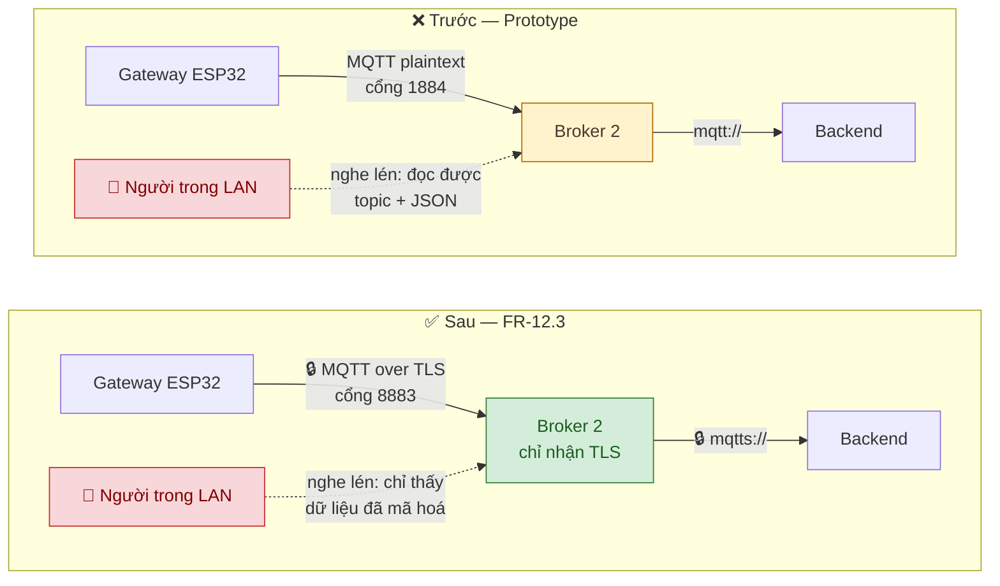
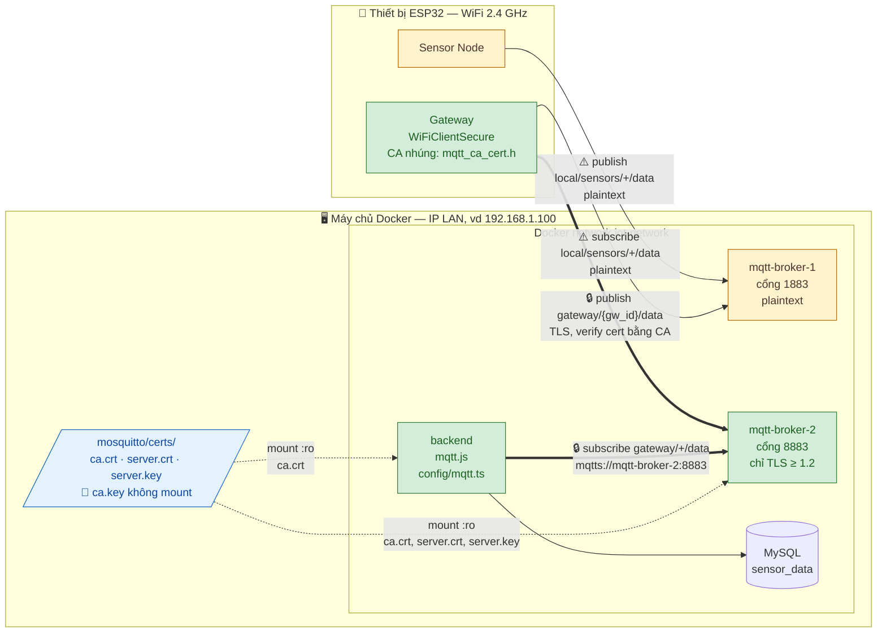
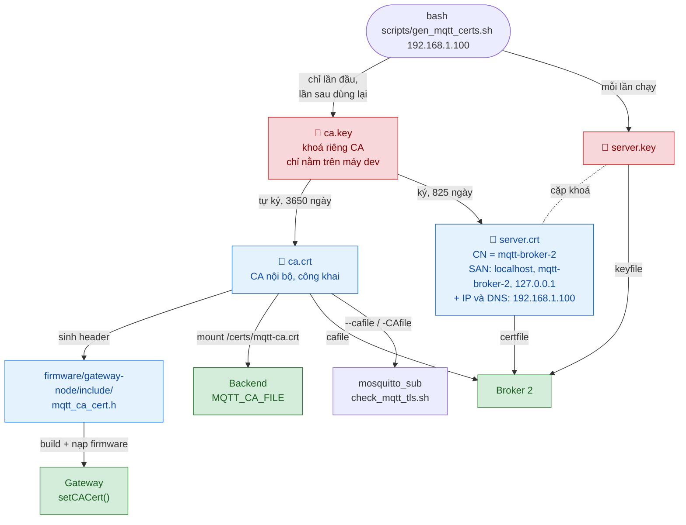
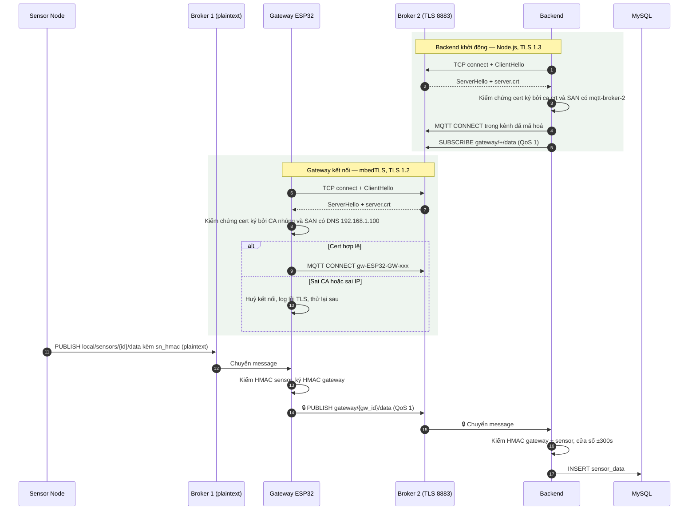
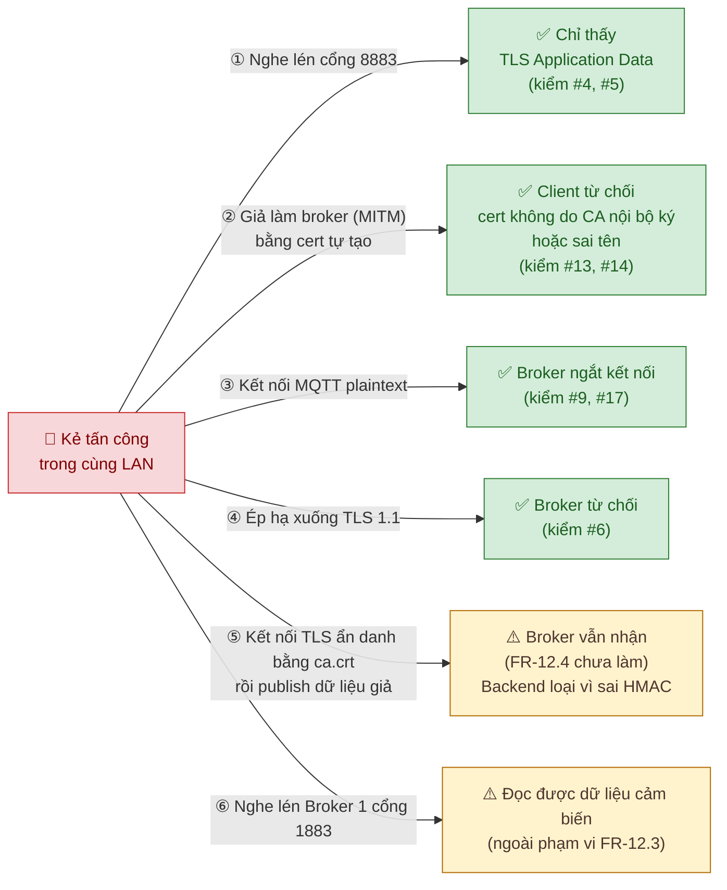

# 14_MQTT_TLS.md

> **Hướng dẫn MQTT TLS — Broker 2 (Gateway ↔ Backend)**
> Tài liệu ghi lại những gì đã làm cho yêu cầu mã hoá MQTT bằng TLS, cách đã kiểm tra, các bước để chạy trên hệ thống thật, và phần còn thiếu.
> Tài liệu này mô tả **hiện trạng code**. Kiến trúc đích nằm ở [`09_SECURITY_ARCHITECTURE.md`](09_SECURITY_ARCHITECTURE.md) §4 và [`13_PRD_SMART_HOME.md`](13_PRD_SMART_HOME.md) FR-12.3, FR-12.4.

| | |
|---|---|
| **Yêu cầu** | FR-12.3 (MUST): MQTT Gateway ↔ Backend dùng TLS, tối thiểu xác thực server. NFR-S1 |
| **Trạng thái** | Đã có code. Đã kiểm tra với broker chạy trên máy dev. **Chưa kiểm tra trên ESP32 thật và trong Docker** |
| **Ngày kiểm tra** | 2026-09-27 |
| **Cập nhật** | 2026-09-28 |

---

## MỤC LỤC

1. [Tổng quan và kiến trúc](#1-tổng-quan-và-kiến-trúc)
   - [1.1. Trước và sau](#11-trước-và-sau) · [1.2. Kiến trúc triển khai](#12-kiến-trúc-triển-khai) · [1.3. Chuỗi tin cậy chứng chỉ](#13-chuỗi-tin-cậy-chứng-chỉ) · [1.4. Luồng kết nối và gửi dữ liệu](#14-luồng-kết-nối-và-gửi-dữ-liệu) · [1.5. Phòng thủ nhiều lớp](#15-phòng-thủ-nhiều-lớp-trước-kẻ-tấn-công-trong-lan)
2. [Những gì đã làm](#2-những-gì-đã-làm)
3. [Những gì đã kiểm tra](#3-những-gì-đã-kiểm-tra)
4. [Việc cần làm để chạy thật](#4-việc-cần-làm-để-chạy-thật)
5. [Xử lý sự cố](#5-xử-lý-sự-cố)
6. [Việc chưa làm](#6-việc-chưa-làm)
7. [Tham chiếu](#7-tham-chiếu)

---

## 1. Tổng quan và kiến trúc

- Broker 2 chỉ còn một cổng là **8883 (TLS)**. Cổng plaintext 1884 đã bỏ hẳn.
- Gateway và Backend đều kiểm chứng chứng chỉ của Broker 2 bằng một **CA nội bộ**. Không có chế độ bỏ qua kiểm tra (`setInsecure()`, `rejectUnauthorized: false`).
- TLS chỉ bảo vệ kênh truyền. HMAC 2 lớp vẫn giữ nguyên để bảo vệ nội dung từng gói tin (Defense-in-Depth, `09` §3).

Năm sơ đồ dưới đây đi từ tổng quát tới chi tiết. Khi trình bày: 1.1 dành cho người không chuyên, 1.2–1.4 cho phần kỹ thuật, 1.5 cho phần bảo mật và demo.

> Sơ đồ viết bằng Mermaid, hiển thị trực tiếp trên GitHub và trong VS Code (cần extension *Markdown Preview Mermaid Support*). Để đưa vào slide: dán khối code vào [mermaid.live](https://mermaid.live) rồi xuất PNG/SVG.

### 1.1. Trước và sau



**Ý chính:** trước đây ai ở cùng mạng LAN cũng đọc được topic và dữ liệu JSON gateway gửi lên. Giờ chặng Gateway → Broker 2 → Backend đã được mã hoá, người nghe lén chỉ thấy dữ liệu không đọc được.

### 1.2. Kiến trúc triển khai



**Cách đọc:**

- Mũi tên chỉ chiều **client mở kết nối tới broker**. Dữ liệu thực tế đi theo thứ tự Sensor → Broker 1 → Gateway → Broker 2 → Backend (xem 1.4).
- Mũi tên đậm 🔒 là kênh TLS. Mũi tên ⚠️ là kênh plaintext. Mũi tên chấm là file chứng chỉ được mount chỉ đọc vào container.
- Gateway đi vào Broker 2 qua cổng 8883 của máy chủ, dùng IP LAN. Backend đi trong mạng Docker bằng tên `mqtt-broker-2`. Cả hai tên này đều nằm trong SAN của `server.crt`, nên cả hai client xác thực được broker.
- Broker 1 và chặng Sensor → Gateway không đổi (xem mục 6).

### 1.3. Chuỗi tin cậy chứng chỉ



**Ý chính:**

- `ca.key` là bí mật quan trọng nhất. Ai có file này đều cấp được chứng chỉ giả mà gateway và backend sẽ tin. Vì vậy file này chỉ nằm trên máy dev, không mount vào container nào, và đã được gitignore.
- Các client chỉ cần `ca.crt`, là file công khai.
- Đổi IP LAN thì chạy lại script: chỉ `server.crt` và `server.key` thay đổi, CA giữ nguyên, nên **không phải nạp lại firmware**.

### 1.4. Luồng kết nối và gửi dữ liệu



**Ý chính:**

- Trước khi gửi bất kỳ gói MQTT nào, client kiểm chứng 2 điều: chứng chỉ do CA nội bộ ký, và tên/IP đang kết nối có trong SAN. Sai một trong hai thì kết nối bị huỷ ngay.
- Backend dùng TLS 1.3. ESP32 dùng TLS 1.2 vì mbedTLS 2.28 chưa hỗ trợ 1.3. Broker chấp nhận cả hai.
- Sau khi kênh đã được mã hoá, HMAC vẫn được kiểm ở gateway (bước 13) và ở backend (bước 16) như trước.

### 1.5. Phòng thủ nhiều lớp trước kẻ tấn công trong LAN



**Ý chính:**

- Số `#` là mã phép thử ở [mục 3](#3-những-gì-đã-kiểm-tra).
- TLS chặn được nghe lén, giả mạo broker, kết nối plaintext và hạ cấp giao thức (① đến ④).
- ⑤ và ⑥ nằm ngoài FR-12.3 và được ghi ở [mục 6](#6-việc-chưa-làm). Riêng ⑤, HMAC ở lớp ứng dụng vẫn chặn được dữ liệu giả. Đây là lý do hệ thống giữ cả TLS lẫn HMAC.
- ① mới được xác nhận qua handshake (#4, #5). Chưa có ảnh Wireshark chụp trên mạng LAN thật (xem bước 7 ở mục 4).

---

## 2. Những gì đã làm

### 2.1. Các quyết định thiết kế

| Quyết định | Lý do |
|---|---|
| Chỉ bật TLS cho Broker 2, Broker 1 giữ plaintext | FR-12.3 chỉ yêu cầu chặng Gateway ↔ Backend. Theo `03` §17 và `09` §4.1, chặng Sensor ↔ Gateway là mạng nội bộ và sẽ chuyển sang ESP-NOW |
| TLS xác thực server, chưa làm mTLS | PRD xếp xác thực server là MUST, mTLS là SHOULD |
| Bỏ hẳn cổng plaintext của Broker 2 | Tiêu chí nghiệm thu yêu cầu 100% lưu lượng Gateway ↔ Backend có TLS. Giữ cổng cũ song song sẽ để lại đường vòng không mã hoá |
| Tự ký một CA nội bộ và dùng lại CA đó | PRD cho phép "self-signed CA cho demo". Khi đổi IP chỉ cần cấp lại cert server, CA không đổi nên không phải nạp lại firmware |
| IP của broker được ghi vào SAN ở cả dạng `IP:` và `DNS:` | ESP32 dùng mbedTLS 2.28.7 (Arduino core 2.0.17), bản này chỉ so khớp SAN kiểu DNS. OpenSSL và Node lại kiểm tra theo SAN kiểu IP. Ghi cả hai thì client nào cũng xác thực được |
| Dùng khoá RSA-2048 | Tương thích với mbedTLS, OpenSSL và Node mà không cần cấu hình thêm |
| Tối thiểu TLS 1.2 | ESP32 (mbedTLS 2.28) chỉ hỗ trợ TLS 1.2. Backend và công cụ trên máy dev dùng TLS 1.3 |

### 2.2. File đã thay đổi

| File | Thay đổi |
|---|---|
| `scripts/gen_mqtt_certs.sh` (mới) | Sinh CA nội bộ (chỉ lần đầu), cert cho Broker 2 và file `firmware/gateway-node/include/mqtt_ca_cert.h` |
| `scripts/check_mqtt_tls.sh` (mới) | Script nghiệm thu gồm 4 phép thử, dùng khi demo bảo vệ |
| `mosquitto/broker2/mosquitto.conf` | Chỉ còn `listener 8883` với `cafile`/`certfile`/`keyfile`, `tls_version tlsv1.2`, `require_certificate false` |
| `mosquitto/certs/README.md` (mới) | Mô tả từng file chứng chỉ và ai được dùng file nào |
| `docker-compose.yml`, `docker-compose.prod.yml` | Broker 2 mở cổng `8883:8883`, mount từng file cert ở chế độ `:ro`. Backend mount `ca.crt` vào `/certs/mqtt-ca.crt`, đặt `MQTT_PORT=8883`, `MQTT_CA_FILE` |
| `backend/src/config/mqtt.ts` (mới) | Hàm `connectBroker()` dùng chung: `mqtts://`, `ca`, `rejectUnauthorized: true`. Đọc CA khi khởi động, thiếu CA thì dừng |
| `backend/src/services/mqttDataService.ts`, `mqttTracker.ts` | Chuyển sang dùng `connectBroker()` |
| `firmware/gateway-node/lib/mqtt_client/mqtt_client.cpp` | Kết nối Broker 2 dùng `WiFiClientSecure` + `setCACert()` + `setHandshakeTimeout(10)`. Khi kết nối lỗi, log in cả nguyên nhân TLS |
| `.gitignore` | Bỏ qua `mosquitto/certs/*` (trừ README) và `firmware/gateway-node/include/mqtt_ca_cert.h` |
| `scripts/setup.sh`, `scripts/setup.bat` | Tự sinh chứng chỉ nếu chưa có, trước bước `compose up` |
| `README.md`, `docs/11_CHAY_LOCAL.md`, `firmware/gateway-node/README.md`, `scripts/ATTACK_SIMULATION_GUIDE.md`, `scripts/DEMO_THREAT_MODEL.md` | Đổi cổng 1884 thành 8883, thêm bước sinh chứng chỉ |

### 2.3. Cấu hình

**Biến môi trường backend**

| Biến | Chạy local | Docker (compose tự đặt) |
|---|---|---|
| `MQTT_HOST` | `localhost` | `mqtt-broker-2` |
| `MQTT_PORT` | `8883` (mặc định trong code) | `8883` |
| `MQTT_CA_FILE` | `../mosquitto/certs/ca.crt` (mặc định, tính từ thư mục `backend/`) | `/certs/mqtt-ca.crt` |

`MQTT_HOST` phải có trong SAN của cert. SAN luôn có sẵn `localhost`, `127.0.0.1` và `mqtt-broker-2`.

**Macro firmware gateway** (trong `include/config_gw.h`, file này gitignored)

| Macro | Giá trị |
|---|---|
| `MQTT_BROKER2_HOST` | IP LAN của máy chạy broker. Phải trùng với IP đã truyền cho `gen_mqtt_certs.sh` |
| `MQTT_BROKER2_PORT` | `8883` |
| `MQTT_TLS_HANDSHAKE_TIMEOUT_S` | Không bắt buộc. Mặc định 10 giây |

**Các file chứng chỉ** (`mosquitto/certs/`, gitignored)

| File | Ai dùng | Mount vào container |
|---|---|---|
| `ca.crt` | Broker 2, backend, gateway (qua `mqtt_ca_cert.h`), `mosquitto_sub --cafile` | Broker 2, backend |
| `ca.key` | Chỉ script `gen_mqtt_certs.sh`. Ai có file này đều cấp được cert giả cho broker | **Không** |
| `server.crt`, `server.key` | Broker 2 | Broker 2 |

Thời hạn: CA 3650 ngày, cert server 825 ngày.

---

## 3. Những gì đã kiểm tra

Môi trường kiểm tra: Windows 11, Mosquitto 2.1.2 cài trên máy (broker chạy với đúng các dòng TLS của `broker2/mosquitto.conf`, trên cổng test 18883), OpenSSL 1.1.1q (Git Bash), mqtt.js 5.15.1, PlatformIO với Arduino core 2.0.17.

| # | Hạng mục | Cách kiểm | Kết quả |
|---|---|---|---|
| 1 | Backend type-check | `cd backend && npx tsc --noEmit` | Không lỗi |
| 2 | Firmware gateway build | `pio run -d firmware/gateway-node` | SUCCESS, không có warning ở `mqtt_client.cpp`. Flash 70.5% (923 597 / 1 310 720 B), RAM tĩnh 15.1% (49 320 B) |
| 3 | Sinh chứng chỉ | Chạy `gen_mqtt_certs.sh 192.168.1.100 gw-broker.local` | `openssl verify` OK. SAN có `DNS:192.168.1.100` và `IP:192.168.1.100`. Có `CA:FALSE` và `serverAuth`. Chạy lại thì CA được dùng lại. Tham số sai (`bad;name`) bị từ chối |
| 4 | Handshake TLS 1.3 | `openssl s_client -CAfile ca.crt -verify_hostname localhost` | `TLSv1.3`, `TLS_AES_256_GCM_SHA384`, `Verification: OK` |
| 5 | Handshake TLS 1.2 với bộ mã mà ESP32 hỗ trợ | `openssl s_client -tls1_2 -cipher ECDHE-RSA-AES128-GCM-SHA256` | `TLSv1.2`, `Verification: OK` |
| 6 | Từ chối TLS 1.1 | `openssl s_client -tls1_1` | Bị từ chối (`alert protocol version`) |
| 7 | Client không tin CA nội bộ | `openssl s_client -verify_return_error` (không truyền `-CAfile`) | Verify thất bại. Broker ghi log `tlsv1 alert unknown ca` |
| 8 | Publish/subscribe qua TLS | `mosquitto_sub`/`mosquitto_pub --cafile ca.crt` | Nhận đúng message |
| 9 | Client plaintext vào cổng TLS | `mosquitto_pub` không TLS | Bị ngắt (`The connection was lost`) |
| 10 | Hostname không có trong SAN | `mosquitto_pub -h 127.0.0.2 --cafile ca.crt` | Bị từ chối |
| 11 | Backend dùng đúng CA | Script thử gọi thẳng `connectBroker()` | Kết nối, subscribe và nhận được message |
| 12 | Backend thiếu file CA | `MQTT_CA_FILE=./nope.crt` | Dừng với exit 1 và in `[startup] Cannot read MQTT CA certificate at ...` |
| 13 | Backend kết nối host không có trong SAN | `MQTT_HOST=127.0.0.2` | `ERR_TLS_CERT_ALTNAME_INVALID` |
| 14 | Backend dùng CA khác | Trỏ `MQTT_CA_FILE` sang CA của bộ cert thử khác | `SELF_SIGNED_CERT_IN_CHAIN` |
| 15 | `mqttTracker` vẫn lấy được IP gateway | Đưa dòng log `New client connected ...` của broker TLS qua regex của tracker | Vẫn khớp, lấy đúng IP và client id |
| 16 | Script nghiệm thu với broker TLS | `check_mqtt_tls.sh localhost 18883` | Đạt 4/4, exit 0 |
| 17 | Script nghiệm thu với broker plaintext (phép thử ngược) | `check_mqtt_tls.sh localhost 18884` | Báo không đạt ở phép thử 1 và 4, exit 1. Script không phải lúc nào cũng báo PASS |
| 18 | Đoạn sinh cert mới trong `setup.bat` | Chạy riêng đoạn đó ở 3 nhánh | Chưa có cert thì sinh cert. Đã có cert thì bỏ qua. Không có Git Bash thì báo lỗi và dừng trước `compose up` |
| 19 | Cú pháp script bash | `bash -n` cho `setup.sh`, `gen_mqtt_certs.sh`, `check_mqtt_tls.sh` | OK |

**Chưa kiểm tra**

- Gateway ESP32 thật kết nối Broker 2 qua TLS, gồm cả việc mbedTLS chấp nhận SAN `DNS:<IP>`, thời gian handshake và lượng heap còn trống khi chạy.
- Stack Docker (`eclipse-mosquitto:2`, backend trong container). Lúc kiểm tra Docker Desktop không chạy.
- Chụp gói tin bằng Wireshark trên mạng LAN thật.
- Chưa có review bảo mật độc lập cho thay đổi này.
- Chưa có test tự động. Mọi kết quả ở bảng trên đều là chạy tay.

---

## 4. Việc cần làm để chạy thật

### Bước 1 — Lấy IP LAN của máy chạy broker

```powershell
ipconfig   # lấy "IPv4 Address" của card WiFi/LAN cùng mạng với ESP32
```

IP này sẽ dùng cho cả `gen_mqtt_certs.sh` (bước 2) và `MQTT_BROKER2_HOST` (bước 5).

### Bước 2 — Sinh lại chứng chỉ có IP LAN

Chứng chỉ hiện có trong repo được sinh không kèm IP LAN, chỉ có `localhost`, nên gateway chưa kết nối được. Mở **Git Bash** ở thư mục gốc repo:

```bash
bash scripts/gen_mqtt_certs.sh 192.168.1.100
```

Kết quả mong đợi:

```
[ca]     Dùng lại CA có sẵn: .../mosquitto/certs/ca.crt
[server] Đã cấp server.crt (hạn 825 ngày)
         SAN DNS: localhost mqtt-broker-2 192.168.1.100
         SAN IP : 127.0.0.1 192.168.1.100
[fw]     Đã ghi firmware/gateway-node/include/mqtt_ca_cert.h
```

### Bước 3 — Cấu hình backend

- **Docker**: không cần làm gì, compose đã đặt sẵn `MQTT_HOST`, `MQTT_PORT` và `MQTT_CA_FILE`.
- **Chạy local**: sửa `backend/.env`:

  ```env
  MQTT_HOST=localhost
  MQTT_PORT=8883
  MQTT_CA_FILE=../mosquitto/certs/ca.crt
  ```

### Bước 4 — Khởi động broker và backend

Bật Docker Desktop trước, rồi:

```bash
docker compose up -d --build                               # lần đầu
docker compose up -d --force-recreate mqtt-broker-2 backend  # sau khi sinh lại cert
docker compose logs mqtt-broker-2 | grep -i "8883\|error"
docker compose logs backend | grep -i "mqtt"
```

Log mong đợi:

```
mqtt-broker-2  | ... Opening ipv4 listen socket on port 8883.
backend        | [mqttTracker] connected, subscribing to $SYS logs
backend        | [mqttData] connected, subscribing to gateway/+/data
```

Chạy không dùng Docker thì làm theo [`11_CHAY_LOCAL.md`](11_CHAY_LOCAL.md) Bước 3 (config `broker2_local.conf` có TLS).

### Bước 5 — Nạp lại firmware gateway

1. Sửa `firmware/gateway-node/include/config_gw.h`:

   ```cpp
   #define MQTT_BROKER2_HOST "192.168.1.100"   // trùng IP ở bước 2
   #define MQTT_BROKER2_PORT 8883
   ```

2. Build, nạp firmware và mở monitor:

   ```bash
   pio run -d firmware/gateway-node -t upload
   pio device monitor -d firmware/gateway-node -b 115200
   ```

3. Log mong đợi:

   ```
   [MQTT-PUB] Broker2: 192.168.1.100:8883 (TLS)
   [MQTT-PUB] Connecting to Broker2 192.168.1.100:8883 (TLS) as 'gw-ESP32-GW-XXXXXXXX'... OK
   ```

Sensor node không cần nạp lại vì Broker 1 không đổi.

### Bước 6 — Mở firewall cho cổng 8883

ESP32 kết nối từ mạng LAN vào máy chạy Docker. Nếu Windows Firewall chặn, mở PowerShell với quyền Administrator:

```powershell
New-NetFirewallRule -DisplayName "MQTT TLS 8883" -Direction Inbound -Protocol TCP -LocalPort 8883 -Action Allow
```

### Bước 7 — Nghiệm thu FR-12.3

1. Chạy script nghiệm thu từ một máy khác trong LAN, hoặc chính máy chạy broker:

   ```bash
   bash scripts/check_mqtt_tls.sh 192.168.1.100
   ```

   Kết quả phải là `4 đạt, 0 không đạt`.

2. Kiểm tra dữ liệu đi hết luồng: sensor gửi dữ liệu, log backend có `[mqttData] saved id=... from ESP32-SN-... via ESP32-GW-...`, và Dashboard hiển thị số đo mới.

3. Demo bằng Wireshark (tiêu chí nghiệm thu mốc M3 trong PRD):
   - Bắt gói trên card mạng LAN với bộ lọc `tcp.port == 8883`. Chỉ thấy `TLSv1.2 Application Data`, không đọc được topic hay payload.
   - Để so sánh, lọc `tcp.port == 1883` (Broker 1). Thấy `Publish Message` với topic `local/sensors/...` và JSON đọc được. Đây chính là chặng chưa mã hoá, xem mục 6.

---

## 5. Xử lý sự cố

| Triệu chứng | Nguyên nhân | Cách sửa |
|---|---|---|
| Backend thoát ngay, log `[startup] Cannot read MQTT CA certificate at ...` | Chưa sinh cert, hoặc `MQTT_CA_FILE` sai đường dẫn | Chạy `gen_mqtt_certs.sh`. Khi chạy local, chạy backend từ thư mục `backend/` hoặc đặt đường dẫn tuyệt đối |
| Trong `mosquitto/certs/` xuất hiện **thư mục** tên `ca.crt`, `server.crt`... | Chạy `docker compose up` trước khi có cert. Docker tự tạo thư mục rỗng cho file mount chưa tồn tại | Chạy `gen_mqtt_certs.sh` (script tự xoá các thư mục rỗng này), rồi `docker compose up -d --force-recreate mqtt-broker-2 backend` |
| Backend log `[mqttData] error: self-signed certificate in certificate chain` | Backend đang dùng một CA khác với CA đã ký cert của broker | Trỏ `MQTT_CA_FILE` về `mosquitto/certs/ca.crt` hiện tại. Khởi động lại broker sau khi sinh cert |
| Backend log `Hostname/IP does not match certificate's altnames` | `MQTT_HOST` không có trong SAN | Dùng `localhost`/`mqtt-broker-2`, hoặc sinh lại cert kèm host đó |
| Backend log `connect ECONNREFUSED ...:1884` | `.env` cũ vẫn còn `MQTT_PORT=1884` | Đổi thành `MQTT_PORT=8883` |
| Gateway log `FAILED (rc=-2, TLS: X509 - Certificate verification failed ...)` | `MQTT_BROKER2_HOST` không có trong SAN, hoặc firmware đang chứa CA cũ | Sinh lại cert với đúng IP. Nếu đã thay CA thì build và nạp lại firmware |
| Gateway log `FAILED (rc=-2)` và không có dòng TLS | Không mở được TCP tới `IP:8883` | Kiểm tra IP, firewall (bước 6), container Broker 2 có đang chạy không |
| Build firmware báo `Thieu include/mqtt_ca_cert.h` | Chưa chạy script sinh cert trên máy này | `bash scripts/gen_mqtt_certs.sh <IP>` |
| `check_mqtt_tls.sh` báo không đạt ở phép thử 1 | Broker chưa bật TLS, sai cổng, hoặc sai tên/IP | Xem log của broker. Chạy lại script với đúng `host port` |

Cần thay CA (ví dụ khi `ca.key` bị lộ): xoá `mosquitto/certs/ca.crt` và `ca.key`, chạy lại script, khởi động lại broker và backend, rồi **build và nạp lại mọi gateway**.

---

## 6. Việc chưa làm

| Hạng mục | Mức trong PRD | Ảnh hưởng hiện tại | Hướng làm |
|---|---|---|---|
| Tắt `allow_anonymous`, credential và ACL riêng cho từng gateway (FR-12.4) | **MUST** | Ai có `ca.crt` (vốn là file công khai) cũng kết nối TLS và publish/subscribe được mọi topic, kể cả `$SYS/broker/log/N` (thấy client id và IP). Dữ liệu giả vẫn bị HMAC chặn | `password_file` hoặc dynamic security, cộng `acl_file` giới hạn mỗi gateway theo `home/{home_id}/gateway/{gw}/#` (`03` §10, `09` §4.3). Backend dùng tài khoản riêng |
| mTLS cho gateway | SHOULD | Broker chưa xác thực được client ở tầng transport | Đổi `require_certificate true`, cấp cert client cho từng gateway lúc provisioning (`09` §4.2) |
| Broker 1 (Sensor ↔ Gateway) vẫn plaintext | Không yêu cầu | Người trong cùng LAN đọc được dữ liệu cảm biến. HMAC vẫn chống giả mạo | Chuyển sang ESP-NOW theo `02`, `08`, hoặc bật TLS cho Broker 1 nếu phải giữ MQTT |
| ESP32 không kiểm tra hạn của cert | — | `CONFIG_MBEDTLS_HAVE_TIME_DATE` đang tắt trong Arduino core, nên cert hết hạn vẫn được gateway chấp nhận | Gia hạn cert server trước 825 ngày bằng cách chạy lại script. Hướng lâu dài: ESP-IDF theo `08` |
| Khoá riêng của CA không có passphrase | — | `ca.key` nằm trên máy dev dạng không mã hoá (đã gitignore, `chmod 600`, không mount vào container) | Chấp nhận được cho demo. Bản production cần lưu CA tách khỏi máy chạy dịch vụ |
| HTTPS cho `/api/device/**` và `BACKEND_SENSORS_URL` | NFR-S1 | Đường HTTP fallback và API lấy danh sách sensor vẫn là `http://` | Bật TLS ở Nginx, gateway chuyển sang `https://` kèm CA |
| Kiểm tra trên phần cứng và Docker | — | Xem mục 3, "Chưa kiểm tra" | Làm theo mục 4, ghi kết quả vào bảng ở mục 3 |

---

## 7. Tham chiếu

- [`13_PRD_SMART_HOME.md`](13_PRD_SMART_HOME.md): FR-12.3, FR-12.4, NFR-S1, mốc M3 ("Wireshark cho thấy MQTT đã mã hoá")
- [`09_SECURITY_ARCHITECTURE.md`](09_SECURITY_ARCHITECTURE.md): §4.1 bảng TLS theo broker, §4.2 mTLS, §4.3 ACL, §17.1 luồng TLS handshake
- [`03_BACKEND_REFACTOR_SMARTHOME.md`](03_BACKEND_REFACTOR_SMARTHOME.md): §10 thiết kế topic, §17 security design
- [`11_CHAY_LOCAL.md`](11_CHAY_LOCAL.md): chạy Broker 2 TLS không dùng Docker
- [`../mosquitto/certs/README.md`](../mosquitto/certs/README.md): các file chứng chỉ
- [`../firmware/gateway-node/README.md`](../firmware/gateway-node/README.md): cấu hình và log mẫu của gateway
